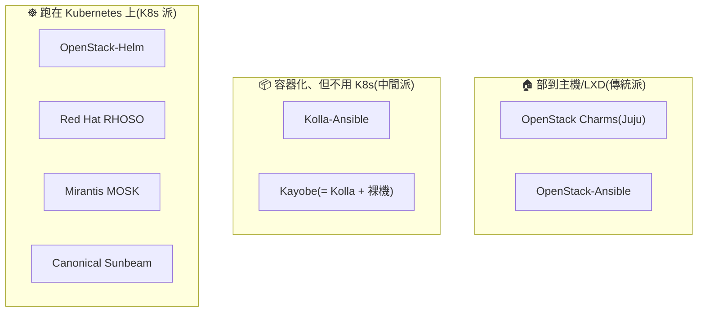

# 部署工具圖鑑

> [前兩次嘗試](previous-attempts.md)的結尾概覽了部署工具的江湖;這一章是**深度圖鑑**:每家工具的詳細介紹、一張「誰支援哪些服務」的實測矩陣、一張晶片架構支援表,最後教你**自己驗貨的方法**——因為支援矩陣是動態的,查證能力比任何一張表都保值。

!!! info "本章資料的查證基準"
    服務矩陣與架構表均於 **2026-07-10** 直接查上游源頭:Kolla-Ansible 查 `stable/2025.1` 分支的 roles、OpenStack-Helm 與 OpenStack-Ansible 查 master 分支、Sunbeam 查 opendev 的 sunbeam-charms、Charms 逐一查 Charmhub API、Sunbeam 架構查 Snap Store API。查證指令都附在文末,表格過期時可自己重跑。

## 快速回顧:三種部署哲學



取捨一句話:**越往 K8s 派,自動化與自癒能力越強,但除錯要跨的層數越多**——[嘗試二](previous-attempts.md)親身驗證過這個代價。

## 各工具詳解

### OpenStack Charms(Juju)——嘗試一走過的路

{ align=right width="90" }

- **陣營**:Canonical(Ubuntu 母公司)。
- **怎麼運作**:每個服務是一個 **charm**(打包了安裝與維運邏輯的單元),由 **Juju** 這個 controller 佈署到主機或 LXD 容器;服務之間宣告 **relation**,連線資訊(DB 帳密、endpoint)在**執行期動態協商**。理論優雅:接好線,雲自己長出來。
- **歷史與現況**:Juju 生態 2012 年起,曾是 Canonical 商用 OpenStack(Charmed OpenStack)的核心。現在 Canonical 的重心已轉向下一代 **Sunbeam**——官方說法是 Sunbeam 達到功能對等後將成為預設交付框架。
- **我們的經驗**(9 天):relation 模型逼你把元件關係學得非常熟,但協商過程是黑箱、出錯難查;而最後致命的是**轉移期的出貨品質**——2026-04 時 octavia charm 的 2024.1/stable 只發佈 ppc64el/s390x、cinder-lvm 只有 s390x,主流 amd64 缺貨(詳見[前兩次嘗試](previous-attempts.md)),三個月後才補齊。
- **適合誰**:購買 Canonical 支援、Ubuntu 深度使用者;新案建議直接評估 Sunbeam。

### Sunbeam——Canonical 的下一代

- **陣營**:Canonical。
- **怎麼運作**:用 **snap** 裝起 MicroK8s,再把 OpenStack 服務以 **K8s charm**(`*-k8s`)跑在上面——等於 Canonical 自己也轉進了 K8s 派。主打「一台機器 30 分鐘起一朵雲」的低門檻。
- **現況**:上游活躍(OpenStack 官方治理下的正式專案)。**注意:目前 snap 只發佈 amd64**(2026-07 查證)——想在 ARM 上玩它還不行。
- **適合誰**:小規模起步、邊緣運算、想跟著 Canonical 路線走的新案。

### Kolla-Ansible——本課程的選擇

{ align=right width="90" }

- **陣營**:**社群主導**,無單一廠商綁定(2014 年起)。
- **怎麼運作**:**Kolla** 把每個服務打包成 Docker image,**Kolla-Ansible** 用 Ansible 把 image 部到主機(host network、無 K8s),設定在部署期生成寫死。透明、單層、`docker ps` 一眼看穿。
- **歷史與現況**:目前公認的社群主流與自管首選,文件與踩雷資料最豐富。
- **我們的經驗**(10 天完課):Day 1 到 Day 11 的一切。它的地雷(ProxySQL、dhclient、Redis jobboard…)全都**能定位、能修**——這正是它勝出前兩條路線的原因。
- **適合誰**:中型自管私有雲、學研單位、lab、不想被廠商綁定的團隊。

### Kayobe——Kolla 的裸機加強版

- **陣營**:**StackHPC**(英國 HPC 顧問商)主導的社群專案。
- **怎麼運作**:Kolla-Ansible 外面再包一層 **Bifrost**(獨立版 Ironic)做裸機佈建:從「一排空機器」到「一朵雲」一條龍,含 BIOS/RAID/網路的宣告式管理。
- **適合誰**:HPC/科研(歐洲尤多)、要管實體機生命週期的機房。學會了 Kolla-Ansible,Kayobe 就只是多學一層。

### OpenStack-Ansible(OSA)——元老

- **陣營**:起源 **Rackspace**(OpenStack 共同創始公司)。
- **怎麼運作**:Ansible 直接把服務裝進 LXC 容器或裸機——**不用 image,從發行版套件/原始碼裝**,客製彈性最大,建置時間也最長。
- **現況**:仍在維護,聲量被 Kolla 蓋過;但下面的服務矩陣會讓你意外——它的覆蓋面非常廣。
- **適合誰**:Rackspace 系、需要深度客製每個服務建置細節的團隊。

### OpenStack-Helm(OSH)——嘗試二走過的路

{ align=right width="90" }

- **陣營**:起源 **AT&T + SK Telecom**(2017),為電信 NFV 而生;現為社群專案。
- **怎麼運作**:OpenStack 每個服務一個 **Helm chart**,當成應用程式部在 Kubernetes 上;排程、自癒、滾動更新全部交給 K8s。
- **生態**:VEXXHOST 的商用發行版 **Atmosphere** 走同路線(順帶一提,VEXXHOST 正是本課 Day 7 那個 magnum-cluster-api driver 的作者)。
- **我們的經驗**(2 天喊停):所有問題都要跨 K8s 與 OpenStack 兩層除錯,單人 lab 成本划不來;詳見 [Sprint 2 回顧](sprint2-reflection.md)。
- **適合誰**:電信、本來就有 K8s 維運團隊的組織。

### TripleO → RHOSO——Red Hat 的路線轉折

- **陣營**:**Red Hat**。
- **歷史**:TripleO(「用 OpenStack 部署 OpenStack」)撐了十年,是 RHOSP 商用版的底層;**上游已於 2024 年退役**。
- **現況**:RHOSP 18 起改為 **RHOSO**(Red Hat OpenStack Services on OpenShift)——OpenStack 控制平面直接以 pod 跑在 OpenShift 上,資料平面留在專用節點。業界份量最重的「OpenStack-on-K8s」背書。
- **適合誰**:買 Red Hat 訂閱的大企業與電信(北美、歐洲尤多)。

### 其餘陣營(速覽)

- **Mirantis MOSK**:OpenStack 元老商 Mirantis 的 OpenStack-on-K8s 產品,服務其既有客戶盤。
- **中國發行版群**(EasyStack、99Cloud、華為雲 Stack 等):基於上游再打包,重點是政企合規與**信創晶片支援**(鯤鵬/飛騰/海光/龍芯)。
- **DevStack**:不在圖鑑內——它只用來在開發機快速起一套改 code,**從來不是部署方案**。

## 服務支援矩陣(2026-07-10 實測)

「這個工具能幫我部哪些服務?」——五個開源工具對 OpenStack 主要服務的支援現況。**✅ = 上游有對應的部署單元**(charm/role/chart/playbook);不代表品質與測試深度相同。

| 服務 | Charms | Kolla-Ansible | OSH | OSA | Sunbeam |
|---|:-:|:-:|:-:|:-:|:-:|
| Keystone / Glance / Placement / Nova / Neutron / Horizon(核心六件) | ✅ | ✅ | ✅ | ✅ | ✅ |
| Heat | ✅ | ✅ | ✅ | ✅ | ✅ |
| Cinder | ✅ | ✅ | ✅ | ✅ | ✅ |
| **Swift** | ✅ | ❌(改推 Ceph RGW) | ✅ | ✅ | ❌ |
| Manila | ✅ | ✅ | ✅ | ✅ | ✅ |
| Octavia | ✅ | ✅ | ✅ | ✅ | ✅ |
| Designate | ✅ | ✅ | ✅ | ✅ | ✅ |
| Barbican | ✅ | ✅ | ✅ | ✅ | ✅ |
| Magnum | ✅ | ✅ | ✅ | ✅ | ✅ |
| Ironic | ✅ | ✅ | ✅ | ✅ | ✅ |
| Telemetry(Ceilometer/Aodh/Gnocchi) | ✅ | ✅ | ✅ | ✅ | ✅ |
| Masakari | ✅ | ✅ | ✅ | ✅ | ✅ |
| **CloudKitty** | ❌ | ✅ | ✅ | ✅ | ✅ |
| **Skyline** | ❌ | ✅ | ✅ | ✅ | ❌ |
| **Watcher** | ✅ | ✅ | ✅ | ❌ | ✅ |
| **Mistral** | ❌ | ✅ | ✅ | ✅ | ❌ |
| **Trove** | ❌ | ✅ | ✅ | ✅ | ❌ |
| **Zun** | ❌ | ✅ | ❌ | ✅ | ❌ |
| **Zaqar**(訊息佇列服務) | ❌ | ❌ | ✅ | ❌ | ❌ |
| **Freezer**(備份服務) | ❌ | ❌ | ✅ | ❌ | ❌ |
| **Venus**(log 管理) | ❌ | ✅ | ❌ | ❌ | ❌ |

**怎麼讀這張表**:

1. **核心 + 主流加值服務(本課用的那 11 個)家家都有**——差異全在長尾。選工具時先列出你真正需要的服務,再看表,多數人會發現「其實哪家都夠」。
2. **Kolla-Ansible 沒有 Swift** 是最常讓人意外的一格:社群的判斷是物件儲存交給 Ceph RGW(Kolla 有 `ceph-rgw` 整合),不再維護原生 Swift。要純 Swift,得看 Charms/OSH/OSA。
3. **Charms 的長尾缺口明顯**(CloudKitty/Skyline/Mistral/Trove/Zun 都沒有)——與其說是技術問題,不如說反映了 Canonical 資源已轉向 Sunbeam 的現實。
4. **OSH 是唯一有 Zaqar/Freezer 的**,電信基因使然;但反而沒有 Zun。
5. **OSA 意外地廣**(還有表外的 Adjutant 工單服務)——元老的積累。
6. **Sunbeam 刻意精簡**:現代核心導向,長尾服務多數尚未跟上。

## 晶片架構支援(2026-07-10 實測)

| 工具 | amd64 | arm64 | ppc64el(POWER) | s390x(大型主機) | 依據 |
|---|:-:|:-:|:-:|:-:|---|
| **Charms** | ✅ | ✅ | ✅ | ✅ | Charmhub API 逐 charm 查證(見文末指令);注意[嘗試一的教訓](previous-attempts.md):**個別 charm 個別 track 可能缺貨** |
| **Kolla-Ansible** | ✅ | ✅ | ❌ | ❌ | 官方 support matrix 只發佈 x86_64 與 aarch64 兩套 image |
| **OSH** | ✅ | 視 image 而定 | ❌ | ❌ | chart 本身不綁架構,實際取決於你用的容器 image;官方發佈以 amd64 為主 |
| **OSA** | ✅ | 理論可行 | — | — | 從發行版套件/原始碼安裝,不依賴預建 image;上游 CI 以 x86_64 為主,其他架構自己扛測試 |
| **Sunbeam** | ✅ | ❌ | ❌ | ❌ | Snap Store API:openstack snap 目前**只發佈 amd64** |

**兩個帶得走的觀察**:

- **「支援矩陣」永遠是三層的**:工具說支援 → 該架構的套件/image 真的有發佈 → 你要的那個版本那一刻真的抓得到。嘗試一敗在第三層(charm 宣稱四架構,2024.1/stable 當下只出了 ppc64el/s390x)。
- 中國信創晶片(鯤鵬 ARM、飛騰、海光、龍芯)不在上游矩陣裡——那是中國發行版各自維護的價值所在,也是該市場選型的硬條件。

## 自己驗貨:別信任何一張表(包括這張)

支援矩陣每半年就會漂移。這一節才是真正保值的——**五條指令,隨時重新產出上面兩張表**:

```bash
# Charms:某服務有沒有 charm?哪些架構?哪些 track?
curl -s "https://api.charmhub.io/v2/charms/info/octavia?fields=channel-map" | jq '
  [."channel-map"[] | {track: .channel.track, risk: .channel.risk,
                       arch: .channel.base.architecture}] | unique'

# Kolla-Ansible:某版本支援哪些服務?(roles 目錄 = 服務清單)
gh api "repos/openstack/kolla-ansible/contents/ansible/roles?ref=stable/2025.1" --jq '.[].name'

# OpenStack-Helm:有哪些 chart?
gh api "repos/openstack/openstack-helm/contents" --jq '.[] | select(.type=="dir") | .name'

# OpenStack-Ansible:有哪些服務 playbook?
gh api "repos/openstack/openstack-ansible/contents/playbooks" --jq '.[].name' | grep '^os-'

# Sunbeam:有哪些 K8s charm?snap 出了哪些架構?
curl -s "https://opendev.org/api/v1/repos/openstack/sunbeam-charms/contents/charms" | jq -r '.[].name'
curl -s -H "Snap-Device-Series: 16" "https://api.snapcraft.io/v2/snaps/info/openstack" | jq '[."channel-map"[].channel.architecture] | unique'
```

這也是本課程一路的方法論:**以裝好的原始碼與官方 API 為準,不信部落格、不信記憶**(部落格常是舊版做法,記憶會漂移——本頁作者親測)。

## 下一步

- 回到我們的故事 → [前兩次嘗試](previous-attempts.md)
- 看這些工具部出來的服務長什麼樣 → [Day 11 · 服務全景圖](runbook/sprint3-day11-openstack-service-map.md)
- 動手走一遍社群主流路線 → [課程主線 Day 0](runbook/sprint3-day0-azure-vm.md)

---

*本頁吉祥物圖像為 OpenInfra Foundation 官方 [Project Mascots](https://www.openstack.org/project-mascots/),版權屬原基金會,此處作社群教學用途。服務矩陣與架構表為 2026-07-10 對各上游源頭之查證結果,方法見文中指令。*
