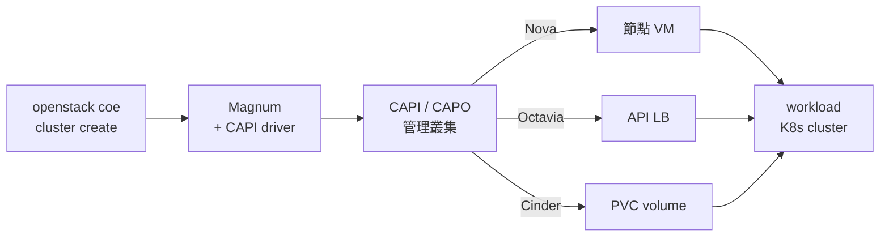

# OpenStack 實作課程 —— 從一台雲端 VM 到 K8s-as-a-Service

這是一門**十天的實作課程**:在 Azure 租一台 VM,用 **Kolla-Ansible** 把 OpenStack 私有雲從零部署起來,最後讓這朵雲能像公有雲一樣——使用者下一行指令,就自動開出一座能跑正式工作負載的 **Kubernetes cluster**(含 Load Balancer 與持久化儲存)。

每一天一份 runbook,固定格式:**原理 → 可照抄的步驟 → 驗收 checkpoint → 踩雷記錄**。所有指令都在真實環境跑過。

!!! tip "這站怎麼用"
    - **想照著做** → 從 [Day 0](runbook/sprint3-day0-azure-vm.md) 開始,依序走到 Day 10。
    - **卡在某個錯誤** → 去 [排錯手冊](solutions/README.md) 搜關鍵字,收錄的都是官方文件查不到的整合地雷。
    - **想懂技術選型的來龍去脈** → 看下面的摘要、完整版在[前兩次嘗試](previous-attempts.md)與[回顧與教訓](sprint3-reflection.md)。

## 這門課之前發生了什麼(為什麼是這條路線)

同一個目標,前後試了三條路線。**你現在看到的課程是第三次嘗試——前兩次的失敗決定了這次的每一個技術選擇**,所以值得花兩分鐘了解:

### 嘗試一:Juju + Charms(Sprint 1)——核心能動,關鍵三項卡死

第一次用 Canonical 的 **Juju/Charm** 工具鏈部署 OpenStack(charm 是 Canonical 打包的服務安裝單元,整套跑在 LXD 容器裡)。核心服務(Keystone、Nova、Neutron 等)成功部起來、也能開 VM,但接下來三個關鍵項目**全數卡死**,而且卡的原因大多不是操作錯誤,是**生態系本身的問題**:

| 卡死項目 | 它是做什麼的 | 死因 |
|---|---|---|
| **Octavia** | 負載平衡服務(之後 K8s 要靠它拿 LoadBalancer) | 官方 charm 在 amd64 架構上**沒有發佈可用版本**——想裝也裝不了 |
| **Cinder LVM** | 區塊儲存(VM 的外掛硬碟、K8s 的 PVC) | 整套跑在 LXD 容器內,容器拿不到 device-mapper 權限,**先天做不到** |
| **Magnum** | 讓 OpenStack 能一鍵開 K8s cluster 的服務 | 當時的舊 driver 內建 2019–2021 年的 image 下載連結,**全部失效**,一座 cluster 都開不出來 |

共同教訓:這條路線的失敗**無從修起**——不是設定錯,是上游沒維護。詳見 [Sprint 1 回顧](reflection.md)。

### 嘗試二:OpenStack-Helm(Sprint 2)——兩天後主動喊停

第二次改走 **OpenStack-Helm**:先架一座 Kubernetes,再把 OpenStack 當應用程式部署在上面。走了兩天就發現代價:任何問題都要**同時跨 K8s 和 OpenStack 兩層除錯**,對單機學習環境來說成本完全划不來,主動停掉。(完整故事見[前兩次嘗試](previous-attempts.md)與 [Sprint 2 回顧](sprint2-reflection.md)。)

### 嘗試三:Kolla-Ansible + Magnum CAPI driver(本課程)——十天走完

第三次換成 **Kolla-Ansible**(用 Ansible 部署,每個 OpenStack 服務跑一個 Docker 容器——社群主流、透明好除錯),Magnum 則改用新一代 **Cluster API(CAPI)driver**(K8s 官方生態維護的建叢集框架,node image 有人持續更新)。結果:

| Sprint 1 卡死的項目 | 本課程的結果 |
|---|---|
| Octavia 裝不了 | ✅ Day 4 手動建 LB 走完全流程;Day 8 K8s `type=LoadBalancer` 自動拿到 Octavia LB |
| Cinder LVM 做不到 | ✅ Day 3 完成 volume 生命週期;Day 8 K8s PVC 由 Cinder 動態供裝 |
| Magnum 開不出 cluster | ✅ Day 8 cluster 一鍵開出、Day 9 還能滾動升版與自動擴縮 |

## 課程路徑(Day 0 → 10)

| Day | 主題 | 里程碑 |
|---|---|---|
| [0](runbook/sprint3-day0-azure-vm.md) | Azure lab 環境 | 支援巢狀虛擬化的 VM + 成本控管 |
| [1](runbook/sprint3-day1-kolla-aio-core.md) | Kolla-Ansible 部署核心服務 | Keystone/Glance/Nova/Neutron/Horizon |
| [2](runbook/sprint3-day2-openstack-resource-flow.md) | OpenStack 資源全流程 | 純 CLI 開出可 SSH 的 VM |
| [3](runbook/sprint3-day3-cinder-lvm.md) | Cinder 區塊儲存 | volume 掛載、boot from volume |
| [4](runbook/sprint3-day4-octavia.md) | Octavia 負載平衡 | LB 建置全流程、round-robin 驗證 |
| [5](runbook/sprint3-day5-barbican-heat.md) | Barbican 秘密管理 + Heat 編排 | secret 存取往返、HOT stack |
| [6](runbook/sprint3-day6-capi-management-cluster.md) | Cluster API 管理叢集 | kind + CAPI/CAPO controllers |
| [7](runbook/sprint3-day7-magnum-capi-driver.md) | Magnum + CAPI driver 整合 | ClusterTemplate 就緒 |
| [8](runbook/sprint3-day8-e2e-workload-cluster.md) | 端到端開出 workload cluster | nodes Ready + LB + PVC 三項驗收 |
| [9](runbook/sprint3-day9-day2-operations.md) | Day-2 維運 | 滾動升版、node group、autoscaler |
| [10](runbook/sprint3-day10-terraform-teardown.md) | Terraform 接管 + 拆除演練 | HCL 管 network/VM/LB |
| [11](runbook/sprint3-day11-openstack-service-map.md) | 後日談:服務全景圖 | 用過的 11 個服務盤點 + 沒用到的版圖 |

## 最終架構:一個指令背後的三層互動

課程終點是讓 `openstack coe cluster create` 這一行指令,自動完成下面整條鏈:

## 這門課留下什麼

- **11 篇** 課程 runbook——可照抄重現整套環境的完整路徑
- **17 篇** 排錯記錄——官方文件查不到、動手才會撞到的整合地雷與解法
- **1 篇** [完整回顧](sprint3-reflection.md)——技術選型對照、通用教訓、產業觀察

---

準備好了嗎? → **[開始:Day 0 · Azure Lab 環境](runbook/sprint3-day0-azure-vm.md)**
