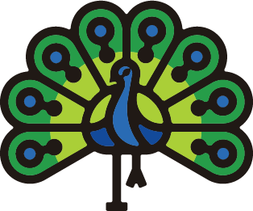
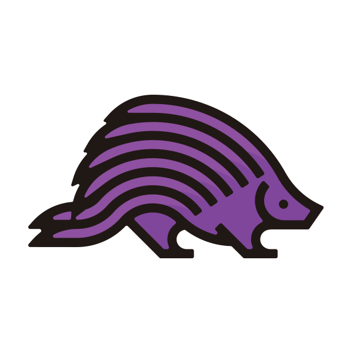
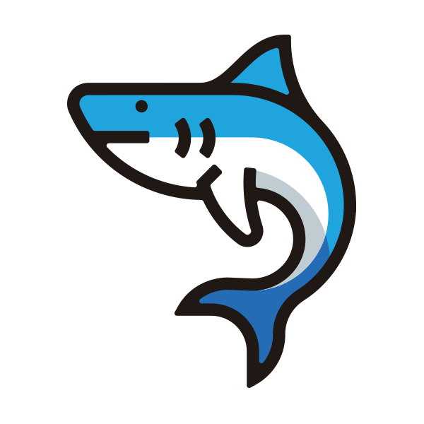
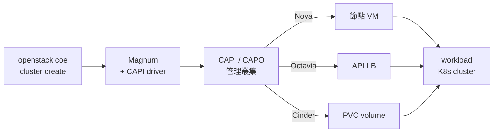
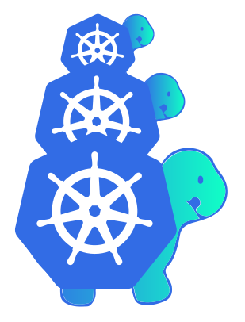

# 親手蓋一朵雲

虛擬機、虛擬網路、雲端硬碟、負載平衡——公有雲的這些能力不是魔法,是一套叫 **OpenStack** 的開源軟體。AWS 那個層級的東西,**你可以自己蓋一朵**。

這個網站帶你從 Azure 的一台空白 VM 開始,把一朵雲從零蓋起來。第二天,你就會對**自己的雲**下這個指令:

```bash
openstack server create --flavor m1.tiny --image cirros --network net1 vm-cirros
```

**你的雲,開出它的第一台虛擬機。**之後每一天再給它一個新能力:雲端硬碟、負載平衡、秘密保險箱、資源藍圖……直到最後一天,這朵雲甚至能像 AWS 的 EKS 一樣,[一行指令長出一整座 Kubernetes](runbook/sprint3-day8-e2e-workload-cluster.md)——那是課程壓軸,也是我們**失敗過兩次**才做到的事。

<div style="text-align: center;" markdown>

{ width="52" }
{ width="52" }
{ width="52" }
{ width="52" }
{ width="52" }
{ width="52" }
{ width="52" }
{ width="52" }

*這些是你這趟旅程會認識的夥伴——OpenStack 每個服務都有官方吉祥物,**記臉比記名字快**。*

</div>

## 從這裡出發

<div class="grid cards" markdown>

-   :material-rocket-launch:{ .lg .middle } __課程主線__

    ---

    從空白 VM 到 K8s-as-a-Service 的完整路徑。每一步都有實測輸出、驗收標準與踩雷記錄。

    [:octicons-arrow-right-24: Day 0 · 開始](runbook/sprint3-day0-azure-vm.md)

-   :material-tools:{ .lg .middle } __排錯手冊__

    ---

    官方文件查不到、動手才會撞到的 15 條整合地雷與解法。拿錯誤訊息來搜就對了。

    [:octicons-arrow-right-24: 查地雷](solutions/README.md)

-   :material-history:{ .lg .middle } __前兩次嘗試__

    ---

    Juju 走了 9 天、OpenStack-Helm 走了 2 天,為什麼都沒走通?失敗史是這門課的地基。

    [:octicons-arrow-right-24: 讀故事](previous-attempts.md)

-   :material-map:{ .lg .middle } __服務全景圖__

    ---

    OpenStack 有幾十個服務,我們用了 11 個。官方 Landscape 一張圖看懂整個版圖。

    [:octicons-arrow-right-24: 看地圖](runbook/sprint3-day11-openstack-service-map.md)

</div>

## 這朵雲的居民

<div class="grid cards" markdown>

-   { width="44" } __Keystone__

    ---

    帳號與權限的守門人——之後每一個指令都先過它這關。

    [:octicons-arrow-right-24: Day 2 認識它](runbook/sprint3-day2-openstack-resource-flow.md)

-   { width="44" } __Nova__

    ---

    開虛擬機的引擎。這朵雲上每一台 VM(連 K8s 節點)都是它開的。

    [:octicons-arrow-right-24: Day 2 開第一台 VM](runbook/sprint3-day2-openstack-resource-flow.md)

-   { width="44" } __Neutron__

    ---

    一切網路的織網者——虛擬網路、路由器、防火牆全是它。

    [:octicons-arrow-right-24: Day 2 建網路](runbook/sprint3-day2-openstack-resource-flow.md)

-   { width="44" } __Cinder__

    ---

    拔得下來的硬碟:VM 刪了資料還在,還能掛給下一台。

    [:octicons-arrow-right-24: Day 3 掛硬碟](runbook/sprint3-day3-cinder-lvm.md)

-   { width="44" } __Octavia__

    ---

    流量的帶位員。負載平衡器其實是一台幫你養的小 VM。

    [:octicons-arrow-right-24: Day 4 建 LB](runbook/sprint3-day4-octavia.md)

-   { width="44" } __Barbican__

    ---

    秘密的保險箱:密碼、金鑰、憑證加密集中存放。

    [:octicons-arrow-right-24: Day 5 存秘密](runbook/sprint3-day5-barbican-heat.md)

-   { width="44" } __Heat__

    ---

    照藍圖蓋房子:一份 YAML,一個指令蓋好一組資源、一個指令全拆。

    [:octicons-arrow-right-24: Day 5 寫藍圖](runbook/sprint3-day5-barbican-heat.md)

-   { width="44" } __Magnum__

    ---

    一鍵長出 K8s——課程壓軸的那行指令,就是對它下的。

    [:octicons-arrow-right-24: Day 7 接上它](runbook/sprint3-day7-magnum-capi-driver.md)

</div>

## 這裡之前發生過什麼

- **嘗試一 · Juju + Charms**:9 天。核心能動,但三項關鍵功能被生態系卡死,放棄。
- **嘗試二 · OpenStack-Helm**:2 天。每個問題都要跨 K8s 與 OpenStack 兩層除錯,主動喊停。
- **嘗試三 · Kolla-Ansible + Magnum CAPI(本課程)**:走完。前兩次卡死的項目,全部完成。

完整的決策與教訓 → [前兩次嘗試:走過才知道的路](previous-attempts.md)

## 課程路徑(Day 0 → 11)

每一天一份 runbook,固定格式:**原理 → 可照抄的步驟 → 驗收 checkpoint → 踩雷記錄**。所有指令都在真實環境跑過。

| Day | 主題 | 里程碑 |
|---|---|---|
| [0](runbook/sprint3-day0-azure-vm.md) | Azure lab 環境 | 支援巢狀虛擬化的 VM + 成本控管 |
| [1](runbook/sprint3-day1-kolla-aio-core.md) | Kolla-Ansible 部署核心服務 | Keystone/Glance/Nova/Neutron/Horizon |
| [2](runbook/sprint3-day2-openstack-resource-flow.md) | OpenStack 資源全流程 | 純 CLI 開出可 SSH 的 VM |
| [3](runbook/sprint3-day3-cinder-lvm.md) | Cinder 區塊儲存 | volume 掛載、boot from volume |
| [4](runbook/sprint3-day4-octavia.md) | Octavia 負載平衡 | LB 建置全流程、round-robin 驗證 |
| [5](runbook/sprint3-day5-barbican-heat.md) | Barbican 秘密管理 + Heat 編排 | secret 存取往返、HOT stack |
| [6](runbook/sprint3-day6-capi-management-cluster.md) | Cluster API 管理叢集 | kind + CAPI/CAPO controllers |
| [7](runbook/sprint3-day7-magnum-capi-driver.md) | Magnum + CAPI driver 整合 | ClusterTemplate 就緒 |
| [8](runbook/sprint3-day8-e2e-workload-cluster.md) | 端到端開出 workload cluster | nodes Ready + LB + PVC 三項驗收 |
| [9](runbook/sprint3-day9-day2-operations.md) | Day-2 維運 | 滾動升版、node group、autoscaler |
| [10](runbook/sprint3-day10-terraform-teardown.md) | Terraform 接管 + 拆除演練 | HCL 管 network/VM/LB |
| [11](runbook/sprint3-day11-openstack-service-map.md) | 後日談:服務全景圖 | 用過的 11 個服務盤點 + 沒用到的版圖 |

## 課程壓軸:一鍵 K8s 背後發生什麼



Day 6–8 會把這條生產線一站一站蓋出來。

## 鎮館之寶

{ align=right width="110" }

Cluster API 的官方標誌:**大龜馱小龜馱更小的龜**,殼上都是 Kubernetes 的舵輪。官方副標一句話講完整個架構哲學——

> *"It's Kubernetes all the way down."*(一路往下,全是 Kubernetes)

為什麼用 K8s 管 K8s?哪隻龜是哪座叢集? → [Day 6 · Cluster API 管理叢集](runbook/sprint3-day6-capi-management-cluster.md)

---

準備好了嗎? → **[開始:Day 0 · Azure Lab 環境](runbook/sprint3-day0-azure-vm.md)**
