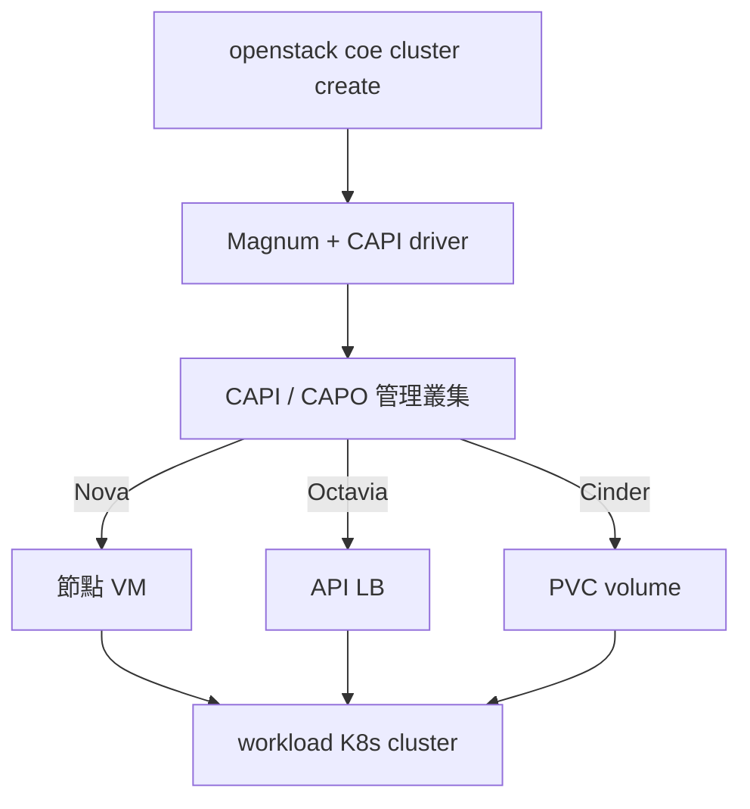

# 親手蓋一朵雲

虛擬機、虛擬網路、雲端硬碟、負載平衡——公有雲的這些能力不是魔法,是一套叫 **OpenStack** 的開源軟體。AWS 那個層級的東西,**你可以自己蓋一朵**。

這個網站帶你從 Azure 的一台空白 VM 開始,把一朵雲從零蓋起來。第二天,你就會對**自己的雲**下這個指令:

```bash
openstack server create --flavor m1.tiny --image cirros --network net1 vm-cirros
```

**你的雲,開出它的第一台虛擬機。**之後每一天再給它一個新能力:雲端硬碟、負載平衡、秘密保險箱、資源藍圖……直到最後一天,這朵雲甚至能像 AWS 的 EKS 一樣,[一行指令長出一整座 Kubernetes](runbook/sprint3-day8-e2e-workload-cluster.md)——那是課程壓軸,也是我們**失敗過兩次**才做到的事。

<div style="text-align: center;" markdown>

{ width="52" }
{ width="52" }
{ width="52" }
{ width="52" }
{ width="52" }
{ width="52" }
{ width="52" }
{ width="52" }

*這些是你這趟旅程會認識的夥伴——OpenStack 每個服務都有官方吉祥物,**記臉比記名字快**。*

</div>

## 這朵雲能做成什麼

你在公有雲用過的東西,OpenStack 幾乎都有對應的積木——這門課會親手把它們一塊塊拼起來:

| | 服務 | 它給你什麼 | AWS | GCP | Azure |
|---|---|---|---|---|---|
| { width="32" } | [Keystone](runbook/sprint3-day2-openstack-resource-flow.md) | 身分認證與存取控制 | IAM | Cloud IAM | Entra ID |
| { width="32" } | [Glance](runbook/sprint3-day2-openstack-resource-flow.md) | VM 映像檔管理 | AMI | Images | Compute Gallery |
| { width="32" } | [Nova](runbook/sprint3-day2-openstack-resource-flow.md) | 虛擬機生命週期與運算調度 | EC2 | Compute Engine | Virtual Machines |
| { width="32" } | [Neutron](runbook/sprint3-day2-openstack-resource-flow.md) | 軟體定義網路:網段、路由、防火牆 | VPC | VPC | Virtual Network |
| { width="32" } | [Cinder](runbook/sprint3-day3-cinder-lvm.md) | 區塊儲存:可掛載、可搬移的持久磁碟 | EBS | Persistent Disk | Managed Disks |
| { width="32" } | [Octavia](runbook/sprint3-day4-octavia.md) | 負載平衡即服務(LBaaS) | ELB | Cloud Load Balancing | Load Balancer |
| { width="32" } | [Barbican](runbook/sprint3-day5-barbican-heat.md) | 金鑰、憑證與機密集中管理 | Secrets Manager | Secret Manager | Key Vault |
| { width="32" } | [Heat](runbook/sprint3-day5-barbican-heat.md) | 宣告式資源編排(IaC) | CloudFormation | Infrastructure Manager | Bicep / ARM |
| { width="32" } | [Magnum](runbook/sprint3-day7-magnum-capi-driver.md) | 代管 Kubernetes 叢集 | EKS | GKE | AKS |
| { width="32" } | [Horizon](runbook/sprint3-day1-kolla-aio-core.md) | 雲資源的網頁管理介面 | Console | Cloud Console | Portal |
| { width="32" } | [物件儲存(RGW)](runbook/sprint4-day15-object-storage-rgw.md) | 物件儲存(S3 + Swift 雙 API) | S3 | Cloud Storage | Blob Storage |
| { width="32" } | [Manila](runbook/sprint4-day16-manila-cephfs.md) | 共享檔案系統 | EFS | Filestore | Azure Files |
| { width="32" } | [Designate](runbook/sprint4-day17-designate-dns.md) | DNS 代管 | Route 53 | Cloud DNS | Azure DNS |
| { width="32" } | [Trove](runbook/sprint4-day18-trove-dbaas.md) | 資料庫即服務 | RDS | Cloud SQL | Azure Database |

點服務名稱可以直接跳到認識它的那一天。

### 還沒拼上的積木

同一盒積木裡還有更多——這些本課程沒有部署,想擴充你的雲時就從這裡挑:

| | 服務 | 它給你什麼 | AWS | GCP | Azure |
|---|---|---|---|---|---|
| { width="32" } | [Zun](runbook/sprint3-day11-openstack-service-map.md) | 容器即服務(不經 K8s) | Fargate | Cloud Run | Container Instances |
| { width="32" } | [Ironic](runbook/sprint3-day11-openstack-service-map.md) | 裸機佈建與生命週期管理 | EC2 Bare Metal | Bare Metal Solution | Azure BareMetal |
| { width="32" } | [Telemetry](runbook/sprint3-day11-openstack-service-map.md) | 計量、監控與告警 | CloudWatch | Cloud Monitoring | Azure Monitor |
| { width="32" } | [CloudKitty](runbook/sprint3-day11-openstack-service-map.md) | 用量計費與費率管理 | Cost Explorer | Cloud Billing | Cost Management |
| { width="32" } | [Masakari](runbook/sprint3-day11-openstack-service-map.md) | 虛擬機高可用與自動復原 | (EC2 內建自動復原) | (內建即時遷移) | (內建服務修復) |

每一個的定位與「什麼時候會需要」,都整理在 [Day 11 · 服務全景圖](runbook/sprint3-day11-openstack-service-map.md)。**Swift(RGW)、Manila、Designate、Trove 已在 Sprint 4(Day 15–18)拼上**,升級到上面的主表了;Sprint 4 後半的課綱見 [Day 12 預告](runbook/sprint3-day12-sprint4-preview.md)。


## 從這裡出發

<div class="grid cards" markdown>

-   :material-rocket-launch:{ .lg .middle } __課程主線__

    ---

    從空白 VM 到 K8s-as-a-Service 的完整路徑。每一步都有實測輸出、驗收標準與踩雷記錄。

    [:octicons-arrow-right-24: Day 0 · 開始](runbook/sprint3-day0-azure-vm.md)

-   :material-tools:{ .lg .middle } __排錯手冊__

    ---

    官方文件查不到、動手才會撞到的 15 條整合地雷與解法。拿錯誤訊息來搜就對了。

    [:octicons-arrow-right-24: 查地雷](solutions/README.md)

-   :material-history:{ .lg .middle } __前兩次嘗試__

    ---

    Juju 走了 9 天、OpenStack-Helm 走了 2 天,為什麼都沒走通?失敗史是這門課的地基。

    [:octicons-arrow-right-24: 讀故事](previous-attempts.md)

-   :material-map:{ .lg .middle } __服務全景圖__

    ---

    OpenStack 有幾十個服務,我們用了 11 個。官方 Landscape 一張圖看懂整個版圖。

    [:octicons-arrow-right-24: 看地圖](runbook/sprint3-day11-openstack-service-map.md)

</div>

## 這裡之前發生過什麼

- **嘗試一 · Juju + Charms**:9 天。核心能動,但三項關鍵功能被生態系卡死,放棄。
- **嘗試二 · OpenStack-Helm**:2 天。每個問題都要跨 K8s 與 OpenStack 兩層除錯,主動喊停。
- **嘗試三 · Kolla-Ansible + Magnum CAPI(本課程)**:走完。前兩次卡死的項目,全部完成。

完整的決策與教訓 → [前兩次嘗試:走過才知道的路](previous-attempts.md)

## 課程路徑(Day 0 → 21,連載中)

每一天一份 runbook,固定格式:**原理 → 可照抄的步驟 → 驗收 checkpoint → 踩雷記錄**。所有指令都在真實環境跑過。

| Day | 主題 | 里程碑 |
|---|---|---|
| [0](runbook/sprint3-day0-azure-vm.md) | Azure lab 環境 | 支援巢狀虛擬化的 VM + 成本控管 |
| [1](runbook/sprint3-day1-kolla-aio-core.md) | Kolla-Ansible 部署核心服務 | Keystone/Glance/Nova/Neutron/Horizon |
| [2](runbook/sprint3-day2-openstack-resource-flow.md) | OpenStack 資源全流程 | 純 CLI 開出可 SSH 的 VM |
| [3](runbook/sprint3-day3-cinder-lvm.md) | Cinder 區塊儲存 | volume 掛載、boot from volume |
| [4](runbook/sprint3-day4-octavia.md) | Octavia 負載平衡 | LB 建置全流程、round-robin 驗證 |
| [5](runbook/sprint3-day5-barbican-heat.md) | Barbican 秘密管理 + Heat 編排 | secret 存取往返、HOT stack |
| [6](runbook/sprint3-day6-capi-management-cluster.md) | Cluster API 管理叢集 | kind + CAPI/CAPO controllers |
| [7](runbook/sprint3-day7-magnum-capi-driver.md) | Magnum + CAPI driver 整合 | ClusterTemplate 就緒 |
| [8](runbook/sprint3-day8-e2e-workload-cluster.md) | 端到端開出 workload cluster | nodes Ready + LB + PVC 三項驗收 |
| [9](runbook/sprint3-day9-day2-operations.md) | Day-2 維運 | 滾動升版、node group、autoscaler |
| [10](runbook/sprint3-day10-terraform-teardown.md) | Terraform 接管 + 拆除演練 | HCL 管 network/VM/LB |
| [11](runbook/sprint3-day11-openstack-service-map.md) | 後日談:服務全景圖 | 用過的 11 個服務盤點 + 沒用到的版圖 |
| [12](runbook/sprint3-day12-sprint4-preview.md) | 下一步的地圖:Sprint 4 預告 | 服務擴充、內部原理、維運實務、水平擴展 |
| [13](runbook/sprint4-day13-skyline.md) | Skyline 新一代儀表板 | 一個 flag 增量部署、兩代 UI 並存 |
| [14](runbook/sprint4-day14-ceph-bootstrap.md) | Ceph 基礎 | cephadm 單機叢集、與 Kolla 同機共存 |
| [15](runbook/sprint4-day15-object-storage-rgw.md) | 物件儲存 RGW | S3 + Swift 雙 API、Keystone 整合 |
| [16](runbook/sprint4-day16-manila-cephfs.md) | Manila 共享檔案系統 | CephFS 後端、掛載讀寫全流程 |
| [17](runbook/sprint4-day17-designate-dns.md) | Designate DNS | zone/recordset、FIP 自動 DNS 記錄 |
| [18](runbook/sprint4-day18-trove-dbaas.md) | Trove 資料庫服務 | 一行指令開出代管 MySQL |
| [19](runbook/sprint4-day19-api-request-lifecycle.md) | server create 背後發生什麼 | token → RPC → qemu 進程徒手追蹤 |
| [20](runbook/sprint4-day20-ovn-packet-trace.md) | 封包怎麼流(OVN) | ovn-trace 看 NAT 改寫的確切一刻 |
| [21](runbook/sprint4-day21-observability.md) | 可觀測性 | Prometheus/Grafana/集中 log |

## 課程壓軸:一鍵 K8s 背後發生什麼



Day 6–8 會把這條生產線一站一站蓋出來。

## 鎮館之寶

{ align=right width="110" }

Cluster API 的官方標誌:**大龜馱小龜馱更小的龜**,殼上都是 Kubernetes 的舵輪。官方副標一句話講完整個架構哲學——

> *"It's Kubernetes all the way down."*(一路往下,全是 Kubernetes)

為什麼用 K8s 管 K8s?哪隻龜是哪座叢集? → [Day 6 · Cluster API 管理叢集](runbook/sprint3-day6-capi-management-cluster.md)

---

準備好了嗎? → **[開始:Day 0 · Azure Lab 環境](runbook/sprint3-day0-azure-vm.md)**
