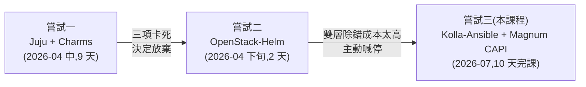
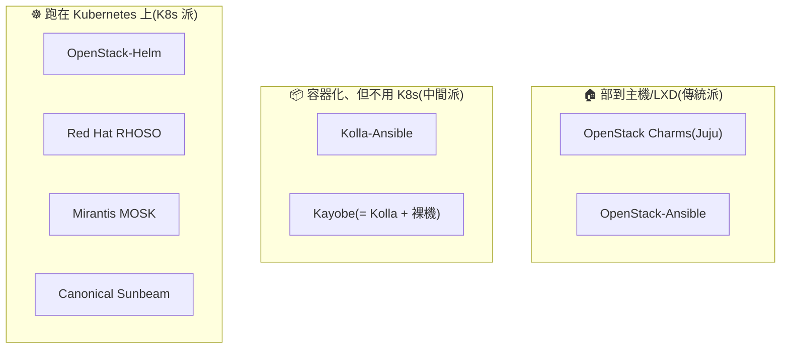

# 前兩次嘗試:走過才知道的路

> 本課程(Day 0–10)是**第三次嘗試**。這個章節保留前兩次的完整紀錄——不是為了懷舊,而是因為**每一個本課程的技術選擇,都是被這裡的失敗逼出來的**。想知道「為什麼是 Kolla-Ansible、為什麼是 CAPI driver」,答案都在這裡。

## 時間軸

## 嘗試一:Juju + Charms(9 天)

{ align=right width="100" }

### 當時為什麼選它

Juju 是 Canonical 的部署工具,charm 是它的服務安裝單元;它的賣點是「宣告 relation(服務關係),charm 自動完成整合」——理論上接好線就能長出一朵雲。整套跑在 LXD 容器裡,單機就能模擬多節點。

### 實際做到哪

不算失敗的一役:**15 個服務部起來、VM 開得出來**,而且逼著把 OpenStack 每個元件的關係摸得很熟(這份理解直接沿用到本課程)。完整過程見左側「Sprint 1」的 20 篇 runbook。

### 為什麼放棄:三項關鍵功能卡死,而且無從修起

| 卡死項目 | 死因 | 為什麼修不了 |
|---|---|---|
| **Octavia**(負載平衡) | 官方 charm 的 2024.1/stable **當時只發佈了 ppc64el/s390x(IBM POWER 與大型主機)版**——最主流的 amd64 反而缺貨 | 不是設定問題,是上游沒出貨——等,或換路線。(後記:2026-07 回查 Charmhub,amd64 已補上——但對當時的我們晚了三個月) |
| **Cinder LVM**(區塊儲存) | LXD 容器拿不到 device-mapper 權限 | 執行環境的先天限制,除非放棄 LXD 架構 |
| **Magnum**(K8s 服務) | 舊 driver 內建 2019–2021 的 image 下載連結,全數失效 | 上游生態多年沒維護 |

共同點:**三個都不是「我做錯了什麼」,是生態系本身撐不住**。9 天踩了 22 個雷(都收錄在[排錯手冊](solutions/README.md)),其中近半是 charm 的預設值陷阱或版本斷代。結論寫在 [Sprint 1 回顧](reflection.md):這條路線對這種 lab 不可行,**放棄 Juju + Charms**。

### 這次嘗試留下什麼

- OpenStack 元件關係的第一手理解(哪個服務跟哪個服務講話、為什麼)
- 22 條排錯紀錄——「charm 生態為什麼撐不起 lab」的具體證據
- 三個明確的未完成項,成為本課程的驗收清單

## 嘗試二:OpenStack-Helm(2 天)

{ align=right width="100" }

### 當時為什麼選它

放棄 Juju 後的規劃(見 [Sprint 2 課程計畫](sprint2-course-plan.md)):既然已經會 Kubernetes,那就**把 OpenStack 當應用程式部在 K8s 上**(OpenStack-Helm 路線),還能省掉學 Ansible。當時甚至刻意寫下「不走 Kolla-Ansible」。

### 實際做到哪

兩天:單節點 K8s 架好(kubeadm + CNI + MetalLB + local-path),OpenStack 的基礎依賴(MariaDB / RabbitMQ / Memcached / OVS)用 Helm chart 部起來,踩了 5 個雷(repo 已 retire、node label 不打就 Pending……見 sprint2 各篇)。

### 為什麼喊停

部 infra 的兩天已經體感到代價:**任何問題都要同時跨 K8s 層和 OpenStack 層除錯**——pod 排程、init container 依賴、chart 版本漂移,全部疊在 OpenStack 本身的複雜度上。對「一個人、一台機、目標是學 OpenStack」的 lab,這個除錯成本完全划不來。走完 infra 就主動停掉,沒有進到 OpenStack 服務本體。

### 這次嘗試留下什麼

- 「部署工具的複雜度要匹配場景」這條教訓——它直接推導出第三次的 Kolla-Ansible(每服務一個 Docker 容器,透明、單層、好除錯)
- 4 篇 runbook 保留為歷史紀錄(左側「Sprint 2」)

## 兩次嘗試如何決定了本課程

{ align=right width="100" }

| 前兩次的教訓 | 本課程的對應選擇 |
|---|---|
| charm 生態斷代、黑箱難修 | **Kolla-Ansible**:社群主流、容器透明、以原始碼為準可自行診斷 |
| LXD 容器的 kernel 權限限制 | **直接跑在 Azure VM**(真機),Cinder LVM 零阻力 |
| Magnum 舊 driver 的 image 全失效 | **Magnum CAPI driver**:node image 由活躍的 K8s 生態維護 |
| OSH 的雙層除錯負擔 | 單層架構:問題不是 OpenStack 的就是 host 的,不會夾在中間 |

結果:前兩次卡死的三個項目,第三次全部完成(見[課程主線 Day 8](runbook/sprint3-day8-e2e-workload-cluster.md) 與 [Sprint 3 回顧](sprint3-reflection.md))。

## 放大視野:OpenStack 部署工具的江湖

我們親身走過的三條,只是整個版圖的一角。**「怎麼部署 OpenStack」本身就是一個有陣營、有歷史、有商業利益的江湖**——知道每家的背景,你就能讀懂為什麼某條路線會斷代、為什麼某家忽然轉向。

### 先分類:三種部署哲學

所有工具先按「OpenStack 的服務跑在什麼上面」分成三派,理解這個分類,後面每一家的定位就清楚了:

三派的取捨一句話:**越往右,自動化與自癒能力越強,但除錯要跨的層數越多**——我們在嘗試二親身驗證過這個代價。

### 各家陣營與現況(2026)

| 工具 | 陣營/出品 | 歷史與現況 | 誰在用/場景 |
|---|---|---|---|
| **OpenStack Charms**(Juju) *嘗試一* | **Canonical**(Ubuntu 母公司) | Juju 生態 2012 年起;曾是 Canonical 商用 OpenStack 的核心。**現況:Canonical 重心已轉向下一代 Sunbeam**(官方說法:Sunbeam 達到功能對等後將成為預設交付框架)——我們撞到的「amd64 stable 缺貨數月」charm 斷代,就是這個轉移期的副作用 | 購買 Canonical 支援的企業與電信;Ubuntu 深度使用者 |
| **Sunbeam** | Canonical(新一代) | snap + K8s charm 的重寫,鎖定「小規模也能起步」;上游活躍 | 邊緣運算、小型私有雲、想跟著 Canonical 走的新案 |
| **Kolla-Ansible** *本課程* | **社群主導**(2014 年起,無單一廠商綁定) | 「每服務一個容器 + Ansible」的務實路線;**目前公認的社群主流與自管首選**,文件與踩雷資料最豐富 | 中型自管私有雲、學研單位、lab;不想被廠商綁定的團隊 |
| **Kayobe** | **StackHPC**(英國 HPC 顧問商) | Kolla-Ansible 再包一層裸機佈建(Bifrost):從空機房到雲一條龍 | HPC/科研(歐洲尤多)、需要管實體機生命週期的場景 |
| **OpenStack-Ansible** | 起源 **Rackspace** | 元老級(LXC/裸機 + Ansible),仍在維護但聲量已被 Kolla 蓋過 | Rackspace 系與存量部署 |
| **OpenStack-Helm** *嘗試二* | 起源 **AT&T + SK Telecom**(2017) | 「OpenStack 當 K8s 應用」的開山路線,為電信 NFV 而生;VEXXHOST 的商用發行版 **Atmosphere** 走同路線(順帶:它正是我們 Day 7 用的 magnum-cluster-api driver 的作者) | 電信、本來就有 K8s 維運團隊的組織 |
| **TripleO → RHOSO** | **Red Hat** | TripleO(「用 OpenStack 部 OpenStack」)撐了十年,**上游已於 2024 退役**;商用版 RHOSP 18 起改為 **RHOSO**——控制平面直接跑在 OpenShift 上 | 買 Red Hat 訂閱的大企業/電信(北美、歐洲尤多) |
| **Mirantis MOSK** | **Mirantis**(OpenStack 元老商之一) | 同樣走 OpenStack-on-K8s | 其既有客戶盤 |
| **中國發行版群** | EasyStack、99Cloud、華為(華為雲 Stack)等 | 各自基於上游再打包;華為長年是上游前幾大貢獻者 | 中國政企市場(見下) |

> 另有 **DevStack**——它不在上表,因為它只用來「在一台開發機快速起一套拿來改 code」,從來不是部署方案。看到教學叫你用 DevStack 架「正式環境」,快逃。

### 三個觀察角度:誰在什麼地方用 OpenStack

**按地域**:

- **中國**是近年最大的成長引擎:電信三雄(NFV 核心網)、政企私有雲,加上「信創」政策帶動的國產化替代。
- **歐洲**的關鍵字是**主權雲**(資料不出境、不依賴美系公有雲):OVHcloud(法)、Cleura(瑞典)、T-Systems 的 Open Telekom Cloud(德)等公有雲都以 OpenStack 為底。
- **日韓**有電信與網路巨頭的大型自建部署(NTT、LINE、SK Telecom——後者正是 OpenStack-Helm 的共同推手)。
- **科研圈**跨地域:CERN 的 OpenStack 私有雲是社群最著名的案例之一。

**按行業**:

- **電信 NFV** 是最大單一場景:核心網功能虛擬化幾乎等於 OpenStack 的天下,這也是 OSH/RHOSO 這些「電信味」路線存在的原因。
- **公部門與受監理行業**(政府、金融、醫療):資料主權與合規讓「自己機房裡的雲」永遠有需求。
- **科研/HPC**:大量裸機 + 客製網路,Ironic/Kayobe 的主場。
- **GPU 算力出租(AI neocloud)**:近年的新血——用 OpenStack 做多租戶 GPU 雲(Ironic 裸機出租 + PCI passthrough),把十年前的 VM 生意換成 GPU 重演一次。

**按晶片**:

- **x86** 仍是絕對主流。
- **ARM 與其他架構**:伺服器 ARM 化(Ampere 等)後,OpenStack 對 aarch64 的支援日趨完整;IBM POWER(ppc64el)與大型主機(s390x)也一直是 charm 生態的正式支援對象。**嘗試一撞到的荒謬現場**正好是這個多架構世界的教材:2026-04 當時,octavia charm 的 2024.1/stable **只出了 ppc64el/s390x**、cinder-lvm **只出 s390x**、某些 OVN charm 只出 arm64——**最主流的 amd64 反而全缺**(2026-07 回查 Charmhub 已補齊)。教訓:多架構支援矩陣是動態的,**在你需要的那一刻**用 `juju info`/Charmhub 驗貨,別假設主流架構一定有。
- **中國信創晶片**(鯤鵬 ARM、飛騰、海光、龍芯):中國發行版的必備支援清單,是該市場選型的硬條件。
- **GPU**:Nvidia passthrough/vGPU 的調度是新一代部署的標配考題。

### 這對你選型的意義

把上面壓縮成一條決策樹:**有 K8s 維運團隊且規模大 → K8s 派(OSH/RHOSO);要買商業支援 → 跟著你的訂閱走(Red Hat/Canonical/Mirantis);自管、中型、想搞懂每一層 → Kolla-Ansible;要管裸機機房 → Kayobe。** 而不管選哪條,本課程教的 OpenStack 服務知識(Day 2–11)完全共通——部署工具會換,雲的本體不會。

!!! tip "想看更深的比較?"
    每家工具的詳細介紹、**「誰支援哪些服務」的實測矩陣**、**晶片架構支援表**,以及自己驗貨的指令,獨立成一章 → **[部署工具圖鑑](deployment-tools.md)**。

---

**接下來怎麼讀這個章節**:左側「Sprint 1 · Juju + Charms」是九天的完整 runbook(依部署順序排列);「Sprint 2 · Kolla / OSH」是兩天的紀錄;[Sprint 2 課程計畫](sprint2-course-plan.md)則是那份「後來被推翻」的原始規劃,對照著看特別有味道。
