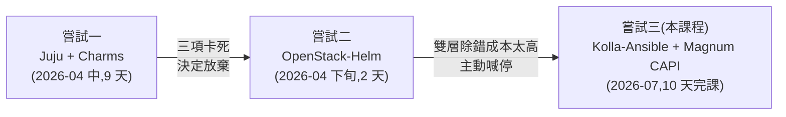

# 前兩次嘗試:走過才知道的路

> 本課程(Day 0–10)是**第三次嘗試**。這個章節保留前兩次的完整紀錄——不是為了懷舊,而是因為**每一個本課程的技術選擇,都是被這裡的失敗逼出來的**。想知道「為什麼是 Kolla-Ansible、為什麼是 CAPI driver」,答案都在這裡。

## 時間軸

## 嘗試一:Juju + Charms(9 天)

### 當時為什麼選它

Juju 是 Canonical 的部署工具,charm 是它的服務安裝單元;它的賣點是「宣告 relation(服務關係),charm 自動完成整合」——理論上接好線就能長出一朵雲。整套跑在 LXD 容器裡,單機就能模擬多節點。

### 實際做到哪

不算失敗的一役:**15 個服務部起來、VM 開得出來**,而且逼著把 OpenStack 每個元件的關係摸得很熟(這份理解直接沿用到本課程)。完整過程見左側「Sprint 1」的 20 篇 runbook。

### 為什麼放棄:三項關鍵功能卡死,而且無從修起

| 卡死項目 | 死因 | 為什麼修不了 |
|---|---|---|
| **Octavia**(負載平衡) | 官方 charm 在 amd64 架構上**沒有發佈可用版本** | 不是設定問題,是上游沒出貨——等,或換路線 |
| **Cinder LVM**(區塊儲存) | LXD 容器拿不到 device-mapper 權限 | 執行環境的先天限制,除非放棄 LXD 架構 |
| **Magnum**(K8s 服務) | 舊 driver 內建 2019–2021 的 image 下載連結,全數失效 | 上游生態多年沒維護 |

共同點:**三個都不是「我做錯了什麼」,是生態系本身撐不住**。9 天踩了 22 個雷(都收錄在[排錯手冊](solutions/README.md)),其中近半是 charm 的預設值陷阱或版本斷代。結論寫在 [Sprint 1 回顧](reflection.md):這條路線對這種 lab 不可行,**放棄 Juju + Charms**。

### 這次嘗試留下什麼

- OpenStack 元件關係的第一手理解(哪個服務跟哪個服務講話、為什麼)
- 22 條排錯紀錄——「charm 生態為什麼撐不起 lab」的具體證據
- 三個明確的未完成項,成為本課程的驗收清單

## 嘗試二:OpenStack-Helm(2 天)

### 當時為什麼選它

放棄 Juju 後的規劃(見 [Sprint 2 課程計畫](sprint2-course-plan.md)):既然已經會 Kubernetes,那就**把 OpenStack 當應用程式部在 K8s 上**(OpenStack-Helm 路線),還能省掉學 Ansible。當時甚至刻意寫下「不走 Kolla-Ansible」。

### 實際做到哪

兩天:單節點 K8s 架好(kubeadm + CNI + MetalLB + local-path),OpenStack 的基礎依賴(MariaDB / RabbitMQ / Memcached / OVS)用 Helm chart 部起來,踩了 5 個雷(repo 已 retire、node label 不打就 Pending……見 sprint2 各篇)。

### 為什麼喊停

部 infra 的兩天已經體感到代價:**任何問題都要同時跨 K8s 層和 OpenStack 層除錯**——pod 排程、init container 依賴、chart 版本漂移,全部疊在 OpenStack 本身的複雜度上。對「一個人、一台機、目標是學 OpenStack」的 lab,這個除錯成本完全划不來。走完 infra 就主動停掉,沒有進到 OpenStack 服務本體。

### 這次嘗試留下什麼

- 「部署工具的複雜度要匹配場景」這條教訓——它直接推導出第三次的 Kolla-Ansible(每服務一個 Docker 容器,透明、單層、好除錯)
- 4 篇 runbook 保留為歷史紀錄(左側「Sprint 2」)

## 兩次嘗試如何決定了本課程

| 前兩次的教訓 | 本課程的對應選擇 |
|---|---|
| charm 生態斷代、黑箱難修 | **Kolla-Ansible**:社群主流、容器透明、以原始碼為準可自行診斷 |
| LXD 容器的 kernel 權限限制 | **直接跑在 Azure VM**(真機),Cinder LVM 零阻力 |
| Magnum 舊 driver 的 image 全失效 | **Magnum CAPI driver**:node image 由活躍的 K8s 生態維護 |
| OSH 的雙層除錯負擔 | 單層架構:問題不是 OpenStack 的就是 host 的,不會夾在中間 |

結果:前兩次卡死的三個項目,第三次全部完成(見[課程主線 Day 8](runbook/sprint3-day8-e2e-workload-cluster.md) 與 [Sprint 3 回顧](sprint3-reflection.md))。

---

**接下來怎麼讀這個章節**:左側「Sprint 1 · Juju + Charms」是九天的完整 runbook(依部署順序排列);「Sprint 2 · Kolla / OSH」是兩天的紀錄;[Sprint 2 課程計畫](sprint2-course-plan.md)則是那份「後來被推翻」的原始規劃,對照著看特別有味道。
