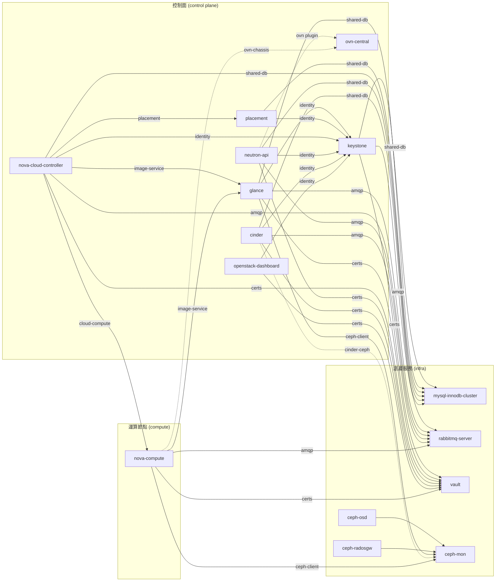

# Day 2: OpenStack Charm 架構地圖

## 目的

在開始部署前，先把 **18 個 OpenStack charm 誰連誰** 看清楚，之後部署每個 charm 時知道它在大圖哪個位置。

## 對應官方文件

- [Install OpenStack 章](https://docs.openstack.org/project-deploy-guide/charm-deployment-guide/latest/install-openstack.html) — 部署順序與 charm 列表
- [OpenStack Charm Guide](https://docs.openstack.org/charm-guide/latest/) — 每個 charm 的詳細說明

---

## 18 個 Charm 按功能分群

### 1. 儲存層（Ceph）— 3 個
| Charm | 角色 |
|---|---|
| `ceph-mon` | Ceph monitor（quorum / cluster state） |
| `ceph-osd` | Object Storage Daemon（實際存資料的節點） |
| `ceph-radosgw` | RADOS Gateway（S3/Swift 相容 HTTP API，optional） |

### 2. 資料庫 — 2 個
| Charm | 角色 |
|---|---|
| `mysql-innodb-cluster` | MySQL 8.0 HA cluster（至少 3 unit） |
| `mysql-router` ⒮ | subordinate，輕量 proxy，附在每個消費 DB 的 unit 上 |

⒮ = subordinate（附著型）

### 3. 訊息 — 1 個
| Charm | 角色 |
|---|---|
| `rabbitmq-server` | AMQP 0.9 broker，OpenStack service 之間的非同步訊息匯流排 |

### 4. 憑證/秘密 — 1 個
| Charm | 角色 |
|---|---|
| `vault` | TLS CA + secret store（發 cert 給所有 OpenStack 服務） |

### 5. 網路（OVN/Neutron）— 4 個
| Charm | 角色 |
|---|---|
| `ovn-central` | OVN control plane（Northbound + Southbound DB + northd） |
| `neutron-api` | Neutron API service（接使用者 API call） |
| `neutron-api-plugin-ovn` ⒮ | subordinate，讓 neutron-api 用 OVN 當資料平面 |
| `ovn-chassis` ⒮ | subordinate，附在每個 nova-compute 上，把 VM 接入 OVN |

### 6. 認證 — 1 個
| Charm | 角色 |
|---|---|
| `keystone` | Identity Service（token + service catalog） |

### 7. 運算與映像 — 4 個
| Charm | 角色 |
|---|---|
| `glance` | Image Service（VM image registry） |
| `placement` | Placement Service（資源 inventory + 配置決策） |
| `nova-cloud-controller` | Nova 控制面（API + scheduler + conductor） |
| `nova-compute` | Hypervisor（實際跑 VM，需要 KVM） |

### 8. 區塊儲存 — 2 個
| Charm | 角色 |
|---|---|
| `cinder` | Block Storage Service（volume API + scheduler + volume manager） |
| `cinder-ceph` ⒮ | subordinate，讓 cinder 用 ceph 當 backend |

### 9. 儀表板 — 1 個
| Charm | 角色 |
|---|---|
| `openstack-dashboard` | Horizon Web UI |

**合計**：9 + 5 subordinate = **18 charm**（ceph-radosgw 若省略則 17）。

---

## 關鍵 Relation Interface

這 18 個 charm 之間的連線，主要靠下面幾個 interface：

| Interface | 意義 | 連接方向 |
|---|---|---|
| `shared-db` / `database` | 取得 MySQL credentials | 服務 → mysql |
| `amqp` | 連到 RabbitMQ | 服務 → rabbitmq |
| `certificates` | 取 TLS 憑證 | 服務 → vault |
| `identity-service` | 註冊到 keystone catalog | 服務 → keystone |
| `identity-credentials` | 取得服務帳號 | 服務 → keystone |
| `image-service` | 取得 Glance API 位置 | nova-compute / cinder → glance |
| `ceph-client` | 當 Ceph client | glance / cinder-ceph → ceph-mon |
| `ceph-osd` | 內部 Ceph cluster | ceph-osd → ceph-mon |
| `cloud-compute` | 控制面對 compute node | nova-cloud-controller → nova-compute |
| `placement` | Nova 查 placement | nova-cloud-controller → placement |
| `neutron-plugin-api-subordinate` | Neutron API 走哪個 backend | neutron-api → neutron-api-plugin-ovn |
| `ovsdb-cms` | OVN NB/SB DB 連線 | neutron-api-plugin-ovn / ovn-chassis → ovn-central |

---

## 全貌關係圖

**讀這張圖的方式**：
- 下面 `infra` 層：所有 OpenStack 服務都靠它（DB / MQ / 憑證 / 儲存）
- 中間 `control plane`：各個 OpenStack API service，彼此有依賴（例如 glance 需要 keystone）
- 上面 `compute`：真正跑 workload 的 hypervisor

---

## 部署順序（官方指南 + 邏輯依賴）

### Phase A — 底層（infra）
先把所有控制面會用到的底層架起來。
1. **ceph-mon** + **ceph-osd**（3 unit 各）
2. **ceph-radosgw**（optional）
3. **mysql-innodb-cluster**（3 unit）
4. **rabbitmq-server**
5. **vault** + 初始化（unseal + authorize-charm）

驗收：`juju status` 全部 active；vault authorize 完成（不然後續服務沒憑證）。

### Phase B — 控制面（OpenStack core）
6. **keystone**（integrate mysql + rabbitmq + vault）
7. **glance**（integrate mysql + rabbitmq + vault + keystone + ceph-mon）
8. **placement**（integrate mysql + keystone）
9. **nova-cloud-controller**（integrate 所有 infra + glance + placement）
10. **neutron-api** + **neutron-api-plugin-ovn** + **ovn-central**
11. **cinder** + **cinder-ceph**
12. **openstack-dashboard**

驗收：`openstack catalog list` 看到所有服務註冊。

### Phase C — 運算節點
13. **nova-compute** + **ovn-chassis**（subordinate）
14. 設 external network、上傳 cirros image、開第一台 VM

驗收：`openstack server create` 成功 + ping 外部。

---

## 我們目前已有的

| 產品用途 | 生產用 Charm | 我們目前用 |
|---|---|---|
| DB | `mysql-innodb-cluster` (3 unit) | ✅ `mysql` (Day 1，單 unit) — 提供同樣的 `shared-db` interface |
| 憑證 | `vault` | ✅ `self-signed-certificates` (Day 1) — 提供同樣的 `tls-certificates` interface |

所以 **Phase A 的 MySQL 和 Vault 可以沿用現有的**，省下部署時間。

剩下要補的底層：
- **rabbitmq-server**
- **ceph-mon / osd / radosgw**（如果要用 ceph-backed glance/cinder）

**簡化方案（學習路徑）**：先跳過 Ceph，用 glance 預設 file backend、暫不裝 cinder。之後回頭再補 Ceph。這樣最快 stand up 可用的 OpenStack。

---

## Day 3 第一步的選擇

按官方指南順序 → 先部署 **Ceph cluster** 。
按學習路徑（快速看到成果） → 先部署 **rabbitmq-server + keystone**。

預設走**學習路徑**（更快看到 `openstack catalog list` 有東西），Ceph 後面 Day 4-5 補。
