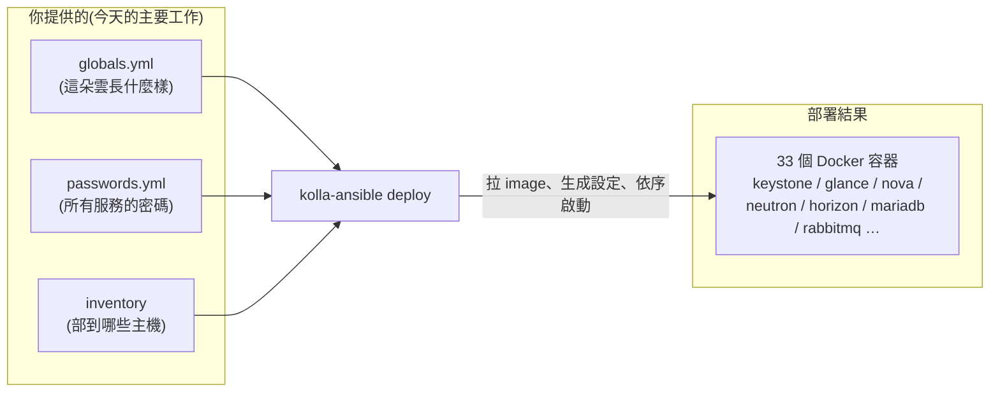
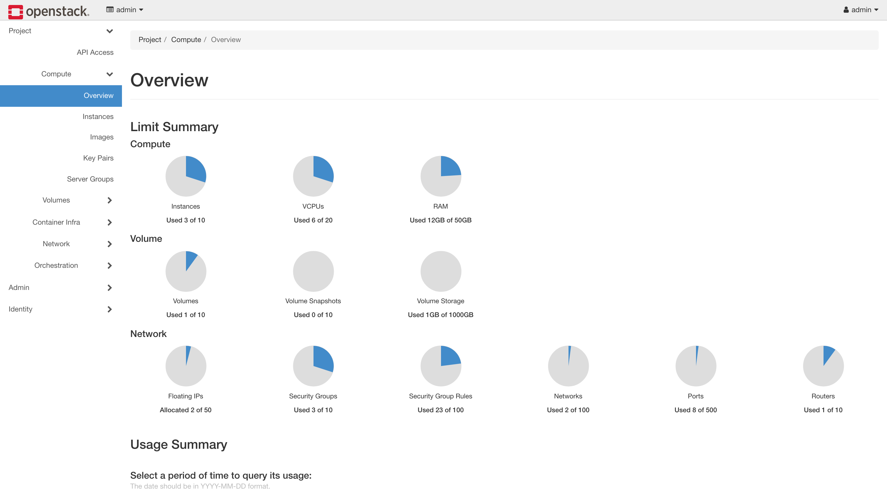

# Day 1: 用 Kolla-Ansible 部署 OpenStack 核心服務

> 今天結束時,你會擁有一朵**能登入、能用的 OpenStack 雲**:五個核心服務跑在 33 個容器裡,網頁儀表板打得開,CLI 查得到服務清單。

!!! abstract "你在課程的哪裡"
    - **昨天(Day 0)**:準備好一台支援巢狀虛擬化的 Azure VM,目前是一台乾淨的 Ubuntu 24.04。
    - **今天**:安裝部署工具 Kolla-Ansible,用它部出 OpenStack 核心(Keystone / Glance / Nova / Neutron / Horizon)。
    - **今天之後**:Day 2 開始「使用」這朵雲(開 VM);之後每天增量加一個服務上去。
    - 今天**刻意不裝** Cinder(儲存服務)——留到 Day 3,順便學「對已上線的環境增量加服務」這個重要工作流。

## 第一次接觸 Kolla-Ansible?先讀這段

{ align=right width="110" }

### 要解決的問題:OpenStack 很難「裝」

OpenStack 不是一個程式,是**十幾個服務的集合**——每個服務要自己的設定檔、資料庫、訊息佇列連線,彼此還要知道對方的位址和密碼。全部手動裝,光把設定串對就要好幾天,而且無法重現。所以實務上**沒有人手動裝 OpenStack**,一定用部署工具。

### Kolla 與 Kolla-Ansible 是什麼

兩個名字很像,分工不同:

- **Kolla**:把每個 OpenStack 服務預先打包成 **Docker image**(放在 `quay.io/openstack.kolla/`)。你不用自己編譯或安裝任何 OpenStack 軟體。
- **Kolla-Ansible**:一組 **Ansible 劇本**(自動化腳本),負責把這些 image 拉到主機、生成每個服務的設定檔、按正確順序啟動、把它們串成一朵雲。

你要做的事只有三件:**填一份設定檔(`globals.yml`)→ 產生密碼 → 執行部署指令**。剩下的交給工具。



### 今天會遇到的名詞

| 名詞 | 白話解釋 |
|---|---|
| **AIO**(all-in-one) | 所有服務裝在同一台主機。學習用標準做法;生產環境會拆多台 |
| **inventory** | Ansible 的「主機名單」。AIO 情境就是一份現成的單機名單檔 |
| **globals.yml** | Kolla-Ansible 唯一的主設定檔。預設全部是註解,你只需要加上自己要改的幾行 |
| **VIP**(virtual IP) | 多主機部署時,一個「飄在多台主機之間」的服務入口 IP。單機部署沒有 HA,VIP 直接填主機自己的 IP |
| **venv** | Python 虛擬環境。把 kolla-ansible 和它的依賴隔離在一個資料夾裡,不污染系統 Python |

## 原理與架構

### 1. Kolla-Ansible 的部署模型:三個特徵

裝之前先建立正確的心智模型,之後除錯會輕鬆很多:

1. **每個服務一個容器**:`docker ps` 會看到 `nova_api`、`keystone`、`mariadb`……一個容器出問題,看那個容器的 log 就好,邊界非常清楚。
2. **所有容器共用主機網路**(host network mode):容器不做網路隔離,服務就像直接跑在主機上一樣佔用 port。好處是網路路徑單純;代價是 port 衝突要自己留意——我們部署時就撞過一次([地雷 4:port 3306 被佔走](#mine-4))。
3. **設定在部署當下生成、寫死**:服務之間互連需要的資訊(資料庫帳密、訊息佇列位址、認證端點)全部由 kolla-ansible 在執行 `deploy` 的當下計算好、寫進每個服務的設定檔。**之後想改任何設定,就改 `globals.yml` 再重跑部署指令**——工具是冪等的(重跑只會套用差異),這是它可靠的來源。

!!! note "與前一次嘗試的對照(選讀)"
    [前兩次嘗試](../previous-attempts.md)中的 Juju/Charm 走的是相反哲學:服務之間靠「relation」在**執行期動態協商**連線資訊,理論優雅,但協商過程是黑箱、出錯難查。Kolla 的「部署期一次算好」土法但透明——設定檔就在那裡,打開看就知道服務拿到了什麼。

### 2. 版本選擇:OpenStack 2025.1(Epoxy)

OpenStack 每半年發布一版,版名按字母排序(……Dalmatian、**Epoxy**、Flamingo……)。本課選 **2025.1 Epoxy**:發布滿一年、文件與社群經驗最豐富的近期穩定版。對應關係:kolla-ansible **20.x** ↔ OpenStack **2025.1**,而我們直接從 git 的 `stable/2025.1` 分支安裝,不用去猜 pip 版號區間。Ubuntu 24.04 主機在官方支援矩陣內。

### 3. 部署前的三個網路決定

`globals.yml` 裡真正需要思考的其實只有網路。這三個決定每個都跟「我們跑在 Azure 上」有關:

| 設定 | 本課的值 | 為什麼 |
|---|---|---|
| `network_interface` | `eth0` | 管理流量、API、隧道流量走哪張網卡。單機單網卡,就是 `eth0`。(VM 上另一張 `enP*` 是 Azure 加速網路的配件,不要碰) |
| `neutron_external_interface` | `dummy0` | Kolla 要求給「對外網路」一張**沒有 IP 的專用網卡**。Azure VM 只有一張真網卡,標準解法是造一張**虛擬的 dummy 網卡**充當。代價:對外網路只在主機內部有效(Azure 網路不允許 L2 廣播,Day 0 已解釋)——所以之後從 Mac 看任何東西都走 SSH tunnel |
| `kolla_internal_vip_address` + `enable_haproxy: "no"` | `10.0.0.4`(主機自己的 IP) | 單機沒有高可用需求,關掉負載平衡層(haproxy),VIP 直接填主機 IP。生產多節點時這裡會是真的浮動 VIP |

另外兩行:`neutron_plugin_agent: "ovn"` 選 OVN 當網路後端(現代預設,Day 2 會深入它),`nova_compute_virt_type: "kvm"` 用硬體虛擬化加速(Day 0 已用 `kvm-ok` 驗證過,不寫也是預設值,寫出來是課程用意)。

## 開始之前

確認你有:

- [x] Day 0 建好的 Azure VM(Ubuntu 24.04、16 vCPU / 128 GB、`kvm-ok` 通過),且能 SSH 進去
- [x] VM 能連外網(要從 quay.io 拉約 30 個 image)
- 以下**所有指令都在 VM 上執行**(SSH 進去後),除非特別註明「在 Mac 上」

## 步驟

### 步驟 1:安裝 Kolla-Ansible

Kolla-Ansible 是 Python 套件,我們把它裝進獨立的 venv,避免跟系統 Python 打架。先裝系統層的編譯依賴,再建 venv:

```bash
sudo apt-get install -y git python3-venv python3-dev libffi-dev gcc libssl-dev
python3 -m venv ~/kolla-venv
source ~/kolla-venv/bin/activate
```

!!! warning "之後每次操作都要先進 venv"
    今天以及未來每一天,執行任何 `kolla-ansible` 指令之前都要先 `source ~/kolla-venv/bin/activate`,提示符出現 `(kolla-venv)` 前綴才算進來了。忘記的話,指令會拿系統的 Python 環境執行,冒出來的錯誤訊息會跟真正的原因毫無關聯、極難聯想——我們就吃過一次虧,過程記錄在[地雷 1:沒進 venv 的靈異錯誤](#mine-1)。

接著在 venv 內安裝 kolla-ansible 本體(從 stable 分支)與它需要的 Ansible:

```bash
pip install -U pip
pip install "ansible-core>=2.16,<2.18"
pip install git+https://opendev.org/openstack/kolla-ansible@stable/2025.1
```

裝完先驗證版本,確認拿到的是 20.x(對應 OpenStack 2025.1):

```bash
kolla-ansible --version
```

```text
kolla-ansible 20.4.0
```

kolla-ansible 還需要一批 Ansible collection(可以想成它的外掛),用內建指令安裝:

```bash
kolla-ansible install-deps
```

最後補裝兩個 Python 模組。這一步官方文件沒寫,但不做的話,稍後的 prechecks 會分別因為缺 Docker SDK 和缺 dbus 模組而失敗(我們就是這樣發現的,詳見[地雷 2](#mine-2) 與[地雷 3](#mine-3));其中 dbus-python 是原始碼編譯套件,要先裝系統標頭檔:

```bash
sudo apt-get install -y pkg-config libdbus-1-dev libdbus-glib-1-dev
pip install docker dbus-python
```

工具裝好了,下一步準備它要吃的設定檔。

### 步驟 2:準備設定檔骨架

Kolla-Ansible 約定所有設定放在 `/etc/kolla/`。把官方範例複製過去,並把單機用的 inventory(主機名單)複製到家目錄:

```bash
sudo mkdir -p /etc/kolla && sudo chown $USER:$USER /etc/kolla
cp -r ~/kolla-venv/share/kolla-ansible/etc_examples/kolla/* /etc/kolla/
cp ~/kolla-venv/share/kolla-ansible/ansible/inventory/all-in-one ~/all-in-one
```

確認骨架就位:

```bash
ls /etc/kolla/
```

```text
globals.yml  passwords.yml
```

`globals.yml` 現在幾乎全是註解(這是特色:只寫你要改的),`passwords.yml` 全是空值(下一步生成)。

### 步驟 3:造一張 dummy 網卡

原理章說過:Kolla 需要一張**沒有 IP 的網卡**給對外網路,而 Azure VM 只有一張真網卡。解法是造一張虛擬的 dummy 網卡。先立即生效:

```bash
sudo ip link add dummy0 type dummy && sudo ip link set dummy0 up
```

但 `ip link` 的效果重開機就消失,所以同時寫成 systemd-networkd 設定讓它**開機自動重建**(這台 VM 每晚會自動關機,這步不做明天就壞):

```bash
sudo tee /etc/systemd/network/10-dummy0.netdev <<EOF
[NetDev]
Name=dummy0
Kind=dummy
EOF
sudo tee /etc/systemd/network/10-dummy0.network <<EOF
[Match]
Name=dummy0

[Network]
LinkLocalAddressing=no
ConfigureWithoutCarrier=yes
EOF
```

驗證網卡存在且是 UP:

```bash
ip -br link show dummy0
```

```text
dummy0           UNKNOWN        aa:bb:cc:dd:ee:ff <BROADCAST,NOARP,UP,LOWER_UP>
```

### 步驟 4:填 globals.yml、產生密碼

把我們在原理章決定好的七行設定**附加到 `globals.yml` 檔尾**。原檔全部是註解所以不會衝突,而且之後 `git diff` 或肉眼一看就知道自己改了什麼:

```bash
tee -a /etc/kolla/globals.yml <<EOF
kolla_base_distro: "ubuntu"
kolla_internal_vip_address: "10.0.0.4"
enable_haproxy: "no"
network_interface: "eth0"
neutron_external_interface: "dummy0"
neutron_plugin_agent: "ovn"
nova_compute_virt_type: "kvm"
EOF
```

> `kolla_internal_vip_address` 請填**你的 VM 的私有 IP**(`ip -4 addr show eth0` 可查);本課環境是 `10.0.0.4`。

接著一個指令生成所有服務的隨機密碼(填滿 `passwords.yml`):

```bash
kolla-genpwd
```

驗證密碼真的生出來了(隨便抽查一個,應該看到隨機字串而不是空白):

```bash
grep keystone_admin_password /etc/kolla/passwords.yml
```

設定齊了:雲長什麼樣(globals)、密碼(passwords)、部到哪(inventory)。可以開始部署。

### 步驟 5:bootstrap 與 prechecks

部署分三段跑,不要一次到位——每段都有明確的驗證點。第一段 `bootstrap-servers` 幫主機裝好 Docker engine 等基礎(約 3 分鐘):

```bash
kolla-ansible bootstrap-servers -i ~/all-in-one
```

第二段 `prechecks` 做部署前健檢(port 有沒有被佔、設定有沒有矛盾):

```bash
kolla-ansible prechecks -i ~/all-in-one
```

兩段結尾都會印 Ansible 的 `PLAY RECAP`,**判準只有一個:`failed=0`**:

```text
PLAY RECAP *********************************************************
localhost : ok=45   changed=8    unreachable=0    failed=0    ...
```

prechecks 沒過就不要繼續——它抓到的每個問題,到 deploy 階段都會變成更難查的失敗。如果你看到 `No module named 'docker'` 或 `No module named 'dbus'`,回到步驟 1 最後補裝模組那段([地雷 2](#mine-2)、[地雷 3](#mine-3) 有完整說明)。

### 步驟 6:deploy(約 25 分鐘)

正式部署。這一步要拉 30 個 image 並依序啟動所有服務,第一次跑約 25 分鐘——**用 `nohup` 放到背景跑**,SSH 斷線也不會中斷(25 分鐘內斷線機率不低,別賭):

```bash
nohup bash -c "source ~/kolla-venv/bin/activate && kolla-ansible deploy -i ~/all-in-one" \
  > ~/kolla-deploy.log 2>&1 &
tail -f ~/kolla-deploy.log
```

`tail -f` 讓你即時看進度(`Ctrl+C` 只會停止觀看,不影響背景部署)。結尾一樣看 `PLAY RECAP` 的 `failed=0`。本課實測:

```text
PLAY RECAP *********************************************************
localhost : ok=367  changed=214  unreachable=0    failed=0    ...
```

如果 deploy 中途失敗:先在 log 裡找第一個 `fatal:`,那才是真正的錯誤(後面的失敗多半是連鎖反應)。我們第一次跑就在這裡失敗——MariaDB 起不來,原因是 port 被佔([地雷 4](#mine-4) 有完整的診斷過程與解法);修正設定後**直接重跑同一個指令**就過了。deploy 是冪等的:重跑只會套用差異,沒有副作用,失敗後不需要砍掉重練。

### 步驟 7:拿到鑰匙,第一次使用你的雲

部署完成後,產生管理員的登入憑證檔:

```bash
kolla-ansible post-deploy -i ~/all-in-one
```

這會生出 `/etc/kolla/admin-openrc.sh`——內容是一組環境變數(帳號、密碼、API 位址),OpenStack CLI 靠它知道要連哪朵雲、用什麼身分。裝 CLI、載入憑證、下第一個指令:

```bash
pip install python-openstackclient
source /etc/kolla/admin-openrc.sh
openstack service list
```

```text
+----------------------------------+-----------+----------------+
| ID                               | Name      | Type           |
+----------------------------------+-----------+----------------+
| ...                              | keystone  | identity       |
| ...                              | glance    | image          |
| ...                              | placement | placement      |
| ...                              | nova      | compute        |
| ...                              | neutron   | network        |
| ...                              | heat      | orchestration  |
| ...                              | heat-cfn  | cloudformation |
+----------------------------------+-----------+----------------+
```

看到服務清單 = 你的雲活著。(眼尖的話:Heat 也在——Epoxy 預設啟用,我們沒特別裝,Day 5 直接用。)

最後開網頁儀表板 Horizon。因為對外網路出不了主機(Azure 限制),**在 Mac 上**開一條 SSH tunnel:

```bash
# 在 Mac 上執行;<VM公網IP> 換成你 Day 0 拿到的
ssh -L 8080:<VM私有IP>:80 azureuser@<VM公網IP>
```

瀏覽器開 `http://localhost:8080`,帳號 `admin`,密碼在 VM 上查:

```bash
grep keystone_admin_password /etc/kolla/passwords.yml
```

登入看到 Horizon 儀表板,今天就完成了。



*登入後的 Horizon Overview:配額圓餅圖顯示這朵雲目前的資源用量——你的第一個雲端儀表板。*


## 驗收 checkpoint

逐項執行,**全部符合才算完成今天**。「本課環境的結果」欄是我們實測的參考值,你的數字可以略有出入,但判準必須成立:

| 驗證 | 判準 | 本課環境的結果 |
|---|---|---|
| deploy 的 PLAY RECAP | `failed=0` | ok=367 / changed=214 |
| `openstack service list` | 核心服務全部註冊 | 7 個服務(多出來的 Heat 是 Epoxy 預設附贈) |
| `openstack compute service list` | nova 的 scheduler / conductor / compute 狀態全是 `up` | 3 個元件全 `up` |
| `openstack network agent list` | OVN agent 全部 Alive | 全 Alive |
| `docker ps` | 每個容器都是 `Up`,沒有 `Exited` 或 `Restarting` | 33 個容器 |
| Horizon | 走 SSH tunnel 打得開登入頁、admin 登得進去 | 正常 |

部署耗時參考:我們第一次跑到第 12 分鐘因 [地雷 4](#mine-4) 失敗;修正後重跑(此時 image 已在本地)約 25 分鐘完成。你如果一次順利通過,含拉 image 約 25–30 分鐘。

## 地雷記錄

我們部署時實際撞到的四個問題,依出現順序排列。正文各步驟提到「地雷 N」時,指的就是這裡的對應條目。

### 地雷 1:沒進 venv,`install-deps` 靜默失敗 {#mine-1}

沒 activate venv、直接用完整路徑呼叫 `~/kolla-venv/bin/kolla-ansible install-deps` 會找不到 `ansible-galaxy`(它是靠 PATH 找的)。**教訓:kolla 指令一律在 `source ~/kolla-venv/bin/activate` 之後跑。** 後遺症狀很誤導:bootstrap-servers 報 `role openstack.kolla.baremetal` 解析錯誤——真因是 collection 根本沒裝進去。

### 地雷 2:prechecks 報 `No module named 'docker'` {#mine-2}

bootstrap-servers 裝的是 Docker **engine**(主機上的服務),venv 裡的 Docker **Python SDK** 是另一回事,要自己 `pip install docker`。

### 地雷 3:prechecks 報 `No module named 'dbus'` {#mine-3}

`dbus-python` 是原始碼編譯套件,直接 pip 裝會編譯失敗——要先 `apt install pkg-config libdbus-1-dev libdbus-glib-1-dev` 再 `pip install dbus-python`。

### 地雷 4:MariaDB 起不來,port 3306 被 proxysql 佔走 {#mine-4}

**症狀**:deploy 卡在 `Wait for first MariaDB service port liveness` 直到 timeout;`docker ps -a` 看到 `mariadb Exited (1)`;`ss -tlnp | grep 3306` 發現聽 3306 的是 **proxysql**。

**根因**:Epoxy 把 `enable_proxysql` 預設為 `yes`(MariaDB 的前端負載平衡),而且它跟 `enable_haproxy` 是**獨立開關**。我們關了 haproxy 並把 VIP 設成主機 IP 之後,proxysql 綁 VIP:3306、mariadb 綁主機:3306——同一個 IP:port,相撞。

**解法**:

```bash
echo 'enable_proxysql: "no"' >> /etc/kolla/globals.yml
sudo docker rm -f proxysql haproxy mariadb
sudo docker volume rm mariadb     # DB 還沒資料,砍掉讓它重新初始化最乾淨
kolla-ansible deploy -i ~/all-in-one   # 冪等,直接重跑
```

**教訓**:單機部署關 haproxy 時,**proxysql 要一起關**。詳細分析見排錯手冊:[Kolla ProxySQL vs MariaDB port](../solutions/integration-issues/kolla-proxysql-mariadb-port-conflict.md)。

## 延伸閱讀

想往下深挖,從這幾份開始:

- **[Kolla-Ansible 官方 Quick Start](https://docs.openstack.org/kolla-ansible/2025.1/user/quickstart.html)** —— 本章部署流程的官方版;哪些步驟是 Kolla 標準動作、哪些是本課環境特調,對照著看就清楚。
- **[Get started with OpenStack](https://docs.openstack.org/install-guide/get-started-with-openstack.html)** —— 官方的服務總覽:每個核心服務是什麼、彼此怎麼分工,一頁講完。
- **[Kolla 專案文件](https://docs.openstack.org/kolla/2025.1/)** —— 那些容器映像檔是誰做的?就是這個專案;想理解映像檔怎麼組出來的看這份。
- **[Kolla-Ansible 支援矩陣](https://docs.openstack.org/kolla-ansible/2025.1/user/support-matrix.html)** —— 哪些作業系統、哪些服務受官方支援,規劃環境前值得先掃一眼。

## 下一步

雲部好了,但現在是「空的」——沒有租戶、沒有 image、沒有網路。[Day 2](sprint3-day2-openstack-resource-flow.md) 我們扮演管理員和租戶,把開出第一台 VM 需要的所有資源從零建立起來。
