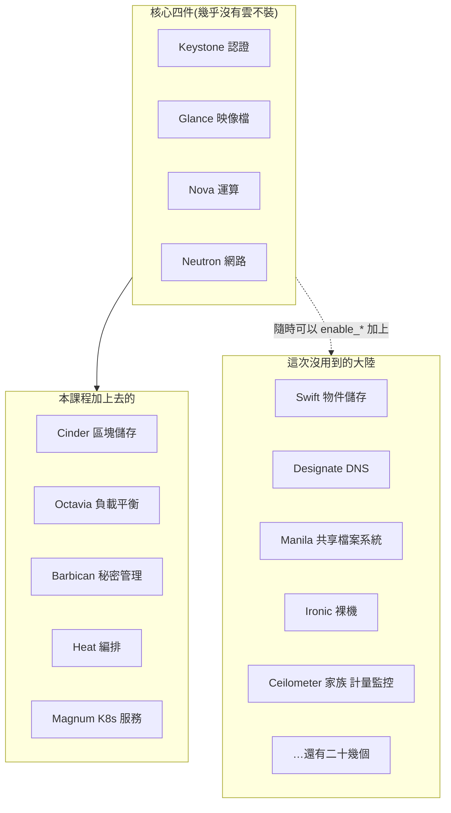
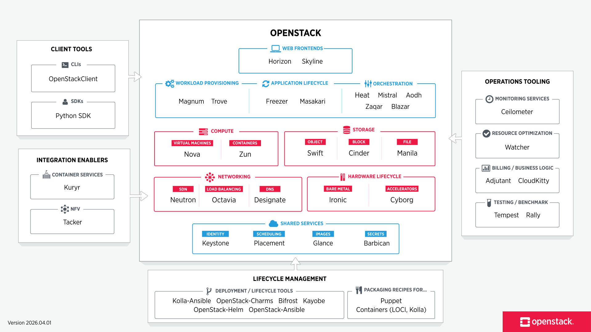
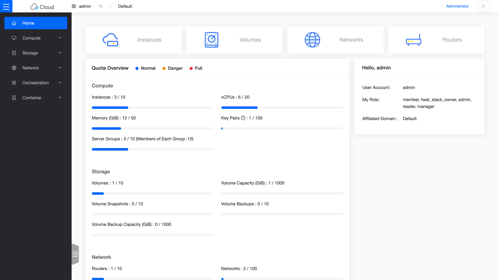
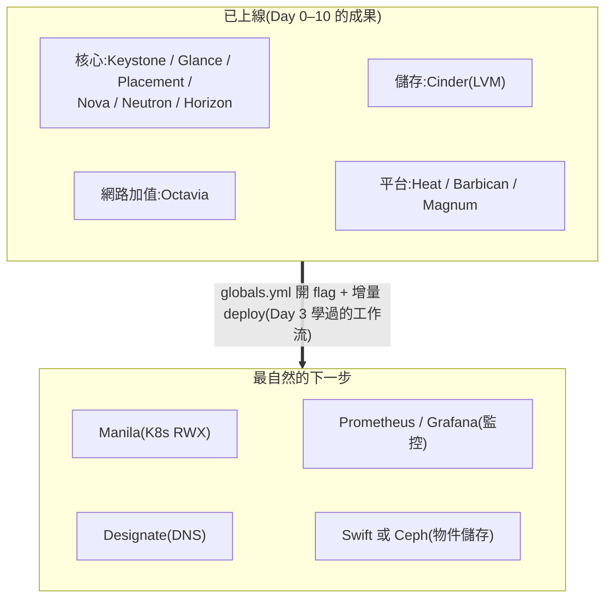

# Day 11 · 後日談:OpenStack 服務全景圖

> 正課到 Day 10 已經結束,這一篇不用動手。它是一張**地圖**:把視野從「這門課用過的服務」拉開到 OpenStack 的完整版圖——你會清楚看到自己這十天走過了哪裡、還有哪些大陸沒踏上,以及下一步值得去哪。

!!! abstract "你在課程的哪裡"
    - **Day 0–10**:從一台裸 VM 到 K8s-as-a-Service,你部署並實際使用了 **11 個 OpenStack 服務**。
    - **今天**:不部署任何東西。盤點用過的、認識沒用過的,建立「整個 OpenStack 生態」的完整心智圖。
    - **今天之後**:想繼續擴充這朵雲的話,文末有依價值排序的建議清單。

## OpenStack 是一盒積木,你不必全部都用

先建立一個常被誤解的觀念:**OpenStack 不是一個「裝了就全有」的產品,而是幾十個獨立專案的集合**。每個專案管一種資源、可以獨立啟用。實務上沒有任何一朵雲會全裝——公有雲業者可能用二十個,企業私有雲常常只用六七個。

這也是為什麼 Kolla-Ansible 的 `globals.yml` 裡全是 `enable_xxx` 開關:你在 Day 3(Cinder)、Day 4(Octavia)、Day 5(Barbican)、Day 7(Magnum)做的事,本質上就是「從積木盒裡再拿一塊出來拼上去」。

{ align=right width="88" }

順帶一提:OpenStack 社群給每個專案都畫了**官方吉祥物**,連我們用了十天的部署工具 Kolla-Ansible 都有——一隻無尾熊(Kolla 的名字就是從 koala 來的)。這一篇會讓每個服務的吉祥物跟著登場,**記臉比記名字快**。

## 官方全景圖:OpenStack Map

上面是本課程視角的簡圖;OpenInfra Foundation 其實有維護一張**官方版全景圖**(類似 CNCF Landscape 的角色),每半年左右更新一次:

*(點圖可到 openstack.org/software 看互動版)*

這張圖值得多看三十秒:

- **中間主體**就是本篇要盤點的服務版圖——你用過的 11 個全在裡面(Shared Services 那排:Keystone/Placement/Glance/Barbican,一天內就能對出來)。
- **下方「Lifecycle Management」格子藏著本課程的彩蛋**:Kolla-Ansible、OpenStack-Charms、OpenStack-Helm 三個部署工具並排站在一起——正好就是[三次嘗試](../previous-attempts.md)各自走過的路線。官方把它們畫在同一格,我們用三個 Sprint 親身比完了。
- **右側「Operations Tooling」**(Ceilometer/Watcher/CloudKitty/Tempest)是本課完全沒碰的維運面,對照下面第二梯隊的表。

## 這門課用過的服務(11 個)

每一個都實際部署、實際操作過。每個專案都有官方吉祥物——記臉比記名字快。「AWS 對應」欄幫你把學到的知識映射到公有雲的世界:

| | 服務 | 管什麼 | AWS 對應 | 在本課程 |
|---|---|---|---|---|
| { width="64" } | **Keystone** | 帳號、租戶、權限、token | IAM | Day 1 部署;之後每一天的每個指令都經過它 |
| { width="64" } | **Glance** | VM 開機映像檔 | AMI | Day 1 部署;Day 2 上傳 cirros/Ubuntu、Day 7 上傳 K8s node image |
| — | **Placement** | 資源帳本(哪台主機還有多少 CPU/RAM/disk) | (EC2 內部機制) | Day 1 部署;Day 9 調 `disk_allocation_ratio` 就是在跟它打交道 |
| { width="64" } | **Nova** | 開 VM、排程 | EC2 | Day 1 部署;Day 2 起開遍了 VM(含 K8s 節點、amphora) |
| { width="64" } | **Neutron**(+ OVN) | 虛擬網路、路由、防火牆 | VPC | Day 1 部署;Day 2 建網路/router/FIP,之後所有網路都是它 |
| { width="64" } | **Horizon** | 網頁儀表板 | Console | Day 1 部署;課程刻意以 CLI 為主,它當觀景窗 |
| { width="64" } | **Heat** | 宣告式編排(藍圖蓋資源) | CloudFormation | Day 1 隨預設部署、Day 5 實戰 HOT stack |
| { width="64" } | **Cinder** | 區塊儲存(VM 的外接硬碟) | EBS | Day 3 部署 + volume 生命週期;Day 8 供裝 K8s PVC |
| { width="64" } | **Octavia** | 負載平衡(amphora VM 模型) | ELB | Day 4 部署 + 手動 LB;Day 8 供裝 K8s LoadBalancer |
| { width="64" } | **Barbican** | 秘密/憑證保險箱 | Secrets Manager / KMS | Day 5 部署 + secret 往返;Day 7 起存放 cluster 憑證 |
| { width="64" } | **Magnum** | K8s-as-a-Service | EKS | Day 7 部署(CAPI driver),Day 8–9 開 cluster、升版、擴縮 |

> Placement 沒有吉祥物——它是後來從 Nova 拆出來的內部服務,連吉祥物都沒分到,很符合它「重要但沒人注意」的個性。

### 悄悄出場的配角

這些不是 OpenStack 專案,但雲少了它們動不了——Kolla 幫你一起部了:

| 元件 | 角色 | 課程中的戲份 |
|---|---|---|
| MariaDB | 所有服務的資料庫 | Day 1 撞過它一次:port 被 ProxySQL 佔走、整個部署卡住([Day 1 的地雷 4](sprint3-day1-kolla-aio-core.md#mine-4)) |
| RabbitMQ | 服務內部的訊息佇列(API 收單 → worker 幹活) | 默默工作,沒出過事 |
| Memcached | Keystone token 快取 | 默默工作 |
| Redis | Octavia 的任務佇列(jobboard) | Day 4 的地雷:不開它 LB 永遠 PENDING |
| OVN | Neutron 底下真正做網路的 SDN | Day 2 的邏輯 router/switch、Day 4 的 o-hm0 都是它 |

另外三個**完全不是 OpenStack** 的主角也值得點名,免得混淆:**kind / Cluster API / CAPO** 是 Kubernetes 生態的專案(Day 6),**Terraform** 是 HashiCorp 的工具(Day 10)。本課程的價值之一就是看清這兩個生態怎麼接起來。

## 這次沒用到的服務:剩下的版圖

沒用到 ≠ 不重要。以下按「你之後最可能需要的程度」分組:

### 第一梯隊:常見到值得認識

| | 服務 | 管什麼 | AWS 對應 | 為什麼這次沒用 / 什麼時候會要 |
|---|---|---|---|---|
| { width="64" } | **Swift** | 物件儲存(丟檔案、拿 URL) | S3 | 本課 Glance 直接存本機檔案系統就夠。要做備份、存 image 集中庫、給應用程式丟檔案時就需要它(或 Ceph) |
| { width="64" } | **Designate** | DNS as a Service | Route 53 | 本課全用 IP 直連。有多服務、多環境時第一個想加的就是它 |
| { width="64" } | **Manila** | 共享檔案系統(多 VM 同時掛同一顆) | EFS | K8s 的 RWX(多 Pod 共寫)PVC 需要它——我們的 Cinder CSI 只能 RWO。Magnum driver 其實已內建 manila 支援,是本 lab 最自然的下一塊積木 |
| — | **Skyline** | 新一代儀表板(取代 Horizon 的方向) | Console | 已排入 [Sprint 4 Day 13](sprint3-day12-sprint4-preview.md)——與 Horizon 並存對照 |
| — | **Prometheus + Grafana**(Kolla 內建整合) | 監控與儀表板 | CloudWatch | lab 用 `docker logs` 硬看;任何正式環境第一件事就是把監控開起來(這兩位是 CNCF 專案,不是 OpenStack,所以沒有 OpenStack 吉祥物) |

*上表提到的 Skyline 長這樣:同一朵雲、新一代介面——Sprint 4 Day 13 會正式把它部起來。*

### 第二梯隊:特定場景才需要

| | 服務 | 管什麼 | 場景 |
|---|---|---|---|
| { width="64" } | **Ironic** | 裸機即服務(把實體機當 VM 一樣開) | 資料中心自動化;跟 Kolla 部署工具是絕配 |
| { width="64" } | **Ceilometer / Gnocchi / Aodh** | 計量、時序資料、告警三兄弟(合稱 Telemetry) | 要做計費(誰用了多少)或用量告警時 |
| { width="64" } | **CloudKitty** | 費率與計費(把計量變帳單) | 對內部門拆帳、對外收費 |
| { width="64" } | **Trove** | 資料庫即服務 | 想給租戶「一鍵開 MySQL」(AWS RDS 的體驗) |
| { width="64" } | **Masakari** | VM 高可用(主機掛了自動在別台重生) | 多節點生產環境 |
| { width="64" } | **Zun** | 容器即服務(不經 K8s 直接跑容器) | 想要 AWS Fargate 體驗——但注意:上游已近停維,Kolla 自 2026.1 起移除支援;業界的答案是 Magnum/K8s |

### 第三梯隊:知道存在即可

**Blazar**(資源預約)、**Watcher**(資源最佳化建議)、**Cyborg**(GPU/FPGA 加速器管理)、**Tacker**(電信 NFV 編排)、**Venus**(log 集中管理)、**Mistral**(工作流引擎)……電信業和超大規模部署才會見到。

!!! tip "彩蛋:其實你早就見過這些名字"
    回去翻 Day 5 部署 Barbican 時的輸出——那一長串 `PLAY [Apply role cyborg] ... skipping: no hosts matched`、`PLAY [Apply role designate] ... skipping`、trove、watcher、cloudkitty、tacker、zun、blazar、masakari、venus、skyline……**Kolla-Ansible 每次部署都會把整盒積木掃一遍,沒開的直接跳過**。當時被你捲過去的雜訊,現在你知道每一行是什麼了。

## 一張圖總結:這朵雲的現況

要加任何一塊,流程都是你在 Day 3 練過的那套:`globals.yml` 開 `enable_xxx` → `kolla-ansible deploy` 增量套用 → 驗證。這門課教的不只是十一個服務,是**這個可以無限擴充的工作流**。

## 下一步

- 想擴充這朵雲 → 這正是下一段課程的主題:[Day 12 · Sprint 4 預告](sprint3-day12-sprint4-preview.md)。
- 想回顧整趟旅程的決策與教訓 → [Sprint 3 回顧](../sprint3-reflection.md)。
- 想知道這條路線是怎麼從兩次失敗裡長出來的 → [前兩次嘗試](../previous-attempts.md)。

---

*本頁吉祥物圖像與 OpenStack Map 為 OpenInfra Foundation 官方資產([Project Mascots](https://www.openstack.org/project-mascots/)、[OpenStack Map](https://www.openstack.org/software/)),版權屬原基金會,此處作社群教學用途。*
