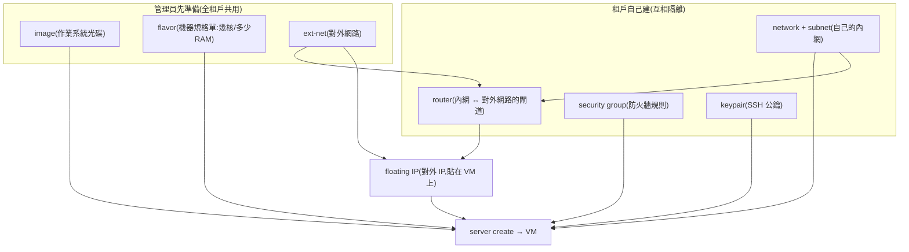
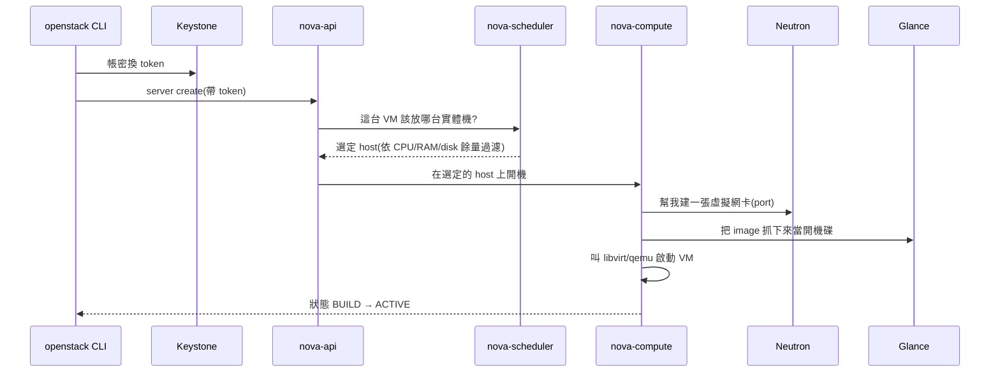

# Sprint 3 / Day 2: OpenStack 資源全流程(純 CLI)

> 課程定位:不碰 Horizon,純 CLI 把「租戶 → image → 網路 → VM → 對外連線」整條流程走一遍,並對照 OVN 的邏輯模型理解每一步在底層發生什麼。

!!! abstract "你在課程的哪裡"
    - **昨天(Day 1)**:OpenStack 已經部署起來了——但它現在是一朵「空的雲」:有服務、沒半個使用者資源。
    - **今天**:分別扮演**雲管理員**(建租戶、上傳 image、開對外網路)和**租戶**(建自己的網路、開 VM、掛對外 IP),把一台 VM 從無到有開出來並 SSH 進去。
    - **今天之後**:Day 3~9 的所有東西(volume、LB、K8s cluster)全都建在今天建立的 demo 租戶與網路之上。

## 第一次接觸 OpenStack?先讀這段

OpenStack 就是**自己架的 AWS**:一組開源服務,把你的實體機器變成可以「開 VM、切網路、掛硬碟」的雲。每個功能由一個獨立服務負責,名字都很怪,但對照公有雲就秒懂:

| | OpenStack 服務 | 它管什麼 | AWS 對應 |
|---|---|---|---|
| { width="56" } | **Keystone** | 帳號、專案(租戶)、權限、發 token | IAM |
| { width="56" } | **Glance** | VM 開機用的作業系統映像檔 | AMI |
| { width="56" } | **Nova** | 開 VM、排程到哪台實體機 | EC2 |
| { width="56" } | **Neutron** | 虛擬網路、路由器、防火牆規則 | VPC |
| { width="56" } | **Horizon** | 網頁儀表板(本課程刻意不用) | AWS Console |

> 服務旁的小圖是各專案的**官方吉祥物**——OpenStack 社群給每個專案都畫了一隻。之後每天的主角出場都會帶著臉,記臉比記名字快。

### 開一台 VM 需要哪些「零件」?

這是今天最重要的觀念。在雲上開 VM 不是按一顆鈕,而是**先備齊一堆互相依賴的資源**——就像組電腦要先有零件、辦網路要先牽線:



| 名詞 | 白話解釋 | AWS 對應 |
|---|---|---|
| image | 作業系統安裝光碟(cirros 是測試用的迷你 Linux,10 秒開機) | AMI |
| flavor | 規格菜單:1 vCPU + 512MB 叫 m1.tiny | instance type |
| network / subnet | 租戶自己的私有內網(例:10.10.10.0/24),別的租戶看不到 | VPC subnet |
| router | 把私有內網接到對外網路的虛擬路由器,順便做 NAT | NAT gateway |
| security group | 掛在 VM 網卡上的防火牆;**預設擋掉所有進站**,連 ping 都要明確開 | Security Group |
| keypair | 你的 SSH 公鑰,開機時自動塞進 VM(所以雲 VM 都不用密碼登入) | Key pair |
| floating IP(FIP) | 可拆可貼的對外 IP:VM 換了,IP 可以帶走貼到新 VM | Elastic IP |

### `server create` 按下去的那一刻,背後發生什麼



看懂這張圖,之後除錯就知道去哪找log:卡在排程 → scheduler;網卡拿不到 → neutron;image 抓不到 → glance。

## 原理與架構

### 1. 每個 CLI 動作在 OVN 裡對應什麼

| OpenStack 資源 | OVN 底層 | Sprint 1 已學,這裡驗證 |
|---|---|---|
| `network create net1`(Geneve) | Logical Switch | tenant overlay,MTU 自動扣 overhead(1442) |
| `network create --external --provider-network-type flat` | Logical Switch + **localnet port** → br-ex | flat = 直通 physnet1(= br-ex = dummy0) |
| `router create` + gateway/subnet | Logical Router + NAT 規則 | FIP = LR 上的 dnat_and_snat entry |
| `floating ip create` + attach | LR NAT 表新增一條 | `ovn-nbctl lr-nat-list` 可看 |
| security group | OVN ACL(port group) | 預設 default SG 擋 ingress |
| metadata | ovnmeta-<netid> namespace 裡的 haproxy → unix socket | cirros keypair 注入成功 = 這條路通 |

### 2. 本 lab 的對外連線設計(Azure 補償)

```
VM 10.10.10.x ── net1(Geneve LS)── r1(LR, SNAT/FIP)── ext-net(flat LS)
                                                          │ localnet
                                                       br-ex(host OVS bridge)
                                            host 掛 172.24.4.1/24 當「外部閘道」
                                                          │ iptables MASQUERADE
                                                        eth0 → Azure → internet
```

- **host 給 br-ex 掛 172.24.4.1** = 假扮 ext-net 的上游 gateway;host 因此也能直接 ping/SSH FIP
- **MASQUERADE** 讓 VM 出網(Azure 只認 VM NIC 的 IP,172.24.4.x 出去必須 NAT)
- 兩者都是 host 上的 runtime 狀態,**每天 auto-shutdown 會消失** → 做成 `ext-net-fixup.service`(oneshot, boot +30s)開機自動重掛

### 3. metadata vs config-drive(刻意兩條路都測)

- **cirros 用 metadata service**:驗證 OVN metadata agent 整條鏈(Sprint 1 曾在這裡踩 shared secret 不同步)
- **Ubuntu 用 `--config-drive True`**:Sprint 1 教訓 #13(cloud-init 搶在 metadata ready 之前跑的 race),config-drive 把資料燒進 ISO 隨 VM 掛載,天生免疫

## 步驟

### 1. Admin 面:租戶、flavor、image

```bash
source ~/kolla-venv/bin/activate && source /etc/kolla/admin-openrc.sh
openstack project create --description "Sprint3 demo tenant" demo
openstack user create --project demo --password demopass123 demo
openstack role add --project demo --user demo member
openstack flavor create --vcpus 1 --ram 512  --disk 1  m1.tiny
openstack flavor create --vcpus 2 --ram 2048 --disk 10 m1.small
curl -sL -o /tmp/cirros.img https://download.cirros-cloud.net/0.6.2/cirros-0.6.2-x86_64-disk.img
openstack image create --disk-format qcow2 --container-format bare --public --file /tmp/cirros.img cirros
curl -sL -o /tmp/noble.img https://cloud-images.ubuntu.com/noble/current/noble-server-cloudimg-amd64.img
openstack image create --disk-format qcow2 --container-format bare --public --file /tmp/noble.img ubuntu-24.04
```

### 2. Admin 面:external network + host 閘道/NAT 持久化

```bash
openstack network create --external --provider-network-type flat \
  --provider-physical-network physnet1 ext-net
openstack subnet create --network ext-net --subnet-range 172.24.4.0/24 \
  --gateway 172.24.4.1 --no-dhcp \
  --allocation-pool start=172.24.4.100,end=172.24.4.200 ext-subnet
```

host 端(寫成 `/usr/local/sbin/ext-net-fixup.sh` + systemd oneshot,略——見 VM 上實檔):

```bash
ip addr replace 172.24.4.1/24 dev br-ex && ip link set br-ex up
sysctl -qw net.ipv4.ip_forward=1
iptables -t nat -A POSTROUTING -s 172.24.4.0/24 -o eth0 -j MASQUERADE
```

### 3. Demo 租戶面:網路、router、SG、keypair

```bash
# demo-openrc.sh = admin-openrc 改 OS_USERNAME/OS_PROJECT_NAME/OS_PASSWORD
source ~/demo-openrc.sh
openstack network create net1
openstack subnet create --network net1 --subnet-range 10.10.10.0/24 --dns-nameserver 8.8.8.8 subnet1
openstack router create r1
openstack router set r1 --external-gateway ext-net
openstack router add subnet r1 subnet1
openstack security group rule create --proto icmp default
openstack security group rule create --proto tcp --dst-port 22 default
ssh-keygen -t ed25519 -f ~/.ssh/oslab_ed25519 -N ""
openstack keypair create --public-key ~/.ssh/oslab_ed25519.pub oslab
```

### 4. 開機 + FIP + 驗證

```bash
openstack server create --flavor m1.tiny --image cirros --network net1 \
  --key-name oslab --wait vm-cirros
CFIP=$(openstack floating ip create ext-net -c floating_ip_address -f value)
openstack server add floating ip vm-cirros $CFIP
ping -c2 $CFIP && ssh -i ~/.ssh/oslab_ed25519 cirros@$CFIP uptime

openstack server create --flavor m1.small --image ubuntu-24.04 --network net1 \
  --key-name oslab --config-drive True --wait vm-ubuntu
UFIP=$(openstack floating ip create ext-net -c floating_ip_address -f value)
openstack server add floating ip vm-ubuntu $UFIP
ssh -i ~/.ssh/oslab_ed25519 ubuntu@$UFIP "ping -c2 8.8.8.8"
```

## Checkpoint(全數通過 2026-07-08)

| 驗證 | 判準 | 實測 |
|---|---|---|
| vm-cirros | ACTIVE + FIP ping + SSH | ✅ 172.24.4.134,metadata 注入 keypair 成功 |
| vm-ubuntu | ACTIVE + SSH(config-drive) | ✅ 172.24.4.111,開機 ~1 分內可連 |
| 出網 | VM 內 ping 8.8.8.8 + DNS | ✅ avg 3.6ms;openstack.org 解析正常 |
| OVN 資料面 | Geneve(東西向)+ flat(南北向)+ NAT | ✅ 整條驗證 |
| 重開機存活 | ext-net-fixup.service enabled | ✅(明早 az vm start 後驗收) |

## 踩雷

**今天零踩雷。** 非運氣——三個 Sprint 1 的地雷是被預防掉的:Ubuntu 用 config-drive(#13)、flat provider 在 kolla 預設就開(#7 的 charm 限制不存在)、security group rule 明確加(#9)。課程結論:**教訓的複利在這裡兌現**。

## 下一步(Day 3)

Cinder LVM:data disk(sdb 256G)做 `cinder-volumes` VG → globals 開 cinder → `kolla-ansible reconfigure/deploy` 增量上服務 → volume attach/boot-from-volume。Sprint 1 未完成項 #1,本次重做。
