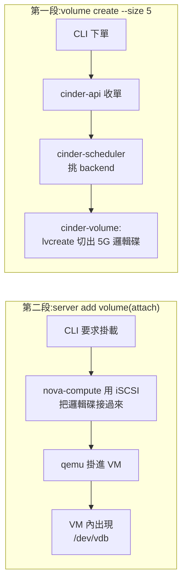
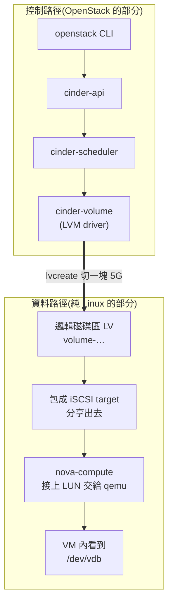
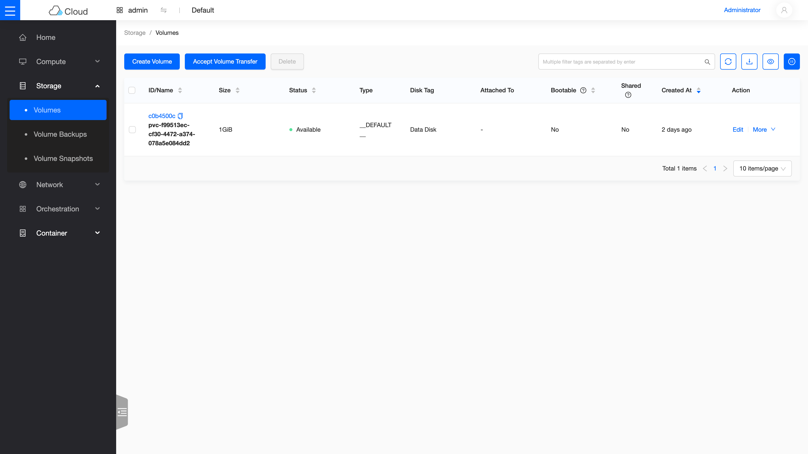

# Day 3: Cinder LVM

> 課程定位:把 data disk 變成 Cinder 的 LVM backend,學會「已上線的 Kolla 環境增量加服務」的工作流,並完成 volume 生命週期 + boot-from-volume。
> 前一次嘗試在這一步卡死:整套跑在 LXD 容器裡,容器拿不到操作磁碟(device-mapper)所需的權限,先天做不到。本次跑在真 VM 上,理論上完全沒有這個限制——今天就來驗證這個假設。

!!! abstract "你在課程的哪裡"
    - **昨天(Day 2)**:你已能開 VM,但 VM 的磁碟是跟著 VM 生滅的——VM 刪掉,資料就沒了。
    - **今天**:加上 **Cinder**(區塊儲存服務),讓 VM 可以掛「獨立於 VM 生命週期的硬碟」。
    - **今天之後**:Day 8 的 Kubernetes PVC(讓 Pod 的資料在 Pod 重建後還在)底層靠的就是今天的 Cinder。

## 第一次接觸區塊儲存?先讀這段

{ align=right width="110" }

VM 的磁碟分兩種,差別就像**機殼內建硬碟 vs 外接硬碟**:

| | ephemeral disk(Day 2 開的 VM 用這種) | **volume(今天的主角)** |
|---|---|---|
| 生命週期 | 跟 VM 綁死,VM 刪 = 資料沒 | 獨立存在,VM 刪了資料還在 |
| 可否搬家 | 不行 | 可以 detach 再 attach 到別台 VM |
| 比喻 | 機殼裡的內建碟 | 外接硬碟,隨插隨拔 |
| AWS 對應 | instance store | **EBS** |

今天還會遇到兩個 Linux 老朋友,先白話認識:

- **LVM(Logical Volume Manager)**:把一顆大實體碟(我們的 256GB data disk)當成「一塊大蛋糕」,要多少切多少的機制。Cinder 每建一個 volume,底層就是 `lvcreate` 切一塊出來。
- **iSCSI**:「把磁碟透過網路接給另一台機器」的協定。切出來的邏輯碟就是靠它接給 VM 所在的 hypervisor。

### 一個 `volume create` + attach 的完整旅程



關鍵理解:**控制流程(上半)是 OpenStack 的,資料流(LVM + iSCSI)是純 Linux 的**。OpenStack 沒有發明新儲存技術,它只是把 Linux 既有機制自動化、API 化——這也是為什麼 Sprint 1 跑在 LXD 容器裡會死:容器碰不到這些 kernel 層機制。

## 原理與架構

### 1. Cinder 三元件與資料路徑



關鍵理解:**control path 是 OpenStack 的,data path 是 Linux 的**(LVM + iSCSI)。AIO 下 iSCSI 是 loopback(initiator 和 target 同一台),生產 multinode 就是跨網路的同一套協定 —— 架構不變,只是距離變遠。

### 2. 增量加服務的 Kolla 工作流

1. 前置的 host 狀態自己準備(VG)—— kolla 不碰你的磁碟分割
2. `globals.yml` 開 flag
3. **重跑 `kolla-ansible deploy`**(冪等):只會新增/改動需要的容器,順帶把 nova.conf 補上 cinder 相關設定並重啟受影響容器

這就是 Day 1 說的「編排期綁定」的代價與好處:改設定 = 重跑編排,但整個過程宣告式、可重複。

### 3. 為什麼 Sprint 1 的 LXD 做不到(對照教材)

| 需求 | LXD unprivileged container | 本次(Azure VM) |
|---|---|---|
| `/dev/mapper/control` ioctl | ❌ 被 namespace 擋 | ✅ 直接是 host |
| udev event(LV 出現) | ❌ 不進 container | ✅ |
| iSCSI kernel target | ❌ 需要 host kernel 權限 | ✅ |

## 步驟

### 1. Data disk → VG(動手前先確認是對的碟!)

```bash
lsblk -o NAME,SIZE,TYPE,MOUNTPOINT,FSTYPE /dev/sdb   # 256G、無分割、無檔案系統
sudo blkid /dev/sdb || echo "safe"                    # 無 signature 才動手
sudo pvcreate /dev/sdb
sudo vgcreate cinder-volumes /dev/sdb                 # VG 名稱 = kolla 預設 cinder_volume_group
```

註:E16s_v5 沒有 local temp disk,所以 sdb 一定是 data disk;用有「d」的機型(Ed16s_v5)時 sdb 可能是 temp disk,**必按 size 確認**。

### 2. globals.yml + 增量 deploy

```bash
printf 'enable_cinder: "yes"\nenable_cinder_backend_lvm: "yes"\n' >> /etc/kolla/globals.yml
source ~/kolla-venv/bin/activate
kolla-ansible deploy -i ~/all-in-one    # 冪等重跑
```

### 3. Volume 生命週期 lab

```bash
source ~/demo-openrc.sh
openstack volume create --size 5 vol-data          # → available
openstack server add volume vm-ubuntu vol-data     # VM 內出現 /dev/vdb
ssh -i ~/.ssh/oslab_ed25519 ubuntu@172.24.4.111 \
  "sudo mkfs.ext4 /dev/vdb && sudo mount /dev/vdb /mnt && echo test | sudo tee /mnt/proof.txt"
openstack server remove volume vm-ubuntu vol-data  # → available
sudo lvs cinder-volumes                            # host 端看 thin LV
```

### 4. Boot-from-volume

```bash
openstack volume create --image cirros --size 2 vol-boot   # 把 image 灌進 volume
openstack server create --flavor m1.tiny --volume vol-boot \
  --network net1 --key-name oslab --wait vm-bfv            # 根碟在 Cinder,不在 hypervisor 本地
```

## 驗收 checkpoint

逐項驗證,**全部符合判準才算完成今天**。「本課環境的結果」欄是我們實測的參考值——你的 IP、耗時等數字會不同,但判準必須成立:

| 驗證 | 判準 | 本課環境的結果 |
|---|---|---|
| `openstack volume service list` | scheduler + volume@lvm-1 up | 符合 |
| attach → VM 內可用 | /dev/vdb 可 mkfs/mount/寫檔 | 符合 |
| detach | volume 回 available、資料保留在 LV | 符合 |
| boot-from-volume | vm-bfv ACTIVE | 符合 |
| host 端 | LV 出現在 cinder-volumes VG | thin LV(為什麼是 thin,見下方觀察) |
| **對照前一次嘗試** | Sprint 1 卡死這一步的 LXD 權限限制,在真 VM 上不存在 | 零阻力直通(當時的細節見[前兩次嘗試](../previous-attempts.md)) |

## 地雷與觀察

### 地雷 1:cinder-backup 預設被帶起來但必然 down {#mine-1}

`enable_cinder: "yes"` 會順帶部 cinder-backup,但它需要 backup backend(Swift/Ceph/NFS),本 lab 都沒有 → 服務 down。**這不是故障**;處理:`enable_cinder_backup: "no"` + `docker rm -f cinder_backup`。教訓:kolla 的服務開關有「父子連動」,開父服務前先看它會帶起哪些子服務。

### 地雷 2:Epoxy 預設 LVM thin provisioning(觀察,非地雷) {#mine-2}

`lvs` 看到的不是 5G 的 thick LV,而是 243G 的 `cinder-volumes-pool`(thin pool)+ 掛在裡面的 thin LV(實際只佔 1.33%)。代表 volume 超賣是預設行為 —— 生產環境要監控 pool 的 Data% 而不是 VG free。


## 從儀表板看成果



*Volume 列表(Skyline 檢視):圖中那顆 1 GiB 的 `pvc-*` volume,正是 Day 8 K8s PVC 動態供裝的產物——今天學的 Cinder,就是它背後的引擎。*

## 延伸閱讀

想往下深挖,從這幾份開始:

- **[Kolla-Ansible 的 Cinder 指南](https://docs.openstack.org/kolla-ansible/2025.1/reference/storage/cinder-guide.html)** —— 本章 LVM 後端設定的官方對照,也列出其他後端(NFS、Ceph)的接法。
- **[Cinder LVM driver 參考](https://docs.openstack.org/cinder/2025.1/configuration/block-storage/drivers/lvm-volume-driver.html)** —— 這個 driver 的完整設定選項與限制。
- **[Cinder 磁碟區操作手冊](https://docs.openstack.org/cinder/2025.1/cli/cli-manage-volumes.html)** —— 建立、掛載、快照、擴容的官方 CLI 流程。

## 下一步(Day 4)

Octavia:amphora image 準備 + LB 手動建置全流程。
