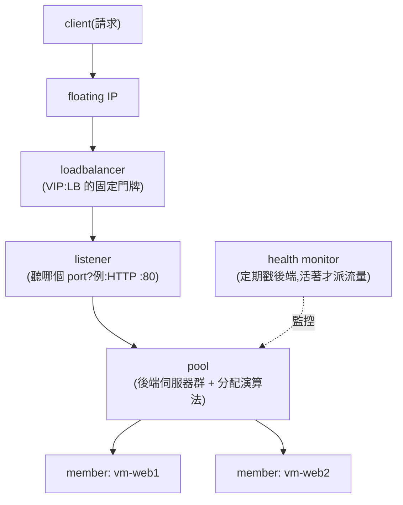
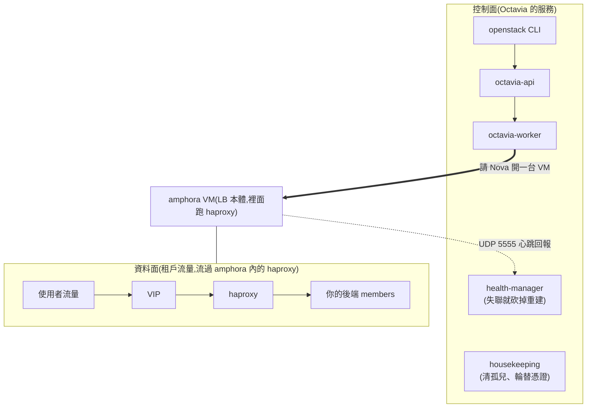
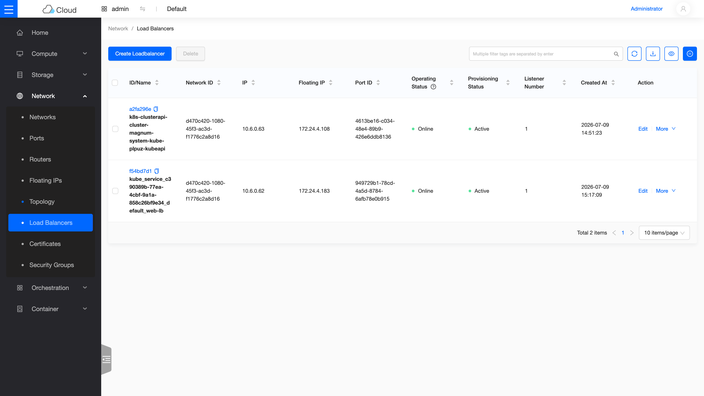

# Sprint 3 / Day 4: Octavia LBaaS(Sprint 1 未完成項 #2)

> 課程定位:部署 Octavia 並手動走完 LB 全流程(LB → listener → pool → member → health monitor → VIP FIP)。
> 前一次嘗試在這一步直接出局:官方 charm 當時在主流架構上根本沒有發佈可用版本,想裝都裝不了。Kolla 這邊 Octavia 是一等公民,今天把它完整部起來。

!!! abstract "你在課程的哪裡"
    - **前兩天**:你已能開 VM(Day 2)、掛硬碟(Day 3)。
    - **今天**:開兩台 web VM,在前面放一台**負載平衡器(Load Balancer)**,讓流量自動分給兩台。
    - **今天之後**:Day 8 在 Kubernetes 裡宣告 `Service type=LoadBalancer` 時,自動生出來的 LB 就是今天這套 Octavia。

## 第一次接觸負載平衡?先讀這段

{ align=right width="110" }

**負載平衡器(LB)就是餐廳門口的帶位員**:客人(請求)一律先到門口,帶位員看哪桌有空就帶去哪桌(後端伺服器),某桌收掉了(伺服器掛了)就不再帶人過去。好處:後端可以隨時加桌/收桌,客人永遠只需要記得門口在哪(一個固定的 IP)。AWS 對應:**ELB/ALB**。

### Octavia 的特別之處:LB 是「一台幫你養的 VM」

多數人以為 LB 是什麼神祕硬體——在 Octavia 的預設模式裡,**LB 就是一台自動幫你開好、裡面跑著 haproxy 的小 VM**,叫 **amphora**(雙耳瓶,取「承載流量的容器」之意)。Octavia 負責:自動開這台 VM、把 haproxy 設定推進去、監控它的心跳、掛了就自動砍掉重開一台。

### LB 的物件模型:四層積木

建一個能用的 LB 要疊四塊積木,每塊都有明確分工:



| 積木 | 白話 |
|---|---|
| loadbalancer | 帶位員本人,持有一個固定的 VIP(虛擬 IP) |
| listener | 「我聽 80 port 的 HTTP」——一個 LB 可以有多個 listener |
| pool + member | 後端名單 + 分法(round-robin = 輪流帶位) |
| health monitor | 每 5 秒戳一次後端,沒回應的踢出名單 |

今天的驗收很直觀:對 LB 的 IP `curl` 六次,回應在 web1/web2 之間**完美交替**,就證明整條鏈通了。

## 原理與架構

### 1. Amphora 模型:LB 是「一台幫你養的 VM」



- **worker**:收到 LB 需求 → 叫 Nova 開 amphora VM、叫 Neutron 插 VIP port、把 haproxy 設定推進去
- **health-manager**:收 amphora 心跳,失聯就 failover(砍掉重開一台)
- **housekeeping**:清理孤兒資源、憑證輪替
- LB 的資料面 = amphora VM 裡的 haproxy;**control plane 掛了,現有 LB 照常轉發**

### 2. mTLS dual CA(`kolla-ansible octavia-certificates`)

controller ↔ amphora-agent(:9443)雙向驗證:
- `server_ca`:簽 amphora 端的 server 憑證(controller 驗 amphora)
- `client_ca`:簽 controller 端的 client 憑證(amphora 驗 controller)
兩個 CA 分開 = 偷到 amphora image 也偽造不了 controller 身分。

### 3. lb-mgmt-net:tenant 模式的 o-hm0 魔術(本日最重要的架構點)

Octavia 管理面需要一條 controller ↔ amphora 的網路。兩種模式:

| | provider 模式(kolla 預設) | **tenant 模式(本 lab 採用)** |
|---|---|---|
| lb-mgmt-net | 實體 VLAN/flat,host 介面直接在上面 | 普通 Geneve tenant 網路 |
| controller 怎麼接進去 | host 網卡本來就在該 L2 | kolla 建一個 neutron port,然後 `ovs-vsctl add-port br-int o-hm0 -- set Interface o-hm0 external-ids:iface-id=<port_id>` —— **把 host 假扮成一個 VM port 插進 overlay** |
| 適用 | 有真實網路可用的生產環境 | 單機 lab / 無 VLAN 環境(如 Azure) |

**設計變更紀錄**:原計畫仿 ext-net 做第二組 dummy1/br-ex2/physnet2(provider 模式)。動手前直接讀裝好的 role 原始碼(`roles/octavia/tasks/hm-interface.yml`)發現 tenant 模式的 o-hm0 手法與 OVN 相容(ovn-controller 認 iface-id 就綁 port),整條手術省掉。**教訓:查「這版怎麼做」永遠以 `~/kolla-venv/share/kolla-ansible/ansible/roles/` 的原始碼為準,部落格文章常是舊版做法。**

### 4. Amphora image:OSISM 預建 vs DIB 自建

官方做法是 diskimage-builder 自建(~15 分、需 debootstrap)。[OSISM 每月發布預建 image](https://github.com/osism/openstack-octavia-amphora-image),有對應 2025.1 的版本,lab 直接用;生產環境建議自建(控制內容物與更新節奏)。

### 5. Bonus:OVN provider driver

Epoxy 的 kolla 在 `neutron_plugin_agent == 'ovn'` 時自動註冊第二個 LB provider:`ovn`。它把 L4 LB 規則直接寫進 OVN 邏輯流表,**不開 amphora VM**——沒有 L7、沒有 health monitor 完整功能,但零額外資源。課程對照:amphora = 功能全、成本高;ovn = 陽春、免費。

## 步驟

### 1. 前置

```bash
# amphora image(背景下載)
curl -sL -o /tmp/amphora.qcow2 \
  https://nbg1.your-objectstorage.com/osism/openstack-octavia-amphora-image/octavia-amphora-haproxy-2025.1.qcow2

# globals.yml
enable_octavia: "yes"
octavia_network_type: "tenant"
octavia_auto_configure: yes     # kolla 自建 lb-mgmt-net/router/flavor/SG/keypair

# 憑證(注意:這個子指令也要 -i,否則找預設 inventory 路徑會出錯)
kolla-ansible octavia-certificates -i ~/all-in-one
```

### 2. Deploy

```bash
kolla-ansible deploy -i ~/all-in-one
```

### 3. 上傳 amphora image + LB lab

```bash
# image 上傳到 octavia.conf 的 amp_image_owner_id 那個 project,tag 必須是 amphora
AMP_PROJECT=$(sudo docker exec octavia_worker grep amp_image_owner_id /etc/octavia/octavia.conf | awk '{print $3}')
source /etc/kolla/admin-openrc.sh
openstack image create amphora-x64-haproxy --file /tmp/amphora.qcow2 \
  --disk-format qcow2 --container-format bare --private --tag amphora \
  --project $AMP_PROJECT --property hw_architecture=x86_64 --property hw_rng_model=virtio
pip install python-octaviaclient

# 兩台 web member(user-data 起 http server 回 hostname)
source ~/demo-openrc.sh
openstack security group rule create --proto tcp --dst-port 80 default
openstack server create --flavor m1.small --image ubuntu-24.04 --network net1 \
  --key-name oslab --config-drive True --user-data /tmp/web-userdata.sh --wait vm-web1   # web2 同

# LB 全流程(第一次 create 會觸發 amphora VM 開機,2-4 分)
openstack loadbalancer create --name lb2 --vip-subnet-id subnet1 --wait
openstack loadbalancer listener create --name listener1 --protocol HTTP --protocol-port 80 --wait lb2
openstack loadbalancer pool create --name pool1 --lb-algorithm ROUND_ROBIN --listener listener1 --protocol HTTP --wait
openstack loadbalancer member create --subnet-id subnet1 --address 10.10.10.124 --protocol-port 80 --wait pool1
openstack loadbalancer member create --subnet-id subnet1 --address 10.10.10.188 --protocol-port 80 --wait pool1
openstack loadbalancer healthmonitor create --name hm1 --delay 5 --max-retries 3 --timeout 3 --type HTTP --url-path / --wait pool1

# VIP 掛 FIP → host 直接打
VIPPORT=$(openstack loadbalancer show lb2 -c vip_port_id -f value)
LBFIP=$(openstack floating ip create ext-net -c floating_ip_address -f value)
openstack floating ip set --port $VIPPORT $LBFIP
for i in $(seq 6); do curl -s http://$LBFIP/; done   # web1/web2 交替 = round robin
```

### 4. Bonus:OVN provider 對照組

```bash
openstack loadbalancer create --name lb-ovn --provider ovn --vip-subnet-id subnet1 --wait
openstack loadbalancer listener create --name lis-ovn --protocol TCP --protocol-port 80 --wait lb-ovn
openstack loadbalancer pool create --name pool-ovn --lb-algorithm SOURCE_IP_PORT --listener lis-ovn --protocol TCP --wait
openstack loadbalancer member create --subnet-id subnet1 --address 10.10.10.124 --protocol-port 80 --wait pool-ovn
# 特徵:L4 only、SOURCE_IP_PORT、無 amphora VM、規則直接進 OVN 流表
```

## 驗收 checkpoint

逐項驗證,**全部符合判準才算完成今天**。「本課環境的結果」欄是我們實測的參考值——你的 IP、耗時等數字會不同,但判準必須成立:

| 驗證 | 判準 | 本課環境的結果 |
|---|---|---|
| octavia 容器 | api/worker/health-manager/housekeeping/driver-agent 全 Up | 符合 |
| o-hm0 | 從 lb-mgmt-subnet 拿到 DHCP IP | 10.1.0.29/24(OVN 原生 DHCP) |
| auto-configure | lb-mgmt-net/router/flavor/SG 自動建立,octavia.conf 填好 id | 符合 |
| amphora | ALLOCATED / STANDALONE,mgmt IP 可達 | 10.1.0.85 |
| lb2(amphora provider) | ACTIVE/ONLINE,members 全 ONLINE | 符合 |
| **round robin** | curl FIP 交替回 web1/web2 | 6/6 完美交替 |
| lb-ovn(ovn provider) | ACTIVE/ONLINE,tenant 內可連通 | 無 amphora,零額外 VM |
| **對照前一次嘗試** | Sprint 1 卡死這一步的 charm 斷代問題,Kolla 路線不存在 | 順利部署(當時的細節見[前兩次嘗試](../previous-attempts.md)) |

## 地雷記錄

### 地雷 1:`octavia-certificates` 不吃預設 inventory {#mine-1}

`kolla-ansible octavia-certificates` 單獨跑會找 `/etc/kolla/ansible/inventory/all-in-one` 報 Path does not exist —— 跟 deploy 一樣要 `-i ~/all-in-one`。

### 地雷 2:Ubuntu 24.04 沒有 dhclient → octavia-interface.service 起不來(solutions 級) {#mine-2}

deploy 死在 `Restart octavia-interface.service`,`systemctl status` 顯示 `dhclient ... status=203/EXEC`(執行檔不存在)。**Noble cloud image 已移除 isc-dhcp-client**(上游棄案),kolla 的 unit 還寫死 `/sbin/dhclient`。修:`apt install isc-dhcp-client` → `systemctl reset-failed && systemctl start octavia-interface` → 補跑 `deploy --tags octavia`。完整記錄見排錯手冊:[octavia-interface 的 dhclient 問題](../solutions/integration-issues/kolla-octavia-dhclient-noble.md)。

### 地雷 3:amphora driver 需要 Redis jobboard,kolla 不會自動開(solutions 級) {#mine-3}

LB 卡 `PENDING_CREATE`、amphora 根本沒開機,worker log:`MasterNotFoundError: No master found for 'kolla'` + `Error 111 connecting to 127.0.0.1:6379`。**Epoxy 的 amphora provider 走 taskflow jobboard(Redis sentinel),但 `enable_redis` 預設 no 且 octavia 不會幫你啟動**。修:`enable_redis: "yes"` → `deploy --tags redis,octavia`。完整記錄見排錯手冊:[amphora 的 Redis jobboard 問題](../solutions/integration-issues/kolla-octavia-redis-jobboard.md)。

### 地雷 4:octavia-openrc.sh 沒有生成 {#mine-4}

文件說會有 `/etc/kolla/octavia-openrc.sh`,實際沒出現。不影響:image 上傳改用 admin + `--project <amp_image_owner_id>`(從 octavia.conf 讀,auto-configure 已填好)。

### 地雷 5:卡在 PENDING_* 的 LB 無法刪除(擴展知識) {#mine-5}

Redis 壞掉期間建立的 lb1 永遠停在 `PENDING_CREATE`,delete 回 409(PENDING 狀態 immutable,而 job 從未進 queue,永遠不會有人來改狀態)。社群公認處置(**lab 限定,生產環境先開 ticket**):DB 把 `provisioning_status` 改 `ERROR` → `loadbalancer delete --cascade`。這是本 lab 唯一一次手改 DB,原因:Octavia 沒有提供 stuck-PENDING 的官方重置工具。


## 從儀表板看成果



*Load Balancer 列表(Skyline 檢視):兩顆 LB 都是 Day 8 的 K8s 自動建的——`kubeapi` 是 cluster API 的入口,`web-lb` 是 `Service type=LoadBalancer` 的產物。Operating Status 的綠色 Online 來自 health monitor 的持續檢查,正是今天教的機制。*

## 延伸閱讀

想往下深挖,從這幾份開始:

- **[Octavia 官方介紹](https://docs.openstack.org/octavia/2025.1/reference/introduction.html)** —— amphora 架構的權威說明;本章「LB 其實是一台 VM」的完整版。
- **[Kolla-Ansible 的 Octavia 指南](https://docs.openstack.org/kolla-ansible/2025.1/reference/networking/octavia.html)** —— 憑證產生、管理網設定這些本章最容易卡的步驟,官方版在這。
- **[Octavia Basic Cookbook](https://docs.openstack.org/octavia/2025.1/user/guides/basic-cookbook.html)** —— 各種 LB 拓樸(TCP/HTTP/健康檢查)的官方食譜,本章只做了最基本的一種。

## 下一步(Day 5)

Barbican(Magnum 的憑證倉庫)+ Heat 複習(白撿的,Day 1 已部)。
