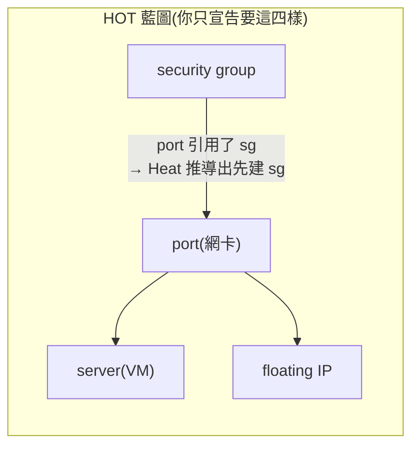
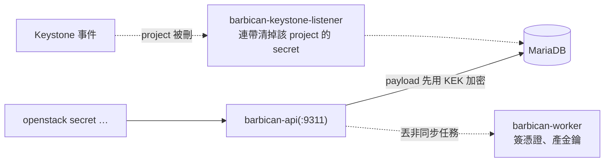

# Sprint 3 / Day 5: Barbican + Heat

> 課程定位:補齊 Magnum 的前置依賴 **Barbican**(secret/cert 倉庫),並複習 **Heat**(HOT 宣告式編排,Day 1 kolla 預設已部,白撿)。
> 這兩個服務本身都不難,重點在「為什麼 Magnum 需要 Barbican」與「Heat 的依賴排序模型」,兩者都會在 Day 6-8 的 CAPI cluster 出現。

!!! abstract "你在課程的哪裡"
    - **前四天**:IaaS 的四大件已齊——運算(Nova)、網路(Neutron)、儲存(Cinder)、負載平衡(Octavia)。
    - **今天**:補兩個配角:**Barbican**(保險箱)和 **Heat**(藍圖引擎)。個別都不難,一天雙拼。
    - **今天之後**:Day 7 的 Magnum 會把 K8s cluster 的憑證存進 Barbican;Heat 則是理解「宣告式基礎設施」的入門,這個思想 Day 6 的 Cluster API 和 Day 10 的 Terraform 都會再出現。

## 第一次接觸這兩個服務?先讀這段

### Barbican:雲的保險箱

{ align=right width="100" }

寫過應用程式的人都遇過:資料庫密碼、API 金鑰要放哪?寫死在程式碼裡會跟著進 git,放設定檔會被翻到。**Barbican 就是雲平台的保險箱**:秘密加密後集中存放,誰能開保險箱由 Keystone 權限控制。AWS 對應:**Secrets Manager / KMS**。

本課程部它的真正理由:**Day 7 的 Magnum 開 K8s cluster 時,cluster 的 CA 憑證(等於 cluster 的萬能鑰匙)必須有個安全的家**——那個家就是 Barbican。

### Heat:照藍圖蓋房子

{ align=right width="100" }

Day 2 你手打了十幾條指令才開出一台 VM:建網路、建 router、開 SG、開機、掛 FIP……順序還不能錯。**Heat 讓你把這整組資源寫成一份 YAML 藍圖(叫 HOT template),一個指令蓋好、一個指令全拆。** AWS 對應:**CloudFormation**;思想上就是 Terraform 的 OpenStack 原生版。

關鍵思想叫**宣告式(declarative)**:你不寫「怎麼做」的步驟,只寫「我要什麼」的最終狀態,順序由引擎自己推導:



Heat 看到「port 引用了 sg」就知道 sg 要先建;server 和 fip 都只依賴 port,所以**兩者自動並行**。這個「引用即依賴、依賴決定順序」的推導,正是之後 Cluster API 和 Terraform 的共同底層邏輯——今天先在最簡單的場景把它看懂。

## 原理與架構

### 1. Barbican:OpenStack 的 secret/cert 倉庫

Barbican 是 key-manager 服務,把 secret(密碼、API key)、對稱金鑰、X.509 憑證/私鑰**加密後存 DB**,用 keystone 做存取控制。三個容器:



- **api**:REST 入口,走 haproxy VIP(本 lab `10.0.0.4:9311`)
- **worker**:非同步作業(order 產金鑰、CA 簽憑證)
- **keystone-listener**:訂閱 keystone 事件,project 被刪時連帶清 secret,避免孤兒

### 2. 為什麼 Magnum 需要 Barbican(本日對 Sprint 的意義)

Magnum 開 K8s cluster 時要管一堆憑證(K8s CA、etcd CA、front-proxy CA、service account key)。這些**必須有地方安全存放**:

| | Sprint 1(heat driver)| **本 Sprint(CAPI driver)** |
|---|---|---|
| 憑證存哪 | 預設 Barbican;沒 Barbican 時 fallback 到 `x509keypair`(存 Magnum 自己的 DB,較弱) | CAPI driver 把 cluster CA bundle 存進 **Barbican secret**,CAPO 再讀出來注入 workload cluster |
| Barbican 必要性 | 選配(有 fallback) | 實質必要 —— Day 7-8 cluster 生命週期依賴它 |

所以 Day 5 先把 Barbican 立起來驗證,Day 7 Magnum 整合時就不會卡在「憑證無處可放」。

### 3. crypto plugin:simple_crypto vs PKCS#11/HSM

Barbican 寫入 DB 前會用 **KEK(Key Encryption Key)**再加密一層。plugin 決定 KEK 放哪:

| plugin | KEK 位置 | 適用 |
|---|---|---|
| **`simple_crypto`(kolla 預設,本 lab)** | 明文寫在 `barbican.conf`(`kek=` base64) | 單機 lab / PoC。KEK 跟 DB 同一台 → 安全性等於「有 root 就全破」,但 lab 夠用 |
| `p11_crypto` | 硬體 HSM / SoftHSM(PKCS#11) | 生產環境;KEK 永不離開 HSM |

本 lab 不改,直接吃 `simple_crypto`,零額外設定。

### 4. Heat:宣告式編排 + 依賴 DAG(對照 Terraform)

Heat 吃 **HOT**(Heat Orchestration Template,YAML),把一組 OpenStack 資源當成一個 **stack** 一起生/滅。核心價值是**依賴排序**:

resources 之間用 `get_resource` / `get_attr` 互相引用,Heat 據此自動推導出依賴圖、決定建立順序——能並行的就並行。這正是本章開頭那張圖畫的事:sg 先建,port 引用 sg 所以第二,server 和 fip 都只依賴 port,所以**兩者自動並行建立**。

`stack delete` 反向拆一次全清,等同 Terraform 的 `apply` / `destroy`。差別:Heat 是 OpenStack 原生、狀態存在 heat DB;Terraform 是外部工具、狀態存 tfstate(Day 10 會用 terraform-provider-openstack 做對照)。

**與 Magnum 的關係**:Magnum 舊的 heat driver 底層就是拿 HOT 開 cluster(Sprint 1 卡點正是那些內嵌 HOT 的 image URL 失效)。本 Sprint 改走 CAPI driver 不再用 Heat 開 cluster,但 Heat 本身是 IaC 教學必修,故獨立複習。

## 步驟

### Part A — Barbican

```bash
# 1. globals.yml 開 barbican(預設 #enable_barbican: "no")
echo -e '\n# Day 5: enable Barbican (secret/cert store for Magnum)\nenable_barbican: "yes"' \
  | sudo tee -a /etc/kolla/globals.yml

# 2. targeted deploy(--tags barbican 已自帶:建 DB(bootstrap.yml)、註冊 keystone
#    endpoint(register.yml)、barbican 的 haproxy frontend(site.yml 內 barbican 的
#    loadbalancer 子任務掛在 barbican tag);加 loadbalancer 確保 haproxy reload)
source ~/kolla-venv/bin/activate
kolla-ansible deploy -i ~/all-in-one --tags barbican,loadbalancer

# 3. 驗證 + secret 存取往返
source /etc/kolla/admin-openrc.sh
openstack service list | grep key-manager          # 出現 barbican / key-manager
pip install python-barbicanclient                  # osc plugin 不隨 openstackclient
SREF=$(openstack secret store --name day5-demo --payload 'Sup3rS3cretDemo!' \
         -c 'Secret href' -f value)
openstack secret list
openstack secret get "$SREF" --payload -f value     # 應原值取回 Sup3rS3cretDemo!
```

### Part B — Heat（已部署，只做實戰）

```bash
pip install python-heatclient                        # 同樣要裝 osc plugin
source ~/demo-openrc.sh                               # 資源在 demo project
```

HOT template `~/day5-heat-demo.yaml`:

```yaml
heat_template_version: 2021-04-16
description: Sprint3 Day5 Heat demo — SG + Port + cirros Server + FloatingIP on net1.

parameters:
  image:   { type: string, default: cirros }
  flavor:  { type: string, default: m1.tiny }
  net:     { type: string, default: net1 }
  ext_net: { type: string, default: ext-net }
  key:     { type: string, default: oslab }

resources:
  sg:
    type: OS::Neutron::SecurityGroup
    properties:
      name: day5-heat-sg
      rules:
        - protocol: icmp
        - { protocol: tcp, port_range_min: 22, port_range_max: 22 }
  port:
    type: OS::Neutron::Port
    properties:
      network: { get_param: net }
      security_groups: [ { get_resource: sg } ]
  server:
    type: OS::Nova::Server
    properties:
      name: day5-heat-vm
      image: { get_param: image }
      flavor: { get_param: flavor }
      key_name: { get_param: key }
      networks: [ { port: { get_resource: port } } ]
  fip:
    type: OS::Neutron::FloatingIP
    properties:
      floating_network: { get_param: ext_net }
      port_id: { get_resource: port }

outputs:
  server_id:   { value: { get_resource: server } }
  internal_ip: { value: { get_attr: [server, first_address] } }
  floating_ip: { value: { get_attr: [fip, floating_ip_address] } }
```

```bash
openstack orchestration template validate -t ~/day5-heat-demo.yaml   # 語法檢查
openstack stack create -t ~/day5-heat-demo.yaml --wait day5-stack     # DAG:sg→port→server+fip
openstack stack output show day5-stack --all                          # 看 outputs
openstack stack resource list day5-stack                              # 4 個資源
openstack stack delete --yes --wait day5-stack                        # 一條全拆
```

## 驗收 checkpoint

逐項驗證,**全部符合判準才算完成今天**。「本課環境的結果」欄是我們實測的參考值——你的 IP、耗時等數字會不同,但判準必須成立:

| 驗證 | 判準 | 本課環境的結果 |
|---|---|---|
| barbican 容器 | api / worker / keystone-listener 全 Up (healthy) | 3/3 healthy |
| key-manager endpoint | internal + public 註冊成功 | `http://10.0.0.4:9311` |
| **secret 往返** | store 後 get --payload 原值取回 | `Sup3rS3cretDemo!` 完全一致 |
| deploy 隔離性 | 增量部署不動到 Day 4 部好的 Octavia | Octavia 相關 task 全部 `changed=0`,確認未被動到 |
| heat template validate | 語法通過、參數解析正確 | 符合 |
| **stack create** | CREATE_COMPLETE,依賴排序正確 | sg→port→(server‖fip),cirros ~14s ACTIVE |
| stack outputs | internal_ip / floating_ip / server_id 取得 | 10.10.10.194 / 172.24.4.149 |
| stack delete | 一條拆掉全部 4 資源,無殘留 | stack/server/sg 全清空 |

## 地雷記錄

### 地雷 1:openstack CLI 沒有 `stack` / `secret` 子命令(必踩) {#mine-1}

`openstack stack ...` 與 `openstack secret ...` 不隨 `python-openstackclient` 內建 —— 它們是各自 client 的 **osc plugin**。乾淨 venv 只會回 `is not an openstack command`。修:`pip install python-heatclient python-barbicanclient`。同 Day 4 的 `python-octaviaclient`,這是 kolla venv 的通則:**每個非 core 服務的 CLI 都要各自 pip 裝 plugin**。

### 地雷 2:`--tags barbican` 是否自帶 haproxy?(查證,非地雷) {#mine-2}

擔心 targeted deploy 漏掉 barbican 的 haproxy frontend 導致 endpoint 打不通。動手前讀 `~/kolla-venv/share/kolla-ansible/ansible/site.yml`:loadbalancer play 內對每個服務有 `include_role: loadbalancer, tasks_from: loadbalancer` 的子任務,barbican 那筆明確 `tags: barbican`(L129-131)。**結論:`--tags barbican` 本身就會配 barbican 的 haproxy frontend**;本 lab 仍加 `loadbalancer` 求穩(保證 haproxy reload),實測 `changed=18 failed=0` 一次過。教訓同 Day 4:tag 行為以 `site.yml` 原始碼為準,別猜。

## 延伸閱讀

想往下深挖,從這幾份開始:

- **[Barbican 官方文件](https://docs.openstack.org/barbican/2025.1/)** —— 密鑰管理服務的架構與 API;secret 型別的完整定義在這。
- **[Heat 範本指南](https://docs.openstack.org/heat/2025.1/template_guide/index.html)** —— 寫 HOT 範本的官方教學,從入門範例到進階功能。
- **[HOT 規格書](https://docs.openstack.org/heat/2025.1/template_guide/hot_spec.html)** —— 範本每個欄位的權威定義;寫範本卡住時查這份最快。

## 下一步(Day 6)

Cluster API 原理 + management cluster:kind 起 CAPI mgmt cluster、`clusterctl init` 裝 CAPO,為 Day 7 的 Magnum CAPI driver 整合鋪路。Barbican(本日)+ Heat 複習到此,Magnum 的兩塊前置依賴(憑證倉庫 + 編排概念)都就緒。
