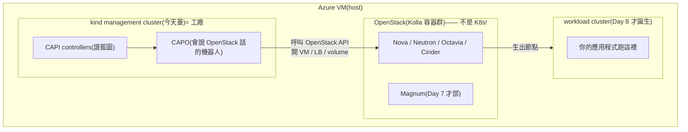

# Sprint 3 / Day 6: Cluster API 管理叢集(kind + CAPO)

> 課程定位:立起 Magnum CAPI driver 的底層 —— 一個 **Cluster API management cluster**(跑在 kind 上),裝好 CAPI core + kubeadm bootstrap/control-plane + **CAPO**(OpenStack infrastructure provider)。Day 7 才把 Magnum 的 driver 接上來。
> 本日踩到一個重大整合地雷:**Kolla 把 docker 的 iptables 關掉,直接斷了 kind 的對外網路**,另立 solutions 詳記。

!!! abstract "你在課程的哪裡"
    - **Day 1–5**:OpenStack 提供的是「原料」——VM、網路、硬碟、LB。
    - **Day 6–8 的大目標**:讓 OpenStack 能像公有雲一樣,**一個指令開出一整座 Kubernetes cluster**。分三步:**今天蓋「造 K8s 的工廠」**(Cluster API),明天把 OpenStack 的接單櫃台(Magnum)接上工廠,後天正式下單開出第一座 cluster。
    - 今天結束時工廠是空轉的——**這是正常的**,還沒有人下單。

## 第一次接觸 Cluster API?先讀這段

### 問題:誰來「蓋」K8s cluster?

手動裝一座 K8s(開 VM、裝 kubeadm、join 節點、配網路)又煩又難維護。業界的答案是 **Cluster API(CAPI)**:把「一座 K8s cluster」本身變成一種宣告式資源——你宣告「我要 1 台 control plane + 2 台 worker、版本 v1.34」,一組 controller(常駐程式)就自動把它蓋出來、壞了修好、要升版就滾動換新。

**CAPI 有個先天限制,決定了今天要做的一切**:CAPI 的 controller 是「K8s 的原生程式」,**必須住在某座 K8s 裡才能跑**。所以要先有一座小 K8s 專門給它們住——這座就叫 **management cluster(管理叢集)**,它不跑你的應用程式,只跑「造叢集的機器人」。

比喻:**management cluster 是工廠**,裡面的 CAPI/CAPO controller 是生產機器人;丟一份藍圖(CAPI 的 YAML)進工廠,機器人就去呼叫 OpenStack 把真正的 cluster(**workload cluster**)蓋出來。

### 全景:此後你的機器上同時存在「三座」東西,別搞混



| | 是什麼 | 跑什麼 | 誰蓋的 |
|---|---|---|---|
| **OpenStack(Kolla)** | host 上的一群 Docker 容器(**不是 K8s**) | Nova/Neutron/Magnum 等雲服務 | Day 1–5 |
| **kind management cluster** | host Docker 裡的一座迷你 K8s | 只跑 CAPI/CAPO controller | **今天** |
| **workload cluster** | 由巢狀 Nova VM 組成的真 K8s | 你的應用程式 | Day 8 |

常見疑問:「為什麼不把 CAPI 直接裝進 OpenStack?」——因為 OpenStack(Kolla)不是 K8s,CAPI controller 沒地方住;所以才用 **kind**(K8s-in-Docker,一個容器就是一座 K8s)開一座最小的給它住。

### 今天要裝進工廠的四個 provider

`clusterctl init` 一次裝四件,各司其職:

| Provider | 白話職責 |
|---|---|
| **core**(cluster-api) | 看懂「Cluster / Machine」這些藍圖的主控 |
| **bootstrap**(kubeadm) | 產生每台節點開機後「怎麼加入 cluster」的腳本 |
| **control-plane**(kubeadm) | 專管 control-plane 節點的生命週期(擴縮、升版) |
| **infrastructure**(**CAPO**) | 唯一「會說 OpenStack 話」的:把 Machine 翻成 Nova VM、把 LB 翻成 Octavia |

## 原理與架構

### 1. Cluster API 是什麼:用 K8s 管 K8s

CAPI 把「建一座 K8s cluster」變成宣告式的 K8s 資源。有兩種 cluster:

```
┌ management cluster(本日建,kind)────────────────────────┐
│  CAPI controllers 在這裡跑,watch 下列 CRD 並 reconcile:  │
│   Cluster ─► ControlPlane(KubeadmControlPlane)            │
│           └► MachineDeployment ─► MachineSet ─► Machine    │
│   OpenStackCluster / OpenStackMachine(CAPO 的 infra CRD)  │
└────────────────────────────────────────────────────────────┘
        │ CAPO 呼叫 OpenStack API(Nova/Neutron/Octavia/Cinder)
        ▼
┌ workload cluster(Day 8 才生)──────────────────────────────┐
│  真正跑 app 的 K8s,節點是 Nova VM                          │
└────────────────────────────────────────────────────────────┘
```

**四種 provider**(clusterctl 的四個 `--` 旗標):

| Provider | 角色 | 本 lab 版本 |
|---|---|---|
| **core**(`cluster-api`) | Cluster/Machine 等核心 CRD 與 reconcile | v1.13.2 |
| **bootstrap**(`kubeadm`) | 產生節點的 cloud-init(kubeadm join) | v1.13.2 |
| **control-plane**(`kubeadm`) | 管 control-plane 生命週期(擴縮、升版) | v1.13.2 |
| **infrastructure**(`openstack` = **CAPO**) | 把 Machine 翻成 Nova VM、把 LB 翻成 Octavia | v0.14.4 |

### 2. 為什麼 management cluster 用 kind

management cluster 只跑 controllers(記憶體帳 ~6 GB),不跑 workload。單機 lab 用 **kind**(K8s-in-Docker)最省事 —— 一個 docker 容器就是一整座 K8s。生產環境會用專用 HA cluster(controllers 掛了不能影響已生的 workload cluster 的 day-2 操作)。

### 3. CAPO v0.14 的新依賴:ORC

CAPO v0.12 起把「OpenStack 資源的實際 CRUD」拆給獨立的 **ORC(openstack-resource-controller,`k-orc/openstack-resource-controller`)**。CAPO 產生 ORC 的 CRD(如 `Image`、`Network`),ORC 去呼叫 OpenStack。**所以 `clusterctl init` 裝 CAPO 前,必須先 `kubectl apply` ORC**,漏了 CAPO 會因缺 CRD 起不來。這是 v0.14 世代最容易漏的一步。

### 4. Driver 決策(計畫要求的 30 分鐘 spike)

| | **vexxhost `magnum-cluster-api`(採用)** | magnum-capi-helm(StackHPC,備案) |
|---|---|---|
| management cluster | **Model A:手動 `clusterctl init`**(driver 只在 Magnum 端建 CAPI CRs) | 走 Helm chart |
| 文件 | 有 Kolla-Ansible 專屬整合教學(R0K5T4R、Satish Patel) | 較少 Kolla 實例 |
| node image | 自家 `capo-image-elements`,對應 k8s 1.33–1.36 | CAPI 生態通用 |
| 現況 | v0.37.0(2026-06),active | active |

**定案:vexxhost magnum-cluster-api v0.37.0。** 版本 pin **不抓 latest,抓 driver 測過的組合** —— 直接讀 driver repo 的 `hack/setup-capo.sh`(其 CI bootstrap):`CAPI=v1.13.2 / CAPO=v0.14.4 / ORC=v2.2.0`。latest 是 v1.13.3 / v0.14.6,只差 patch,但用 pin 版最保險。

### 5. ⚠️ Kolla 與 kind 在同一台 host 的網路衝突(本日最大地雷)

Kolla-Ansible 設定 `/etc/docker/daemon.json` 為 **`iptables:false`、`ip-forward:false`、`bridge:none`** —— 因為 Kolla 容器全走 host network,網路由 neutron/OVN 自管,不讓 docker 碰 iptables。**但 kind 是正常 bridge 容器**,靠 docker 的 MASQUERADE 才能 SNAT 出去。`iptables:false` = docker 不建 NAT = kind node 封包帶著 `172.17.x` private source 出 eth0、被 Azure 丟掉,表現成**所有 image pull `i/o timeout`**。修法:比照 Kolla 既有那條,手動加一條只針對 kind 網段的 MASQUERADE(**不動 daemon.json、不全域開 docker iptables**,以免弄壞正在跑的 OpenStack)。詳見 `solutions/integration-issues/kind-kolla-docker-iptables-masquerade.md`。

## 步驟

### 1. 裝 CLIs(版本對齊 driver pin)

```bash
# kubectl / kind / clusterctl(=CAPI 版) / helm
curl -sLo /tmp/kubectl    https://dl.k8s.io/release/v1.36.2/bin/linux/amd64/kubectl
curl -sLo /tmp/kind       https://kind.sigs.k8s.io/dl/v0.32.0/kind-linux-amd64
curl -sLo /tmp/clusterctl https://github.com/kubernetes-sigs/cluster-api/releases/download/v1.13.2/clusterctl-linux-amd64
sudo install -m0755 /tmp/{kubectl,kind,clusterctl} /usr/local/bin/
curl -sSfL https://raw.githubusercontent.com/helm/helm/main/scripts/get-helm-3 | sudo bash

# kind 需要「非 sudo」docker → 把使用者加進 docker group(需新 ssh session 生效)
sudo usermod -aG docker azureuser
```

### 2. 建 management cluster

```bash
kind create cluster --name capi-mgmt --wait 120s     # kindest/node v1.36.1
kubectl get nodes                                    # control-plane Ready
```

### 3. 修 kind egress(關鍵,否則下一步必死)

```bash
# 比照 Kolla 既有的 172.24.4.0/24 那條,只 SNAT kind 網段
sudo iptables -t nat -A POSTROUTING -s 172.17.0.0/16 -o eth0 -j MASQUERADE
# 驗證:kind node 應能連外
docker exec capi-mgmt-control-plane bash -c 'cat </dev/null >/dev/tcp/1.1.1.1/443 && echo OK'
```

持久化(VM 每天 reboot 會掉,用獨立 systemd oneshot 冪等補上):`/etc/systemd/system/kind-masquerade.service`（見 solutions 檔內完整 unit),`systemctl enable --now kind-masquerade`。

### 4. ORC → clusterctl init

```bash
# 先裝 ORC(CAPO v0.14 依賴)
kubectl apply -f https://github.com/k-orc/openstack-resource-controller/releases/download/v2.2.0/install.yaml

# clusterctl init(EXP 旗標比照 setup-capo.sh)
export EXP_CLUSTER_RESOURCE_SET=true
export EXP_KUBEADM_BOOTSTRAP_FORMAT_IGNITION=true
export CLUSTER_TOPOLOGY=true
clusterctl init \
  --core cluster-api:v1.13.2 \
  --bootstrap kubeadm:v1.13.2 \
  --control-plane kubeadm:v1.13.2 \
  --infrastructure openstack:v0.14.4
# clusterctl 會自動先裝 cert-manager(v1.20.2),不需手動處理
```

### 5. 驗證

```bash
for ns_dep in \
  capi-system/capi-controller-manager \
  capi-kubeadm-bootstrap-system/capi-kubeadm-bootstrap-controller-manager \
  capi-kubeadm-control-plane-system/capi-kubeadm-control-plane-controller-manager \
  capo-system/capo-controller-manager; do
  kubectl -n ${ns_dep%/*} rollout status deploy/${ns_dep#*/} --timeout=180s
done
kubectl get providers -A
```

## Checkpoint(全數通過 2026-07-09)

| 驗證 | 判準 | 實測 |
|---|---|---|
| kind cluster | control-plane Ready | ✅ kindest/node v1.36.1,18s Ready |
| kind egress | node 可連外部 443 | ✅ 加 MASQUERADE 後 1.1.1.1 / quay 皆 OK |
| MASQUERADE 持久化 | systemd unit enabled+active,規則不重複 | ✅ count=1 |
| ORC | orc-controller-manager Running | ✅ v2.2.0 |
| cert-manager | 3 deploy available | ✅ v1.20.2(clusterctl 自動裝) |
| **4 controller** | capi / bootstrap / control-plane / capo 全 1/1 Running | ✅ |
| providers | core/bootstrap/control-plane v1.13.2 + openstack v0.14.4 | ✅ `kubectl get providers` 四筆到位 |

## 踩雷

### 1. Kolla `iptables:false` 斷 kind egress(solutions 級,本日最大地雷)

見上「原理 §5」與 `solutions/integration-issues/kind-kolla-docker-iptables-masquerade.md`。症狀是所有 image `ImagePullBackOff` / `i/o timeout`,根因不在 kind 也不在 quay,而在 host 的 docker daemon.json。**診斷關鍵順序**:確認 host 自己連 quay OK → 才知道問題在 kind 這層 → 測 kind node 連「任意外部 IP」都失敗(排除 quay 專屬)→ TCP handshake 就失敗(排除 MTU,MTU 只斷大封包)→ 查 NAT 發現沒有 kind 網段的 MASQUERADE → daemon.json `iptables:false`。

### 2. `clusterctl init` 卡 "cert-manager context deadline exceeded"(§1 的下游症狀)

第一次 init 死在 `Waiting for cert-manager to be available...` → `context deadline exceeded`。**這不是 cert-manager 的錯,是 §1 egress 沒通導致它 ImagePullBackOff**。修好 MASQUERADE、刪掉卡住的 pod 讓它重拉、cert-manager available 後**重跑同一條 `clusterctl init` 即可續裝**(它偵測 cert-manager 已在會跳過,直接裝 CAPI/CAPO)。教訓:`clusterctl init` 可安全重跑。

### 3. kind node 偏好 IPv6 但無 egress(次要)

kind 的 docker network 帶 IPv6 ULA(`fc00::/64`)且有 v6 default route,`getent hosts quay.io` 會回 AAAA,但 Azure 無 IPv6 對外 → 更拖慢 pull。修好 IPv4 MASQUERADE 後 Happy Eyeballs 會走 v4,不再是問題;要根治可在 kind config 關 IPv6,本 lab 未做(非必要)。

### 4. VM reboot 後的復原(操作提醒,非 bug)

- **MASQUERADE**:已由 `kind-masquerade.service` 開機自動補,免手動。
- **kind cluster 本身**:kind node 容器預設不隨 VM reboot 自動健康復原。早上開機後若要用 management cluster,先 `docker start capi-mgmt-control-plane` 等它回穩(或重建 cluster + 重跑 clusterctl init)。Day 7 開工前確認 `kubectl get providers -A` 四筆都在。

## 下一步(Day 7)

Magnum + CAPI driver 整合(Sprint 1 未完成項 #3):把 vexxhost `magnum-cluster-api` v0.37.0 driver 裝進 Kolla 的 magnum image(pip 客製)、把本 management cluster 的 kubeconfig 餵給 magnum conductor、建 ClusterTemplate。底層 CAPI/CAPO 已就緒。
