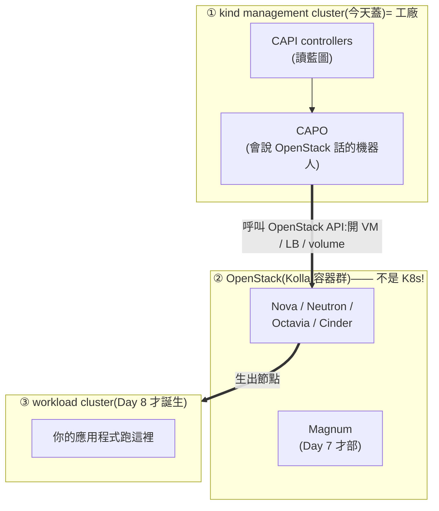
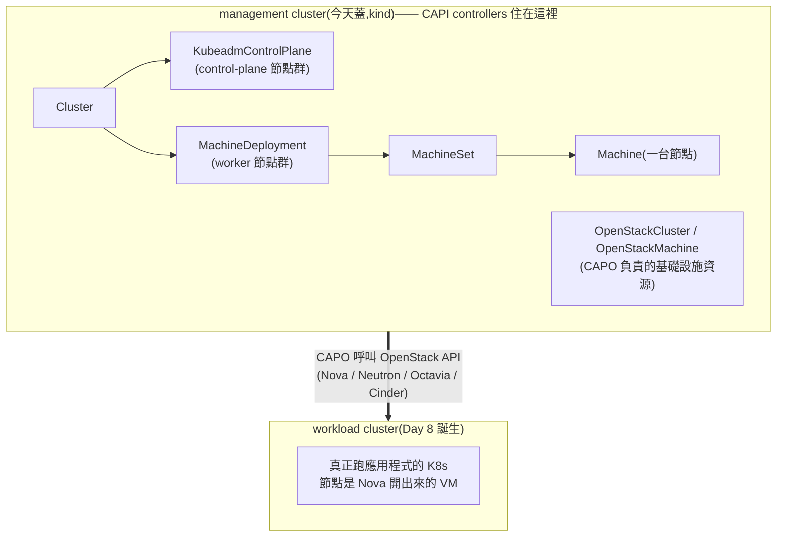
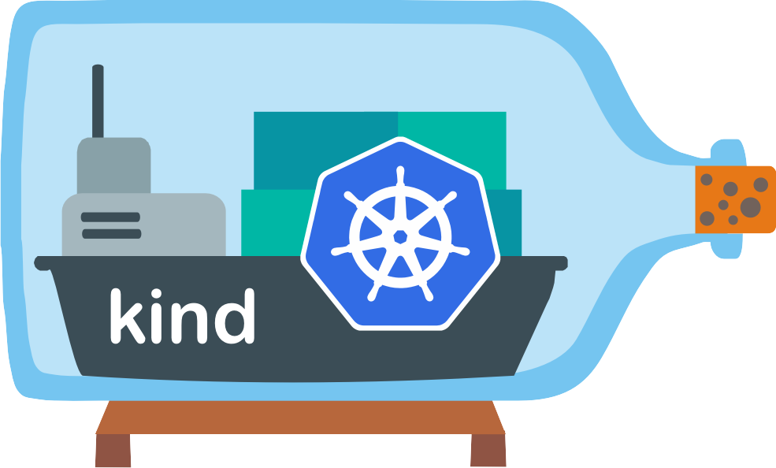

# Day 6: Cluster API 管理叢集——kind + CAPO

> 課程定位:立起 Magnum CAPI driver 的底層 —— 一個 **Cluster API management cluster**(跑在 kind 上),裝好 CAPI core + kubeadm bootstrap/control-plane + **CAPO**(OpenStack infrastructure provider)。Day 7 才把 Magnum 的 driver 接上來。
> 今天有一個必須先知道的整合陷阱:**Kolla 為了 OpenStack,關掉了 Docker 的防火牆管理——這會直接斷掉 kind 的對外網路**。原理章會解釋為什麼,步驟 3 會處理它。

!!! abstract "你在課程的哪裡"
    - **Day 1–5**:OpenStack 提供的是「原料」——VM、網路、硬碟、LB。
    - **Day 6–8 的大目標**:讓 OpenStack 能像公有雲一樣,**一個指令開出一整座 Kubernetes cluster**。分三步:**今天蓋「造 K8s 的工廠」**(Cluster API),明天把 OpenStack 的接單櫃台(Magnum)接上工廠,後天正式下單開出第一座 cluster。
    - 今天結束時工廠是空轉的——**這是正常的**,還沒有人下單。

## 第一次接觸 Cluster API?先讀這段

### 問題:誰來「蓋」K8s cluster?

{ align=right width="130" }

手動裝一座 K8s(開 VM、裝 kubeadm、join 節點、配網路)又煩又難維護。業界的答案是 **Cluster API(CAPI)**:把「一座 K8s cluster」本身變成一種宣告式資源——你宣告「我要 1 台 control plane + 2 台 worker、版本 v1.34」,一組 controller(常駐程式)就自動把它蓋出來、壞了修好、要升版就滾動換新。

**CAPI 有個先天限制,決定了今天要做的一切**:CAPI 的 controller 是「K8s 的原生程式」,**必須住在某座 K8s 裡才能跑**。所以要先有一座小 K8s 專門給它們住——這座就叫 **management cluster(管理叢集)**,它不跑你的應用程式,只跑「造叢集的機器人」。CAPI 官方標誌的副標把這個哲學講完了:**"It's Kubernetes all the way down"**(一路往下全是 Kubernetes)。

比喻:**management cluster 是工廠**,裡面的 CAPI/CAPO controller 是生產機器人;丟一份藍圖(CAPI 的 YAML)進工廠,機器人就去呼叫 OpenStack 把真正的 cluster(**workload cluster**)蓋出來。

### 全景:此後你的機器上同時存在「三座」東西,別搞混



三座全部住在同一台 Azure VM 上——這正是容易搞混的原因。

| | 是什麼 | 跑什麼 | 誰蓋的 |
|---|---|---|---|
| **OpenStack(Kolla)** | host 上的一群 Docker 容器(**不是 K8s**) | Nova/Neutron/Magnum 等雲服務 | Day 1–5 |
| **kind management cluster** | host Docker 裡的一座迷你 K8s | 只跑 CAPI/CAPO controller | **今天** |
| **workload cluster** | 由巢狀 Nova VM 組成的真 K8s | 你的應用程式 | Day 8 |

常見疑問:「為什麼不把 CAPI 直接裝進 OpenStack?」——因為 OpenStack(Kolla)不是 K8s,CAPI controller 沒地方住;所以才用 **kind**(K8s-in-Docker,一個容器就是一座 K8s)開一座最小的給它住。

### 今天要裝進工廠的四個 provider

`clusterctl init` 一次裝四件,各司其職:

| Provider | 白話職責 |
|---|---|
| **core**(cluster-api) | 看懂「Cluster / Machine」這些藍圖的主控 |
| **bootstrap**(kubeadm) | 產生每台節點開機後「怎麼加入 cluster」的腳本 |
| **control-plane**(kubeadm) | 專管 control-plane 節點的生命週期(擴縮、升版) |
| **infrastructure**(**CAPO**) | 唯一「會說 OpenStack 話」的:把 Machine 翻成 Nova VM、把 LB 翻成 Octavia |

## 原理與架構

### 1. Cluster API 是什麼:用 K8s 管 K8s

CAPI 把「建一座 K8s cluster」變成宣告式的 K8s 資源。有兩種 cluster:



controllers 監看上半部這些宣告式資源,持續「把現實校正成宣告的樣子」——這就是 reconcile。

**四種 provider**(clusterctl 的四個 `--` 旗標):

| Provider | 角色 | 本 lab 版本 |
|---|---|---|
| **core**(`cluster-api`) | Cluster/Machine 等核心 CRD 與 reconcile | v1.13.2 |
| **bootstrap**(`kubeadm`) | 產生節點的 cloud-init(kubeadm join) | v1.13.2 |
| **control-plane**(`kubeadm`) | 管 control-plane 生命週期(擴縮、升版) | v1.13.2 |
| **infrastructure**(`openstack` = **CAPO**) | 把 Machine 翻成 Nova VM、把 LB 翻成 Octavia | v0.14.4 |

### 2. 為什麼 management cluster 用 kind

{ align=right width="160" }

management cluster 只跑 controllers(記憶體帳 ~6 GB),不跑 workload。單機 lab 用 **kind**(K8s-in-Docker)最省事 —— 一個 docker 容器就是一整座 K8s。生產環境會用專用 HA cluster(controllers 掛了不能影響已生的 workload cluster 的 day-2 操作)。

kind 的官方標誌就是一艘**瓶中船**——把 K8s 之船裝進(Docker 的)瓶子裡,看一眼就懂它在做什麼。

### 3. CAPO v0.14 的新依賴:ORC

CAPO v0.12 起把「OpenStack 資源的實際 CRUD」拆給獨立的 **ORC(openstack-resource-controller,`k-orc/openstack-resource-controller`)**。CAPO 產生 ORC 的 CRD(如 `Image`、`Network`),ORC 去呼叫 OpenStack。**所以 `clusterctl init` 裝 CAPO 前,必須先 `kubectl apply` ORC**,漏了 CAPO 會因缺 CRD 起不來。這是 v0.14 世代最容易漏的一步。

### 4. Driver 決策(計畫要求的 30 分鐘 spike)

| | **vexxhost `magnum-cluster-api`(採用)** | magnum-capi-helm(StackHPC,備案) |
|---|---|---|
| management cluster | **Model A:手動 `clusterctl init`**(driver 只在 Magnum 端建 CAPI CRs) | 走 Helm chart |
| 文件 | 有 Kolla-Ansible 專屬整合教學(R0K5T4R、Satish Patel) | 較少 Kolla 實例 |
| node image | 自家 `capo-image-elements`,對應 k8s 1.33–1.36 | CAPI 生態通用 |
| 現況 | v0.37.0(2026-06),active | active |

**定案:vexxhost magnum-cluster-api v0.37.0。** 版本 pin **不抓 latest,抓 driver 測過的組合** —— 直接讀 driver repo 的 `hack/setup-capo.sh`(其 CI bootstrap):`CAPI=v1.13.2 / CAPO=v0.14.4 / ORC=v2.2.0`。latest 是 v1.13.3 / v0.14.6,只差 patch,但用 pin 版最保險。

### 5. 注意:Kolla 與 kind 對 Docker 網路的假設互相衝突

這是今天最重要的注意事項——不先理解,待會 `clusterctl init` 會莫名其妙失敗。

兩套工具對同一個 Docker 有完全相反的期待:

- **Kolla 在 Day 1 部署時,改掉了 Docker 的全域設定**(`/etc/docker/daemon.json` 裡的 `iptables: false` 等):OpenStack 容器全部走主機網路、網路交給 Neutron/OVN 自己管,所以 Kolla 刻意禁止 Docker 去碰防火牆規則。對 OpenStack 來說,這是正確的設定。
- **kind 是一般的 bridge 容器**:它的對外連線,依賴 Docker 自動建立的 NAT 轉換規則才出得去。

在這台主機上,兩者相遇的結果:Docker 不會替 kind 建 NAT,kind 節點的封包帶著內部位址直接送出網卡,Azure 網路一律丟棄。**你會看到的症狀是 kind 叢集裡所有 image 拉取一律 `i/o timeout`**——看起來像網路故障,其實是設定衝突。

正確的解法是**只替 kind 的網段手動補一條 NAT 規則**(步驟 3 會做),而不是把 Docker 的 `iptables` 改回 `true`——改全域設定會波及正在運作的 OpenStack。完整的診斷過程與開機自動生效的設定,見排錯手冊:[kind × Kolla 的 docker iptables 衝突](../solutions/integration-issues/kind-kolla-docker-iptables-masquerade.md)。

## 步驟

### 1. 裝 CLIs(版本對齊 driver pin)

```bash
# kubectl / kind / clusterctl(=CAPI 版) / helm
curl -sLo /tmp/kubectl    https://dl.k8s.io/release/v1.36.2/bin/linux/amd64/kubectl
curl -sLo /tmp/kind       https://kind.sigs.k8s.io/dl/v0.32.0/kind-linux-amd64
curl -sLo /tmp/clusterctl https://github.com/kubernetes-sigs/cluster-api/releases/download/v1.13.2/clusterctl-linux-amd64
sudo install -m0755 /tmp/{kubectl,kind,clusterctl} /usr/local/bin/
curl -sSfL https://raw.githubusercontent.com/helm/helm/main/scripts/get-helm-3 | sudo bash

# kind 需要「非 sudo」docker → 把使用者加進 docker group(需新 ssh session 生效)
sudo usermod -aG docker azureuser
```

### 2. 建 management cluster

```bash
kind create cluster --name capi-mgmt --wait 120s     # kindest/node v1.36.1
kubectl get nodes                                    # control-plane Ready
```

### 3. 補上 kind 的對外 NAT(關鍵:不做的話,下一步的 `clusterctl init` 必定失敗)

```bash
# 比照 Kolla 既有的 172.24.4.0/24 那條,只 SNAT kind 網段
sudo iptables -t nat -A POSTROUTING -s 172.17.0.0/16 -o eth0 -j MASQUERADE
# 驗證:kind node 應能連外
docker exec capi-mgmt-control-plane bash -c 'cat </dev/null >/dev/tcp/1.1.1.1/443 && echo OK'
```

持久化(VM 每天 reboot 會掉,用獨立 systemd oneshot 冪等補上):`/etc/systemd/system/kind-masquerade.service`（見 solutions 檔內完整 unit),`systemctl enable --now kind-masquerade`。

### 4. ORC → clusterctl init

```bash
# 先裝 ORC(CAPO v0.14 依賴)
kubectl apply -f https://github.com/k-orc/openstack-resource-controller/releases/download/v2.2.0/install.yaml

# clusterctl init(EXP 旗標比照 setup-capo.sh)
export EXP_CLUSTER_RESOURCE_SET=true
export EXP_KUBEADM_BOOTSTRAP_FORMAT_IGNITION=true
export CLUSTER_TOPOLOGY=true
clusterctl init \
  --core cluster-api:v1.13.2 \
  --bootstrap kubeadm:v1.13.2 \
  --control-plane kubeadm:v1.13.2 \
  --infrastructure openstack:v0.14.4
# clusterctl 會自動先裝 cert-manager(v1.20.2),不需手動處理
```

### 5. 驗證

```bash
for ns_dep in \
  capi-system/capi-controller-manager \
  capi-kubeadm-bootstrap-system/capi-kubeadm-bootstrap-controller-manager \
  capi-kubeadm-control-plane-system/capi-kubeadm-control-plane-controller-manager \
  capo-system/capo-controller-manager; do
  kubectl -n ${ns_dep%/*} rollout status deploy/${ns_dep#*/} --timeout=180s
done
kubectl get providers -A
```

## 驗收 checkpoint

逐項驗證,**全部符合判準才算完成今天**。「本課環境的結果」欄是我們實測的參考值——你的 IP、耗時等數字會不同,但判準必須成立:

| 驗證 | 判準 | 本課環境的結果 |
|---|---|---|
| kind cluster | control-plane Ready | kindest/node v1.36.1,18s Ready |
| kind egress | node 可連外部 443 | 加 MASQUERADE 後 1.1.1.1 / quay 皆 OK |
| MASQUERADE 持久化 | systemd unit enabled+active,規則不重複 | count=1 |
| ORC | orc-controller-manager Running | v2.2.0 |
| cert-manager | 3 deploy available | v1.20.2(clusterctl 自動裝) |
| **4 controller** | capi / bootstrap / control-plane / capo 全 1/1 Running | 符合 |
| providers | core/bootstrap/control-plane v1.13.2 + openstack v0.14.4 | `kubectl get providers` 四筆到位 |

## 地雷記錄

### 地雷 1:Kolla `iptables:false` 斷 kind egress(solutions 級,本日最大地雷) {#mine-1}

背景見上方原理第 5 節,完整解法見排錯手冊:[kind × Kolla 的 docker iptables 衝突](../solutions/integration-issues/kind-kolla-docker-iptables-masquerade.md)。症狀是所有 image `ImagePullBackOff` / `i/o timeout`,根因不在 kind 也不在 quay,而在 host 的 docker daemon.json。**診斷關鍵順序**:確認 host 自己連 quay OK → 才知道問題在 kind 這層 → 測 kind node 連「任意外部 IP」都失敗(排除 quay 專屬)→ TCP handshake 就失敗(排除 MTU,MTU 只斷大封包)→ 查 NAT 發現沒有 kind 網段的 MASQUERADE → daemon.json `iptables:false`。

### 地雷 2:`clusterctl init` 卡 "cert-manager context deadline exceeded"(§1 的下游症狀) {#mine-2}

第一次 init 死在 `Waiting for cert-manager to be available...` → `context deadline exceeded`。**這不是 cert-manager 的錯,是 §1 egress 沒通導致它 ImagePullBackOff**。修好 MASQUERADE、刪掉卡住的 pod 讓它重拉、cert-manager available 後**重跑同一條 `clusterctl init` 即可續裝**(它偵測 cert-manager 已在會跳過,直接裝 CAPI/CAPO)。教訓:`clusterctl init` 可安全重跑。

### 地雷 3:kind node 偏好 IPv6 但無 egress(次要) {#mine-3}

kind 的 docker network 帶 IPv6 ULA(`fc00::/64`)且有 v6 default route,`getent hosts quay.io` 會回 AAAA,但 Azure 無 IPv6 對外 → 更拖慢 pull。修好 IPv4 MASQUERADE 後 Happy Eyeballs 會走 v4,不再是問題;要根治可在 kind config 關 IPv6,本 lab 未做(非必要)。

### 地雷 4:VM reboot 後的復原(操作提醒,非 bug) {#mine-4}

- **MASQUERADE**:已由 `kind-masquerade.service` 開機自動補,免手動。
- **kind cluster 本身**:kind node 容器預設不隨 VM reboot 自動健康復原。早上開機後若要用 management cluster,先 `docker start capi-mgmt-control-plane` 等它回穩(或重建 cluster + 重跑 clusterctl init)。Day 7 開工前確認 `kubectl get providers -A` 四筆都在。

## 延伸閱讀

想往下深挖,從這幾份開始:

- **[Cluster API Quick Start](https://cluster-api.sigs.k8s.io/user/quick-start)** —— CAPI 官方入門;本章 kind + clusterctl 的流程就是它的 OpenStack 版。
- **[CAPO:Cluster API Provider OpenStack](https://cluster-api-openstack.sigs.k8s.io/)** —— 本章裝的那個 provider 的官方手冊,OpenStackCluster/OpenStackMachine 資源的定義都在這。
- **[kind 官方文件](https://kind.sigs.k8s.io/)** —— 用 Docker 容器跑 K8s 的工具;設定檔選項與已知限制。
- **[Docker 的封包過濾與防火牆](https://docs.docker.com/engine/network/packet-filtering-firewalls/)** —— 本章那顆 iptables 地雷的背景知識:Docker 到底對 iptables 做了什麼。

## 下一步(Day 7)

Magnum + CAPI driver 整合:把 vexxhost `magnum-cluster-api` v0.37.0 driver 裝進 Kolla 的 magnum image(pip 客製)、把本 management cluster 的 kubeconfig 餵給 magnum conductor、建 ClusterTemplate。底層 CAPI/CAPO 已就緒。

---

*Cluster API 與 kind 標誌為 CNCF(Linux Foundation)之商標與專案資產,此處作社群教學用途。*
