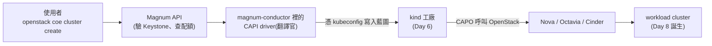

# Sprint 3 / Day 7: Magnum + Cluster API driver 整合(Sprint 1 未完成項 #3)

> 課程定位:把 Day 6 立好的 CAPI management cluster 接上 Magnum。**關鍵發現:Kolla Epoxy 的官方 magnum image 已內建 vexxhost `magnum-cluster-api` driver**,不用自建 image、不用 `docker exec pip install` —— 整個整合收斂成「開 magnum + 放一份 kubeconfig」。
> Sprint 1 這步死於 heat driver 內嵌的 2019-2021 image URL 全數失效(day-6/day-7 紀錄)。CAPI driver 的 node image 由 CAPI 生態(capo-image-elements)持續維護,從根本解掉這個問題。

!!! abstract "你在課程的哪裡"
    - **昨天(Day 6)**:「造 K8s 的工廠」(CAPI management cluster)蓋好了,但空轉中——沒有人下單。
    - **今天**:部署 **Magnum**(OpenStack 的 K8s 服務),並把它接上工廠。做完後,`openstack coe cluster create` 這行指令就「接得上線」了。
    - **明天(Day 8)**:正式下單,開出第一座 workload cluster。

## 第一次接觸 Magnum?先讀這段

{ align=right width="110" }

### Magnum 是什麼

**Magnum 是 OpenStack 版的「managed Kubernetes 服務」**——就像 AWS 的 EKS、GCP 的 GKE:使用者不用懂怎麼裝 K8s,對雲說「給我一座 3 節點的 cluster」,雲就生一座給你。

### 常見疑問:昨天的 CAPI 不是已經會蓋 cluster 了嗎?Magnum 還有什麼用?

這是本課程最值得搞懂的架構問題。答案:**CAPI 和 Magnum 各管一半,缺一不可**——

CAPI 很會「蓋」,但它的世界裡**沒有「租戶」的概念**:誰拿到工廠(management cluster)的鑰匙,誰就能蓋任何叢集、看所有叢集、砍別人的叢集。自己一個團隊用沒問題;但要做成**開放給多租戶的雲服務**,總不能把工廠萬能鑰匙發給每個客戶。

Magnum 補的正是這一半:

| | **Magnum(前台)** | **CAPI/CAPO(引擎)** |
|---|---|---|
| 管什麼 | **誰**能建、能建**多少**、用什麼**範本** | 怎麼**真的把 cluster 蓋出來**、升版、自癒 |
| 認證 | Keystone(租戶用自己的 OpenStack 帳號) | 無租戶概念(kubeconfig = 萬能鑰匙) |
| 使用介面 | `openstack coe cluster create` 一行 | 手寫一疊 CRD YAML,還得懂 CAPI |
| 配額/隔離 | 每租戶 quota、A 看不到 B 的 cluster | 無 |
| 比喻 | **店面櫃台 + POS**:認客戶、管訂單、擺目錄 | **工業級 3D 印表機**:給藍圖就印,不問你是誰 |

所以:**只是自己團隊要用 K8s → 直接用 CAPI 就好,不需要 Magnum;要做成雲上的多租戶服務(本課程的目標)→ 兩層都要。** 這種「前台 API + 造叢集引擎」的分層不是 Magnum 獨有,Rancher、Gardener 等產品都是同一個結構。

### 今天的整合,說穿了就是「給櫃台一把工廠鑰匙」

Magnum 收到訂單後,由它內建的 **CAPI driver(翻譯官)**把 OpenStack 風格的請求翻成 CAPI 藍圖、丟進 Day 6 的工廠。而「怎麼丟進去」的答案樸素得驚人——**給 Magnum 一份工廠的 kubeconfig(= 地址 + 鑰匙)**:



更妙的是 Kolla 的設計:**「有沒有放 kubeconfig」本身就是 driver 的開關**——放了,CAPI driver 自動啟用;沒放,維持關閉。這是今天步驟裡最關鍵的一手,原理見下節。

## 原理與架構

### 1. Kolla 原生 CAPI driver 機制:用 kubeconfig 的「存在與否」當開關

Magnum 支援多種 cluster driver,靠 `magnum.conf` 的 `disabled_drivers` 決定哪些關掉。Kolla Epoxy 的 `magnum.conf.j2` 有一段精巧邏輯:

```jinja

disabled_drivers = k8s_cluster_api_flatcar,k8s_cluster_api_rockylinux,k8s_cluster_api_ubuntu,k8s_cluster_api_ubuntu_focal

```

- **沒放 kubeconfig** → `magnum_kubeconfig_file_path` 未定義 → 這行輸出 → 四個 `k8s_cluster_api_*` driver 全被關(預設狀態,driver 雖 bake 在 image 裡但不啟用)
- **放了 kubeconfig** → Kolla 的 magnum role 偵測到 `/etc/kolla/config/magnum/kubeconfig`、定義 `magnum_kubeconfig_file_path`、把整行 `disabled_drivers` **省略** → CAPI drivers **自動啟用**

也就是:**「有沒有 management cluster 的 kubeconfig」直接等於「要不要啟用 CAPI driver」**,設計得很自洽。

### 2. kubeconfig 怎麼進到 magnum_conductor

Kolla 的 magnum role(`tasks/config.yml`)+ 容器 `config.json`:

```
/etc/kolla/config/magnum/kubeconfig   (你放的,host 上)
        │ role: Copying over kubeconfig file
        ▼
容器 config.json:{ source: .../kubeconfig, dest: /var/lib/magnum/.kube/config }
        ▼
magnum_conductor 容器內 /var/lib/magnum/.kube/config
        │ driver clients.py: pykube.HTTPClient(pykube.KubeConfig.from_env())
        │   from_env() → 讀 ~/.kube/config(容器內 HOME=/var/lib/magnum)→ 完全對上
        ▼
連 kind API(kubeconfig 內 server=https://127.0.0.1:33689)
```

**能連通的前提**:Kolla 的 magnum 容器走 **host network**(與 barbican/heat 同),所以容器內 `127.0.0.1:33689` = host 的 kind API port。若 magnum 不是 host-net(別的部署工具),就要改用 kind 容器的 docker IP 或 `--internal` kubeconfig。

### 3. driver 怎麼被選中:image 的 `os_distro`

`disabled_drivers` 拿掉後四個 CAPI driver 都在(flatcar / rockylinux / ubuntu / ubuntu_focal)。實際建 cluster 時,Magnum 依 **ClusterTemplate 的 image 的 `os_distro` property** 選:node image 標 `os_distro=ubuntu` → 選 `k8s_cluster_api_ubuntu`。所以 image 上傳時 `--property os_distro=ubuntu` 是關鍵,`coe cluster template show` 的 `cluster_distro=ubuntu` 就是它認出來的證據。

### 4. cluster_user_trust:為什麼要開

`enable_cluster_user_trust: "yes"` → `magnum.conf` 的 `cluster_user_trust = yes`。CAPI cluster 內的元件(OpenStack CCM、Cinder CSI、cluster-autoscaler)要**回呼 OpenStack API**(建 LB、掛 volume、擴縮節點),靠 Magnum 建的 trust 拿 credential。Day 8 這些才會用到,但屬 magnum 部署期設定,Day 7 一起開好免得重 deploy。安全上這是「較寬的信任」,生產環境要斟酌;lab 直接開。

### 5. node image 來源:capo-image-elements(Sprint 1 失敗根因的解法)

Sprint 1 的 heat driver 內嵌 FCOS/flannel 的舊 image URL,失效即死。CAPI 路線的 node image 由 **`vexxhost/capo-image-elements`** 持續發布(release `2026.05-7`,對應 k8s v1.33.12/v1.34.8/v1.35.5/v1.36.1),本課選 **v1.34.8**。image 是預裝好 kubelet/kubeadm/containerd 的 Ubuntu 24.04,CAPO 開機後 kubeadm join 即成節點。

## 步驟

### A. 開 Magnum + 啟用 driver

```bash
# 1. globals
enable_magnum: "yes"
enable_cluster_user_trust: "yes"

# 2. 放 management cluster 的 kubeconfig(Day 6 kind 的 ~/.kube/config)
sudo mkdir -p /etc/kolla/config/magnum
sudo cp ~/.kube/config /etc/kolla/config/magnum/kubeconfig
sudo chown azureuser:azureuser /etc/kolla/config/magnum/kubeconfig   # ← 見踩雷#1

# 3. deploy(magnum 建 DB/keystone/trustee、掛 kubeconfig、省略 disabled_drivers)
kolla-ansible deploy -i ~/all-in-one --tags magnum,loadbalancer,horizon
```

### B. 驗證 driver 載入 + 連通

```bash
source /etc/kolla/admin-openrc.sh
# disabled_drivers 應「不存在」= driver 啟用
sudo grep -c '^disabled_drivers' /etc/kolla/magnum-conductor/magnum.conf   # → 0
# conductor 用 driver 的方式實連 kind
sudo docker exec magnum_conductor python3 -c \
  "import pykube; a=pykube.HTTPClient(pykube.KubeConfig.from_env()); print([n.name for n in pykube.Node.objects(a)])"
# → ['capi-mgmt-control-plane']
pip install python-magnumclient
openstack coe service list        # magnum-conductor state=up
```

### C. Node image + ClusterTemplate

```bash
# image(os_distro=ubuntu 是 driver 選型關鍵)
curl -fLO https://github.com/vexxhost/capo-image-elements/releases/download/2026.05-7/ubuntu-24.04-v1.34.8.qcow2
openstack image create ubuntu-24.04-v1.34.8 --disk-format qcow2 --container-format bare --public \
  --file ubuntu-24.04-v1.34.8.qcow2 --property os_distro=ubuntu --property os_version=24.04

# flavor(k8s 節點,原本只有 m1.tiny/small)
openstack flavor create m1.medium --vcpus 2 --ram 4096 --disk 40

# ClusterTemplate(master-lb-enabled 必需;kube_tag 對應 image 版本)
openstack coe cluster template create k8s-v1.34.8 \
  --image ubuntu-24.04-v1.34.8 --external-network ext-net --dns-nameserver 8.8.8.8 \
  --master-lb-enabled --master-flavor m1.medium --flavor m1.medium \
  --network-driver calico --docker-storage-driver overlay2 \
  --coe kubernetes --label kube_tag=v1.34.8
```

## Checkpoint(全數通過 2026-07-09)

| 驗證 | 判準 | 實測 |
|---|---|---|
| magnum 容器 | api + conductor healthy | ✅ |
| **driver 啟用** | 生成的 magnum.conf 無 `disabled_drivers` 行 | ✅ 0 行 |
| kubeconfig 掛載 | 容器內 `/var/lib/magnum/.kube/config` 存在 | ✅ magnum:magnum 600 |
| **conductor → mgmt cluster** | pykube 列得出 kind node / capo pod | ✅ `['capi-mgmt-control-plane']` |
| conductor service | `openstack coe service list` state=up | ✅ |
| node image | active,os_distro=ubuntu | ✅ v1.34.8(825M) |
| **ClusterTemplate** | `coe cluster template create` 成功 | ✅ k8s-v1.34.8,cluster_distro=ubuntu |

## 踩雷

### 1. `sudo cp` 讓 kubeconfig 變 root:root → deploy 讀不到(必踩)

`sudo cp ~/.kube/config /etc/kolla/config/magnum/kubeconfig` 產生的檔是 `root:root 0600`。但 kolla-ansible 以 **azureuser** 身分讀這個 src(`copy` module 從 control node 讀),撞 `Permission denied: /etc/kolla/config/magnum/kubeconfig`,deploy `failed=1` 死在 "Copying over kubeconfig file"。修:`sudo chown azureuser:azureuser` 該檔(保持 600 即可),再重跑 deploy(冪等)。教訓:放進 `/etc/kolla/config/` 的自訂檔要讓跑 ansible 的使用者讀得到。

### 2. 沒有 m1.medium flavor

環境原本只有 m1.tiny / m1.small(Day 2 建的)。getting-started 用 m1.medium,得先 `openstack flavor create`。ClusterTemplate 只存 flavor 名稱,template create 時不驗證 flavor-vs-image 磁碟大小(那是 Day 8 nova boot 才驗),所以就算 flavor 偏小 template 仍會建成功 —— 但 Day 8 要確保 flavor 磁碟 ≥ image 虛擬大小。

### 3. 版本一致性(承 Day 6)

driver(image 內建)、CAPI/CAPO(mgmt cluster)、node image 三者版本要相容。本課全部對齊 vexxhost 測過的組合:driver = Kolla Epoxy 內建版、CAPI v1.13.2 / CAPO v0.14.4(Day 6)、node image k8s v1.34.8(capo-image-elements 2026.05-7)。

## 下一步(Day 8)

E2E:`openstack coe cluster create` 用本 template 實際開 workload cluster —— Magnum → CAPI(kind)→ CAPO → Nova 開節點 VM、Octavia 給 API LB。驗 `kubectl get nodes` 全 Ready、部 app 拿 LoadBalancer(Octavia)、PVC 綁 Cinder。三項全過 = Sprint 1 三個未完成項全數補完。**開工前注意**:若 VM 隔夜重開,先確認 kind cluster 回穩(Day 6 §踩雷4)且 magnum 的 kubeconfig 內 API port(33689)未變;kind 重建會換 port,需同步更新 `/etc/kolla/config/magnum/kubeconfig` 並 `kolla-ansible deploy --tags magnum`。
