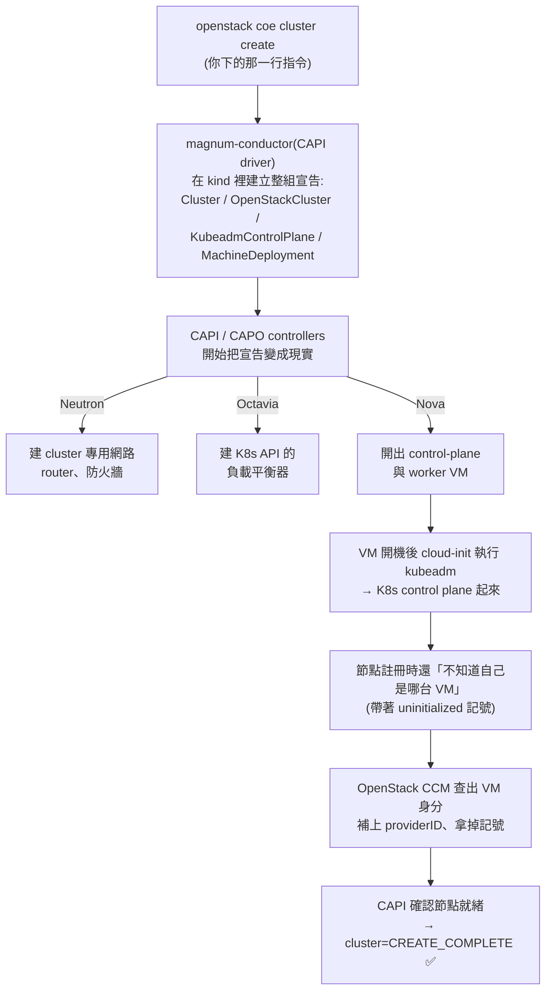
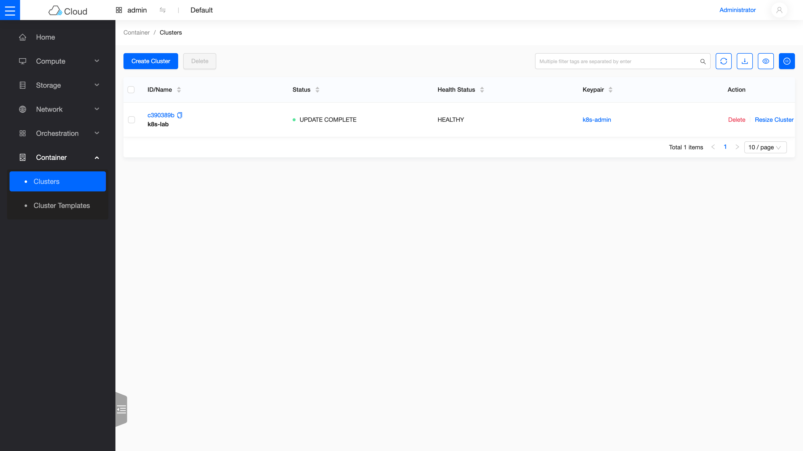
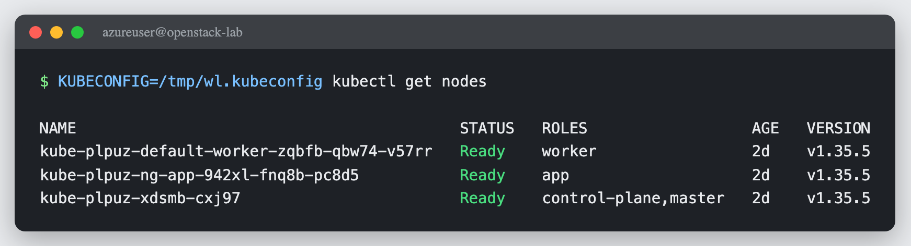

# Sprint 3 / Day 8: E2E — 開 workload cluster 跑起來(Sprint 1 未完成項 #3 收尾)

> 課程定位:用 Day 7 的 ClusterTemplate 真的 `openstack coe cluster create` 開一座 K8s workload cluster,驗證三層互動並完成三項最終驗收:**① `kubectl get nodes` 全 Ready ② `Service type=LoadBalancer` 拿到 Octavia LB ③ PVC 由 Cinder CSI 供裝**。
> 本日踩了四個雷(microversion、CIDR 撞號、LB provider、Nova disk),全部記錄——這正是本次路線的價值:Sprint 1 死在無法診斷的 charm/image 斷代,本次每個地雷都能定位、能修。

## 原理與架構

### 1. 三層互動:一個 `cluster create` 背後發生什麼

{ align=right width="90" }

今天的終點是一座**真正的 Kubernetes**——不是管理用的 kind,而是跑你工作負載的 workload cluster。整條生產線長這樣:



三層 = **Magnum(API/driver)→ CAPI/CAPO(kind,宣告式 reconcile)→ OpenStack(Nova/Octavia/Cinder 出實體資源)**。

### 2. external cloud provider:providerID 與 CCM 的關鍵角色(本日兩個地雷的核心)

現代 CAPO 走 **external cloud provider**:kubelet 起來時**不知道自己是哪台 OpenStack VM**,以 `node.cloudprovider.kubernetes.io/uninitialized:NoSchedule` taint 註冊。**OpenStack CCM** 才去 Nova 問出這台 VM 的 UUID、寫進 `Node.spec.providerID=openstack:///<uuid>`、移除 taint。

連鎖後果:**CCM 一旦掛掉,整座 cluster 卡死** —— 沒 providerID → CAPI 永遠「Waiting for a Node with providerID X to exist」;沒移除 taint → coredns/CSI-controller 排不進節點 → 一路 Pending。本日的[地雷 2](#mine-2) 正是 CCM 連不到 Keystone 而 crash 的實例。

### 3. LoadBalancer / PVC 怎麼落到 OpenStack

- **`Service type=LoadBalancer`**:CCM 監到後呼叫 **Octavia** 建 LB(amphora),VIP 掛 ext-net FIP → `EXTERNAL-IP`。node 是 LB 的 member(NodePort)。
- **PVC**:`openstack-cinder-csi` 動態供裝 → 建 **Cinder volume** → attach 到 pod 所在 node → mount。

今天的三項驗收,每一項背後都是一個你前幾天親手部署過的服務在動工:

| 你在 K8s 宣告的 | 幕後動工的 | 你在哪天認識它 |
|---|---|---|
| 節點(`kubectl get nodes`) | { width="48" } **Nova** 開 VM | Day 1–2 |
| `Service type=LoadBalancer` | { width="48" } **Octavia** 建 LB | Day 4 |
| `PVC` | { width="48" } **Cinder** 建 volume | Day 3 |

## 步驟

### 0. Pre-flight(reboot 後必查)

```bash
# management cluster 4 controllers Ready、magnum 連得到 kind、template 在
kubectl get providers -A
# keypair(cluster create 需要)
openstack keypair create k8s-admin > ~/k8s-admin.pem && chmod 600 ~/k8s-admin.pem
# ⚠️ Octavia o-hm0:host reboot 後 octavia-interface 常因比 OVN 早跑而 failed → o-hm0 DOWN
#   K8s API LB 靠它,先修(見 Day6 solutions 的 drop-in 已讓它自動重試)
sudo systemctl reset-failed octavia-interface && sudo systemctl start octavia-interface
ip -br addr show o-hm0     # 應 UP + 10.1.0.x
```

### 1. 修 magnum.conf(建 cluster 前必做,預防[地雷 1](#mine-1))

```ini
# /etc/kolla/config/magnum.conf  (Kolla merge)
[nova_client]
api_version = 2.15     # 預設 2 太舊,driver 建 soft-anti-affinity server group 需 ≥2.15
```
```bash
kolla-ansible deploy -i ~/all-in-one --tags magnum   # regen conf + 重啟容器
```

### 2. 用「Azure-correct」template 開 cluster

Template 必帶三個 lab 專屬 label——每一個都是用地雷換來的([地雷 2](#mine-2)、[地雷 3](#mine-3)):

```bash
openstack coe cluster template create k8s-v1.34.8-azure \
  --image ubuntu-24.04-v1.34.8 --external-network ext-net --dns-nameserver 8.8.8.8 \
  --master-lb-enabled --master-flavor m1.medium --flavor m1.medium \
  --network-driver calico --docker-storage-driver overlay2 --coe kubernetes \
  --label kube_tag=v1.34.8 \
  --label fixed_subnet_cidr=10.6.0.0/24 \   # 地雷 2:不可與 API 的 10.0.0.4 同段
  --label octavia_provider=amphora          # 地雷 3:我們 Octavia 沒啟用 amphorav2

openstack coe cluster create k8s-lab --cluster-template k8s-v1.34.8-azure \
  --keypair k8s-admin --master-count 1 --node-count 1
```

### 3. 監控到 CREATE_COMPLETE

```bash
watch openstack coe cluster show k8s-lab -c status
# 盯 providerID 是否被 CCM 設上(關鍵健康指標):
SEC=$(kubectl -n magnum-system get secret -o name | grep kubeconfig | head -1)
kubectl -n magnum-system get $SEC -o jsonpath='{.data.value}' | base64 -d > /tmp/wl.kubeconfig
KUBECONFIG=/tmp/wl.kubeconfig kubectl get nodes -o jsonpath='{..providerID}'
```

### 4. 三項最終驗收

```bash
export KUBECONFIG=/tmp/wl.kubeconfig
# ① nodes Ready
kubectl get nodes
# ③ PVC → Cinder(先建 StorageClass,driver 沒附預設的)
kubectl apply -f - <<'EOF'
apiVersion: storage.k8s.io/v1
kind: StorageClass
metadata: {name: cinder, annotations: {storageclass.kubernetes.io/is-default-class: "true"}}
provisioner: cinder.csi.openstack.org
volumeBindingMode: Immediate
EOF
kubectl apply -f pvc+pod.yaml     # PVC 1Gi + busybox 掛載
kubectl get pvc                   # Bound;openstack volume list 出現 pvc-*
# ② LoadBalancer → Octavia
kubectl create deploy web --image nginx --replicas 2
kubectl expose deploy web --port 80 --type LoadBalancer --name web-lb
kubectl get svc web-lb            # EXTERNAL-IP(ext-net FIP)
curl http://<EXTERNAL-IP>/        # host 內可打(Azure FIP 僅 host 內有效)
```

## 驗收 checkpoint

逐項驗證,**全部符合判準才算完成今天**。「本課環境的結果」欄是我們實測的參考值——你的 IP、耗時等數字會不同,但判準必須成立:

| 驗證 | 判準 | 本課環境的結果 |
|---|---|---|
| cluster | CREATE_COMPLETE / HEALTHY | 符合 |
| **驗收① nodes** | control-plane + worker 全 Ready、有 providerID | v1.34.8,`openstack:///...` |
| CCM / CSI / calico | 全 Running(providerID 設好、taint 移除) | CCM 0 重啟 |
| **驗收② LoadBalancer** | Octavia amphora LB ACTIVE/ONLINE、EXTERNAL-IP、curl 200 | `172.24.4.183`,curl ×6 = 200 |
| **驗收③ PVC** | Bound、Cinder volume in-use、資料持久化 | `pvc-f99513ec` in-use,`cat` 回 `deepwave-day8` |
| **總驗收** | 前兩次嘗試卡死的三大項(Octavia/Cinder/Magnum)全數走通 | 三項全數通過 |

## 地雷記錄(本日四連)

### 地雷 1:`nova_client api_version=2` 太舊 → server group `soft-anti-affinity` 被拒(CREATE_FAILED 秒失敗) {#mine-1}

cluster create 8 秒就 CREATE_FAILED,magnum-system 無任何 CAPI CR。conductor log:`nova.server_groups.create(policies=['soft-anti-affinity'])` → Nova 400 `'soft-anti-affinity' is not one of ['anti-affinity','affinity']`。driver 用 `magnum.common.clients` 建 nova client,Magnum `[nova_client] api_version` 預設 `2`(=2.1),而 `soft-anti-affinity` 需 **microversion ≥ 2.15**。修:magnum.conf 設 `api_version = 2.15`(**別設 ≥2.64**,那之後 server_group API 從 `policies` list 改成 `policy`,driver 還用 list)。

### 地雷 2:`fixed_subnet_cidr` 與 OpenStack API IP 撞號 → CCM CrashLoopBackOff → cluster 卡死(solutions 級,本日最大地雷) {#mine-2}

cluster 一直 CREATE_IN_PROGRESS、VM 都 ACTIVE 但 Machine 停在 Provisioned。根因:driver 的 `fixed_subnet_cidr` 預設 **`10.0.0.0/24`**,與 OpenStack API endpoint **`10.0.0.4`**(host)同段 → 節點把 10.0.0.4 當 on-link、ARP 不到真 Keystone → CCM crash → 無 providerID → 卡死。修:label **`fixed_subnet_cidr=10.6.0.0/24`**(避開 10.0.0.4,也避開 pod 10.100/svc 10.254/lb-mgmt 10.1/ext-net 172.24)。完整記錄見排錯手冊:[CAPI 子網撞 API IP](../solutions/integration-issues/magnum-capi-fixed-subnet-overlaps-api.md)。

### 地雷 3:`octavia_provider` 預設 amphorav2,但 Octavia 只啟用 amphora → LoadBalancer 失敗 {#mine-3}

`Service type=LoadBalancer` 一直 pending,CCM 報 Octavia 400 `Provider 'amphorav2' is not enabled`。driver 的 CCM cloud.conf `lb-provider` 由 label `octavia_provider`(預設 `amphorav2`)決定,而本 Octavia `enabled_provider_drivers` 只有 `amphora,ovn`。修:label **`octavia_provider=amphora`**(現有 cluster 熱修:patch workload `cloud-config` secret 的 `lb-provider=amphora` + 重啟 CCM)。

### 地雷 4:Nova disk 被 leftover VM 佔滿 → amphora `No valid host` {#mine-4}

改用 amphora 後 LB 仍失敗,Octavia amphora build 報 Nova `No valid host was found`。hypervisor `free_disk_gb=1`、`local_gb_used=121/122`:**Day 2-4 遺留的 SHUTOFF VM(vm-cirros/ubuntu/web1/web2)+ 舊 LB 的 amphora 仍佔用 Nova 的 flavor-disk 配額**(SHUTOFF 不佔 RAM/CPU 但佔 disk 帳)。修:刪掉 leftover(`openstack server delete` demo VM、`loadbalancer delete --cascade` 舊 lb2/lb-ovn)→ 釋放 36GB → amphora 排得進。**教訓:單機 lab 要定期清 leftover,Nova disk 用 flavor 總和計帳、SHUTOFF 也算。**

## Sprint 1 未完成項:全數補完

Sprint 1 的三大敗因,在 Kolla + Magnum-CAPI 路線全部解決:

| Sprint 1 敗因 | 本 Sprint 結果 |
|---|---|
| Octavia:Canonical charm amd64 斷代(裝不了) | ✅ Day 4 amphora LB round-robin;Day 8 workload `Service type=LoadBalancer` 拿到 Octavia LB |
| Cinder LVM:LXD device-mapper 限制 | ✅ Day 3 LVM;Day 8 PVC 由 Cinder CSI 動態供裝 |
| Magnum:heat driver 內嵌 image URL 全失效 | ✅ CAPI driver + capo-image-elements 維護的 node image,cluster CREATE_COMPLETE |


## 從儀表板看成果



*Magnum 的 cluster 列表(Skyline 檢視):k8s-lab,狀態 UPDATE COMPLETE、健康狀態 HEALTHY——十一天的成果濃縮成這一列。*



*同一座 cluster,從 kubectl 看:三個節點全 Ready(control-plane、worker,加上 Day 9 的 `app` node group)。這裡用的是**暫存的 kubeconfig**(`KUBECONFIG=/tmp/wl.kubeconfig` 只影響這一條指令)——查別人的 cluster 時養成這個習慣,不會弄髒自己的 kubectl 設定。*

## 下一步(Day 9)

Day-2 operations:用 `k8s-v1.34.8-azure` template 驗 cluster 升版(CAPI rolling,如 v1.34→v1.35,需先上傳對應 node image)、node group、cluster-autoscaler。開工前照 Pre-flight §0 確認 kind/magnum/octavia o-hm0 就緒。

---

*Kubernetes 標誌為 CNCF(Linux Foundation)之商標;OpenStack 吉祥物為 OpenInfra Foundation 官方資產。此處均作社群教學用途。*
