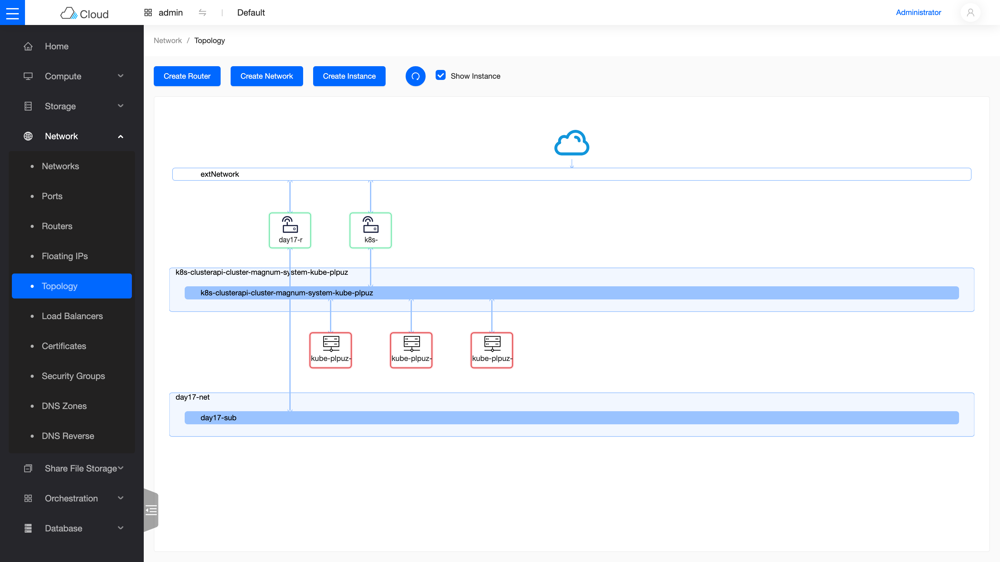
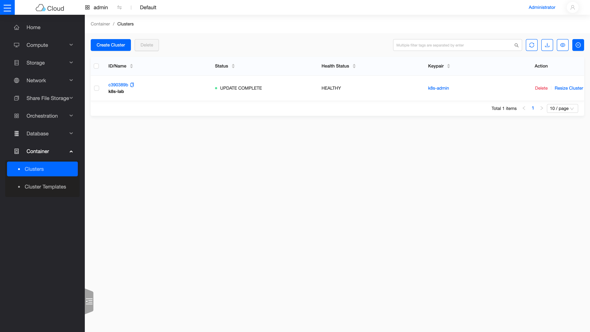

# Day 13:Skyline —— 新一代儀表板

> Sprint 4 的第一天刻意選了一個輕鬆的開場:給你的雲換上現代化的儀表板 **Skyline**,同時複習 Sprint 3 學過的「增量加服務」工作流。今天結束時,同一朵雲會有兩代介面並存——比較它們,是理解 OpenStack 生態如何演進的最好入口。

!!! abstract "你在課程的哪裡"
    - **Day 0–12**:雲已建成,11 個服務上線;Day 12 看過 Sprint 4 的地圖。
    - **今天**:部署 Skyline(一個 flag),認識它與 Horizon 的差異。這是 Sprint 4 唯一「零已知地雷」的一天——當暖身剛好。
    - **今天之後**:Day 14–16 進入儲存三部曲(Ceph → 物件儲存 → 共享檔案系統)。

## 第一次接觸 Skyline?先讀這段

{ align=right width="100" }

Horizon(Day 1 部署的網頁儀表板)已經服役超過十年,技術棧是 Django 伺服器端渲染——功能齊全,但操作體感跟現代網頁應用有落差。**Skyline 是 OpenStack 官方的新一代儀表板**:前後端分離(Vue 前端 + Python API server),頁面即時更新、內建資源拓樸圖、深色模式。

兩者的關係不是取代,是**並存過渡**:Skyline 還在追趕 Horizon 的功能覆蓋面(例如部分管理員操作仍缺),所以實務上常兩個都開——日常瀏覽用 Skyline,深度管理回 Horizon。這也是今天部署完的狀態。

## 原理與架構

Skyline 只有兩個容器,都跟其他 kolla 服務一樣跑在主機網路上:

| 容器 | Port | 角色 |
|---|---|---|
| `skyline_apiserver` | 9998 | API 層:代理與聚合各 OpenStack 服務的 API,自己註冊為 Keystone 的 `skyline` service |
| `skyline_console` | 9999 | 前端層:提供 Vue 網頁,把請求轉給 apiserver |

登入帳號直接用 Keystone 的使用者(與 Horizon 同一組 `admin`)——這正是 Day 2 學過的「所有服務共用一套身分系統」的又一個實例。

## 步驟

### 步驟 1:開 flag、增量部署

這就是 Day 3 學過的工作流:`globals.yml` 加一行 → 針對性部署。Skyline 不需要任何 `/etc/kolla/config/` 自訂檔:

```bash
echo 'enable_skyline: "yes"' | sudo tee -a /etc/kolla/globals.yml
source ~/kolla-venv/bin/activate
kolla-ansible deploy -i ~/all-in-one --tags skyline
```

```text
PLAY RECAP *********************************************************************
localhost : ok=23  changed=16  unreachable=0  failed=0  skipped=3  ...
```

`failed=0` 就是過關,全程約兩分鐘。

### 步驟 2:驗證服務

```bash
sudo docker ps --format "{{.Names}}  {{.Status}}" | grep skyline
source /etc/kolla/admin-openrc.sh
openstack endpoint list -f value | grep skyline
curl -s -o /dev/null -w "%{http_code}\n" http://10.0.0.4:9999/
```

```text
skyline_console    Up (healthy)
skyline_apiserver  Up (healthy)
... skyline ... http://10.0.0.4:9998
200
```

### 步驟 3:打開它

跟 Horizon 一樣,Azure lab 的網頁要走 SSH tunnel(Day 1 學過的原因:對外網路出不了主機):

```bash
# 在你的電腦上執行
ssh -L 9999:<VM私有IP>:9999 -i <你的金鑰> azureuser@<VM公網IP>
```

瀏覽器開 `http://localhost:9999`,帳號 `admin`、密碼與 Horizon 同一組(`grep keystone_admin_password /etc/kolla/passwords.yml`)。


*登入後的首頁:配額總覽即時圖表。左側選單每一項,都是你在 Sprint 3 親手部署過的服務。*

值得逛的幾個頁面:

**Network → Topology** —— 資源拓樸圖,把 Day 2 手建的那條「外網 → router → 內網 → VM」畫成一張圖;Day 8 的 K8s cluster 三個節點、Sprint 4 建的 `day17-net` 也都在上面:



**Container → Clusters** —— Day 8 開的 Magnum K8s cluster,狀態 `UPDATE COMPLETE`、健康 `HEALTHY`:



順帶一提,左側選單此刻已經比 Day 1 剛部署時長很多——`Share File Storage`、`Database`、`DNS Zones` 這些項目,都是 Sprint 4 之後幾天陸續加上的服務(Manila / Trove / Designate)。這張選單本身,就是這朵雲成長的縮影。

別忘了右上角還能切換**深色模式**——現代儀表板的基本配備。

## 驗收 checkpoint

逐項驗證,**全部符合判準才算完成今天**。「本課環境的結果」欄是我們實測的參考值:

| 驗證 | 判準 | 本課環境的結果 |
|---|---|---|
| deploy PLAY RECAP | `failed=0` | ok=23 / changed=16,約 2 分鐘 |
| 容器 | console + apiserver 都 `Up (healthy)` | 符合 |
| Keystone endpoint | `skyline` service 自動註冊 | `http://10.0.0.4:9998` |
| HTTP | 9999 與 9998 都回 200 | 符合 |
| UI | admin 登入、各資源頁正常顯示 | Sprint 3 的所有資源都看得到 |

## 地雷記錄

今天**零地雷**——這不是運氣,是刻意的課程設計:Sprint 4 的第一天用一個「一定會成功」的部署找回手感。不過有一條要先寫進待辦:

!!! note "待辦尾巴:Day 21 要回來動它一次"
    Skyline 的設定模板會在 Prometheus 存在時自動接上監控資料。Day 21 部署完監控套件後,**要連 Skyline 一起 reconfigure**,它的監控頁面才會亮起來。到時候會提醒你。

## 延伸閱讀

想往下深挖,從這幾份開始:

- **[Skyline 官方文件](https://docs.openstack.org/skyline-apiserver/2025.1/)** —— apiserver 的架構與設定參考;本章「兩容器分工」的完整定義在這裡。
- **[Kolla-Ansible 的 Skyline 部署指南](https://docs.openstack.org/kolla-ansible/2025.1/reference/shared-services/skyline-guide.html)** —— 本章部署步驟的官方對照,SSO 與自訂外觀等進階選項也在這份。
- **[skyline-console 原始碼](https://opendev.org/openstack/skyline-console)** —— 想看前端怎麼組出資源拓樸圖,直接讀源頭。

## 下一步

儀表板換新了,接下來三天是 Sprint 4 的重頭戲——**儲存三部曲**。[Day 14](sprint4-day14-ceph-bootstrap.md) 先把地基打好:在同一台主機上立起一套 **Ceph**,它是生產環境 OpenStack 的儲存標配,也是 Day 15(物件儲存)與 Day 16(共享檔案系統)的共同骨幹。

---

*Skyline 吉祥物(九色鹿)為 OpenStack 官方專案標誌,此處作社群教學用途。*
