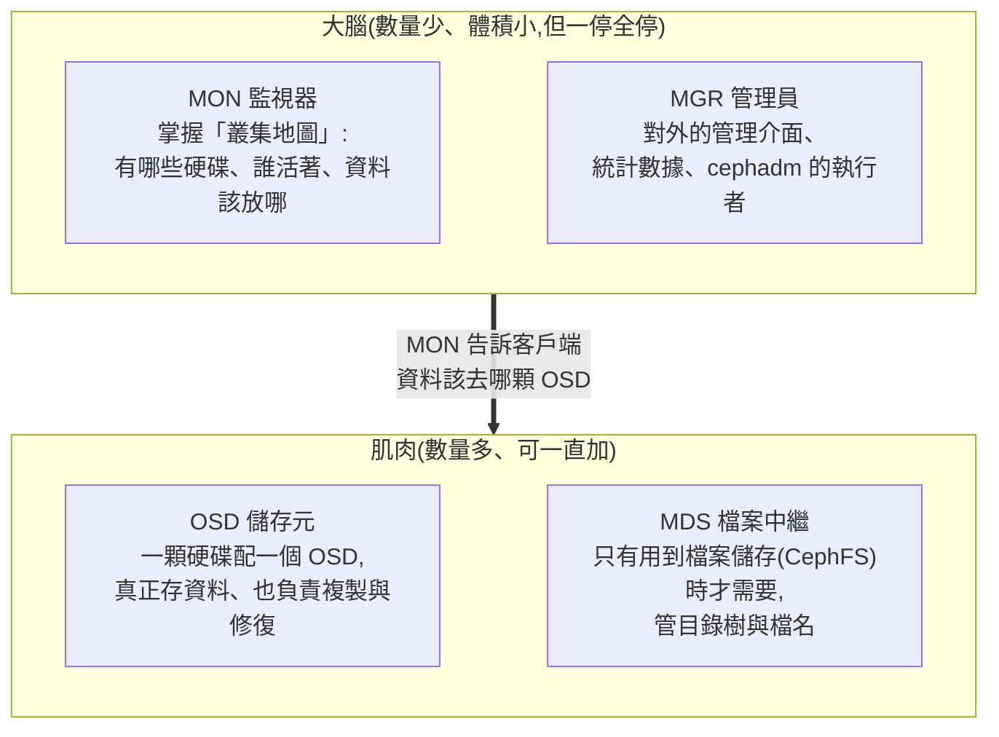
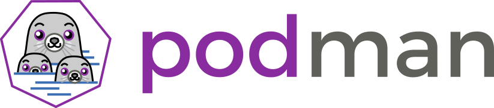

# Day 14:Ceph 基礎 —— 在同一台主機立起儲存骨幹

> 今天不碰 OpenStack 本體,改立一套 **Ceph**——生產環境 OpenStack 的儲存標配。它會成為 Day 15(物件儲存)與 Day 16(共享檔案系統)的共同地基。單機跑 Ceph 有一串「必須預先知道」的調校,本章全部寫清楚;照著做,一小時內 `HEALTH_OK`。

!!! abstract "你在課程的哪裡"
    - **Day 3 的儲存**:Cinder 用主機上的 LVM——單機夠用,但生產環境很少這樣做。
    - **今天**:用 **cephadm** 在同一台主機部署一套最小 Ceph 叢集(mon + mgr + osd)。今天只立骨幹,還不接 OpenStack。
    - **今天之後**:Day 15 在上面開物件儲存(RGW),Day 16 開共享檔案系統(CephFS)。

## 第一次接觸 Ceph?先讀這段

### 為什麼生產環境的答案是 Ceph

{ align=right width="110" }

Day 3 的 Cinder 用主機上的 LVM,能用,但有個天花板:硬碟綁在單一主機上,主機掛了、資料就跟著下線,而且容量加到單機塞不下就到頂了。生產環境需要的是另一種東西——**能橫跨很多台機器、壞一台不掉資料、想擴容就加硬碟**的儲存。這就是 Ceph。

它的運作方式,比較像 RAID 從一台機器裡的幾顆硬碟,放大到整個機房的幾百顆硬碟:你寫進去的每一份資料,Ceph 都幫你在**不同機器**上各留一份副本。於是同一份資料同時存在好幾個地方——壞掉一顆硬碟、甚至垮掉一整台機器,資料都還在別處,系統照常運轉。對使用它的人來說,底下有幾台機器、資料實際躺在哪顆硬碟上,全部看不見也不用管,只看到一個能一直寫、一直加大的儲存空間。

這個「把硬碟細節藏起來、對外只給一個大空間」的能力,展開來是三件單機 LVM 做不到的事:

- **資料自動存多份**:同一份資料複製到不同機器上的不同硬碟,任何一顆壞掉都不掉資料——這叫「沒有單點故障」。
- **自動修復**:偵測到某顆硬碟掛了,自動把它上面的資料在別處重建一份,不必等人半夜爬起來換硬碟。
- **一套系統、三種介面**:同一座 Ceph,可以當**區塊**儲存(像一顆硬碟,給 Cinder 當後端)、**物件**儲存(用 HTTP API,提供 S3/Swift)、**檔案**儲存(掛成網路資料夾)。這就是為什麼業界不再為了物件儲存單獨養一套 Swift([Day 12](sprint3-day12-sprint4-preview.md) 講過這段歷史):養一座 Ceph,三種儲存全有了。

Ceph 的吉祥物是章魚 🐙,其實挺傳神——很多隻觸手各抓各的硬碟,腦袋卻協調成一個整體對外動作,正是它的運作寫照。

### 它是怎麼做到的?四個角色

Ceph 之所以能「壞一台不掉資料」,是因為它把工作拆給四種背景程式(daemon),各司其職。理解這四個角色,今天後面所有的調校指令你就知道在調誰:



- **MON(監視器)**:Ceph 的權威記帳員,維護一張「叢集地圖」——哪些 OSD 存在、誰健康、資料該怎麼分佈。客戶端要讀寫資料前,先問 MON「這份資料在哪」。生產環境放 **3 個或 5 個**(奇數),因為它們要投票決定「誰說了算」,避免腦裂。
- **MGR(管理員)**:提供對外的管理與監控介面,也是 cephadm 下指令的實際執行者。通常跟 MON 成對出現(一主一備)。
- **OSD(儲存元,Object Storage Daemon)**:**一顆硬碟對應一個 OSD**,是真正把資料寫進磁碟的角色,也負責把資料複製到其他 OSD、以及在某顆壞掉時參與修復。要擴容,就是加硬碟、加 OSD——這就是 Ceph 能「橫向長大」的原因。
- **MDS(檔案中繼)**:只有當你用它的**檔案儲存**功能(CephFS,Day 16 會用到)時才需要,負責管理目錄結構與檔名(資料本體還是存在 OSD 上)。

還有一個不是背景程式、但天天會遇到的名詞——**pool(儲存池)**:OSD 是實體硬碟,pool 是它們之上的**邏輯分區**,「資料要存幾份」這個設定就是掛在 pool 上的。今天調的 `size=1`(只存一份)就是 pool 的參數。

### 為什麼我們的 lab 需要一堆特殊調校

看懂上面就懂了:**Ceph 的每個預設值,都是為「很多台機器、很多顆硬碟」設計的**——資料預設存 3 份、MON 要投票、故障域跨主機。而我們的 lab 是**一台機器、一顆硬碟**,把這套為叢集設計的系統硬塞進單機,預設值全部水土不服:只有 1 顆硬碟卻要存 3 份(放不下)、只有 1 個 MON 卻在等投票、記憶體預設會依「機器很大、OSD 很多」的公式暴衝。所以步驟 3 的每一條調校,本質上都是在跟 Ceph 說「我知道這樣不是生產做法,lab 就這一台,你將就一下」——**明知故犯,但知道犯在哪、代價是什麼**,這正是 lab 的價值。

### cephadm 與 Kolla 的分工

{ align=right width="150" }

還有一個部署面的決定要先講。Kolla-Ansible 自 2020 年起就**不部署 Ceph 本體**,只做「接上一套現成的 Ceph」的整合——部署 Ceph 用的是它官方的專屬工具 **cephadm**。所以今天主機上是兩套系統並存:cephadm 管 Ceph、Kolla 管 OpenStack。

一個關鍵決定:**cephadm 底下用 podman,不用 docker**。原因是 Kolla 每次部署都可能重啟主機的 docker 服務——如果 Ceph 也跑在 docker 下,那 MON/OSD 會跟著被連坐重啟。而 **podman 沒有一個常駐的總管程式(daemon)**,每個 Ceph 背景程式都是獨立的 systemd 服務,跟 Kolla 的 docker 完全井水不犯河水。(這個選擇的回報,在本章結尾的重開機測試會看到。)

## 開始之前

- [x] 一顆**全新的空硬碟**給 Ceph 專用。本課環境:在 Azure 加掛一顆 256G Premium 磁碟,VM 內出現為 `/dev/sdc`:
  ```bash
  # 在你的電腦上執行
  az vm disk attach -g <資源群組> --vm-name <VM名> --name ceph-data --new --size-gb 256 --sku Premium_LRS
  ```
- [x] 建議先拍一張磁碟 snapshot(動儲存屬於高風險操作):`az snapshot create …`
- [x] 確認 `lsblk` 看得到新磁碟且**沒有任何分割**

## 步驟

### 步驟 1:安裝前置與 cephadm

```bash
sudo apt-get install -y podman lvm2 chrony
cd ~
curl --silent --remote-name --location https://download.ceph.com/rpm-20.2.2/el9/noarch/cephadm
chmod +x cephadm
./cephadm version
```

```text
cephadm version 20.2.2 (...) tentacle (stable)
```

版本選擇有講究:**釘 Tentacle 20.2.2**。前一代 Squid 即將停止維護,而 Ubuntu 發行版倉庫裡的 ceph 套件是有已知問題的預覽快照——一律用官方下載的 cephadm(它是不挑發行版的獨立執行檔,`el9` 路徑在 Ubuntu 上照用)。

### 步驟 2:bootstrap(三個旗標都有理由)

```bash
sudo ./cephadm bootstrap \
  --mon-ip 10.0.0.4 \
  --single-host-defaults \
  --skip-monitoring-stack \
  --skip-dashboard
```

- `--single-host-defaults`:把「資料要分散在多台主機」的預設放寬到單機。
- `--skip-monitoring-stack`:**必帶**。Ceph 自帶的 grafana(3000)、node-exporter(9100)、alertmanager(9093)與 Day 21 要部署的 Kolla 監控**完全同 port**——現在跳過,未來才不會對撞。
- `--skip-dashboard`:lab 省資源;要看狀態用 CLI 就夠。

結尾看到 `Bootstrap complete.` 即成功(約 2–3 分鐘,含拉 Ceph 容器映像檔)。

### 步驟 3:單機調校(每一條都在拆一顆雷)

```bash
sudo ./cephadm shell -- bash -c "
ceph config set global mon_allow_pool_size_one true
ceph config set global osd_pool_default_size 1
ceph config set global osd_pool_default_min_size 1
ceph config set mon osd_pool_default_size 1
ceph config set osd osd_memory_target_autotune false
ceph config set osd osd_memory_target 2G
ceph config set mds mds_cache_memory_limit 1G
"
```

前四條:只有一顆硬碟,資料只能存一份(`size=1`)——生產環境絕不這樣,lab 明知故犯並知道代價。
後三條是**本章最重要的一顆雷的預拆**:cephadm 有記憶體自動調整,公式是「總記憶體 × 0.7 ÷ OSD 數」——在 128 GB、單 OSD 的機器上,它會把 OSD 的記憶體目標推到**幾十 GB**,直接跟 OpenStack 搶記憶體。關掉自動調整、鎖 2 GB。

### 步驟 4:加入 OSD

指名硬碟,不用「自動吃掉所有可用磁碟」的懶人選項——這台主機上還有 OpenStack 的磁碟:

```bash
sudo ./cephadm shell -- ceph orch daemon add osd $(hostname -s):/dev/sdc
```

```text
Created osd(s) 0 on host 'openstack-lab'
```

約 30 秒後 `ceph osd stat` 應顯示 `1 osds: 1 up, 1 in`。

### 步驟 5:處理必然出現的告警

```bash
sudo ./cephadm shell -- ceph health detail
```

單機 + 與 OpenStack 共存,會看到兩種告警,都要「知情處理」而不是無視:

1. `POOL_NO_REDUNDANCY`——size=1 的必然產物,知情靜音:
   ```bash
   sudo ./cephadm shell -- ceph health mute POOL_NO_REDUNDANCY --sticky
   ```
2. `CEPHADM_REFRESH_FAILED`——見[地雷 1](#mine-1),同樣知情靜音。

處理完:

```bash
sudo ./cephadm shell -- ceph -s
```

```text
    health: HEALTH_OK
    mon: 1 daemons, quorum openstack-lab
    mgr: openstack-lab.xxxx(active), standbys: openstack-lab.yyyy
    osd: 1 osds: 1 up, 1 in
    usage: 28 MiB used, 256 GiB / 256 GiB avail
```

## 驗收 checkpoint

逐項驗證,**全部符合判準才算完成今天**。「本課環境的結果」欄是我們實測的參考值:

| 驗證 | 判準 | 本課環境的結果 |
|---|---|---|
| `ceph -s` | HEALTH_OK(兩項知情靜音已記錄) | 符合 |
| OSD | 1 up / 1 in,容量等於新磁碟 | 256 GiB 可用 |
| 記憶體 | 部署後增量 ≤ 8 GiB | 實測只多 ~1 GiB(OSD 空載) |
| Kolla 不受影響 | `openstack service list` 正常、容器數不變 | 13 服務 / 53 容器,無感 |
| 背景程式歸屬 | `ceph orch ps` 全部由 systemd+podman 管理 | 符合(與 kolla 的 docker 零耦合) |

## 地雷記錄

### 地雷 1:裝置掃描被 Cinder 的 thin-pool 嗆到 {#mine-1}

**症狀**:`ceph health` 出現 `CEPHADM_REFRESH_FAILED: failed to probe daemons or devices`,詳情裡是一長串 `blkid: error: /dev/cinder-volumes/...pool_tmeta: No such file or directory`。

**根因**:cephadm 定期做全機磁碟盤點(`ceph-volume inventory`),掃到 Day 3 建立的 Cinder thin-pool 的**內部中繼 LV** 時讀不到裝置節點而失敗。這是「OpenStack 與 Ceph 同機共存」特有的碰撞——各自獨立時都不會發生。

**處置**:功能無損——加 OSD 走的是指名路徑(步驟 4),不依賴盤點。知情靜音並記錄:`ceph health mute CEPHADM_REFRESH_FAILED --sticky`。

### 地雷 2:記憶體 autotune 會吃掉幾十 GB {#mine-2}

已在步驟 3 預拆。若忘了關,`osd_memory_target` 會被自動推到「總記憶體 × 0.7 ÷ OSD 數」——單 OSD 的大記憶體主機上是災難。驗證:`ceph config get osd osd_memory_target` 應回 `2147483648`(2G)。

### 地雷 3:告警讀到舊值——health check 有快取 {#mine-3}

**症狀**:明明 `ceph config get mon osd_pool_default_size` 已回 1,`ceph -s` 卻持續顯示 `OSD count 1 < osd_pool_default_size 2`。

**根因**:健康檢查的評估值有快取,改設定後不會立即重算。

**解法**:`ceph mgr fail` 讓 standby mgr 接手,告警立即依新值重評消失。「改了設定但告警沒變?先讓 mgr 換手再說」是張好用的牌。

### 地雷 4:調校與 pool 誕生的時序 {#mine-4}

bootstrap 剛完成時叢集裡**零個 pool**(第一個 pool `.mgr` 要等首顆 OSD 上線才誕生),此時對 `.mgr` pool 的操作會回 `unrecognized pool`。無需補救——只要 `osd_pool_default_size=1` 在 pool 誕生**之前**設好,新 pool 就會以正確參數出生。教訓:**先調 default、再加 OSD**,順序就是一切。

## 為什麼 Ceph 重開機不需要照顧

前面選 podman 時提過,好處會在重開機時看到——這裡具體說明。因為每個 Ceph 背景程式都被註冊成獨立的 systemd 服務,主機重開後,systemd 會自動把它們一個個拉回來:`HEALTH_OK` 直接回歸、先前的靜音設定也都還在,不需要任何人工介入。

這一點值得跟 [Day 6 的 kind](sprint3-day6-capi-management-cluster.md) 對照:kind 叢集重開機後往往要人工檢查、API port 變了還得重配 kubeconfig。同樣是「主機上的一套系統」,能不能撐過重開機,取決於它有沒有把自己交給 systemd 託管——這是評估任何自建服務時值得問的一個問題。

## 附錄:整套拆除

Lab 結束或想重來:

```bash
FSID=$(sudo ./cephadm shell -- ceph fsid)
sudo ./cephadm rm-cluster --force --zap-osds --fsid $FSID
```

`--zap-osds` 會把資料碟上的 Ceph 痕跡一併清除。

## 延伸閱讀

想往下深挖,從這幾份開始:

- **[cephadm 部署官方指南](https://docs.ceph.com/en/tentacle/cephadm/install/)** —— bootstrap 流程與單機選項的官方版;本章步驟的出處。
- **[Ceph 架構總覽](https://docs.ceph.com/en/tentacle/architecture/)** —— MON/MGR/OSD 這些角色的權威定義,比本章的白話版深一層。
- **[Ceph 硬體建議](https://docs.ceph.com/en/tentacle/start/hardware-recommendations/)** —— OSD 記憶體目標等調校參數的官方基準;本章防暴走設定的依據。
- **[Red Hat:單機跑 Ceph](https://www.redhat.com/en/blog/ceph-cluster-single-machine)** —— 單機部署的取捨講得很直白,適合當本章「明知故犯」段的延伸。

## 下一步

儲存骨幹立起來了,但現在它跟 OpenStack 還是兩個世界。[Day 15](sprint4-day15-object-storage-rgw.md) 蓋第一座橋:在 Ceph 上開 **RGW 物件儲存**,讓你的雲同時擁有 S3 與 Swift 兩種 API。

---

*Ceph 標誌為 Ceph 專案、podman 標誌為 Podman 專案之官方資產,此處作社群教學用途。*
