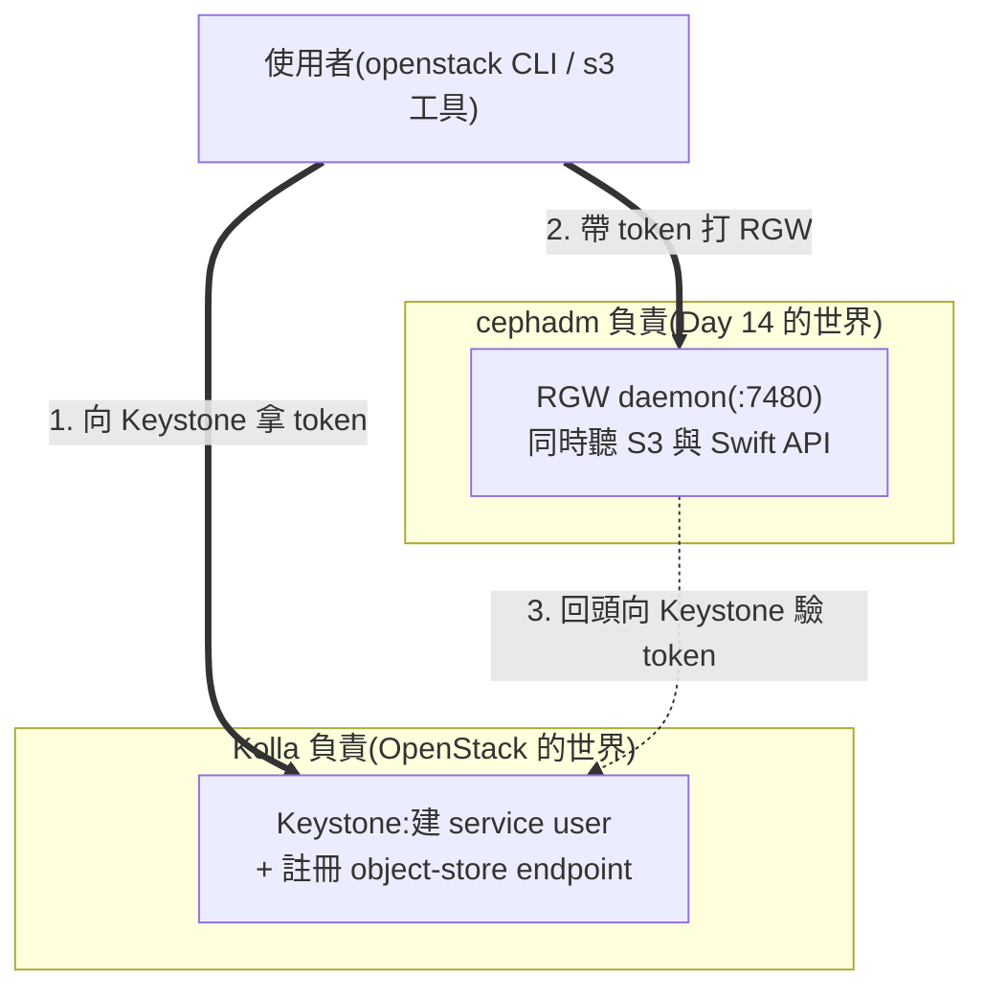
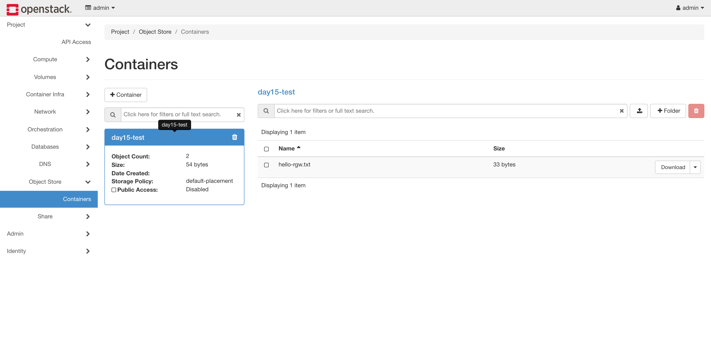

# Day 15: 物件儲存——用 RGW 提供 S3 與 Swift API

> 今天把 Day 14 的 Ceph 接上 OpenStack,開出**物件儲存**服務。做完之後,你的雲會多一個 `object-store` endpoint,S3 和 Swift 兩種 API 同時可用——而且你會親眼看到,為什麼業界用一個 RGW 就取代了整套 Swift。

{ align=right width="100" }

!!! abstract "你在課程的哪裡"
    - **Day 14**:Ceph 骨幹已立(mon/mgr/osd,HEALTH_OK)。
    - **今天**:在 Ceph 上開 **RGW**(RADOS Gateway),並讓 OpenStack 的使用者能用 Keystone 身分直接使用它。
    - **今天之後**:Day 16 用同一套 Ceph 開共享檔案系統;Day 18 的資料庫備份也會存到今天開的物件儲存裡。

## 第一次接觸物件儲存?先讀這段

前幾天的儲存都是「掛在機器上的磁碟」(區塊儲存);**物件儲存**是另一種正規化:沒有目錄樹、沒有掛載,只有「容器(bucket)裝物件(檔案)」,一切透過 HTTP API 存取——AWS 的 S3 就是這個模式的代名詞。適合放備份、映像檔、log、靜態網站這類「寫一次、讀多次、不需要檔案系統語意」的資料。

OpenStack 世界有兩種介面歷史:自家的 **Swift API** 與業界事實標準 **S3 API**。而 Ceph 的 **RGW** 一個守護行程同時實作兩種——這正是 Kolla 移除原生 Swift 支援的底氣([Day 12 講過這段歷史](sprint3-day12-sprint4-preview.md))。

## 原理與架構

今天的部署有個必須先想通的分工——**Kolla 的 `ceph-rgw` 角色不部署任何容器**(它的原始碼註解直接寫明這件事),RGW 守護行程由 cephadm 管:



所以今天是「兩邊各設定一半、在 Keystone 會合」:cephadm 端起 daemon 並告訴它去哪驗 token;Kolla 端把 endpoint 與 service user 註冊好。

## 步驟

### 步驟 1:cephadm 端起 RGW

```bash
sudo ./cephadm shell -- ceph orch apply rgw kolla --placement=1 --port=7480
```

**`--port=7480` 不能省**:RGW 預設綁 port 80,而這台主機的 80 已被 Horizon 佔用——不指定的話兩邊都會壞。約 30 秒後驗證 daemon 活著(S3 API 對匿名請求會回一份空的 bucket 清單 XML):

```bash
curl -s http://10.0.0.4:7480/
```

```text
<?xml version="1.0"...><ListAllMyBucketsResult ...><Buckets></Buckets></ListAllMyBucketsResult>
```

### 步驟 2:Kolla 端註冊(globals 每一行都有理由)

```bash
sudo tee -a /etc/kolla/globals.yml << 'EOF'
enable_ceph_rgw: "yes"
enable_ceph_rgw_loadbalancer: "no"
ceph_rgw_port: "7480"
ceph_rgw_internal_fqdn: "10.0.0.4"
ceph_rgw_external_fqdn: "10.0.0.4"
update_keystone_service_user_passwords: "no"
EOF
```

- `enable_ceph_rgw_loadbalancer: "no"`——我們的單機部署關掉了 haproxy,這行不設,**部署前檢查會直接失敗**。
- 兩個 `fqdn` 指向主機——haproxy 停用時,預設 endpoint 會指到一個沒人在聽的位址,必須明確覆寫。
- `update_keystone_service_user_passwords: "no"`——不設的話,之後每次 reconfigure 都會重設服務密碼、造成 token 失效(官方文件的明確警告)。

```bash
source ~/kolla-venv/bin/activate
kolla-ansible deploy -i ~/all-in-one --tags ceph-rgw
```

```text
PLAY RECAP: ok=11  changed=5  failed=0
```

這一步建立了 Keystone 的 `ceph_rgw` service user 與 `object-store` endpoint。

### 步驟 3:回到 Ceph 端,告訴 RGW 怎麼驗 Keystone token

密碼從 Kolla 的密碼庫拿(兩邊必須一致):

```bash
PW=$(sudo grep '^ceph_rgw_keystone_password:' /etc/kolla/passwords.yml | awk '{print $2}')
sudo ./cephadm shell -- bash -c "
ceph config set client.rgw rgw_keystone_url http://10.0.0.4:5000
ceph config set client.rgw rgw_keystone_api_version 3
ceph config set client.rgw rgw_keystone_admin_user ceph_rgw
ceph config set client.rgw rgw_keystone_admin_password $PW
ceph config set client.rgw rgw_keystone_admin_project service
ceph config set client.rgw rgw_keystone_admin_domain Default
ceph config set client.rgw rgw_keystone_accepted_roles member,Member,admin
ceph config set client.rgw rgw_keystone_implicit_tenants true
ceph config set client.rgw rgw_s3_auth_use_keystone true
ceph config set client.rgw rgw_enable_apis s3,swift,swift_auth,admin
ceph orch restart rgw.kolla
"
```

### 步驟 4:完整往返驗證

```bash
source /etc/kolla/admin-openrc.sh
openstack endpoint list --service object-store -f value -c Interface -c URL
openstack container create day15-test
echo "hello-rgw" > /tmp/obj.txt
openstack object create day15-test /tmp/obj.txt
openstack object save day15-test /tmp/obj.txt --file /tmp/back.txt && cat /tmp/back.txt
```

```text
internal http://10.0.0.4:7480/swift/v1
public   http://10.0.0.4:7480/swift/v1
day15-test
/tmp/obj.txt
hello-rgw
```

上傳再下載、內容一致——**Swift API 的完整認證與資料鏈全通**。Ceph 端同時可以看到 RGW 自動建出六個 `default.rgw.*` pool(`ceph osd pool ls`)。

同一顆 bucket 在主控台也看得到。Skyline 目前沒有物件儲存頁,但 Horizon 有(專案 → Object Store → Containers)——左邊是 container 的統計(物件數、總大小、storage policy),右邊列出裡面的物件,還能直接下載:



!!! tip "物件名別直接吃本機路徑"
    上面那行 `openstack object create day15-test /tmp/obj.txt` 會**拿本機路徑當物件名**,於是物件真的叫 `/tmp/obj.txt`——開頭那個斜線會讓 Horizon 把它當成資料夾層級,結果物件列表看起來是空的。想要乾淨的名字就明講:`openstack object create --name hello-rgw.txt day15-test /tmp/obj.txt`(圖上那個就是)。

### 步驟 5:用 S3 憑證打一次(認證版)

上面步驟 4 走的是 Swift API,步驟 0 只驗了 S3 的**匿名**空清單。但這章的賣點是「既有 S3 應用不改碼搬上來」——那條路要的是一組 S3 金鑰。怎麼拿?靠 Keystone 的 **EC2 credentials**:

```bash
# 1. 拿一組 S3 相容金鑰(access / secret)
source ~/demo-openrc.sh
openstack ec2 credentials create        # 輸出的 Access / Secret 就是 S3 金鑰

# 2. 裝 aws-cli、設金鑰與 region,再打 RGW 的 S3 端點(RGW 走 path-style 定址)
sudo apt-get install -y awscli
aws configure set aws_access_key_id <access>
aws configure set aws_secret_access_key <secret>
aws configure set default.region us-east-1     # RGW 不挑 region 值,給個預設即可,不設會被 aws-cli 擋下
aws --endpoint-url http://10.0.0.4:7480 s3 mb s3://day15-s3
echo hello-s3 > /tmp/s3.txt
aws --endpoint-url http://10.0.0.4:7480 s3 cp /tmp/s3.txt s3://day15-s3/
aws --endpoint-url http://10.0.0.4:7480 s3 ls s3://day15-s3/     # 列出剛上傳的物件
```

!!! note "這段是示範路徑,未附本課實測輸出"
    上面這串是「拿 S3 金鑰、用 aws-cli 打通」的標準做法,回答「使用者怎麼拿到 S3 金鑰」這個問題;但它**不在本課的逐項驗證裡**(所以沒附輸出),照做前自行驗證。要點:金鑰來自 `ec2 credentials`(綁在你的 project 上)、endpoint 直指 RGW 的 `:7480`、RGW 用 path-style 而非 virtual-host style 定址。這條路一旦通,你的既有 S3 SDK 只改 endpoint 就能搬上這朵雲。

## 驗收 checkpoint

逐項驗證,**全部符合判準才算完成今天**:

| 驗證 | 判準 | 本課環境的結果 |
|---|---|---|
| RGW daemon | `ceph orch ps` 顯示 rgw running、7480 有回應 | 符合 |
| endpoint | `object-store` internal+public 指向 `:7480/swift/v1` | 符合 |
| Swift 往返 | container 建立、object 上傳後下載內容一致 | `hello-rgw` 原樣取回 |
| S3 API | 匿名請求回 `ListAllMyBucketsResult` XML | 符合(雙 API 並存) |
| Ceph 端 | `default.rgw.*` pool 自動誕生 | 6 個 pool |

## 地雷記錄

### 地雷 1:RGW 預設 port 80,會與 Horizon 對撞 {#mine-1}

已在步驟 1 預拆(`--port=7480`)。這類「兩套系統同機、預設 port 相撞」是本 Sprint 的主旋律之一——Day 14 的監控套件、今天的 80,之後還會再見。

### 地雷 2:haproxy 停用時的兩個隱形前提 {#mine-2}

`enable_ceph_rgw_loadbalancer: "no"` 與 fqdn 覆寫缺一不可:前者不設 precheck 直接失敗,後者不設 endpoint 會指向空位址。這是「單機關掉 haproxy」在 Sprint 3 埋下的長尾效應——每個新服務接上來時都要重新想一次入口在哪。

### 地雷 3:自動化檢查撞到範本的註解行 {#mine-3}

**症狀**:用 `grep -q "enable_ceph_rgw"` 判斷 globals.yml 是否已設定,結果永遠判定「已存在」而跳過寫入。

**根因**:kolla 的 globals.yml 範本本來就含有**註解掉的** `#enable_ceph_rgw: "no"`,不錨定行首的 grep 會誤中。

**教訓**:對 globals.yml 做存在性檢查一律錨定行首(`grep -q "^enable_ceph_rgw"`)。寫自動化腳本的人一定會踩一次。

## 延伸閱讀

想往下深挖,從這幾份開始:

- **[Ceph Object Gateway 總覽](https://docs.ceph.com/en/tentacle/radosgw/)** —— RGW 的完整文件入口:S3/Swift API 相容性、multisite、進階設定。
- **[RGW 的 Keystone 整合](https://docs.ceph.com/en/tentacle/radosgw/keystone/)** —— 本章步驟 3 那一整批 `rgw_keystone_*` 設定的權威出處。
- **[Kolla-Ansible External Ceph 指南](https://docs.openstack.org/kolla-ansible/2025.1/reference/storage/external-ceph-guide.html)** —— Kolla 這側所有 ceph 整合(RGW/Glance/Cinder/Manila)的官方對照。
- **[cephadm 部署 RGW](https://docs.ceph.com/en/tentacle/cephadm/services/rgw/)** —— `ceph orch apply rgw` 的完整選項(placement、port、realm)。

## 下一步

物件儲存上線,三種儲存介面已有其二(區塊 Day 3、物件今天)。[Day 16](sprint4-day16-manila-cephfs.md) 補上第三種:**Manila 共享檔案系統**——多台 VM 同時掛同一顆碟,也是 K8s 世界 RWX volume 的底層答案。
