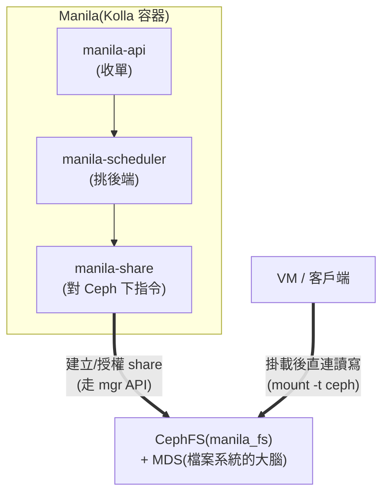
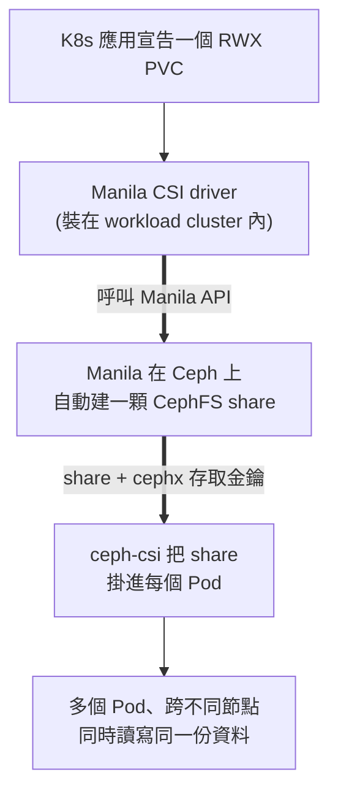
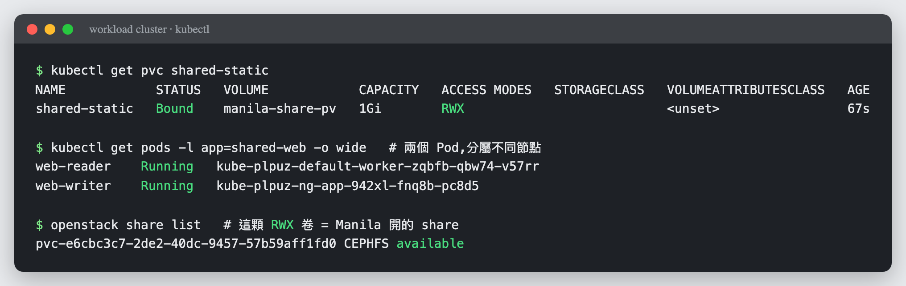
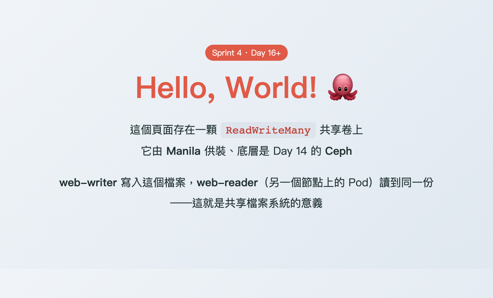
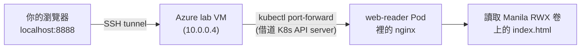
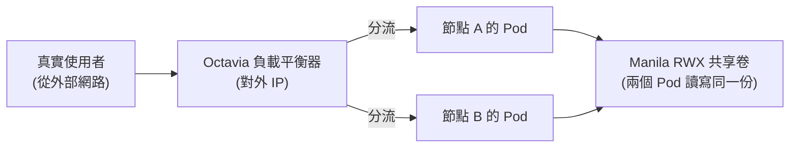

# Day 16: Manila——多台機器同掛一顆碟

> 儲存三部曲的最終章:**共享檔案系統**。Cinder 的磁碟一次只能掛給一台機器;今天部署的 Manila 讓多台 VM(以及未來 K8s 的多個 Pod)同時讀寫同一份資料。後端就用 Day 14 的 Ceph——一套骨幹,第三種介面。

{ align=right width="100" }

!!! abstract "你在課程的哪裡"
    - **儲存三部曲**:區塊(Day 3 Cinder)✅、物件(Day 15 RGW)✅、**檔案(今天)**。
    - **今天**:CephFS 當後端,部署 Manila,建立 share、授權、掛載、讀寫全流程。
    - **今天之後**:Day 8 的 K8s PVC 只能單 Pod 讀寫(RWO);有了 Manila,`ReadWriteMany` 的缺口就補上了——文末的 **Day 16+ 選讀**會把它真的接回 Day 8 的 cluster。

## 第一次接觸共享檔案系統?先讀這段

三種儲存的差異用「怎麼用」最好記:

| | 介面 | 同時使用者 | 代表場景 |
|---|---|---|---|
| 區塊(Cinder) | 掛成 `/dev/vdb`,自己分割格式化 | **一台機器** | 資料庫的資料碟 |
| 物件(RGW) | HTTP API,無掛載 | 無限 | 備份、映像檔、靜態資源 |
| **檔案(Manila)** | 掛成網路資料夾,現成檔案系統 | **多台機器同時讀寫** | 共用素材庫、多實例應用的共同目錄、K8s RWX |

AWS 對應是 **EFS**。Manila 是 OpenStack 的「檔案分享即服務」:它不搬資料,只負責**開單**——在後端(我們的 CephFS)建立分享、管理配額與存取權;資料流量由客戶端直連後端。

## 原理與架構

今天用的驅動是 **CephFS native**:VM 直接以 Ceph 客戶端身分掛載 CephFS。Manila 這邊三個服務容器 + Ceph 那邊一個新角色:



注意資料路徑:**manila-share 只管控制面**,VM 掛載後的讀寫直達 Ceph——跟 Day 3「control path 是 OpenStack 的、data path 是 Linux 的」同一個道理。

`MDS`(Metadata Server)是 CephFS 專屬的新角色:管目錄樹與檔名(資料本體仍存 OSD)。建立檔案系統時 cephadm 會自動部署它。

## 步驟

### 步驟 1:Ceph 端——建檔案系統與 Manila 專用身分

```bash
sudo ./cephadm shell -- ceph fs volume create manila_fs
sudo ./cephadm shell -- ceph fs set manila_fs standby_count_wanted 0   # 單機沒有備援 MDS,關掉這項健康檢查
sudo ./cephadm shell -- ceph auth get-or-create client.manila mon 'allow r' mgr 'allow rw'
```

約 20 秒後 `ceph fs status manila_fs` 應顯示 MDS `active`。

權限那行值得一看:`client.manila` 只需要 `mon 讀 + mgr 讀寫`——Manila 是透過 **mgr 的管理 API** 操作 CephFS 的,不直接碰資料,所以不需要 osd/mds 權限。最小權限原則的好示範。

### 步驟 2:Kolla 端——兩個設定檔(這裡埋著兩顆文件級的雷)

```bash
sudo mkdir -p /etc/kolla/config/manila
# ceph.conf:用官方指令產生「最小版」,再把行首空白拿掉
sudo ./cephadm shell -- ceph config generate-minimal-conf | sed 's/^[[:space:]]*//' \
  | sudo tee /etc/kolla/config/manila/ceph.conf
# keyring:同樣去掉行首空白
sudo ./cephadm shell -- ceph auth get client.manila | sed 's/^[[:space:]]*//' \
  | sudo tee /etc/kolla/config/manila/ceph.client.manila.keyring
```

兩個 `sed` 不是潔癖:`generate-minimal-conf` 的輸出帶**行首縮排**,而 Kolla 的設定合併器讀到縮排的 ini 會直接解析失敗——這是官方文件有提但極易忽略的一行警告。另外,keyring 的**路徑**要照上面放在 `manila/` 正下方:官方文件某處寫了 `manila-share/` 子目錄,那是文件錯誤,Kolla 程式碼實際只從 `manila/` 讀。

### 步驟 3:globals 與部署

```bash
sudo tee -a /etc/kolla/globals.yml << 'EOF'
enable_manila: "yes"
enable_manila_backend_cephfs_native: "yes"
manila_cephfs_filesystem_name: "manila_fs"
EOF
source ~/kolla-venv/bin/activate
kolla-ansible deploy -i ~/all-in-one --tags manila
```

```text
PLAY RECAP: ok=29  changed=20  failed=0
```

### 步驟 4:CLI 外掛與 share type

```bash
pip install python-manilaclient        # 沒裝的話 openstack 沒有 share 子命令(見地雷 1)
source /etc/kolla/admin-openrc.sh
openstack share type create default_share_type False
```

那個 `False` 是 **DHSS**(driver 是否自管服務網路)——CephFS native 驅動不需要,**必須是 False**;照別的教學抄 `True` 會在建立 share 時卡死。

### 步驟 5:建 share、授權、真的掛起來

```bash
openstack share create CEPHFS 1 --name day16-share --share-type default_share_type
openstack share show day16-share -f value -c status          # available(秒級)
openstack share export location list day16-share -f value -c Path
```

```text
10.0.0.4:6789:/volumes/_nogroup/bf9a.../a1d5...
```

授權一個 cephx 身分並取出金鑰,然後在任何能連到 Ceph 的機器上掛載(這裡用主機示範;VM 內做法完全相同,只需裝 `ceph-common`):

```bash
openstack share access create day16-share cephx day16user
KEY=$(openstack share access list day16-share -f value -c 'Access Key')
sudo mkdir -p /mnt/day16
sudo mount -t ceph 10.0.0.4:6789:/volumes/_nogroup/<你的路徑> /mnt/day16 -o name=day16user,secret=$KEY
echo "manila-e2e" | sudo tee /mnt/day16/proof.txt
sudo cat /mnt/day16/proof.txt && df -h /mnt/day16 | tail -1
```

```text
manila-e2e
10.0.0.4:6789:/volumes/...  1.0G  0  1.0G  0% /mnt/day16
```

寫得進、讀得回、配額 1G 正確呈現——三部曲的最後一塊拼圖到位。

## 驗收 checkpoint

逐項驗證,**全部符合判準才算完成今天**:

| 驗證 | 判準 | 本課環境的結果 |
|---|---|---|
| Ceph 端 | `manila_fs` 存在、MDS active | 約 20 秒就緒 |
| Manila 服務 | `openstack share service list` 三服務 enabled+up | data/scheduler/share 全 up |
| share | 建立後 `available` | 秒級 |
| export location | 取得 CephFS 路徑 | `10.0.0.4:6789:/volumes/…` |
| **端到端** | cephx 授權 → 掛載 → 寫入讀回一致、df 顯示配額 | 符合 |

## 地雷記錄

### 地雷 1:`openstack` 沒有 `share` 子命令 {#mine-1}

**同型雷第三次出現**(Day 5 的 heat/barbican、以及 designate 都一樣):OpenStack CLI 的各服務指令來自各自的外掛套件。通則直接背起來:**新服務部署完 CLI 沒指令,第一反應是 `pip install python-<服務>client`**。

### 地雷 2:keyring 路徑與 ceph.conf 縮排——兩顆文件級的雷 {#mine-2}

已在步驟 2 預拆。這兩顆雷值得記住的是出處:keyring 路徑是**官方文件寫錯**(以 Kolla 原始碼為準);縮排則是**官方工具的輸出跟官方部署工具互不相容**。「文件與程式碼衝突時,程式碼才是真相」——本課程方法論的又一實例。

### 地雷 3:CephFS 的 pool 誕生後 PG 總數超標 {#mine-3}

**症狀**:`manila_fs` 建立後 `ceph health` 出現 `too many PGs per OSD (369 > max 250)`。

**根因**:每個 pool 都帶著預設的 PG 數出生,單 OSD 的上限很快被多個 pool 疊爆——又是單機才會撞到的邊界。

**解法**:lab 直接放寬上限 `ceph config set mon mon_max_pg_per_osd 512`。生產環境的正解是讓 autoscaler 依容量比例縮放,多 OSD 下不會發生。

## Day 16+ 延伸(選讀):把 Manila 接回 Day 8 的 K8s cluster

!!! tip "這是選讀的進階整合"
    上面的核心課程到 host 掛載就完成了。這一節示範 Manila 最有價值的應用場景——**填補 Kubernetes 的儲存缺口**。內容較深(要動到兩個 CSI 驅動),但成果很值得:你會看到一個 K8s 應用要求共享儲存,而 OpenStack 自動在 Ceph 上開一顆 share 滿足它。

### 為什麼這個整合重要

回想 [Day 8](sprint3-day8-e2e-workload-cluster.md):我們讓 K8s 的 PVC 由 Cinder 供裝——但 Cinder 是**區塊**儲存,一顆 volume 一次只能掛給一個 Pod(`ReadWriteOnce`,RWO)。可是很多場景需要**多個 Pod 同時讀寫同一份資料**(`ReadWriteMany`,RWX):共用的上傳目錄、多副本網站的靜態資源、共享的模型檔案。**RWX 正是 Cinder 給不了、而 Manila 天生就能提供的**——這一節就把這塊拼上,讓 Sprint 3 的儲存故事真正完整。

### 運作原理



安裝需要兩個 CSI 驅動搭配:**csi-driver-manila**(負責跟 Manila 要 share)委派給 **ceph-csi**(負責實際掛載 CephFS)。兩者用 helm 裝進 Day 8 的 workload cluster。

### 驗證:兩個 nginx Pod 共用一顆 RWX 卷

建一個 `ReadWriteMany` 的 PVC(用 Manila 的 StorageClass),然後讓兩個 nginx Pod 掛同一顆——關鍵是**確認它們被排到不同節點**,這樣「跨節點共享」才有說服力:

```text
$ kubectl get pvc shared-static
NAME            STATUS   VOLUME            CAPACITY   ACCESS MODES   ...
shared-static   Bound    manila-share-pv   1Gi        RWX            ...

$ kubectl get pods -l app=shared-web -o wide
web-reader   Running   kube-plpuz-default-worker-...    ← 節點 A
web-writer   Running   kube-plpuz-ng-app-...            ← 節點 B(不同節點!)

$ openstack share list          # 這顆 RWX 卷,就是 Manila 開的一顆 share
pvc-e6cbc3c7-...  CEPHFS  available
```



最後一行是整個整合的證據:**K8s 開一個 PVC,OpenStack 這側就多了一顆同名的 share**——這朵雲的儲存服務,自動滿足了它上面 K8s 應用的需求。

### 收尾:讓它真的 serve 一個網頁

叫 `web-writer` 寫一個 hello world HTML 到共享卷,再從**另一個節點上**的 `web-reader` 讀——它的 nginx 吐出的,正是 writer 剛寫的那一份:

```bash
kubectl exec web-writer  -- sh -c 'echo "<h1>Hello, World!</h1>..." > /usr/share/nginx/html/index.html'
kubectl exec web-reader  -- wget -qO- http://localhost/     # 讀到同一份頁面
```



*這個頁面由 `web-writer` 寫入、`web-reader`(不同節點的 Pod)serve 出來,底層是 Manila 供裝、Ceph 承載的共享卷。Sprint 3 的 Cinder RWO 加上今天的 Manila RWX,K8s 的兩種儲存需求現在都由你自己的雲滿足了。*

!!! note "實作時的地雷(如果你要自己做)"
    這個整合有兩個 CSI 之間的磨合點,踩過才知道:
    - **provisioner 名稱有 protocol 前綴**:csi-driver-manila 的 CephFS driver 實際註冊成 `cephfs.manila.csi.openstack.org`(不是 `manila.csi.openstack.org`),StorageClass 的 `provisioner` 要寫對才綁得到 PVC。
    - **node-stage secret 要放 OpenStack 認證**(不是 ceph key):node 掛載時 Manila CSI 要用 OS 憑證去跟 Manila 查 share 的存取規則。
    - **靜態掛載缺 `fsName` 會失敗**:ceph-csi 掛 CephFS 必須知道檔案系統名(我們的是 `manila_fs`),少了它報 `missing required field fsName`。

### 從你的瀏覽器看到這個網頁:兩種路徑

網頁在 cluster 裡跑起來了,但你的電腦要怎麼連到它?這個問題本身就是一堂網路課——因為 Pod 活在 cluster 內部網路(`10.100.x.x`),外界碰不到。有兩條路,一條給 lab、一條給正式環境:

#### 路徑一:`kubectl port-forward`(lab 臨時用,本課採用)

`kubectl port-forward` 借用 K8s API server 當跳板,打一條「臨時隧道」直通某個 Pod——不需要負載平衡器、不需要對外 IP,一行指令就通。因為我們的 lab 從你的電腦到 cluster 隔著兩層(Azure lab VM、cluster 內網),所以要串接兩段隧道:



```bash
# 在 lab VM 上:把 pod 的 80 埠轉發到 VM 的 8888
kubectl port-forward --address 0.0.0.0 pod/web-reader 8888:80 &
# 在你的電腦上:把 VM 的 8888 接到本機 8888
ssh -L 8888:127.0.0.1:8888 azureuser@<VM公網IP>
# 瀏覽器開 http://localhost:8888 —— 就看到那個 hello world 頁
```

這條路的特點是**臨時、點對點、只給操作者自己看**——適合除錯或 demo,不是給真實使用者用的入口。

#### 路徑二:`Service type=LoadBalancer`(正式環境的做法)

正式環境會用你在 [Day 8](sprint3-day8-e2e-workload-cluster.md) 學過的方式:把 Service 宣告成 `type=LoadBalancer`,K8s 的 CCM 就會自動叫 **Octavia** 開一台負載平衡器、掛上對外 IP,把流量分流到每個節點上的 Pod:



這才是「一個公開網站」該有的樣子:有穩定的對外 IP、有負載平衡、多個 Pod 分攤流量——而它們共用的正是今天這顆 RWX 卷。

!!! warning "在本 lab 開 LoadBalancer 會撞到 Day 8 的老朋友"
    如果你在這座 cluster 試 `type=LoadBalancer`,CCM 建 LB 時會失敗:`Provider 'amphorav2' is not enabled`。這正是 [Day 8 的地雷 #3](sprint3-day8-e2e-workload-cluster.md#mine-3)——CCM 預設要 `amphorav2`,而我們的 Octavia 只啟用了 `amphora`。所以本課的 demo 走 `port-forward`(路徑一);要走 LoadBalancer,得依 Day 8 的解法給 cluster 帶上 `octavia_provider=amphora` 標籤。**同一顆雷在不同章節重逢,正好說明它是這套 lab 架構的固有特性,不是偶發。**

## 延伸閱讀

想往下深挖,從這幾份開始:

- **[Manila CephFS driver 官方文件](https://docs.openstack.org/manila/2025.1/configuration/shared-file-systems/drivers/cephfs_driver.html)** —— native 與 NFS 兩種模式的差異、`client.manila` 權限的出處。
- **[Kolla-Ansible 的 Manila 指南](https://docs.openstack.org/kolla-ansible/2025.1/reference/storage/manila-guide.html)** —— Kolla 側部署選項的官方對照(注意本章地雷 2 提到的文件勘誤)。
- **[CephFS 官方文件](https://docs.ceph.com/en/tentacle/cephfs/)** —— MDS、subvolume、配額這些概念的權威定義。
- **[Manila CSI plugin](https://github.com/kubernetes/cloud-provider-openstack/tree/master/docs/manila-csi-plugin)** —— Day 16+ 那套 K8s 整合的官方文件與部署選項。

## 下一步

儲存三部曲完成——你的雲現在同時提供區塊、物件、檔案三種儲存,全部長在同一套 Ceph 上。[Day 17](sprint4-day17-designate-dns.md) 換個領域:給雲加上 **DNS 服務**,讓每台 VM 自動擁有自己的域名。
