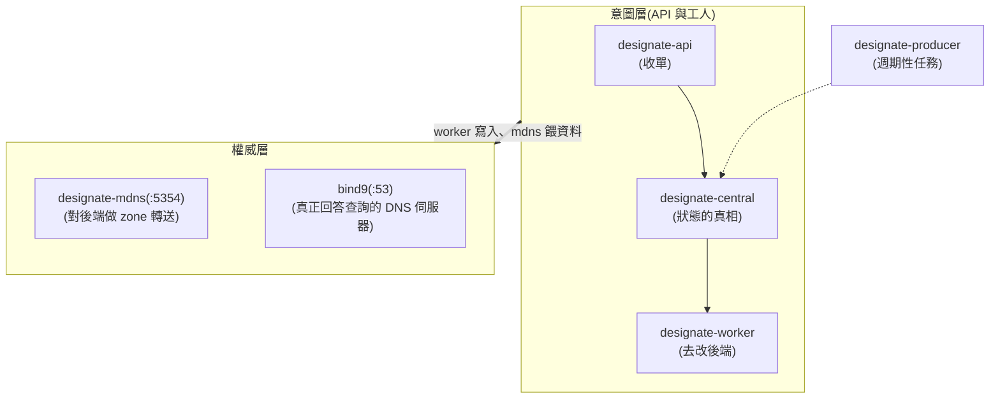

# Day 17: Designate——讓 VM 自動擁有域名

> 到目前為止,你都是用 IP 存取雲裡的資源。今天部署 **Designate**(DNS 即服務),並打通它與 Neutron 的整合——掛上 floating IP 的瞬間,DNS 記錄自動誕生;刪掉的瞬間,自動消失。本章還有一個「看起來像故障、其實是設計」的行為,幾乎每個學員都會在那裡卡住,我們正面教它。

{ align=right width="100" }

!!! abstract "你在課程的哪裡"
    - **今天**:部署 Designate(bind9 後端)+ Neutron DNS 整合,驗證「開 VM 掛 FIP → 域名自動出現 → dig 解析成功」全鏈。
    - **今天之後**:Day 18 用一鍵資料庫收尾階段一;你今天建的網路會直接沿用。

## 第一次接觸 DNSaaS?先讀這段

**Designate 是 OpenStack 的 Route 53**:多租戶的 DNS 管理服務。兩個核心名詞:

- **zone**:一個網域的管轄區,例如 `oslab.test.`(注意結尾的點——DNS 世界的完整域名都以點結尾)
- **recordset**:zone 裡的一筆記錄,例如「`vm-dns.oslab.test.` 的 A 記錄指向 172.24.4.152」

它真正的殺手級能力是**與 Neutron 的整合**:網路掛上 `dns_domain` 之後,資源的生命週期會自動同步到 DNS——不需要任何人手動加記錄。

## 原理與架構

Designate 是本課程目前容器最多的服務(六個),分工是一條「意圖 → 權威資料 → 對外服務」的流水線:



Neutron 那側的整合,Kolla **全自動接好**:開了 `enable_designate` 之後,neutron.conf 的 `external_dns_driver`、ML2 的 extension、通知 Designate 的認證段落,全部由模板代勞——你只需要供應兩個值(見步驟 1)。

## 步驟

### 步驟 1:globals(一個點決定成敗)

```bash
sudo tee -a /etc/kolla/globals.yml << 'EOF'
enable_designate: "yes"
designate_ns_record:
  - "ns1.oslab.test"
neutron_dns_domain: "oslab.test."
EOF
```

兩個細節都是翻車熱點:`designate_ns_record` 是 **list**(舊版教學常寫成字串);`neutron_dns_domain` **必須以 `.` 結尾**、且不能是預設的 `openstacklocal`——忘了那個點,部署會過、整合會靜靜地壞。

### 步驟 2:port 53 檢查與部署

bind9 要綁主機的 53。Ubuntu 的 systemd-resolved 只聽 `127.0.0.53`,不衝突,但部署前確認是好習慣:

```bash
sudo ss -tlnp | grep ":53 "     # 應該只看到 127.0.0.53/127.0.0.54
```

部署要**三個 tag 一起**——designate 本體加上 neutron/nova 的整合設定:

```bash
source ~/kolla-venv/bin/activate
kolla-ansible deploy -i ~/all-in-one --tags designate,neutron,nova
```

```text
PLAY RECAP: ok=129  changed=47  failed=0
```

### 步驟 3:建 zone

```bash
pip install python-designateclient     # 同型雷第四次:CLI 外掛
source /etc/kolla/admin-openrc.sh
openstack zone create --email admin@oslab.test oslab.test.
openstack zone show oslab.test. -f value -c status    # PENDING → 約 10 秒 → ACTIVE
```

### 步驟 4:見證自動化(以及那個「像故障的設計」)

建一個掛上 `dns_domain` 的網路、開一台 VM:

```bash
openstack network create day17-net --dns-domain oslab.test.
openstack subnet create day17-sub --network day17-net --subnet-range 10.17.0.0/24 --dns-nameserver 8.8.8.8
openstack router create day17-r
openstack router set day17-r --external-gateway ext-net
openstack router add subnet day17-r day17-sub
openstack server create vm-dns --flavor m1.tiny --image cirros --network day17-net --wait
openstack recordset list oslab.test.
```

**這時你會發現:沒有 A 記錄。** 這不是故障——見[地雷 1](#mine-1)。私有網路的 port 預設**不會**發布到外部 DNS(私有 IP 不該外洩)。會自動發布的是 **floating IP**:

```bash
openstack floating ip create ext-net --dns-name vm-dns --dns-domain oslab.test. -f value -c floating_ip_address
openstack server add floating ip vm-dns <上一步的FIP>
sleep 10
openstack recordset list oslab.test. -f value -c name -c type -c records | grep -v "SOA\|NS"
```

```text
vm-dns.oslab.test. A 172.24.4.152
```

### 步驟 5:真的解析看看

對 bind9(權威伺服器)與 mdns 各問一次:

```bash
dig +short @10.0.0.4 vm-dns.oslab.test. A
dig +short -p 5354 @10.0.0.4 vm-dns.oslab.test. A
```

兩者都應回 FIP 位址。最後做生命週期驗證:把 FIP 刪掉,記錄應**自動消失**——

```bash
openstack server remove floating ip vm-dns <FIP> && openstack floating ip delete <FIP>
openstack recordset list oslab.test. -f value | grep vm-dns || echo "記錄已自動清除"
```

## 驗收 checkpoint

逐項驗證,**全部符合判準才算完成今天**:

| 驗證 | 判準 | 本課環境的結果 |
|---|---|---|
| 六容器 | api/central/mdns/producer/worker/backend_bind9 全 healthy | 符合 |
| zone | `oslab.test.` ACTIVE | PENDING→ACTIVE 約 10 秒 |
| **自動發布** | FIP 掛上後 A 記錄自動誕生 | `vm-dns.oslab.test. A 172.24.4.152` |
| 解析 | bind9(:53)與 mdns(:5354)都答對 | 符合 |
| 生命週期 | FIP 刪除後記錄自動消失 | 符合 |

## 地雷記錄

### 地雷 1:私有網路的 VM 沒有 DNS 記錄——是設計,不是故障 {#mine-1}

**症狀**:網路明明掛了 `dns_domain`,VM 開起來了,`recordset list` 卻空空如也。

**根因**:Neutron 刻意**不把 tenant(overlay)網路的 port 發布到外部 DNS**——那些是私有 IP,發布出去等於洩漏內部拓樸。會自動發布的是:**floating IP**、以及 provider 網路上的 port。

**教訓**:這是每個學員必卡的點,而卡住的原因是「安全預設」。驗證 DNS 整合,請用 FIP。

### 地雷 2:`neutron_dns_domain` 的結尾點 {#mine-2}

已在步驟 1 預拆。忘了結尾的 `.`,一切照常部署、只有整合默默不動作——屬於「錯了不會叫」的最陰險類型。

### 地雷 3:subnet 沒設 DNS nameserver 的長尾 {#mine-3}

本日步驟已在建 subnet 時就給了 `--dns-nameserver 8.8.8.8`。這不是為了 Designate——是為了**網路裡未來的住戶**:少了它,VM 對外解析全部失敗,而症狀往往在幾天後才爆(Day 18 的資料庫實例就差點死在這裡)。把「建 subnet 必給 DNS」當肌肉記憶。

## 延伸閱讀

想往下深挖,從這幾份開始:

- **[Kolla-Ansible 的 Designate 指南](https://docs.openstack.org/kolla-ansible/2025.1/reference/networking/designate-guide.html)** —— 本章設定的官方對照,包含 sink 等本章沒開的進階選項。
- **[Neutron 的 DNS 整合說明](https://docs.openstack.org/neutron/2025.1/admin/config-dns-int.html)** —— 「哪些 port 會發布到外部 DNS」的權威答案;本章地雷 1(私網不發布)的官方出處。
- **[Designate 官方文件](https://docs.openstack.org/designate/2025.1/)** —— zone/recordset/pool 的完整概念與 API。

## 下一步

你的雲現在會自己管理域名了。階段一只剩最後一塊積木:[Day 18](sprint4-day18-trove-dbaas.md) 的 **Trove**——資料庫即服務,今天建的 `day17-net` 直接當它的家。
