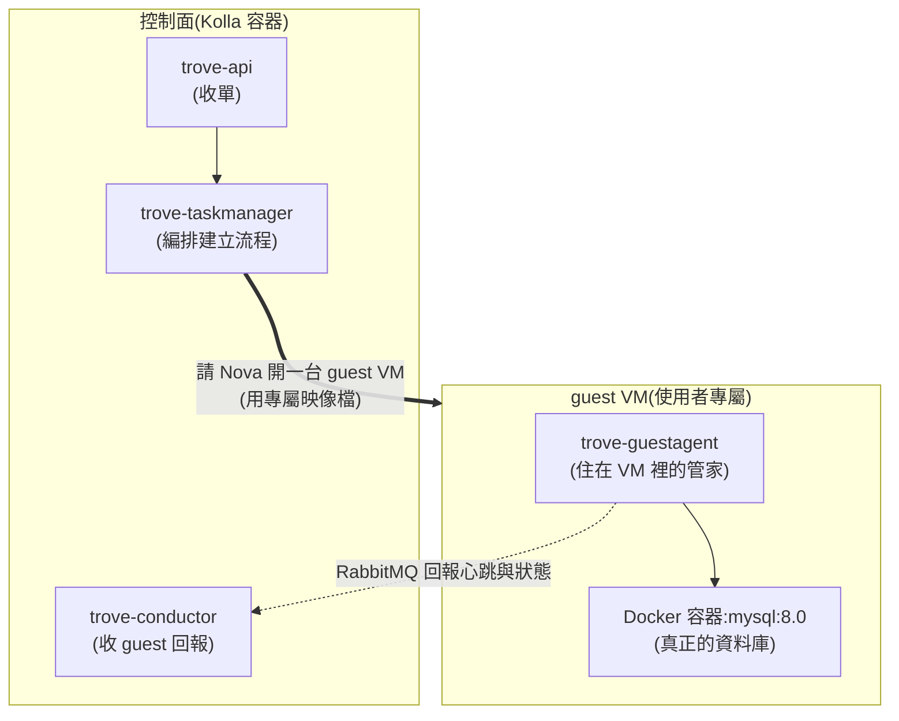
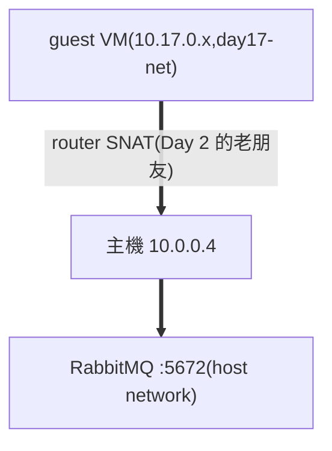

# Day 18:Trove —— 一行指令開出一台代管 MySQL

> 階段一的收官戰:**資料庫即服務**。今天結束時,你的雲能像 AWS RDS 一樣——使用者下一行指令,幾分鐘後拿到一台會自己照顧自己的 MySQL。本章有一顆幾乎人人會撞的雷,而且症狀非常具有誤導性——判讀方法會完整教給你。

{ align=right width="100" }

!!! abstract "你在課程的哪裡"
    - **今天**:部署 Trove、準備 guest 映像檔、註冊 datastore、開出第一台代管 MySQL 並實際讀寫。
    - **今天之後**:階段一(服務擴充)完成;Day 19 起換腦袋——不再加新服務,改為拆解既有服務的內部。

## 第一次接觸 DBaaS?先讀這段

「在 VM 裡自己裝 MySQL」和「用 RDS」的差別,用過的人都懂:前者要自己管安裝、設定、備份、升版;後者下一張單,這些全是雲的事。**Trove 就是 OpenStack 的 RDS**。

它的現代架構值得先認識,因為這決定了今天的雷區分布:



兩個要點:

1. **資料庫跑在 guest VM 內的 Docker 容器裡**——guest 映像檔只含作業系統 + 管家(guest-agent)+ Docker;MySQL 版本由容器映像檔決定。這個設計讓「映像檔斷代」的古老風險大幅降低(這正是我們預先查證後把風險降級的原因:官方 guest 映像檔每天自動建置,資料庫容器另行每日更新)。
2. **guest-agent 要連得回控制面的 RabbitMQ**——這是 Trove 部署最經典的卡點。好消息:在我們的網路架構下,它**自然就通**(原理見下)。

## 原理與架構:guest 怎麼連回家

官方文件教你為 Trove 建一條專用管理網路。但回想 [Day 8](sprint3-day8-e2e-workload-cluster.md):K8s 節點(tenant 網的 VM)一直都連得到 `10.0.0.4` 的 Keystone 與 RabbitMQ——路徑是 **tenant 網 → router SNAT → 主機**。Trove 的 guest 走同一條路即可,**一個管理網路都不用建**:



這就是本課程「極簡路徑優先」的原則:先走已驗證的路,不夠再加料。生產環境基於隔離與安全,仍應建立專用管理網——但理解了上面這條路,再讀官方的管理網設計就只是加一層而已。

## 步驟

### 步驟 1:部署 Trove(就一行 flag)

```bash
echo 'enable_trove: "yes"' | sudo tee -a /etc/kolla/globals.yml
source ~/kolla-venv/bin/activate
kolla-ansible deploy -i ~/all-in-one --tags trove
```

```text
PLAY RECAP: ok=24  changed=17  failed=0
```

三個容器(api/taskmanager/conductor)healthy 即可續行。

### 步驟 2:準備 guest 映像檔

官方每天自動建置 guest 映像檔(1.4 GB),下載、上傳 Glance、打上 Trove 用來找映像檔的 tag:

```bash
curl -L -o ~/trove-guest-noble.qcow2 \
  https://tarballs.opendev.org/openstack/trove/images/trove-master-guest-ubuntu-noble.qcow2
source /etc/kolla/admin-openrc.sh
openstack image create trove-guest-ubuntu-noble \
  --file ~/trove-guest-noble.qcow2 --disk-format qcow2 --container-format bare \
  --tag trove --tag mysql
```

### 步驟 3:註冊 datastore

告訴 Trove:「有一種叫 mysql 8.0 的資料庫,guest 映像檔用 tag 找,容器用 8.0 這個版本標籤拉」:

```bash
pip install python-troveclient        # CLI 外掛,同型雷第 N 次
openstack datastore version create 8.0 mysql mysql "" \
  --image-tags trove,mysql --active --default --version-number 8.0
openstack datastore version list mysql
```

### 步驟 4:建立資料庫實例

網路沿用 Day 17 建立的 `day17-net`。**動手前先確認 subnet 設有 DNS nameserver**——guest 開機時要從網路拉取資料庫容器,沒有 DNS 必定失敗(完整的症狀判讀見[地雷 1](#mine-1)):

```bash
openstack subnet show day17-sub -f value -c dns_nameservers   # 必須非空,例如 ['8.8.8.8']
```

```bash
NET=$(openstack network show day17-net -f value -c id)
openstack database instance create day18-db \
  --flavor m1.medium --size 2 --nic net-id=$NET \
  --datastore mysql --datastore-version 8.0 \
  --databases demo --users demo:<你的密碼>
watch openstack database instance show day18-db -c status -c operating_status
```

背後發生的事:Nova 開 guest VM(掛一顆 2G 的 Cinder volume 當資料碟)→ guest-agent 開機自啟、連回 RabbitMQ → 從網路拉 `mysql:8.0` 容器 → 啟動並初始化你指定的資料庫與使用者。本課環境全程約 **2.5 分鐘**,終態:

```text
status: ACTIVE
operating_status: HEALTHY
```

### 步驟 5:驗證它是一台真的資料庫

讀路徑(這些查詢會經 API → RabbitMQ → guest-agent → MySQL 全鏈):

```bash
openstack database db list day18-db        # demo
openstack database user list day18-db      # demo
```

寫路徑(叫管家真的動手):

```bash
openstack database user create day18-db u2 <密碼>
openstack database db create day18-db demo2
openstack database db list day18-db        # demo、demo2 都在
```

寫得進去 = guest 裡的 MySQL 真實運作中。

## 驗收 checkpoint

逐項驗證,**全部符合判準才算完成今天**:

| 驗證 | 判準 | 本課環境的結果 |
|---|---|---|
| 控制面 | api / taskmanager / conductor healthy | 符合 |
| 映像檔 | 官方每日版上傳 + tag,datastore 註冊 default | mysql 8.0 |
| **實例** | `ACTIVE` + `HEALTHY` | BUILD→HEALTHY 約 2.5 分 |
| 讀路徑 | db list / user list 走全鏈成功 | 符合 |
| 寫路徑 | 新建 user 與 db 生效 | u2 / demo2 到位 |
| 備份 | 見地雷 4(本課程留為開放項) | △ |

## 地雷記錄

### 地雷 1:subnet 沒 DNS——「有心跳但起不來」的元兇 {#mine-1}

**症狀**:第一次建立在約兩分鐘後轉 `ERROR`,fault 訊息 `Service not active, status: failed to spawn`。

**判讀關鍵**:「failed to spawn」是 guest-agent **自己回報的**——agent 能回報 = RabbitMQ 路是通的,死因在 guest 內部。

**根因**:當時 subnet 沒設 DNS nameserver。agent 連 RabbitMQ 用 IP(不需要 DNS)所以活著;但 guest 內 `docker pull mysql` 要解析網域名——沒有 DNS,拉不到容器,spawn 失敗。

**解法**:`openstack subnet set day17-sub --dns-nameserver 8.8.8.8`,重建實例,一次過。

**金句**:**「agent 有心跳但 spawn 失敗 → 先查 subnet 有沒有 DNS。」** 兩個症狀的組合直接指向根因,不用進 guest 就能判案。

### 地雷 2:失敗清理會滅證 {#mine-2}

Trove 對建立失敗的實例會自動刪除 guest VM——**連 console log 一起帶走**。發現 ERROR 時,`openstack console log show` 要趁早;晚了就只剩 taskmanager 的 log 可查(`/var/log/kolla/trove/`)。

### 地雷 3:backup 指令的新版語法 {#mine-3}

新版 troveclient 的備份指令是 `openstack database backup create --instance <實例> <備份名>`——舊教學裡「實例當第一個位置參數」的寫法會直接吐 usage。

### 地雷 4:備份的最後一哩(開放項){#mine-4}

備份功能會把資料上傳到 object-store(正是 Day 15 的 RGW,依賴鏈設計如此)。實測:備份任務成功派送(`storage_driver: swift` 正確),但 guest 內拉取**備份工具容器**時卡住——修法已知:在 `/etc/kolla/config/trove/trove-guestagent.conf` 覆寫備份容器來源後重部。本章先如實記錄現象與修法方向;完整步驟驗證後會補進本頁。

## 階段一完成 🎉

六天、六塊積木:Skyline、Ceph、RGW、Manila、Designate、Trove——首頁那張「還沒拼上的積木」表,一半已經拼上了。更重要的是方法論的複利:**同型雷第 N 次出現時,你已經能在錯誤出現之前說出答案**(CLI 外掛、行首錨定、subnet DNS)。

## 延伸閱讀

想往下深挖,從這幾份開始:

- **[Trove 生產環境部署指南](https://docs.openstack.org/trove/2025.1/admin/run_trove_in_production.html)** —— 官方的管理網設計;本章「極簡路徑」的正式版對照組。
- **[Trove guest image 建置指南](https://docs.openstack.org/trove/2025.1/admin/building_guest_images.html)** —— 自建映像檔(本章 Plan B)的官方流程與 `trovestack` 用法。
- **[官方 guest image 出貨處](https://tarballs.opendev.org/openstack/trove/images/)** —— 每日自動建置的映像檔就放在這;本章步驟 2 下載的來源。
- **[Trove User Guide](https://docs.openstack.org/trove/2025.1/user/)** —— 實例、備份、設定群組的使用者操作大全。

## 下一步

[Day 19](sprint3-day12-sprint4-preview.md) 起進入階段二:不再加新東西,改為**拆開你已經用了三個星期的東西**——一個 API 請求從 token 到 qemu 的完整生命週期。(內容隨 Sprint 4 進度陸續上線)
