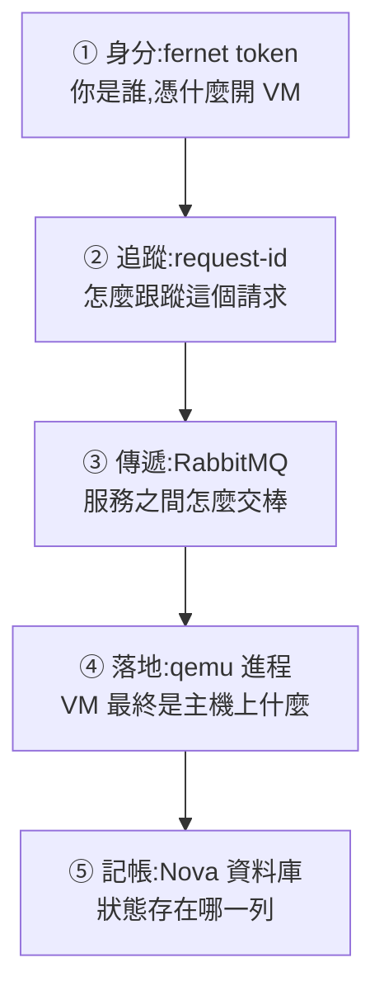
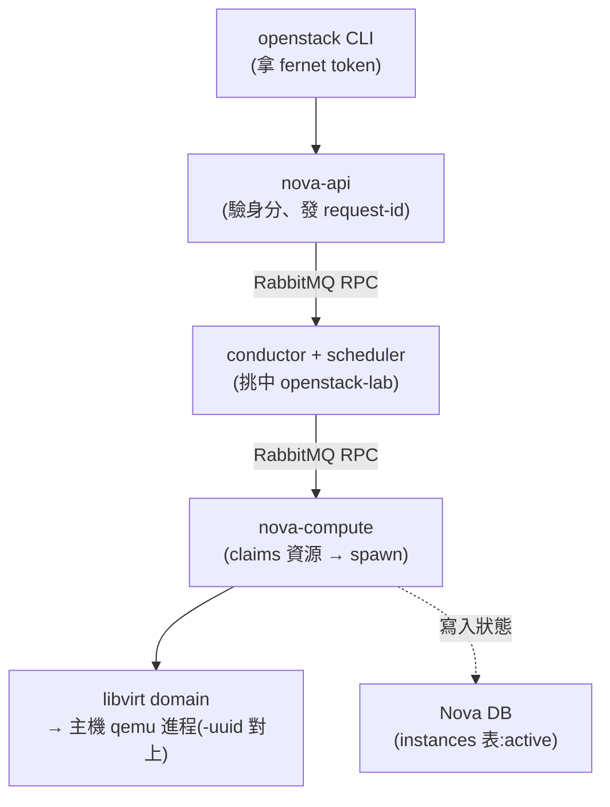

# Day 19:server create 背後,OpenStack 做了什麼

> 階段二開始,換一種學法:不再加新服務,改為**拆開你已經用了三個星期的東西**。今天的目標很單純也很硬——挑一個 `openstack server create`,不靠任何抽象層,徒手把它從一張 token 一路追到主機上的 qemu 進程。做完之後,「開一台 VM」在你眼裡不再是一行指令,而是一條看得見每一段的鏈。

!!! abstract "你在課程的哪裡"
    - **Day 0–18**:一直站在 `openstack` CLI 這一側「使用」這朵雲。
    - **今天**:潛到 CLI 底下,看一個請求在 Keystone、Nova、RabbitMQ、libvirt、資料庫之間怎麼流動。**不部署任何東西**,驗收標準是「你能不能把整條鏈重建出來」。
    - **今天之後**:Day 20 用同樣的精神拆網路(追一個封包)。

## 為什麼要做這件事

前 18 天你累積了大量「用過的東西」——現在它們全都是解剖的對象。理解底層有個很實際的回報:**當某天出事、而 CLI 只回你一句沒頭沒尾的錯誤時,能自己往下挖的人和只能重開機的人,差距就在這裡。** 這也是本課程一路強調的:知道它為什麼會動,才有辦法在它不動時判斷卡在哪。

## 今天要追的這條鏈

當你打下 `openstack server create`,從按下 Enter 到主機上真的有一台 VM 在跑,中間經過五個環節。今天就是**沿著這條鏈,一站一站把它拆給你看**——每一站用一個實際的指令,親眼確認「這裡發生了什麼」:



不需要一次記住五站,跟著往下走就好。走完你會發現:所謂「一台 VM」,其實是一份身分憑證、一串 log、幾則佇列訊息、一個 Linux 進程、和資料庫裡的一列——全部對得起來。

## 第一站 · 身分:fernet token 是一份加密憑證

一切從身分開始——沒有身分,連 `server create` 都發不出去。跟 Keystone 換一張 token:

```bash
source /etc/kolla/admin-openrc.sh
TOKEN=$(openstack token issue -f value -c id)
echo "${TOKEN:0:20}…  (長度 ${#TOKEN})"
```

這一長串以 `gAAAAA` 開頭的字串就是 **fernet token**。它值得拆開看,因為它顛覆了一個直覺——**token 不是「資料庫裡的一筆 session 記錄」,而是一份自帶簽章的加密憑證**:

```bash
python3 - << 'PY'
import base64, struct
tok = "貼上你的 token"
raw = base64.urlsafe_b64decode(tok + "=" * (-len(tok) % 4))
print(f"版本位元組: 0x{raw[0]:02x}   (0x80 = fernet)")
print(f"時間戳     : {struct.unpack('>Q', raw[1:9])[0]}")
print(f"IV (16B)   : {raw[9:25].hex()}")
print(f"密文+HMAC  : {len(raw)-25} bytes  ← 要 keystone 的金鑰才解得開")
PY
```

結構是 `[版本][時間戳][IV][密文+HMAC]`。**payload 是加密的**,解密金鑰在 Keystone 手上:

```bash
sudo docker exec keystone ls /etc/keystone/fernet-keys/
# 0  1   ← 兩把輪替金鑰
```

這個設計的意義:Keystone **不必查資料庫**就能驗證一張 token——它只要用金鑰解密、驗簽章、看時間戳有沒有過期。這就是為什麼 OpenStack 的認證能水平擴展:任何一台 Keystone 都能獨立驗證任何一張 token,不需要共享 session 狀態。

## 第二站 · 追蹤:request-id 是這個請求的追蹤線

每個 API 請求,OpenStack 都發一個 `request-id`。用 `--debug` 看得到:

```bash
openstack --debug server create trace-vm \
  --flavor m1.tiny --image cirros --network day17-net 2>&1 \
  | grep -i x-openstack-request-id | head -1
```

```text
x-openstack-request-id: req-30b85aef-a444-465d-8cb6-e97dc924b8f4
```

理論上這條 id 能串起整個請求的旅程。但**這裡有個實務上的雷**——

!!! warning "request-id 的鏈是斷的,server UUID 才是可靠線索"
    OpenStack 預設的 log 等級是 INFO,而一個請求進到內部後會經過多次 RPC 呼叫,**每一段內部呼叫會產生自己的 request-id**。所以你拿 API 回傳的那條 id 去 grep,往往只找得到 nova-api 那一段,追不到 compute。
    **更可靠的追蹤線索是 server 的 UUID**——它從頭到尾不變,而且會出現在每個經手服務的 log 裡。

```bash
UUID=$(openstack server show trace-vm -f value -c id)
sudo grep -rl "$UUID" /var/log/kolla/nova/ | sed 's|/var/log/kolla/||'
```

```text
nova/nova-api.log
nova/nova-compute.log
```

用 UUID 就能看到 VM 在不同服務的軌跡:

```bash
# ① nova-api 收到請求
sudo grep "$UUID" /var/log/kolla/nova/nova-api.log | head -1
# ② nova-compute 真正開機(claims 資源 → spawn)
sudo grep "$UUID" /var/log/kolla/nova/nova-compute.log | grep -iE "claim|spawned"
```

```text
nova.compute.claims  Claim successful on node openstack-lab
nova.virt.libvirt.driver [instance: 206aa8b3-…] Instance spawned successfully
```

## 第三站 · 傳遞:服務之間靠 RabbitMQ 交棒

{ align=right width="72" }

上一站你看到請求出現在 nova-api 和 nova-compute 兩個服務——但這兩者中間還隔著 conductor 和 scheduler,它們是怎麼把請求傳過去的?答案不是互相直接呼叫,而是透過 **RabbitMQ** 傳訊息(這套機制叫 oslo.messaging)。看佇列:

```bash
sudo docker exec rabbitmq rabbitmqctl list_queues name messages \
  | grep -iE "conductor|scheduler|compute"
```

你會看到 `conductor`、`scheduler` 等佇列——`server create` 的請求就是以訊息的形式在這些佇列間流動:api 把任務丟進佇列,scheduler 撿起來挑主機、再丟回去,compute 撿起來真的去開機。**這是 OpenStack 各元件解耦的核心機制**,也是為什麼你能單獨擴充某一種服務。

## 第四站 · 落地:VM 最終是主機上一個 qemu 進程

訊息一路傳到 nova-compute,它真的動手開機了——那「開機」到底開出了什麼?追到最底會發現:一台 VM 對主機來說,就是一個 **qemu 進程** + 一個 libvirt domain。先找到這台 VM 對應的 domain(注意:`virsh list` 的順序不等於建立順序,**必須用 UUID 比對**):

```bash
for d in $(sudo docker exec nova_libvirt virsh list --name); do
  u=$(sudo docker exec nova_libvirt virsh dumpxml "$d" | grep -oE '<uuid>[^<]+' | cut -d'>' -f2)
  [ "$u" = "$UUID" ] && echo "這台 VM 的 domain = $d"
done
```

拿到 domain 後,主機上真的有一個帶著這個 UUID 的 qemu 進程:

```bash
sudo pgrep -af "guest=<你的domain>" | grep -oE '\-uuid [a-f0-9-]+|accel=kvm'
```

```text
-uuid 206aa8b3-a51a-4868-9145-4798420394f4
accel=kvm
```

**`-uuid` 參數就是 nova instance 的 UUID**——你手上那個抽象的「VM 物件」,在這裡對上了一個實體的 Linux 進程;`accel=kvm` 證明它走硬體虛擬化(Day 0 用 `kvm-ok` 驗過的那件事,在這裡兌現)。順帶看它的磁碟:

```bash
sudo docker exec nova_libvirt virsh dumpxml <domain> | grep 'source file'
# .../instances/<uuid>/disk        ← 這台 VM 專屬的差異磁碟(overlay)
# .../instances/_base/<hash>       ← 所有同 image 的 VM 共用的底圖
```

## 第五站 · 記帳:VM 在 Nova 資料庫裡的那一列

進程跑起來了,但 OpenStack 怎麼「記得」這台 VM 的存在與狀態?答案在資料庫——這台 VM 在 Nova 的 DB 裡就是一列記錄:

```bash
PW=$(sudo grep '^database_password' /etc/kolla/passwords.yml | awk '{print $2}')
sudo docker exec mariadb mysql -uroot -p"$PW" -N -e \
  "SELECT uuid, host, vm_state, power_state FROM nova.instances WHERE uuid='$UUID';"
```

```text
206aa8b3-…  openstack-lab  active  1
```

`vm_state=active`、`power_state=1`(執行中)——CLI 上 `openstack server show` 給你看的狀態,源頭就是這一列。

## 全鏈總結

把五站串起來,就是一個 `server create` 從指令到 qemu 進程的完整路徑:



## 驗收 checkpoint

今天沒有部署,驗收標準是「能不能徒手重建整條鏈」:

| 驗證 | 判準 | 本課環境的結果 |
|---|---|---|
| fernet token | 能解出版本/時間戳/IV/密文的分段結構 | 符合 |
| 追蹤線索 | 用 server UUID 串起 nova-api → nova-compute 的 log | 符合 |
| RPC | `rabbitmqctl list_queues` 看到 conductor/scheduler 佇列 | 符合 |
| qemu | 主機 qemu 進程的 `-uuid` == nova instance UUID | 徒手對上 |
| 資料庫 | `nova.instances` 一列對應一台 VM,狀態 active | 符合 |

清理:`openstack server delete trace-vm`。

## 帶得走的東西

- **token 是加密憑證不是 session** → Keystone 能無狀態驗證 → 認證可水平擴展。
- **追請求用 server UUID,不要迷信單一 request-id**(內部 RPC 各有各的 id)。
- **每個抽象物件底下都有一個實體**:VM = qemu 進程、狀態 = DB 的一列——出事時,你知道往哪一層挖。

## 延伸閱讀

想往下深挖,從這幾份開始:

- **[Keystone Fernet Token FAQ](https://docs.openstack.org/keystone/2025.1/admin/fernet-token-faq.html)** —— fernet 設計的官方問答:為什麼不用資料庫、金鑰怎麼輪替;第一站的完整版。
- **[Nova 架構說明](https://docs.openstack.org/nova/2025.1/admin/architecture.html)** —— api/conductor/scheduler/compute 分工的權威版本;本章那條鏈的官方圖。
- **[oslo.messaging 文件](https://docs.openstack.org/oslo.messaging/2025.1/)** —— 第三站看到的 RPC 機制就是這個函式庫;RabbitMQ 之上的抽象層怎麼設計。

## 下一步

運算面拆完了,還有網路面。[Day 20](sprint4-day20-ovn-packet-trace.md) 用同樣的精神拆網路:追一個封包從 VM 送出,看它經過哪些邏輯關卡、在哪一刻被 NAT 改寫——而且全程不用真的發一個封包。

---

*RabbitMQ 標誌為其商標持有者之資產,此處作社群教學用途。*
