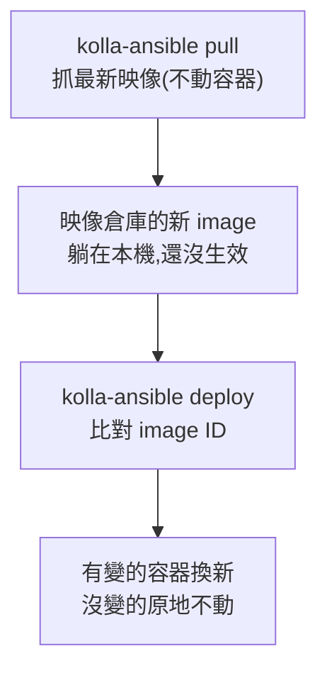
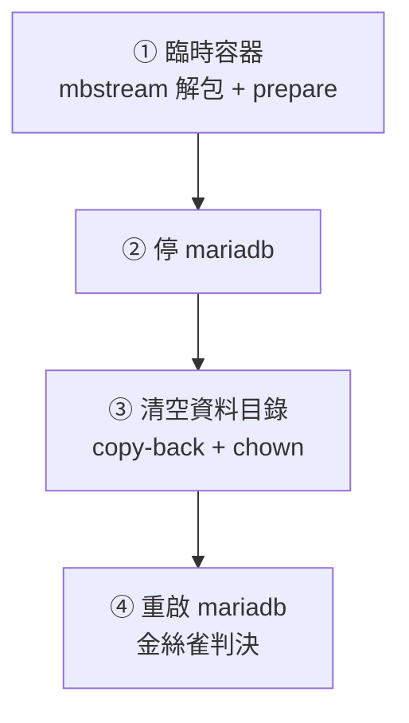

# Day 22: 更新運行中的雲,還原它的資料庫

> 前面九天都在替雲加新能力;從今天起,課程進入維運的日常。今天做兩件生產環境每個月都在做的事:**讓雲跟上上游的修補**(系列內更新),以及**證明雲的記憶救得回來**(備份加還原演練)。注意「證明」兩個字——沒有做過還原演練的備份,只是一個沒人打開過的保險箱。

!!! abstract "你在課程的哪裡"
    - **Day 13–18**:加服務(Skyline、Ceph、RGW、Manila、Designate、Trove)。
    - **Day 19–21**:拆原理、上監控(請求鏈、封包路徑、可觀測性)。
    - **今天**:維運實務第一課——更新與備份。**Day 21 裝好的監控正好派上用場**:更新過程中系統的每個反應,你都看得見。
    - **接下來**:Day 23–24 離開單機,走向多節點。

## 版本前進的兩種方式

動手前先分清楚兩個常被混用的詞,因為它們的指令不一樣:

| | 系列內更新(今天做的) | 跨系列升級 |
|---|---|---|
| 例子 | 2025.1 內的修補(新映像、新修正) | 2025.1 → 2025.2 |
| 指令 | `kolla-ansible deploy` | `kolla-ansible upgrade` |
| 資料庫 schema | 不變 | 會跑 migration |
| 風險 | 低(同版本系列) | 中高(建議先拍 snapshot) |

OpenStack 每半年出一個版本系列,其中每年一個是 **SLURP** 版(可以隔代直升的長支援版);2025.1 就是 SLURP。但今天不跨版——**系列內更新**才是最高頻的日常:上游持續替 2025.1 重建容器映像(修 CVE、修 bug),tag 不變、內容前進。

更新的機制是兩段式,理解這個分工是今天的第一課:



`pull` 只補彈藥,`deploy` 才換槍。分開的好處:拉映像的時間(可能很久)不算進服務切換的窗口。

## 步驟 0:先拍 snapshot

更新前的保險。**關機狀態拍的 snapshot 最一致**(沒有寫入中的資料),如果你的 lab 有自動關機,早上開機前就是最好的時機:

```bash
az snapshot create -g <資源群組> -n pre-day22-os-$(date +%Y%m%d) \
  --source <OS磁碟名> --incremental true
# data disk 與 ceph disk 各拍一顆——三顆一起拍才互相一致
```

## 步驟 1:確認 kolla-ansible 本體要不要動

```bash
pip show kolla-ansible | grep Version    # 20.4.1.dev17
git ls-remote https://opendev.org/openstack/kolla-ansible refs/heads/stable/2025.1
```

比對安裝時的 commit 與上游 `stable/2025.1` 的 tip。本課環境兩者相同——**kolla-ansible 本體不用升**,今天的更新實體是容器映像。如果 tip 有前進,先 `pip install -U git+…@stable/2025.1` 再 `kolla-ansible install-deps`。

## 步驟 2:pull——看見「同 tag,不同內容」

```bash
kolla-ansible pull -i all-in-one
```

```text
PLAY RECAP: ok=62  changed=28  failed=0
```

`changed=28` 表示 28 個映像抓到了新內容。挑 mariadb 對比,能看到今天最有感的一幕:

```bash
sudo docker images --format "{{.Repository}}:{{.Tag}} {{.ID}} {{.CreatedSince}}" | grep mariadb-server
# quay.io/openstack.kolla/mariadb-server:2025.1-ubuntu-noble d3fbe3d26d58 2 hours ago
sudo docker inspect mariadb --format "{{.Image}}" | cut -c8-20
# 03fdc2d535fd   ← 跑著的容器還在舊 image
```

倉庫裡躺著**兩小時前才建好**的新映像,而運行中的容器還掛在舊的上——tag 一樣、內容不同。這就是為什麼生產環境的更新紀律是「釘 digest 或定期 pull + deploy」,而不是相信 tag。

## 步驟 3:全量 prechecks——翻出老包袱

```bash
kolla-ansible prechecks -i all-in-one
```

本課環境在這裡踩到第一顆雷(見[地雷 1](#mine-1)):一行部署初期寫下、之後從沒被檢查過的設定,被今天的**全量** prechecks 翻了出來。原因值得記住:平常用 `--tags` 做增量部署時,**prechecks 只跑該 tag 的檢查**——其他角色的設定錯誤會一直潛伏,直到下一次全量檢查。

修正後重跑,全綠才前進:

```text
PLAY RECAP: ok=93  changed=0  failed=0
```

## 步驟 4:deploy——滾動換新

```bash
kolla-ansible deploy -i all-in-one
```

```text
PLAY RECAP: ok=628  changed=175  failed=0
```

驗證三件事:

```bash
sudo docker ps --format "{{.Names}} {{.Status}}" | grep -i unhealthy   # (空)
sudo docker inspect mariadb --format "{{.Image}}" | cut -c8-20         # d3fbe3d26d58 ← 換上新映像了
openstack service list | wc -l                                        # 服務數不變
```

mariadb 容器的 image ID 從 `03fdc2d…` 變成 `d3fbe3d…`——deploy 精準地只換了有新映像的容器。

## 備份:讓資料庫有第二條命

Kolla 內建 Mariabackup 支援(熱備份,不停機)。開三步:

```bash
# 1. globals.yml 加一行
enable_mariabackup: "yes"
# 2. 讓 MariaDB 拿到備份帳號與權限
kolla-ansible reconfigure -i all-in-one -t mariadb
# 3. 跑全量備份(注意指令是 dash,見地雷 2)
kolla-ansible mariadb-backup -i all-in-one
```

備份落在 docker volume `mariadb_backup`:

```bash
sudo ls -lh /var/lib/docker/volumes/mariadb_backup/_data/full-*/
# mysqlbackup-13-07-2026-1783920508.qp.xbc.xbs.gz   4.1M
```

整個控制平面的記憶——每台 VM、每條網路、每個使用者——壓縮後 4.1MB。

### 金絲雀方法論:讓還原有東西可以「判決」

直接還原然後看服務會不會動,只能證明「沒壞」,不能證明「真的回到了備份時間點」。所以在備份**前後**各留一個標記:

```bash
openstack project create day22-before-backup   # 備份前建 → 還原後應該「在」
kolla-ansible mariadb-backup -i all-in-one
openstack project create day22-after-backup    # 備份後建 → 還原後應該「消失」
```

還原成功的判準:before 在、after 不在。兩個都在 = 根本沒還原;兩個都不在 = 還原到錯的東西。

## 還原演練:走完全程才算數



① 準備備份(不影響運行中的資料庫):

```bash
sudo docker run --rm --volumes-from mariadb --volume mariadb_backup:/backup \
  quay.io/openstack.kolla/mariadb-server:2025.1-ubuntu-noble bash -c '
  cd /backup && rm -rf restore && mkdir -p restore/full
  gunzip -k full-<日期>/mysqlbackup-<日期>.qp.xbc.xbs.gz
  mbstream -x -C restore/full/ < full-<日期>/mysqlbackup-<日期>.qp.xbc.xbs
  mariabackup --prepare --target-dir /backup/restore/full'
# [00] completed OK!
```

② 停資料庫(從這一刻起 API 會斷,直到 ④ 完成——這正是演練要體感的):

```bash
kolla-ansible stop -i all-in-one -t mariadb --yes-i-really-really-mean-it
```

③ 清空舊資料、把備份放回去——**注意最後的 chown,官方文件漏了它**(見[地雷 3](#mine-3)):

```bash
sudo docker run --rm --volumes-from mariadb --volume mariadb_backup:/backup \
  quay.io/openstack.kolla/mariadb-server:2025.1-ubuntu-noble bash -c '
  rm -rf /var/lib/mysql/* /var/lib/mysql/.[!.]*
  mariabackup --copy-back --target-dir /backup/restore/full
  chown -R mysql:mysql /var/lib/mysql'
```

④ 重啟、等 healthy、判決:

```bash
sudo docker start mariadb
openstack project list | grep day22
# day22-before-backup   ← 在(正確)
#                       ← day22-after-backup 消失了(正確)
```

**備份後做的任何變更,還原後都會消失**——這不是缺陷,是還原的定義。生產環境裡這代表:還原點的選擇,就是資料損失範圍的選擇。

## 為什麼雲自己的資料庫要手動照顧?

一個合理的疑問:Day 18 才部署了 Trove——資料庫即服務,一行指令就有代管 MySQL、自動備份。為什麼雲自己的 MariaDB 還要這樣手工伺候?

因為 **Trove 開出來的資料庫,跑在這朵雲的 VM 裡;而這朵雲自己的資料庫,是雲能開出 VM 的前提**。讓雲把自己的地基放進自己蓋的房子裡,第一次停電就會發現:要救資料庫得先有雲,要有雲得先有資料庫。這個循環依賴沒有解,所以控制平面的資料庫永遠站在產品之外,用今天這種「土辦法」照顧——每一層雲的底下,都有一層不是雲的東西。

## 驗收 checkpoint

| 驗證 | 判準 | 本課環境的結果 |
|---|---|---|
| pull | 有 changed(拿到新映像) | changed=28 |
| prechecks | 全綠才准 deploy | 修正 1 項後 ok=93 failed=0 |
| deploy | failed=0、無 unhealthy、image ID 換新 | ok=628 changed=175,mariadb 換新 |
| 備份 | 備份檔實際存在 | 4.1MB `.qp.xbc.xbs.gz` |
| 還原 | before 金絲雀在、after 金絲雀消失 | 判決通過 |
| 服務 | 還原後 service list 正常 | 18 個服務全在 |

## 地雷記錄

### 地雷 1:`--tags` 部署的檢查盲區 {#mine-1}

本課環境的 globals.yml 裡躺著初期寫下的 `octavia_network_type: "tenant"`——它與 OVN 不相容(amphora 管理網走 tenant 型只支援 openvswitch),但因為之後的部署都用 `--tags` 增量進行,這行錯誤設定潛伏了整個 Sprint,直到今天的全量 prechecks 才爆出來。修正是讓設定回歸現實(這朵雲的負載平衡一直由 OVN provider 承擔):

```yaml
octavia_provider_drivers: "ovn:OVN provider"
octavia_provider_agents: "ovn"
```

教訓:**`--tags` 只檢查該 tag 的世界**。定期跑一次全量 prechecks,把潛伏的設定債翻出來。

### 地雷 2:指令是 `mariadb-backup`,文件內文寫的底線是舊寫法 {#mine-2}

官方文件內文寫 `kolla-ansible mariadb_backup`(底線),但 2025.1 的 CLI 實際接受的是 `kolla-ansible mariadb-backup`(dash)。底線版是舊 CLI 的殘留寫法。

### 地雷 3:copy-back 之後必須 chown {#mine-3}

`mariabackup --copy-back` 以 root 身分寫回資料目錄,但 mariadb 容器以 `mysql` 使用者執行——不補 `chown -R mysql:mysql /var/lib/mysql`,重啟會直接失敗。官方還原文件沒有這一步,實測必要。

## 帶得走的東西

- **系列內更新用 `deploy`,跨系列才用 `upgrade`**;pull 補彈藥、deploy 換槍,兩段分開。
- **同一個 tag 的內容會前進**——上游持續重建映像,別把 tag 當成不變的保證。
- **沒還原過的備份不算備份**;金絲雀方法論讓「還原成功」變成可判決的命題。
- **雲的地基不能放在雲裡**——控制平面資料庫永遠需要雲外的照顧方式。

## 延伸閱讀

想往下深挖,從這幾份開始:

- **[Kolla-Ansible 的 MariaDB 備份與還原指南](https://docs.openstack.org/kolla-ansible/2025.1/admin/mariadb-backup-and-restore.html)** —— 本章備份還原流程的官方出處,含增量備份的完整範例(注意本章地雷 2、3 的兩處修正)。
- **[Operating Kolla:升級操作手冊](https://docs.openstack.org/kolla-ansible/2025.1/user/operating-kolla.html)** —— 系列內更新與跨系列升級的官方定義;哪天要跨到 2025.2,照這份走。
- **[Mariabackup 總覽(MariaDB 官方)](https://mariadb.com/kb/en/mariabackup-overview/)** —— 熱備份為什麼可以不停機、prepare 階段在做什麼,原理都在這份。
- **[OpenStack 版本時間表](https://releases.openstack.org/)** —— 每個系列的維護狀態與 SLURP 標記;規劃升級路徑前先看這頁。

## 下一步

單機的維運課到此完整。[Day 23](sprint4-day23-multinode-ha.md) 換一個全新的環境:**四台機器的多節點部署**——單機時代被關掉的 haproxy、被略過的 VIP,在那裡全部復活,而且你會親眼看到關掉一台 controller 之後,API 只停了六秒。
