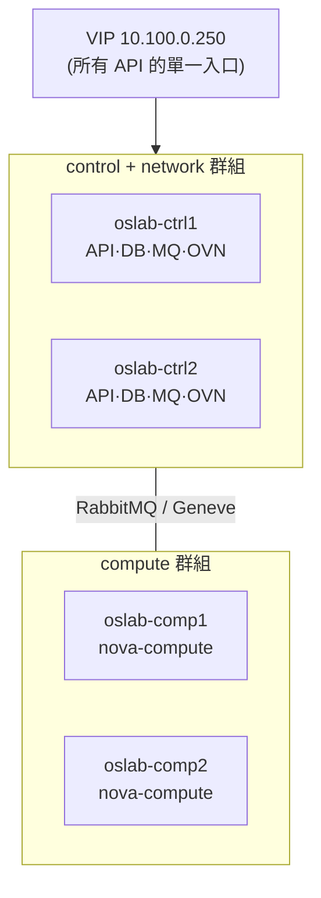
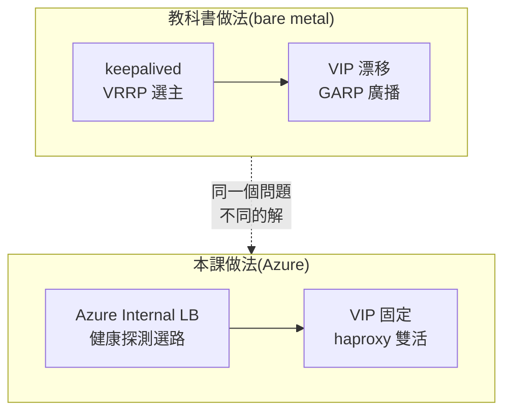

# Day 23: 多節點部署與 HA 演練

> 三個星期以來,這門課一直有個誠實的免責聲明:「單機 lab,生產環境請多節點」。今天把這句話兌現。租四台新機器,部署 2 控制 + 2 運算的真正多節點雲——然後做一件單機永遠做不到的事:**關掉一台 controller,看 API 繼續回答**。

!!! abstract "你在課程的哪裡"
    - **Day 1–22**:所有東西都在一台機器上——夠學會每個服務,但「高可用」只能用講的。
    - **今天**:全新環境、四台機器。inventory 的群組、haproxy、VIP……單機時代被關掉或略過的設定,今天全部啟用,而且你會知道**為什麼它們存在**。
    - **明天**:在這個環境上回答 Sprint 4 的核心問題——怎麼擴展。

## 多節點改變了什麼

單機部署時,inventory 裡所有群組都指向同一台機器。多節點的本質就是**把群組拆開**:



拆開之後立刻出現兩個新問題,它們就是今天的主課:

1. **API 有兩份了,客戶端連哪一台?** → 答案是 VIP + haproxy(單機時 `enable_haproxy: "no"` 關掉的東西,今天復活)。
2. **資料庫有兩份了,誰說了算?** → 答案是 Galera 同步複寫 + 多數決(quorum)——今天會親眼看到它翻臉。

## 雲上的 VIP 難題:keepalived 為什麼出局

教科書的答案是 haproxy + keepalived:兩台 controller 都跑 haproxy,keepalived 用 VRRP 選出 MASTER,把 VIP 掛在它身上;MASTER 倒了,BACKUP 接手 VIP,並發 GARP 廣播告訴整個網段「這個 IP 搬家了」。

**這套在公有雲上行不通。** Azure 的虛擬網路不是真的 L2 網段——它不轉發 GARP 與 multicast,封包要送到哪張網卡由 Azure 的網路層自己決定。keepalived 把 VIP 掛上網卡,Azure 根本不會把流量送過來。

雲上的正規解法:**讓雲的負載平衡器接手 keepalived 的工作**。



本課的組合(每個零件都有明確的職責):

| 零件 | 職責 | 設定 |
|---|---|---|
| Azure Internal LB | 把打到 VIP 的流量送給活著的 controller | frontend = 10.100.0.250、HA ports、floating IP、TCP 1984 健康探測 |
| haproxy(雙活) | 在每台 controller 上把 API 流量分給後端 | kolla 預設,兩台都跑 |
| `enable_keepalived: "no"` | 雲層 LB 已接手選路,keepalived 退場 | globals.yml |
| VIP 掛 loopback | 讓 controller 願意收下目的地是 VIP 的封包 | 兩台 ctrl:`ip addr add 10.100.0.250/32 dev lo` |
| NIC 開 IP forwarding | 讓來源是 VIP 的回包通過 Azure 的防偽檢查 | Azure NIC 屬性 |

kolla 幫了一個關鍵的忙:它會在 LB 節點設 `net.ipv4.ip_nonlocal_bind=1`,haproxy 因此能綁定不屬於本機的 VIP——這正是雙活模式需要的。

## 環境:四台機器與它們的網路

| 主機 | 私網 IP | 角色 | 規格 |
|---|---|---|---|
| oslab-ctrl1 | 10.100.0.11 | control + network(兼跳板、部署機) | E8s_v5 |
| oslab-ctrl2 | 10.100.0.12 | control + network | E8s_v5 |
| oslab-comp1 | 10.100.0.21 | compute | E8s_v5 |
| oslab-comp2 | 10.100.0.22 | compute | E8s_v5 |

只有 ctrl1 有公網 IP(SSH 跳板);其他機器一律走私網。這個決定立刻踩出今天第一顆雷:**掛在 Standard Internal LB 後端、又沒有公網 IP 的 VM,Azure 不給預設出網路徑**——ctrl2 連 apt 都跑不動(見[地雷 1](#mine-1))。解法是替 subnet 掛一顆 NAT Gateway,順便把所有節點的出網固化。

成本誠實記帳:四台 E8s_v5 約 US$2.4/小時,兩天課程(含自動關機)約 US$50。

## Bootstrap:四台機器的前置作業

每台機器要做三件事(全部可以從 ctrl1 用 ansible 或迴圈完成):

```bash
# 1. /etc/hosts——kolla 要求主機名稱互相解析
10.100.0.11 oslab-ctrl1
10.100.0.12 oslab-ctrl2
10.100.0.21 oslab-comp1
10.100.0.22 oslab-comp2
# 2. dummy0 網卡(Azure 單網卡的標準解,同 Day 1)
# 3. DNS 直連上游——先修掉地雷 2,別等它爆
sudo ln -sf /run/systemd/resolve/resolv.conf /etc/resolv.conf
```

inventory 從官方 multinode 範本出發,只改最上面的群組段:

```ini
[control]
oslab-ctrl1
oslab-ctrl2

[network]
oslab-ctrl1
oslab-ctrl2

[compute]
oslab-comp1
oslab-comp2

[monitoring]
oslab-ctrl1

# glance 釘在單一節點:file 後端的映像檔不會自己同步,
# 兩台各存一半的 glance 是壞掉的 glance
[glance]
oslab-ctrl1
```

globals.yml 與單機的差異只有四行:

```yaml
kolla_internal_vip_address: "10.100.0.250"   # 單機時 = 本機 IP;現在是真 VIP
enable_keepalived: "no"                      # Azure ILB 接手(見上節)
network_interface: "eth0"
neutron_external_interface: "dummy0"
```

然後照標準流程:`kolla-genpwd` → `bootstrap-servers`(四台裝好 docker)→ `prechecks`(四台全綠)→ `deploy`。

## deploy 途中:親眼看到 quorum 翻臉

四節點全量部署約半小時。本課環境的部署在中途炸了一次,而炸法本身就是多節點最重要的一課(完整記錄在[地雷 3](#mine-3)):

部署高載時,兩台 controller 之間的 Galera 心跳抖了 3 秒。對兩節點叢集來說,「對方失聯」意味著**自己只剩 1 票、拿不到多數**——Galera 立刻把自己切到 NON-PRIMARY、拒絕所有讀寫。當時正在跑的 nova 資料庫 migration 被攔腰斬斷,留下半套 schema。

```text
WSREP: connection to peer … timed out, no messages seen in PT3S
WSREP: New COMPONENT: primary = no, memb_num = 1
WSREP: Received NON-PRIMARY.
```

**這就是「生產環境要三台 controller」的完整理由**:三台叢集抖掉一台,剩下兩台仍是多數(2/3),照常服務;兩台叢集抖掉一台,剩下的那台是少數(1/2),立刻停擺。兩節點的「HA」在腦裂面前是假的——本課用兩台是成本妥協,拿到的教訓貨真價實。

修復:砍掉半套的 nova 資料庫、重跑 deploy(冪等)。最終:

```text
PLAY RECAP: oslab-ctrl1 ok=354 … failed=0(其餘三台皆 failed=0)
```

## 部署驗證:VIP 這條路真的通嗎

驗證要從**會經過 ILB 的位置**打——compute 節點沒有把 VIP 掛在 loopback,它打 VIP 一定走 Azure ILB:

```bash
# 在 comp1 上
curl -s -o /dev/null -w "keystone via VIP: HTTP %{http_code} (%{time_total}s)\n" \
  http://10.100.0.250:5000/
# keystone via VIP: HTTP 300 (0.003805s)   ← 300 是 keystone 的版本清單,正常回應
```

控制面的每個角色都是雙份的:

```bash
openstack compute service list -f value -c Binary -c Host -c State | sort
# nova-compute   oslab-comp1  up
# nova-compute   oslab-comp2  up
# nova-conductor oslab-ctrl1  up
# nova-conductor oslab-ctrl2  up
# nova-scheduler oslab-ctrl1  up
# nova-scheduler oslab-ctrl2  up
```

四台合計 81 個容器、0 個 unhealthy。開一台 VM 指定落點,確認調度器聽話:

```bash
openstack server create ha-canary --flavor m1.tiny --image cirros \
  --network day23-net --availability-zone nova:oslab-comp2 --wait
openstack server show ha-canary -f value -c OS-EXT-SRV-ATTR:host   # oslab-comp2
```

## HA 失效演練:關掉一台 controller

演練設計:在 comp1 上每秒打一次 VIP(留下時間戳記錄),然後**整台關掉 ctrl2**(優雅關機),全程觀察。

```bash
# comp1 上的秒級探測
while true; do
  echo "$(date -u +%H:%M:%S) $(curl -s -o /dev/null -m 2 -w %{http_code} http://10.100.0.250:5000/ || echo FAIL)"
  sleep 1
done > /tmp/vip-probe.log
# 然後:az vm deallocate -n oslab-ctrl2
```

ctrl2 完全關機的狀態下,雲的三種能力逐一驗證:

```bash
openstack token issue        # 通——Keystone 由 ctrl1 接手
openstack server list        # 通——ha-canary 照常 ACTIVE
openstack flavor create …    # 通——資料庫「寫入」也正常
```

第三項最關鍵:讀能通可能只是快取,**寫能通代表資料庫真的活著**。看 Galera 倖存者的狀態:

```text
wsrep_cluster_size    1
wsrep_cluster_status  Primary   ← 一台也能是 Primary?
```

跟部署中的翻臉對照,這裡藏著 Galera 最重要的區別——**優雅離場與無預警失聯是兩回事**:

| | 優雅關機(今天的演練) | 無預警失聯(部署中的 3 秒抖動) |
|---|---|---|
| 離場方式 | mysqld 正常關閉,先告知叢集 | 心跳逾時,對方「消失」 |
| 叢集視角 | 成員數 2→1,倖存者是 1/1 多數 | 成員數不變,但 1/2 拿不到多數 |
| 結果 | 照常服務(Primary) | 停擺(NON-PRIMARY) |

而斷線期間的 API 空窗,秒級探測給出了精確數字:

```text
128 次探測,6 次失敗——07:54:45 到 07:54:50
```

**六秒**。那是 ILB 的健康探測(5 秒間隔)把 ctrl2 踢出後端池之前,仍把部分連線送過去的窗口。之後直到 ctrl2 完全關機、再到重新開機歸隊,API 沒有再掉過一拍。ctrl2 開機後,Galera 自動重新同步:`wsrep_cluster_size` 回到 2,無人工介入。

## 驗收 checkpoint

| 驗證 | 判準 | 本課環境的結果 |
|---|---|---|
| 部署 | 四台 failed=0、無 unhealthy 容器 | 81 容器全健康 |
| VIP | 從 compute 節點經 ILB 打 API 通 | HTTP 300,3.8ms |
| 控制面冗餘 | conductor/scheduler 每台 ctrl 各一份 | 符合 |
| 指定落點 | VM 落在指定的 compute | oslab-comp2 |
| HA 演練 | 單 controller 下:讀 ✓ 寫 ✓ | token/list/flavor create 全通 |
| 空窗 | 量測 failover 中斷時間 | 6 秒 |
| 歸隊 | Galera 自動回到 size 2 | 無人工介入 |

## 地雷記錄

### 地雷 1:Internal LB 的後端沒有預設出網 {#mine-1}

沒有公網 IP 的 VM 一旦掛進 Standard **Internal** LB 的後端池,Azure 就不再提供預設的對外連線——ctrl2 的 apt 連 mirror 都碰不到,而且症狀是「重試 N 次後失敗」,看起來像網路抖動,實際是確定性的規則。解法:subnet 掛 NAT Gateway。教訓:**在雲上,出網是要自己準備的資源,不是理所當然的預設**。

### 地雷 2:systemd-resolved 在部署高載時餓死 {#mine-2}

大量並行拉映像時,Ubuntu 預設的 DNS stub(127.0.0.53)會間歇性逾時,症狀偽裝成「quay.io 掛了」;更麻煩的是它引發的連鎖——一台節點拉不到映像退場後,keystone 的 fernet 安全檢查會主動停下整個部署,compute 節點再跟著全炸。看到多台全倒,先找**第一張倒下的骨牌**。根治:`ln -sf /run/systemd/resolve/resolv.conf /etc/resolv.conf`,繞過 stub 直連上游 DNS。

### 地雷 3:兩節點叢集的多數決陷阱 {#mine-3}

兩節點 Galera 在任何一方**無預警失聯**時(哪怕 3 秒),倖存者因為拿不到多數(1/2)會立刻自我停擺——這是防腦裂的正確行為,但代價是「兩台的 HA」只對優雅關機成立。生產環境的答案永遠是**奇數台、至少三台**。若部署途中因此炸掉 migration,留下的半套 schema 要先 `DROP DATABASE` 再重跑 deploy,否則 alembic 會卡在「表已存在」。

## 帶得走的東西

- `enable_haproxy`、VIP、inventory 群組這些單機時代關掉或略過的設定,現在你知道它們為什麼存在。
- **公有雲上 VIP 的正規解是雲層 LB**,keepalived 屬於 bare metal;識別「這個工具假設了什麼網路能力」是跨環境部署的核心功。
- **quorum 是數學不是玄學**:2 台叢集掉 1 台 = 少數 = 停擺;3 台掉 1 台 = 多數 = 照常。
- **failover 有數字**:這個環境是 6 秒——由 ILB 探測間隔決定,可以調,但先量出來。

## 延伸閱讀

想往下深挖,從這幾份開始:

- **[Kolla-Ansible 多節點部署指南](https://docs.openstack.org/kolla-ansible/2025.1/user/multinode.html)** —— inventory 群組設計與部署流程的官方版本;本章 inventory 的出發點。
- **[Kolla-Ansible 的 HAProxy 指南](https://docs.openstack.org/kolla-ansible/2025.1/reference/high-availability/haproxy-guide.html)** —— haproxy 與 keepalived 的官方定位,以及 `enable_keepalived: "no"` 這個開關的出處。
- **[Azure Load Balancer 的 floating IP](https://learn.microsoft.com/en-us/azure/load-balancer/load-balancer-floating-ip)** —— 本章 ILB 架構的關鍵功能:為什麼後端要把 VIP 掛在 loopback、封包怎麼送達。
- **[Galera 的加權 quorum 機制](https://galeracluster.com/library/documentation/weighted-quorum.html)** —— 地雷 3 的理論全貌:多數怎麼算、為什麼偶數節點是反模式。

## 下一步

雲已經是複數台了,但還有最後一個問題沒回答——也是 Sprint 4 從第一天就掛著的問題:**容量不夠時怎麼擴展?**[Day 24](sprint4-day24-scale-out.md) 租第五台機器實地演練:加節點、熱遷移、清空一台機器,全程使用者無感。
