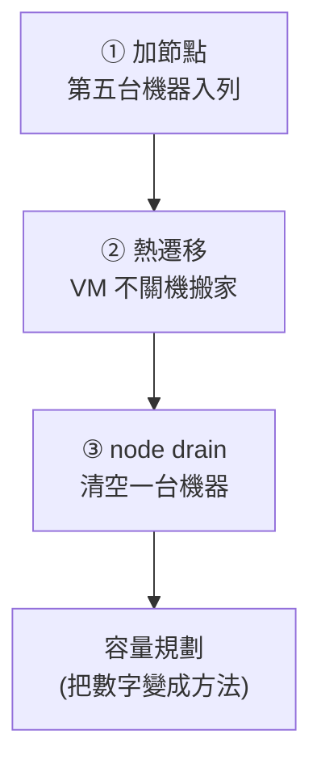

# Day 24: 橫向擴展——加節點、熱遷移、容量水位

> Sprint 4 開場時掛起的核心問題,今天正面回答:**Nova 和 Magnum 的機器是誰準備的?**答案是維運者——而「準備一台機器」在成熟的部署工具下,是三行指令的事。今天租第五台機器現場加入雲,然後演練機器的整個生命週期:接收工作、搬走工作、清空退場。

!!! abstract "你在課程的哪裡"
    - **Day 8–9**:Magnum 的 autoscaler 會自己長 K8s worker——但它長出來的 VM,用的是**雲已經有的**容量。
    - **Day 23**:雲變成四台,控制面有了冗餘。
    - **今天**:回答「雲層自己的容量怎麼長」。這是課程主線的最後一塊動手拼圖。
    - **明天**:Sprint 4 總結。

## 今天的三場演練



三場演練共用同一個觀測工具:**placement 的容量水位**。開始前先記下現況:

```bash
pip install osc-placement   # resource provider 系列指令需要這個外掛(見地雷 2)
openstack resource provider list -f value -c uuid -c name | while read u n; do
  T=$(openstack resource provider inventory list "$u" -f value | awk '/VCPU/{print $3}')
  echo "$n: $T vCPU"
done
# oslab-comp1: 8 vCPU
# oslab-comp2: 8 vCPU        ← 叢集總量 16 vCPU
```

## 演練 ①:加節點

### 租機的第一課發生在雲的外面

替 lab 租第五台時撞上 Azure 的 vCPU 配額——而且發現一個容易記錯的規則:**deallocated(已關機釋放)的 VM 依然佔用配額**。舊的單機 lab 雖已關機,16 核照算,剩餘配額只夠 2 核(見[地雷 1](#mine-1))。

所以第五台是 E2s_v5(2 vCPU)——比其他 compute 小四倍。這個妥協反而讓教學更誠實:**真實世界的雲本來就是異質的**(不同代的硬體、不同規格的節點),等一下 placement 會如實呈現這件事。

### 新節點的前置(把 Day 23 的雷全部先修掉)

```bash
# oslab-comp3(10.100.0.23)上:
# 1. /etc/hosts 全叢集互相解析(新節點一行也要加回舊節點)
# 2. dummy0 網卡
# 3. DNS 直連上游(Day 23 地雷 2 的預防)
sudo ln -sf /run/systemd/resolve/resolv.conf /etc/resolv.conf
```

inventory 只加一行:

```ini
[compute]
oslab-comp1
oslab-comp2
oslab-comp3     # ← 新成員
```

### 三部曲:`--limit` 讓現役節點毫髮無傷

```bash
kolla-ansible bootstrap-servers -i multinode --limit oslab-comp3   # 裝 docker、建 kolla 使用者
kolla-ansible pull -i multinode --limit oslab-comp3                # 預拉映像
kolla-ansible deploy -i multinode --limit oslab-comp3              # 部署 compute 角色
```

```text
oslab-comp3 : ok=104  changed=62  failed=0
```

`--limit` 是這裡的關鍵:整個過程**只碰新節點**,現役的四台連一個容器都沒重啟。

### 你沒做的那件事:cell discovery

教科書會說新 compute 節點要跑 `nova-manage cell_v2 discover_hosts` 註冊進 cell。注意剛剛的流程裡**完全沒有這一步**——kolla 的 nova-cell 角色在 deploy 時代跑了。直接驗收:

```bash
openstack compute service list -f value -c Binary -c Host -c State | grep nova-compute
# nova-compute oslab-comp1 up
# nova-compute oslab-comp2 up
# nova-compute oslab-comp3 up     ← 已註冊、已上線

openstack resource provider list -f value -c name
# oslab-comp1 / oslab-comp2 / oslab-comp3
```

容量水位的變化:

| 節點 | 加入前 | 加入後 |
|---|---|---|
| oslab-comp1 | 8 vCPU | 8 vCPU |
| oslab-comp2 | 8 vCPU | 8 vCPU |
| oslab-comp3 | — | **2 vCPU** |
| **叢集總量** | **16** | **18** |

從租機到 placement 看見新容量,全程**沒有動過任何現有服務、沒有一秒 API 中斷**——使用者視角:雲就是默默變大了。這就是 Day 8「機器從哪來」的最終答案:維運者把裸機變成 placement 裡的數字,之後的一切(Nova 調度、Magnum autoscaler)都消費這個數字。

## 演練 ②:熱遷移——VM 不關機搬家

汰換硬體、重新平衡負載,都靠這一招。本課環境沒有共享儲存,所以磁碟要跟著搬(block migration):

```bash
openstack server show ha-canary -f value -c OS-EXT-SRV-ATTR:host   # oslab-comp2
openstack server migrate ha-canary --live-migration --block-migration \
  --host oslab-comp1 --wait
openstack server show ha-canary -f value -c OS-EXT-SRV-ATTR:host   # oslab-comp1
openstack server show ha-canary -f value -c status                  # ACTIVE(全程)
```

原理一句話:libvirt 把 VM 的記憶體分批複製到目的地,來源繼續運行、持續補傳「又變髒的頁」,直到剩餘量小到能在毫秒級凍結window內收尾——所以 VM 覺得自己沒停過。

## 演練 ③:node drain——機器退場的標準動作

假想劇本:oslab-comp2 要換硬體。標準四步:

```bash
# 1. 停止進貨:調度器不再把新 VM 排進來(現有 VM 不受影響)
openstack compute service set --disable \
  --disable-reason "maintenance: hardware replacement" oslab-comp2 nova-compute

# 2. 清空存貨:把上面的 VM 逐一熱遷走
openstack server migrate drain-canary --live-migration --block-migration \
  --host oslab-comp3 --wait

# 3. 確認清空
openstack server list --host oslab-comp2 -f value | wc -l    # 0

# 4. (維護完成後)重新開張
openstack compute service set --enable oslab-comp2 nova-compute
```

演練後的水位,講了一個完整的故事:

```text
oslab-comp1: used=1   ← ha-canary(演練②搬來的)
oslab-comp2: used=0   ← 被清空、已歸隊
oslab-comp3: used=1   ← drain-canary(新節點接下真實工作)
```

注意 drain-canary 的落點:**今天早上才加入的 comp3,已經在承接從老節點撤下來的工作負載**。加節點→接工作→老節點退場,這條循環就是雲的新陳代謝。

## 把數字變成方法:容量規劃

三場演練都在讀 placement 的數字;生產環境的容量規劃就是圍繞這些數字的紀律:

| 概念 | 內容 | 本課環境的對應 |
|---|---|---|
| allocation ratio | vCPU 常見超賣(如 4:1),記憶體幾乎不超賣(1:1) | placement inventory 的 `allocation_ratio` 欄位 |
| 預留(reserved) | 每台主機留給系統本身的資源 | `reserved_host_memory_mb` 等 |
| N+1 headroom | 隨時保有「清空最大一台」所需的空位——否則 drain 演練做不了 | 今天若三台全滿,演練③會卡在第 2 步 |
| host aggregate / AZ | 把節點分池(SSD 池、GPU 池、機櫃容錯域),調度時指定 | 本課的 `--availability-zone nova:主機` 是它的最簡形式 |

**Magnum 的視角**(Day 9 的伏筆收回):workload cluster 的 autoscaler 覺得「隨時可以長」,是因為它信任雲層有容量。autoscaler 觸發 → Magnum 開 VM → Nova 找 placement 要資源——如果水位見底,長不出來的錯誤會出現在這條鏈的最末端。**看 placement 水位,就是在看所有上層彈性的天花板。**

## 驗收 checkpoint

| 驗證 | 判準 | 本課環境的結果 |
|---|---|---|
| 加節點 | 三部曲 failed=0、現役節點零擾動 | ok=104 failed=0 |
| cell discovery | 不跑 nova-manage,新節點自動註冊 | 三台 nova-compute up |
| placement | 總量增加、異質規格如實呈現 | 16→18 vCPU,comp3=2 |
| 熱遷移 | 換主機、全程 ACTIVE | comp2→comp1 ✓ |
| drain | disable→清空→歸隊完整走完 | comp2 歸零後 re-enable |
| 新節點承載 | 撤下的工作落在新節點 | drain-canary 在 comp3 |

## 地雷記錄

### 地雷 1:配額連關機的 VM 一起算 {#mine-1}

Azure 的 regional vCPU 配額把 **deallocated 的 VM 也計入**——「先關掉舊環境再租新機」不會釋放配額,只有刪除 VM(磁碟可留)才會。規劃多環境並行的 lab 時,把「配額」當成一種你雲底下的雲的容量水位來管理;撞牆時的訊息(`QuotaExceeded`)會告訴你目前用量與需要的新上限。

### 地雷 2:placement 指令要另裝外掛 {#mine-2}

`openstack resource provider …` 系列不在預設的 openstackclient 裡,需要 `pip install osc-placement`。沒裝時 CLI 會輸出「你是不是要找…」的相似指令清單——**在腳本裡這段文字會被當成正常輸出往下傳**,產生一串難以理解的垃圾。寫自動化時,先驗證外掛存在。

## 帶得走的東西

- **「機器怎麼準備」的完整答案**:裸機 → 前置(hosts/DNS/dummy0)→ `--limit` 三部曲 → placement 出現新數字。之後的一切調度都是消費這個數字。
- **`--limit` 是加節點的安全邊界**:現役節點連容器都不重啟。
- **drain 四步**(disable → migrate → verify → enable)是機器退場的標準動作;做得了 drain 的前提是平時留有 N+1 空位。
- **placement 水位是所有上層彈性的天花板**——包括 Magnum autoscaler 的。

## 延伸閱讀

想往下深挖,從這幾份開始:

- **[Kolla-Ansible:新增與移除主機](https://docs.openstack.org/kolla-ansible/2025.1/user/adding-and-removing-hosts.html)** —— 本章三部曲的官方出處,也涵蓋今天沒演的「移除節點」完整流程。
- **[Nova 熱遷移操作指南](https://docs.openstack.org/nova/2025.1/admin/live-migration-usage.html)** —— 熱遷移的前提條件、模式選擇(共享儲存 vs block migration)與監看方式。
- **[Placement 服務文件](https://docs.openstack.org/placement/2025.1/)** —— resource provider、inventory、allocation 的完整模型;容量規劃表格裡每個概念的權威定義。

## 下一步

十二天的動手全部完成。[Day 25](sprint4-day25-sprint4-recap.md) 收束整個 Sprint:這朵雲從哪裡出發、現在長什麼樣子、路上埋掉的每一顆雷——以及誠實的清單:它離生產環境還差哪幾步。
