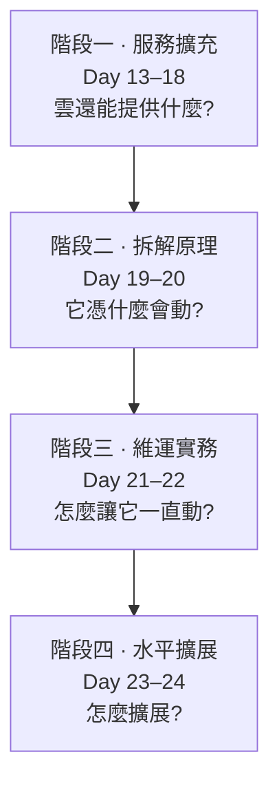

# Day 25: Sprint 4 總結——從會動的雲,到敢動的雲

> Sprint 3 的終點,是一朵**會動**的雲:九個服務、一鍵開出 K8s。Sprint 4 的終點,是一朵**敢動**的雲:敢升級、敢備份還原、敢關掉一台 controller、敢在營運中長出新節點。這中間差的不是服務數量,是**可驗證性**——每個「敢」字背後,都是一次真的做過的演練。

!!! abstract "你在課程的哪裡"
    - **今天**:不動手,盤點。十二天走過的路、雲的前後對比、二十八顆地雷,以及誠實的清單——它離生產環境還差哪幾步。
    - **今天之後**:課程主線完結。文末有兩條延伸路。

## 十二天走過的路

四個階段,每個階段回答一種問題:

| Day | 主題 | 最重要的一件事 |
|---|---|---|
| [13](sprint4-day13-skyline.md) | Skyline | 一個 flag 的增量部署;兩代 UI 並存 |
| [14](sprint4-day14-ceph-bootstrap.md) | Ceph | RAID 放大到機房尺度;cephadm 與 Kolla 同機共存 |
| [15](sprint4-day15-object-storage-rgw.md) | RGW | S3 + Swift 雙 API 一次到手;物件儲存入列 |
| [16](sprint4-day16-manila-cephfs.md) | Manila | 共享檔案系統;延伸到 K8s 的 RWX 掛載 |
| [17](sprint4-day17-designate-dns.md) | Designate | DNS 代管;FIP 自動長出記錄 |
| [18](sprint4-day18-trove-dbaas.md) | Trove | 代管 MySQL 資料庫服務 |
| [19](sprint4-day19-api-request-lifecycle.md) | 請求鏈 | server create 徒手追到 qemu 進程 |
| [20](sprint4-day20-ovn-packet-trace.md) | 封包路徑 | ovn-trace 看見 NAT 改寫的那一刻 |
| [21](sprint4-day21-observability.md) | 可觀測性 | 四大黃金訊號;Prometheus/Grafana 上線 |
| [22](sprint4-day22-upgrade-backup.md) | 更新與備份 | 金絲雀判決的還原演練 |
| [23](sprint4-day23-multinode-ha.md) | 多節點 | 關掉一台 controller,API 只停 6 秒 |
| [24](sprint4-day24-scale-out.md) | 橫向擴展 | 加節點三部曲;placement 水位 16→18 |

## 這朵雲的前後對比

| | Sprint 3 結束時 | Sprint 4 結束時 |
|---|---|---|
| 機器 | 1 台 | 單機 lab + 多節點環境(2 控制 + 3 運算) |
| 服務 | 9 個核心服務 | 18 個(+Skyline、Swift API、Manila、Designate、Trove…) |
| 儲存形態 | 區塊(LVM) | 區塊 + 物件(RGW/S3)+ 共享檔案(CephFS)三態到齊 |
| 看得見嗎 | 只有 log | Prometheus 指標 + Grafana 儀表板 + 集中式 log |
| 高可用 | 「生產環境請多節點」(免責聲明) | 實測:單 controller 失效,API 空窗 6 秒 |
| 升級與備份 | 沒做過 | 系列內更新 + 備份還原演練,各走過一輪 |
| 擴容 | 理論 | 第五台節點營運中加入,使用者無感 |

## 「敢」的三個證據

貫穿這個 Sprint 的方法論只有一條:**沒有驗證過的能力,不算能力。**三場關鍵演練都遵守同一個模式——先設計判準,再動手,讓結果可以被判決:

1. **敢升級**([Day 22](sprint4-day22-upgrade-backup.md)):每一步設 gate(prechecks 全綠才 deploy、image ID 真的換了才算數);還原用**金絲雀**判決——備份前的標記要在、備份後的標記要消失,兩個條件缺一即失敗。
2. **敢關一台**([Day 23](sprint4-day23-multinode-ha.md)):不是「應該沒問題」,是秒級探測量出 **6 秒**空窗,而且在單 controller 狀態下驗證了資料庫**寫入**——讀通可能是快取,寫通才是活著。
3. **敢長大**([Day 24](sprint4-day24-scale-out.md)):加節點全程 `--limit`,現役節點零擾動;新節點的第一份工作,就是接下 drain 演練從老節點撤下的 VM。

## 地雷回顧:二十八顆,九種教訓

Sprint 4 十三章共記錄了 28 顆具名地雷。全部值得翻,這裡挑出最有普遍性的幾顆——它們的教訓超出 OpenStack 本身:

| 教訓 | 地雷 | 出處 |
|---|---|---|
| 文件會過時,實測才算數 | keyring 路徑與文件不符;`mariadb-backup` 的底線寫法;copy-back 漏了 chown | [Day 16](sprint4-day16-manila-cephfs.md#mine-2)、[Day 22](sprint4-day22-upgrade-backup.md#mine-2) |
| 預設值不是為你的環境設的 | RGW 預設 port 80 撞 Horizon;OSD autotune 吃掉幾十 GB | [Day 15](sprint4-day15-object-storage-rgw.md#mine-1)、[Day 14](sprint4-day14-ceph-bootstrap.md#mine-2) |
| 增量檢查有盲區 | `--tags` 部署讓錯誤設定潛伏整個 Sprint | [Day 22](sprint4-day22-upgrade-backup.md#mine-1) |
| 症狀會偽裝,先找第一張骨牌 | resolved stub 餓死偽裝成 quay.io 掛掉,連鎖炸四台 | [Day 23](sprint4-day23-multinode-ha.md#mine-2) |
| 多數決是數學 | 兩節點 Galera 抖 3 秒即停擺——三台不是建議,是算式 | [Day 23](sprint4-day23-multinode-ha.md#mine-3) |
| 雲下面還有雲 | ILB 後端沒有預設出網;配額連關機的 VM 都算 | [Day 23](sprint4-day23-multinode-ha.md#mine-1)、[Day 24](sprint4-day24-scale-out.md#mine-1) |
| 沒有 DNS,什麼都起不來 | Trove guest 有心跳但 spawn 失敗的元兇是 subnet 沒 DNS | [Day 18](sprint4-day18-trove-dbaas.md#mine-1) |
| 監控系統自己也會壞 | cadvisor 的 inotify 上限;exporter 缺口要記帳 | [Day 21](sprint4-day21-observability.md#mine-1) |
| 快取會說謊 | Ceph 告警讀到舊值——health check 有快取 | [Day 14](sprint4-day14-ceph-bootstrap.md#mine-3) |

## 誠實的清單:離生產環境還差什麼

這門課的雲「敢動」,但它仍是教學環境。若要真的扛生產流量,至少還有這些課沒上:

- **三台 controller**:本課的兩台在無預警失聯時會停擺(Day 23 親眼看過)。奇數 quorum 是底線。
- **TLS**:所有 API 目前走 HTTP。生產環境的第一件事就是 `kolla_enable_tls_internal/external`。
- **跨系列升級**:本課只做了系列內更新;2025.1 → 2025.2(或下一個 SLURP)的 `kolla-ansible upgrade` 是另一場演練。
- **Ceph 的真正形態**:單機單 OSD 的 Ceph 學到了架構,但三副本、故障域、多機恢復才是它存在的理由。
- **備份的異地性**:備份檔還躺在同一台機器的 docker volume 裡;生產環境要送出去(物件儲存正好是 Day 15 學過的)。
- **秘密管理**:passwords.yml 是明文檔案;輪替機制與 vault 整合都是課題。

清單不是遺憾,是地圖——你已經有能力自己走這幾段路了。

## 兩條延伸路

1. **拆掉,再長出來。**[Day 10](sprint3-day10-terraform-teardown.md) 的 Terraform 程序 + 這個 Sprint 的所有 runbook,理論上能讓你從零重建整朵雲。真的做一次,你會找到文件裡缺的每一步——那就是你自己的地雷記錄的開始。
2. **往前升。**對照 [OpenStack 版本時間表](https://releases.openstack.org/),把 lab 從 2025.1 升到下一個系列。Day 22 的 gate 方法論(snapshot → prechecks → 逐步驗證)在跨系列升級時一樣適用,只是每一步的風險更真實。

## 結語

第 0 天的第一個問題是「為什麼 `kvm-ok` 很重要」;第 24 天的最後一個動作,是看著一台早上才加入的節點接下從老節點撤下的工作負載。中間的每一步——每個 gate、每隻金絲雀、每顆具名的地雷——都在練同一件事:**讓「它應該可以」變成「我驗證過它可以」。**

這朵雲會繼續動。現在,它也敢動了。
