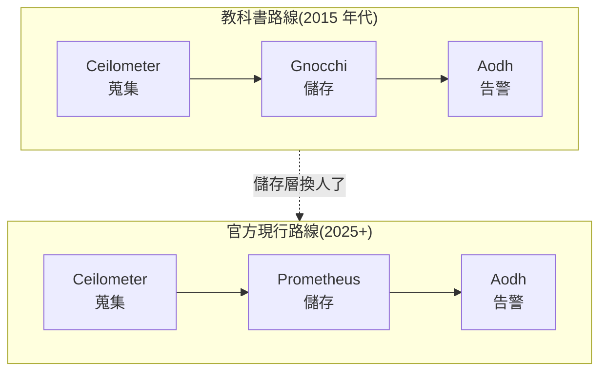

# Day 26: 下一步的地圖——Sprint 5 預告

> Sprint 3 的雲**會動**,Sprint 4 的雲**敢動**。但有一種問題,前 25 天完全沒碰過:這朵雲一個月燒多少錢?哪個部門用掉的?憑什麼收他這個價?客戶問 SLA 怎麼回答?稽核員來了拿什麼給他看?——這些是把雲**當成生意經營**的問題,也是 Sprint 5 的全部內容。

!!! abstract "你在課程的哪裡"
    - **Day 13–24**:動手,雲長出 18 個服務、變成多節點、敢升級敢擴張。
    - **Day 25**:Sprint 4 總結。
    - **Day 26(本篇)**:下一段的地圖。不動手,講清楚 Sprint 5 要學什麼、為什麼是這些。

## 從「敢動」到「當生意經營」

一朵技術上完美的雲,放到企業裡馬上會被問四個問題:

1. **誰用了多少?**——計量(metering)
2. **怎麼換算成錢?**——計費(rating/chargeback)
3. **對使用者承諾什麼?**——SLA 與自動復原
4. **對稽核員交代什麼?**——身分治理、加密、稽核軌跡

Sprint 5 用 **9 天、四個階段**回答這四個問題:

  <strong>階段一 · 治理基礎</strong>&ensp;Day 27 · 先有租戶結構,才有分帳對象
  

    
<b>27</b>&nbsp;多租戶治理與額度

  

▼

  <strong>階段二 · 計量與反應</strong>&ensp;Day 28–29 · 看見用量,然後讓雲自己反應
  

    
<b>28</b>&nbsp;計量管線(Ceilometer)

    
<b>29</b>&nbsp;告警與自動擴縮(Aodh)

  

▼

  <strong>階段三 · 計費</strong>&ensp;Day 30 · 用量變成帳單
  

    
<b>30</b>&nbsp;計費(CloudKitty)

  

▼

  <strong>階段四 · SLA 與合規</strong>&ensp;Day 31–34 · 自癒、加密、企業身分、稽核
  

    
<b>31</b>&nbsp;SLA 與自癒(Masakari)

    
🔐<b>32</b>&nbsp;全站 TLS

    
🪪<b>33</b>&nbsp;企業身分 SSO

    
📋<b>34</b>&nbsp;稽核軌跡(CADF)

  

<em>最後以 Day 35 總結收尾——含一堂「怎麼判斷 OpenStack 專案生死」的版圖課。</em>

## 預定課表(Day 27–35)

| Day | 主題 | 一句話 |
|---|---|---|
| [27](sprint5-day27-multi-tenant-governance.md) ✅ | **多租戶治理與額度** | Keystone domains 分層、application credentials、**unified limits(2025.1 剛轉正)**、新一代權限模型現況 |
| [28](sprint5-day28-ceilometer-metering.md) ✅ | **計量管線(Ceilometer)** | 誰開了幾台 VM、用了幾 GB——資料流進 Day 21 建好的 Prometheus;Gnocchi 為什麼繞過,證據攤給你看 |
| [29](sprint5-day29-aodh-autoscaling.md) ✅ | **告警與自動擴縮(Aodh)** | Aodh 盯著 Prometheus 的數字,Heat 接到告警自己長 VM——收 Day 5 的伏筆 |
| [30](sprint5-day30-cloudkitty-rating.md) ✅ | **計費(CloudKitty)** | 訂價規則、算錢、出報表——兩個租戶各拿各的帳單;帳單畫面在 Horizon(原因見設計決定) |
| [31](sprint5-day31-masakari-ha.md) ✅ | **SLA 與自癒(Masakari)** | 回多機環境一天:VM 程序死掉自動重啟、compute 整台掛掉自動搬家 |
| [32](sprint5-day32-full-tls.md) ✅ | **全站 TLS** | 所有 API 換上 https;內建 CA 為什麼不能上生產 |
| [33](sprint5-day33-keycloak-federation.md) ✅ | **企業身分 SSO(Federation)** | 公司的 Keycloak 帳號直接登入這朵雲——Keystone 聯邦身分與角色對應 |
| [34](sprint5-day34-cadf-audit.md) ✅ | **稽核軌跡(CADF)** | 「誰在何時對哪個資源做了什麼」——稽核事件接回 Day 21 的集中式 log |
| [35](sprint5-day35-sprint5-recap.md) ✅ | **Sprint 5 總結 + 版圖課** | 前後對比;怎麼判斷一個 OpenStack 專案的生死——用四個真實案例教你驗屍 |

## 三個先講清楚的設計決定

### 為什麼計量儲存用 Prometheus,不是教科書上的 Gnocchi

翻開任何一本 OpenStack 教材,遙測這一章都是同一組三件套:Ceilometer 蒐集、Gnocchi 儲存、Aodh 告警。課表裡卻只見前後兩位,中間的儲存層不見了——因為這條管線的中段,上游已經換人:

Ceilometer 與 Aodh 都還照著半年一版的節奏正常前進,但 Gnocchi 在 2017 年離開 OpenStack 官方治理後逐漸沉寂——最新版本距今近一年,主流發行版的新一代遙測架構也已經把它排除在外(截至 2026-07)。取而代之的儲存層就是 Prometheus:Aodh 這幾年的主力開發正是 Prometheus 告警,CloudKitty 也官方支援直接向 Prometheus 取數,官方團隊的下一步 **Aetos**(在 Prometheus 前面加租戶隔離與 Keystone 認證的代理)更說明方向已定。

對這門課來說這是好消息:**Day 21 部署的 Prometheus 直接成為 Sprint 5 的計量骨幹**,不用為了計費再養一顆資料庫。Gnocchi 在 Day 28 仍會出現——作為歷史脈絡,以及 Aodh 部分告警型別命名的由來。

### 為什麼帳單畫面要回 Horizon 看

CloudKitty 的儀表板外掛只有 Horizon 版本,**Skyline 目前沒有計費畫面**。課程從 Day 13 起把 Skyline 當主要介面,所以 Day 30 需要說清楚:這不是走回頭路,是外掛生態的成熟度差異——Horizon 累積了十年的外掛生態,Skyline 還在補。實務上兩個並存本來就常見:日常操作用 Skyline,帳務查詢回 Horizon,CLI/API 則永遠都在。

### 為什麼多機環境只回來一天

Sprint 5 的九天裡,只有 Masakari(Day 31)非多機不可——「compute 整台掛掉、VM 自動搬家」在單機上演不出來。其他八天全部在單機 lab 完成。所以多機環境平常保持關機,Day 31 開機一天,用完即關——這正是 Day 24 教過的容量紀律的自我實踐:**用多少、開多少、關掉不用的**。全 Sprint 預估成本約 US$90–100。

## 查資料時會撞到的過期名字

學 OpenStack 有個特有的坑:**網路上的教學文章不會過期下架**。你搜「OpenStack 監控」會撞到 Monasca,搜「計量」滿頁都是 Gnocchi,搜「大數據」還有 Sahara——它們都曾是官方專案,文章寫得又多又好,但今天照著做只會走進死巷。這張表幫你在動手前先過濾(截至 2026-07):

| 看到這些名字 | 現況 | 建議 |
|---|---|---|
| Monasca、Murano、Sahara、Senlin、Solum、Freezer | 已停止維護(RETIRED) | 文章再完整都別照做 |
| Vitrage、Venus | 垂死(接連被列 inactive、無人接手) | 別投資學習時間 |
| Gnocchi | 苟延(還有心跳,不建議新部署) | 讀懂概念即可,見上方設計決定 |
| Watcher | 沉寂後於 2025 年重啟維護 | 觀察中,[Day 35](sprint5-day35-sprint5-recap.md) 的版圖課有提 |

反過來也有專案常被誤傳已死——Mistral、Zaqar、Adjutant 至今都還正常維護,別因為一篇舊文章就跳過它們。**Day 35 的版圖課會教你自己驗證的方法**:看哪幾個頁面、查哪些訊號,五分鐘判斷一個專案的生死,不用等別人告訴你。

## 下一步

- Sprint 5 開課後,課表每一列會變成一篇完整 runbook,工法與 Sprint 4 相同:先逐日部署驗證、gate 全過,才寫教材。
- 想先暖身 → [Day 21 · 可觀測性](sprint4-day21-observability.md)是 Sprint 5 計量骨幹的地基;[Day 11 · 服務全景圖](sprint3-day11-openstack-service-map.md)裡 Masakari、Telemetry、CloudKitty 的定位都介紹過了。
- 想回顧上一段 → [Day 25 · Sprint 4 總結](sprint4-day25-sprint4-recap.md)。
