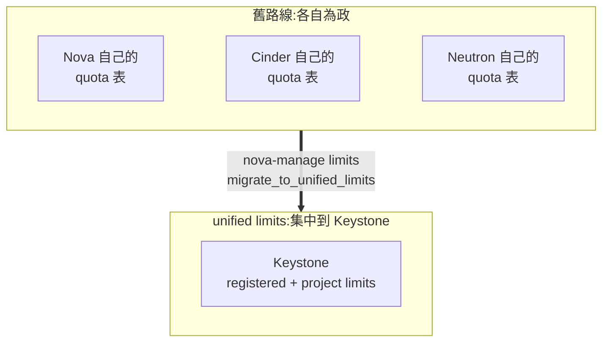
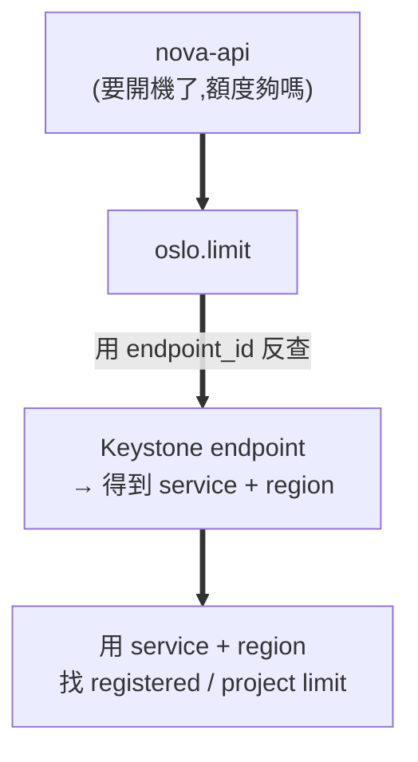
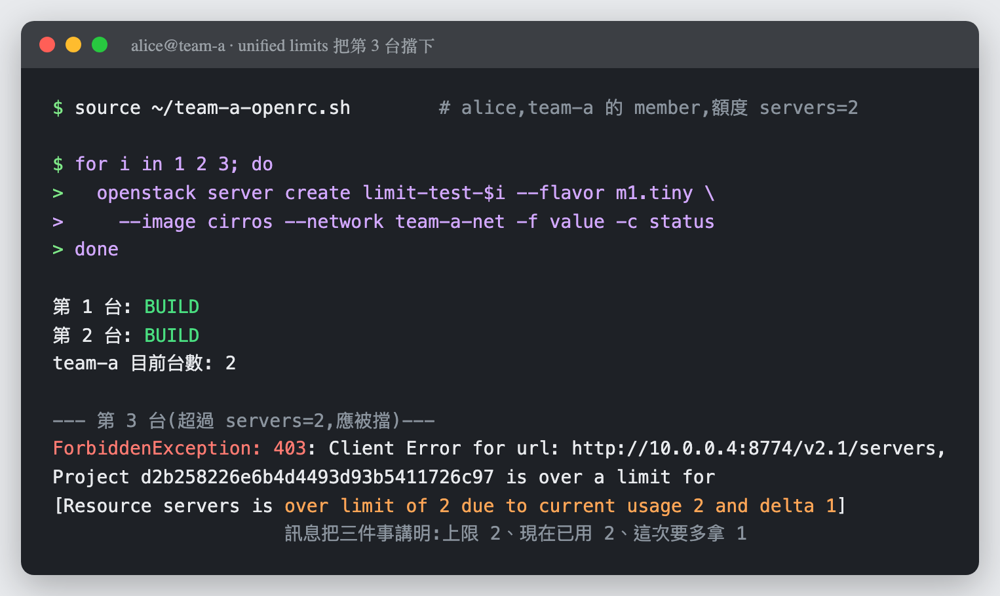

# Day 27: 多租戶治理——先有租戶,才有帳單

> Sprint 5 要把雲當生意經營,而生意的第一個問題是「**跟誰收錢**」。今天蓋出分帳的對象:Keystone 的 domain 階層、不用密碼的 application credentials、以及 2025.1 剛轉正的 **unified limits**——額度從 Nova 自己的抽屜搬進 Keystone。本章有一顆雷會**把整個 compute API 弄掛**,還有一顆讓所有額度讀成 0,以及一顆最陰險的:**查詢回空,而限制正在執行**。

{ align=right width="100" }

!!! abstract "你在課程的哪裡"
    - **Sprint 5 開始**:從「讓雲活得久」轉向「把雲當生意經營」。
    - **今天**:建立租戶結構與額度治理——後面四天的分帳對象、告警範圍、帳單抬頭,全部來自今天。
    - **今天之後**:[Day 28](sprint5-day28-ceilometer-metering.md) 讓雲說得出每個租戶用了多少。

## 第一次接觸多租戶?先讀這段

前 26 天你都是 `admin`,想開什麼開什麼。真實的雲不是這樣——它同時服務很多群互不信任的人,而 Keystone 用四層結構把他們隔開:

| 名詞 | 是什麼 | 這門課的例子 |
|---|---|---|
| **domain** | 最外層的隔離邊界,像一家公司 | `day27-corp` |
| **project** | domain 底下的資源容器,像一個部門 | `team-a`(工程)、`team-b`(資料) |
| **user** | 使用者,屬於某個 domain | `alice` |
| **role** | 使用者在**某個 project 上**的權限 | alice 在 team-a 是 `member` |

關鍵在最後一列:**權限不是使用者的屬性,是「使用者 × 專案」的關係**。同一個 alice 可以在 team-a 是 member、在 team-b 什麼都不是。這個結構就是後面所有分帳、告警、稽核的骨架。

## 原理與架構:額度搬家

「額度(quota)」這件事,OpenStack 正在做一次搬家,而 2025.1 是它轉正的版本:



搬家的理由很實際:額度散在各服務的資料庫裡,**沒有人回答得出「這個租戶總共能用多少」**。集中到 Keystone 之後,額度變成身分系統的一部分,跟角色、專案放在一起管。

兩個新名詞今天會一直出現:

- **registered limit**:全域預設。「每個專案預設可以開 10 台機器」。
- **project limit**:針對特定專案的覆寫。「但 team-a 只能開 2 台」。

而 Nova 這側靠一個叫 **oslo.limit** 的函式庫去 Keystone 查額度。**今天三顆雷有兩顆出在這個查詢的路徑上**,所以先記住它怎麼找:



**`service` 和 `region` 都對上,才查得到額度。** 對不上不會報錯——它會告訴你額度是 **0**。

## 步驟

### 步驟 1:建立租戶結構

```bash
source /etc/kolla/admin-openrc.sh
openstack domain create day27-corp --description "Sprint 5 多租戶示範"
openstack project create --domain day27-corp team-a --description "工程團隊"
openstack project create --domain day27-corp team-b --description "資料團隊"
openstack user create --domain day27-corp --password '<你的密碼>' alice
openstack role add --project team-a --project-domain day27-corp \
  --user alice --user-domain day27-corp member
```

驗證 alice 拿得到 team-a 的 token:

```bash
cat > ~/team-a-openrc.sh << 'EOF'
export OS_AUTH_URL=http://10.0.0.4:5000/v3
export OS_IDENTITY_API_VERSION=3
export OS_USERNAME=alice
export OS_PASSWORD='<你的密碼>'
export OS_USER_DOMAIN_NAME=day27-corp
export OS_PROJECT_NAME=team-a
export OS_PROJECT_DOMAIN_NAME=day27-corp
export OS_REGION_NAME=RegionOne
EOF
chmod 600 ~/team-a-openrc.sh
source ~/team-a-openrc.sh
openstack token issue -f value -c project_id
```

!!! tip "租戶要有自己的網路"
    alice 開機時會撞到這個:

    ```text
    No Network found for e279e342-5ad3-4001-810c-045bc9a98de1
    ```

    前面幾天建的 `day17-net` 屬於 admin,**team-a 根本看不到它**。這正是租戶隔離在運作。給 team-a 建自己的:

    ```bash
    openstack network create team-a-net
    openstack subnet create team-a-sub --network team-a-net --subnet-range 10.27.0.0/24 \
      --dns-nameserver 8.8.8.8
    ```

    `--dns-nameserver` 是 [Day 17 地雷 3](sprint4-day17-designate-dns.md#mine-3) 的肌肉記憶——建 subnet 必給 DNS。

### 步驟 2:Application Credentials——不用密碼的認證

CI 流程要操作雲,難道要把 alice 的密碼寫進 pipeline?**Application credential 就是為這件事存在的**:一組獨立的憑證,可以限定角色、設到期日,而且**隨時可以撤銷而不影響本人的密碼**。

```bash
source ~/team-a-openrc.sh
openstack application credential create day27-ci --role member --role reader
```

真正的驗證是**把所有帳密環境變數清空**,只靠這組憑證認證:

```bash
unset OS_USERNAME OS_PASSWORD OS_PROJECT_NAME OS_USER_DOMAIN_NAME OS_PROJECT_DOMAIN_NAME
export OS_AUTH_TYPE=v3applicationcredential
export OS_APPLICATION_CREDENTIAL_ID=<剛才的 ID>
export OS_APPLICATION_CREDENTIAL_SECRET=<剛才的 Secret>
openstack server list
```

**沒報錯 = 完全不用密碼就通過認證,並查到 team-a 的資源。**

!!! warning "Secret 只顯示一次"
    建立時那串 86 字元的 secret **之後再也查不到**。沒存下來就只能刪掉重建。另外,用腳本抓 ID 時會踩[地雷 4](#mine-4)——這個指令的 JSON 欄位名是大寫的。

### 步驟 3:unified limits 遷移

先看現況,`registered limit` 是空的:

```bash
openstack registered limit list -f value | wc -l
```

```text
0
```

Nova 提供了搬家工具,**先 dry-run**:

```bash
sudo docker exec nova_api nova-manage limits migrate_to_unified_limits --dry-run
```

```text
The following resource classes were found during the scan:
+-----------------+------------------+
| Resource        | Registered Limit |
+-----------------+------------------+
| class:DISK_GB   | missing          |
| class:MEMORY_MB | missing          |
| class:VCPU      | missing          |
+-----------------+------------------+
WARNING: It is strongly recommended to create registered limits for resource
classes missing limits in Keystone before proceeding.
```

真的執行:

```bash
sudo docker exec nova_api nova-manage limits migrate_to_unified_limits
```

```text
ec8ba3a754d44487879a381264baf009 servers 10
ec8ba3a754d44487879a381264baf009 class:VCPU 20
ec8ba3a754d44487879a381264baf009 class:MEMORY_MB 51200
ec8ba3a754d44487879a381264baf009 server_metadata_items 128
ec8ba3a754d44487879a381264baf009 server_injected_files 5
...
```

舊 quota 搬進 Keystone 了。**但這個工具留下兩個坑**:`class:DISK_GB` 沒有對應的舊 quota,所以沒補齊;而且它建出來的 limit **沒有 region**——那顆會在[地雷 2](#mine-2) 爆炸。

補上 team-a 的專屬額度(**比預設嚴格**,這樣才驗得出來):

```bash
NOVA_SVC=$(openstack service list -f value -c ID -c Type | awk '$2=="compute"{print $1}')
TEAM_A=$(openstack project show team-a -f value -c id)
openstack limit create --service "$NOVA_SVC" --region RegionOne \
  --project "$TEAM_A" --resource-limit 2 servers
openstack limit create --service "$NOVA_SVC" --region RegionOne \
  --project "$TEAM_A" --resource-limit 4 class:VCPU
```

那行 `awk` 不是為了炫技——`openstack service list --service compute` 這個寫法**不存在**([地雷 5](#mine-5))。

### 步驟 4:切換 quota driver

告訴 Nova 改用新的額度來源:

```bash
sudo tee /etc/kolla/config/nova/nova-api.conf << 'EOF'
[quota]
driver = nova.quota.UnifiedLimitsDriver

[oslo_limit]
auth_url = http://10.0.0.4:5000/v3
auth_type = password
user_domain_id = default
username = nova
password = <nova_keystone_password>
system_scope = all
endpoint_id = <nova 的 public endpoint id>
EOF
sudo cp /etc/kolla/config/nova/nova-api.conf /etc/kolla/config/nova/nova-conductor.conf
```

**`[oslo_limit]` 那一整段不能省**——少了它,整個 compute API 會 500([地雷 1](#mine-1))。而 `system_scope = all` 也不是裝飾:nova 這個使用者必須有 system 層級的讀權限,否則查不到別人專案的額度:

```bash
openstack role add --user nova --user-domain Default --system all reader
```

```bash
kolla-ansible deploy -i ~/all-in-one --tags nova
```

```text
PLAY RECAP: ok=74  changed=13  failed=0
```

### 步驟 5:驗收——第 3 台必須被擋下

team-a 的額度是 `servers=2`。開三台,前兩台該過,第三台該死:

```bash
source ~/team-a-openrc.sh
for i in 1 2 3; do
  openstack server create limit-test-$i --flavor m1.tiny --image cirros \
    --network team-a-net -f value -c status
done
```

```text
第 1 台: BUILD
第 2 台: BUILD
team-a 目前台數: 2

--- 第 3 台(超過 servers=2,應被擋)---
ForbiddenException: 403: Project d2b258226e6b4d4493d93b5411726c97 is over a limit for
[Resource servers is over limit of 2 due to current usage 2 and delta 1]
```



**額度真的擋下了,而且訊息直接告訴你上限、現況、以及這次要多拿的量。** 這就是 unified limits 在運作的樣子——注意擋人的不是 Nova 自己的抽屜,是 Keystone 裡那筆 `servers=2`。

清乾淨:`openstack server delete limit-test-1 limit-test-2`。

!!! question "這些東西在主控台看得到嗎?"
    **一半看得到,而看不到的那一半正好在示範[地雷 3](#mine-3)。**

    - **額度看得到**:Horizon 的 **專案 → Compute → Overview** 有一區 Limit Summary,把 Instances、VCPUs、RAM 的用量畫成圓餅圖(`Used 4 of 10` 這種)——那個分母就是今天設的 unified limits。
    - **domain 階層看不到**:Identity → Projects 列得出 `team-a`(工程團隊)、`team-b`(資料團隊),但 **Domain Name 那欄顯示 `-`**,不是 `day27-corp`。而導覽列裡**根本沒有 Domains 這一項**;直接打 `/identity/domains/` 會回 **`You are not authorized to access this page`**。

    最後那個「未授權」不是權限設錯——**是 admin 的 token scope 在 admin 專案上**,而 domain 是專案之上的東西。跟[地雷 3](#mine-3) 一模一樣的道理:**在 Keystone 的世界裡,你看到什麼永遠取決於你是誰**,連主控台也不例外。

    所以今天的畫面是上面那張終端機——**因為額度真正說話的地方是 API 的回應,不是圓餅圖**。

## 驗收 checkpoint

逐項驗證,**全部符合判準才算完成今天**:

| 驗證 | 判準 | 本課環境的結果 |
|---|---|---|
| domain 階層 | `day27-corp` → team-a / team-b,alice 在 team-a 是 member | 符合 |
| 租戶隔離 | alice 看不到 admin 的網路 | `No Network found`(正是隔離生效) |
| **app credential** | 清空所有帳密環境變數仍能認證 | 符合 |
| 遷移 | 舊 quota 進了 Keystone 的 registered limits | servers 10、VCPU 20、MEMORY_MB 51200… |
| compute API | 切換 driver 後 API 仍正常 | 補上 `[oslo_limit]` 後正常(見地雷 1) |
| **額度真的擋下** | 第 3 台被 403,訊息來自 unified limits | `over limit of 2 due to current usage 2 and delta 1` |
| Secure RBAC | 見下方「誠實的現況」 | △ 量不出來,列為概念討論 |

## 地雷記錄

### 地雷 1:切了 driver 沒設 `[oslo_limit]`,整個 compute API 掛掉 {#mine-1}

**症狀**:改完 `driver = nova.quota.UnifiedLimitsDriver` 重新部署後,**開機不是被擋,是整個炸開**:

```text
HttpException: 500: Server Error for url: http://10.0.0.4:8774/v2.1/servers,
Unexpected API Error... <class 'oslo_limit.exception.SessionInitError'>
```

**判讀關鍵**:**500 不是 403**。額度不足會回 403,回 500 代表**額度系統本身壞了**,不是你超額。這個區分能省下很多時間。

**根因**:`UnifiedLimitsDriver` 要向 Keystone 查額度,而查詢用的憑證放在 `[oslo_limit]` 段。只切了 driver 沒給憑證 → Nova 連 session 都建不起來 → 每個 API 請求都爆。

**解法**:補完整的 `[oslo_limit]` 段(見步驟 4),並給 nova 使用者 system 層級的 reader 角色。

**教訓**:**這是「半套設定」最惡劣的一種——它不是讓新功能失效,是讓舊功能一起死。** 切換任何核心 driver 之前,先確認它的相依設定是否完整;`--tags nova` 的部署前檢查**不會**幫你檢查 `[oslo_limit]` 在不在。

### 地雷 2:region 對不上,所有額度讀成 0 {#mine-2}

**症狀**:補完 `[oslo_limit]`,API 活了,403 也出現了——但仔細看訊息:

```text
403: Project d2b258226e6b4d4493d93b5411726c97 is over a limit for
[Resource class:DISK_GB is over limit of 0 due to current usage 0 and delta 1,
 Resource class:MEMORY_MB is over limit of 0 due to current usage 0 and delta 512,
 Resource class:VCPU is over limit of 0 due to current usage 0 and delta 1,
 Resource servers is over limit of 0 due to current usage 0 and delta 1]
```

**`over limit of 0`——每一項額度都是 0,連一台都開不了。** 但 Keystone 裡明明寫著 servers=10。

**根因**:三行輸出就破案了:

```text
=== registered limits 的 region ===
servers 10 None
class:VCPU 20 None
=== nova endpoint 的 region ===
RegionOne
```

`nova-manage limits migrate_to_unified_limits` **建出來的 limit 沒有 region**(`None`),而 nova 的 endpoint 在 `RegionOne`。oslo.limit 是用 endpoint 反查 service + region 再去找額度的——**對不上就當作沒設,而沒設就是 0**。

**解法**:重建時明確帶 `--region RegionOne`:

```bash
openstack registered limit create --service "$SVC" --region RegionOne \
  --default-limit "$V" "$R"
openstack limit create --service "$SVC" --region RegionOne \
  --project "$TEAM_A" --resource-limit 2 servers
```

**教訓**:**官方遷移工具產生的資料,不保證能被官方的執行路徑讀到。** 這不是誰寫錯了,是兩邊對「region 可以是 None 嗎」的假設不一致。跑完任何 migrate 指令,**一定要驗證結果真的生效**,而不是看到「遷移完成」就往下走。

!!! note "殘骸要清"
    舊的 `None` region 記錄有兩筆刪不掉(被 project limit 參照),於是 Keystone 裡會同時存在 `region=None` 與 `region=RegionOne` 兩份。生效的是 RegionOne 那份,None 那份是死資料——**但它會誤導之後每一次查詢**。等 project limit 也重建到 RegionOne 之後,記得回頭把 None 的殘骸清掉。

### 地雷 3:查詢回空,而限制正在執行 {#mine-3}

**這是本章最陰險的一顆**,而且它是在兩天後的 [Day 29](sprint5-day29-aodh-autoscaling.md) 才咬人的。

**症狀**:想確認 team-a 還有沒有額度限制:

```bash
openstack limit list --project $TEAM_A -f value
```

**它一個字都沒印。** 不是錯誤、不是「你沒權限看」——就是零筆結果,離開代碼 0。拿掉 `--project` 查全部,一樣什麼都沒有。

不信邪,繞過 CLI 直接問 Keystone:

```bash
curl -s -H "X-Auth-Token: $TOKEN" "http://10.0.0.4:5000/v3/limits" \
  | python3 -c "import sys,json; print('總數:', len(json.load(sys.stdin)['limits']))"
```

```text
總數: 0
```

**API 也說沒有。於是你合理地認為 team-a 沒有專案額度覆寫。然後 Nova 賞你一巴掌:**

```text
403: Project ... is over a limit for
[Resource servers is over limit of 2 due to current usage 2 and delta 1]
```

**限制一直都在,而且正在執行。**

**根因**:Keystone 的 `GET /v3/limits` **會依 token 的 scope 過濾**。用「scope 在 admin 專案」的 token 去查,只看得到 admin 專案的限制——**看別的專案就是空的,而且不會告訴你「你沒權限看」,就只是空的**。

而 Nova 看得到,是因為它的 `[oslo_limit]` 設了 `system_scope = all`(步驟 4 那行不是裝飾)。

**解法**:用 system-scoped token 查:

```bash
source /etc/kolla/admin-openrc.sh
unset OS_PROJECT_NAME OS_PROJECT_DOMAIN_NAME OS_PROJECT_ID \
      OS_TENANT_NAME OS_TENANT_ID OS_PROJECT_DOMAIN_ID
export OS_SYSTEM_SCOPE=all
openstack limit list -f value -c "Project ID" -c "Resource Name" -c "Resource Limit"
```

```text
d2b258226e6b4d4493d93b5411726c97 servers 2
d2b258226e6b4d4493d93b5411726c97 class:VCPU 4
```

**限制在那裡,一直都在。**

**教訓**:**「查詢回空」和「東西不存在」是兩件事。** 這一族的雷比報錯危險得多——報錯會停下你,回空會讓你**帶著錯誤的世界觀繼續往下走**。[Day 29 地雷 5](sprint5-day29-aodh-autoscaling.md#mine-5) 是同族(CLI 欄位顯示 `null`),[Day 17 地雷 2](sprint4-day17-designate-dns.md#mine-2) 也是(少一個點,一切照常但整合默默不動)。

**通則**:**當查詢結果讓你想說「這不可能」時,換一個身分或介面再問一次。** 在 Keystone 的世界裡,「你看到什麼」永遠取決於「你是誰」。

### 地雷 4:application credential 的 JSON 欄位是大寫 {#mine-4}

**症狀**:想用腳本抓剛建立的 credential ID:

```bash
openstack application credential create day27-ci -f json | python3 -c "
import sys,json; print(json.load(sys.stdin)['id'])"
```

```text
KeyError: 'id'
```

**根因**:直接看原始輸出就破案:

```json
{
  "ID": "fe27332a44874f6aab76bac71ac4d3d8",
  "Name": "day27-ci",
  ...
```

**這個指令的 JSON 欄位名是大寫的 `ID` / `Name` / `Secret` / `Roles`**,不像其他 openstack 指令用小寫。

**解法**:用 `-f value -c ID` 直接取值,不要自己解 JSON。

**教訓**:`openstack` CLI 的輸出格式**不是全域一致的**。與其猜欄位名,不如用 `-f value -c <欄位>` 讓 CLI 自己處理——順便避開 [Day 15 地雷 3](sprint4-day15-object-storage-rgw.md#mine-3) 那種「grep 表格」的脆弱寫法。

### 地雷 5:`openstack service list --service` 不存在 {#mine-5}

**症狀**:

```bash
openstack service list --service compute -f value -c ID
```

```text
openstack service list: error: unrecognized arguments: --service compute
```

而如果沒發現,那個空值會一路流到下一個指令:

```text
BadRequestException: 400: Invalid input for field/attribute service_id.
Value: . '' is not a 'uuid'
```

**根因**:`service list` 沒有 `--service` 這個過濾參數(那是別的指令的參數)。

**解法**:

```bash
NOVA_SVC=$(openstack service list -f value -c ID -c Type | awk '$2=="compute"{print $1}')
```

**教訓**:重點不是這個參數本身,是**「空值會安靜地往下流」**。shell 裡一個失敗的 `$(...)` 會變成空字串,然後下一個指令拿著空字串去做事,報出一個看起來完全無關的錯(`'' is not a 'uuid'`)。**寫自動化時,抓到的 ID 要立刻驗證非空**,否則你會在三步之後除一個假的錯。

## Secure RBAC:誠實的現況

[Day 26](sprint4-day26-sprint5-preview.md) 預告過今天要談「新一代權限模型」。這裡必須誠實交代:**本課環境沒能驗證它。**

Secure RBAC 是 OpenStack 這幾年在做的權限改革——引入 `reader` 角色、system/domain/project 三種 scope、以及 `enforce_scope` / `enforce_new_defaults` 兩個開關。**截至 2026-07**,Nova、Neutron、Octavia 在 2025.1 已預設開啟強制執行,Cinder 進度落後。

但這件事很難量。先讀設定檔:

```text
nova-api         enforce_scope=(未設,用預設)
neutron-server   enforce_scope=(未設,用預設)
cinder-api       enforce_scope=(未設,用預設)
```

全部「未設」——因為 kolla 沒明寫,服務吃程式碼裡的預設值。改成直接問跑著的容器:

```text
nova_api         enforce_scope/new_defaults = True True
neutron_server   enforce_scope/new_defaults = True True
cinder_api       enforce_scope/new_defaults = True True
```

看起來全開了。**但這個數字量到的是 oslo.policy 函式庫的預設值,不是各服務實際覆寫後的生效值**——兩者未必相同,而從外部沒有可靠的方法區分。

所以本章的判決是:**列為概念討論,不宣稱已驗證。** 你今天確實用到了 Secure RBAC 的一部分——步驟 4 那個 `--system all reader` 就是 system scope 加 reader 角色的實例,而且它有效([地雷 3](#mine-3) 就是靠它才看得見真相)。但「哪些服務真的在強制執行 scope」,這門課目前答不出來。

## 帶得走的東西

- **權限不是使用者的屬性,是「使用者 × 專案」的關係。** 同一個帳號在 A 專案是 member、在 B 專案什麼都不是——所有分帳、告警、稽核的邊界都從這個結構長出來。
- **額度的查詢路徑是 endpoint → service + region → limit,三段任何一段對不上,答案是 0 而不是錯誤。** 這是「錯了不會叫」在額度系統的具體長相。
- **在 Keystone 的世界裡,你看到什麼取決於你是誰。** 同一個 API、同一個查詢,project-scoped 與 system-scoped 的 token 看到的東西完全不同——而它不會告訴你「你看得不夠多」。
- **官方遷移工具產生的資料,不保證能被官方的執行路徑讀到。** 跑完任何 migrate,要驗證結果真的生效,不是看到「完成」就往下走。
- **切換核心 driver 是「連舊功能一起賭」的操作。** 相依設定少一段,壞掉的不是新功能,是整個 API。

## 延伸閱讀

想往下深挖,從這幾份開始:

- **[Nova 的 Unified Limits 指南](https://docs.openstack.org/nova/2025.1/admin/unified-limits.html)** —— `migrate_to_unified_limits`、`[oslo_limit]` 設定、以及本章[地雷 1](#mine-1) 相依設定的官方對照。
- **[Keystone Unified Limits](https://docs.openstack.org/keystone/2025.1/admin/unified-limits.html)** —— registered limit 與 project limit 的概念與 API;本章[地雷 3](#mine-3) 那個 scope 過濾行為的出處。
- **[Keystone Application Credentials](https://docs.openstack.org/keystone/2025.1/user/application_credentials.html)** —— 到期日、角色限制、access rules 等本章沒用到的進階選項。
- **[OpenStack Secure RBAC 現況](https://governance.openstack.org/tc/goals/selected/consistent-and-secure-rbac.html)** —— 這場改革的官方進度表;想自己判斷哪個服務走到哪一步,從這份開始。

## 下一步

分帳的**對象**有了。[Day 28](sprint5-day28-ceilometer-metering.md) 補上分帳的**依據**:部署 Ceilometer,讓雲說得出每個租戶到底用了多少——資料直接流進 Day 21 建好的 Prometheus。
