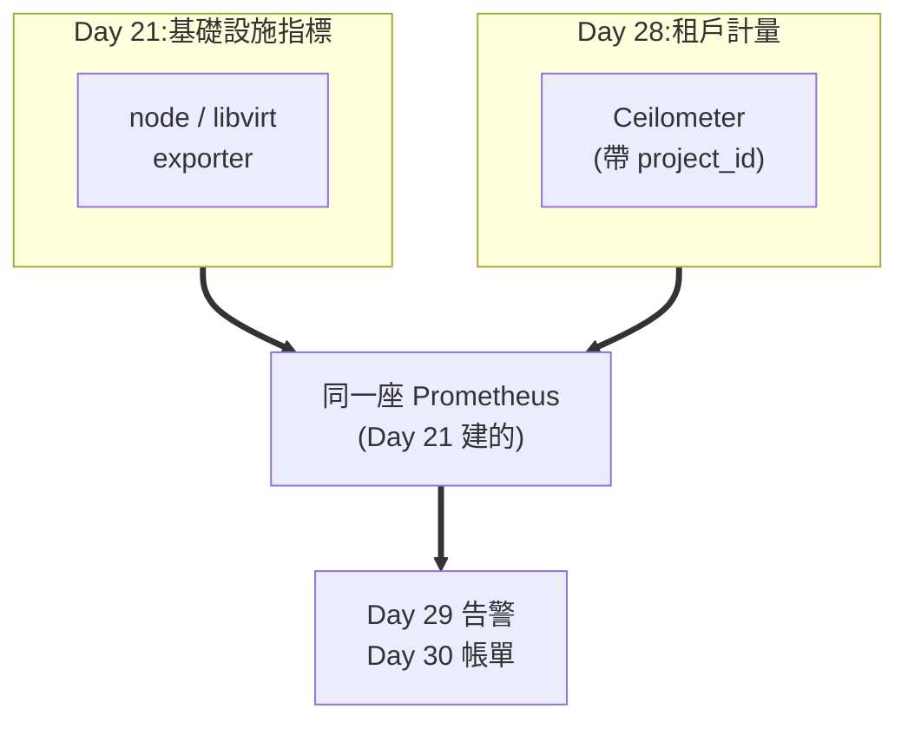
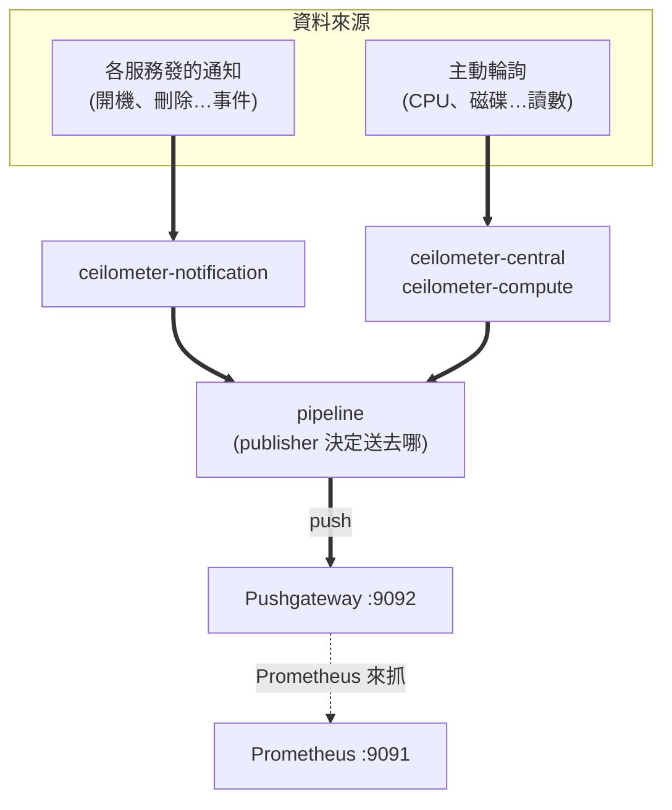
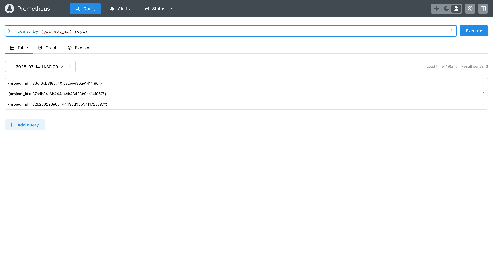

# Day 28: 計量管線——誰用了多少

> Day 27 把租戶結構蓋好了,現在有了分帳的對象。今天處理分帳的**依據**:部署 Ceilometer,讓「誰開了幾台 VM、跑了多久、用了幾 GB」變成 Day 21 那座 Prometheus 裡查得到的數字。本章要先講清楚一件事——**這條管線跟 Day 21 的監控不是同一條**,把它們搞混,Day 30 的帳單就永遠算不對。

{ align=right width="100" }

!!! abstract "你在課程的哪裡"
    - **Day 21**:Prometheus + Grafana + 集中式 log 上線,你看得見**機器**的健康。
    - **Day 27**:domains、專案、額度就緒,有了租戶邊界。
    - **今天**:讓雲說得出**每個租戶各用了多少**——計量資料流進 Day 21 那座 Prometheus。
    - **今天之後**:[Day 29](sprint5-day29-aodh-autoscaling.md) 讓這些數字觸發自動反應,[Day 30](sprint5-day30-cloudkitty-rating.md) 把它們換成錢。

## 監控與計量,不是同一件事

這是今天最容易誤會、也最該先講的一段。Day 21 之後,你可能會想:Prometheus 不是已經有一堆指標了嗎?為什麼還要裝 Ceilometer?

因為那兩批資料**回答的是不同問題**:

| | Day 21 的 exporters | 今天的 Ceilometer |
|---|---|---|
| 誰產生的 | node / libvirt / mysqld exporter | OpenStack 服務本身 |
| 回答什麼 | 這台**主機**還好嗎 | 這個**租戶**用了多少 |
| 典型指標 | 主機記憶體剩幾 GB、磁碟水位 | 這顆 VM 屬於哪個 project、開機幾小時 |
| 帶不帶租戶身分 | **不帶** | **帶 `project_id`** |
| 用途 | 維運告警 | 分帳、稽核、容量規劃 |

差別的關鍵在最後兩列。libvirt exporter 知道「這台 hypervisor 上有 12 顆 VM 在跑」,但它**不知道哪顆是誰的**——那是 OpenStack 資料庫裡的事實,只有 OpenStack 自己說得出來。



**兩條路平行前進,最後匯進同一座 Prometheus。** 這是這門課的設計紅利:Day 21 的地基直接變成 Sprint 5 的計量骨幹,不用為了計費再養一顆資料庫。

## Gnocchi 去哪了

翻開任何一本 OpenStack 教材,遙測都是三件套:**Ceilometer 蒐集 → Gnocchi 儲存 → Aodh 告警**。今天的課表卻只有頭尾兩位。

[Day 26](sprint4-day26-sprint5-preview.md) 已經把判決攤開過:Gnocchi 在 2017 年離開 OpenStack 官方治理後逐漸沉寂,主流發行版的新一代遙測架構已經把它排除在外(截至 2026-07);而官方現行路線是 **Ceilometer → Prometheus → Aodh**,下一步的 Aetos(在 Prometheus 前面加租戶隔離與 Keystone 認證的代理)更說明方向已定。

所以 Gnocchi 在這門課只以兩種身分出現:**歷史脈絡**,以及 **Aodh 部分告警型別名稱的由來**——[Day 29](sprint5-day29-aodh-autoscaling.md) 會看到 Heat 至今仍列著三種 `OS::Aodh::Gnocchi*` 資源型別,和一個 `OS::Aodh::PrometheusAlarm` 並排。那張清單本身就是這段歷史的化石。

繞過 Gnocchi 有代價,而且代價在 [Day 29](sprint5-day29-aodh-autoscaling.md#architecture) 會現形:Prometheus 這條路**存不住 resource metadata**,教科書那套「幫 VM 貼標籤再用標籤圈選機群」的做法直接失效。今天先記著這件事。

## 原理與架構

Ceilometer 用**兩種**方式取得資料,這決定了今天要動哪些服務:



兩個要點決定今天的雷區:

1. **通知那條路要對方配合**——Nova、Cinder、Neutron 得先「願意發通知」,而它們預設是關的。這需要動到那些服務,不是裝好 Ceilometer 就有([地雷 3](#mine-3))。
2. **Ceilometer 是 push,Prometheus 是 pull**——兩邊方向相反,中間要塞一個 **Pushgateway** 當轉接頭。而**kolla 不會幫你部署它**,得自己起。

!!! warning "Pushgateway 是個妥協,不是好設計"
    Prometheus 官方文件明講 Pushgateway **不該拿來把 Prometheus 變成推送式系統**——它是為「短命的批次任務」設計的。用它接 Ceilometer 是目前 kolla 提供的路,但它有個會直接影響帳單正確性的副作用,見[地雷 5](#mine-5)。動手前先知道你在用什麼。

## 步驟

### 步驟 1:起一個 Pushgateway

kolla 有 `enable_ceilometer_prometheus_pushgateway` 這個開關,但它只負責**叫 Ceilometer 把資料推去某個位址**——**那個位址上的服務要你自己準備**。

```bash
sudo docker run -d --name pushgateway --restart unless-stopped --network host \
  quay.io/prometheus/pushgateway:latest --web.listen-address=:9092
```

兩個參數都是被雷炸出來的:

- **`--network host`**——kolla 的 docker daemon 設了 `iptables: false` + `bridge: none`,**`-p` 埠映射是死的**([地雷 1](#mine-1))。
- **`:9092`**——Pushgateway 預設聽 9091,而那正是 Day 21 kolla Prometheus 的埠([地雷 2](#mine-2))。

驗證它活著,並確認兩個服務各據一埠:

```bash
curl -s -o /dev/null -w "%{http_code}\n" http://10.0.0.4:9092/-/healthy
sudo ss -tlnp | grep -E ":909[12]"
```

```text
200
10.0.0.4:9091  users:(("prometheus",pid=10788,fd=6))
*:9092         users:(("pushgateway",pid=1319183,fd=4))
```

### 步驟 2:讓 Prometheus 去抓它

kolla 支援用檔案片段擴充 Prometheus 的 scrape 設定,不必改動它自己的模板:

```bash
sudo mkdir -p /etc/kolla/config/prometheus/prometheus.yml.d
sudo tee /etc/kolla/config/prometheus/prometheus.yml.d/10-pushgateway.yml << 'EOF'
scrape_configs:
  - job_name: ceilometer-pushgateway
    honor_labels: true
    static_configs:
      - targets:
        - '10.0.0.4:9092'
EOF
```

!!! danger "`honor_labels: true` 不能省"
    Prometheus 抓取時**預設會用自己的 `job` / `instance` 覆蓋掉指標原本的標籤**。Ceilometer 推上來的資料自帶 `job="openstack-telemetry"`,被覆蓋掉的話,後面 Day 30 的 CloudKitty 就對不到它要的東西。這一行保住原始標籤。

### 步驟 3:部署 Ceilometer

```bash
sudo tee -a /etc/kolla/globals.yml << 'EOF'
# Day 28:計量管線(Ceilometer → Prometheus,不用 Gnocchi)
enable_ceilometer: "yes"
enable_ceilometer_prometheus_pushgateway: "yes"
ceilometer_prometheus_pushgateway_host: "10.0.0.4"
ceilometer_prometheus_pushgateway_port: "9092"
EOF
source ~/kolla-venv/bin/activate
kolla-ansible deploy -i ~/all-in-one --tags ceilometer,prometheus
```

```text
PLAY RECAP: ok=49  changed=18  failed=0
```

三個容器起來(central / compute / notification),Prometheus 也認得新目標了:

```text
job=ceilometer-pushgateway  health=up
總 targets: 38
```

### 步驟 4:打開通知——第一次驗收會失敗

檢查 Nova 等服務願不願意發通知:

```bash
for s in nova cinder neutron; do
  echo -n "$s: "
  sudo docker exec ${s}_api grep -A2 "^\[oslo_messaging_notifications\]" /etc/$s/$s.conf | grep driver
done
```

```text
nova:   driver = noop
cinder: driver = noop
neutron:driver = noop
```

**全是 `noop`——沒有人在發通知。** `--tags ceilometer` 只部署了 Ceilometer 自己,不會回頭去改別人的設定([地雷 3](#mine-3))。把會發通知的服務全部重跑一次:

```bash
kolla-ansible deploy -i ~/all-in-one --tags nova,neutron,cinder,glance,keystone,heat
```

```text
PLAY RECAP: ok=190  changed=52  failed=0
```

再驗一次:

```text
nova-api        driver=messagingv2  topics=notifications
cinder-api      driver=messagingv2  topics=notifications
neutron-server  driver=messagingv2  topics=notifications
glance-api      driver=messagingv2  topics=notifications
```

### 步驟 5:產生用量,然後分租戶查

開一台 VM 在 Day 27 建的租戶裡:

```bash
source /etc/kolla/admin-openrc.sh
openstack server create meter-vm --flavor m1.tiny --image cirros \
  --network team-a-net --wait
```

等一兩分鐘讓輪詢跑過,直接看 Pushgateway 收到什麼:

```bash
curl -s http://10.0.0.4:9092/metrics | grep -v "^#" | head
```

```text
compute_instance_booting_time{...} 13.29833
cpu{instance="",job="openstack-telemetry",project_id="…",resource_id="…",user_id="…"} 6.777e+10
disk_device_read_bytes{...} 2.877696e+07
disk_device_read_requests{...} 1035
disk_device_write_bytes{...} 7.303168e+07
```

指標叫 **`cpu`**,不是 `ceilometer_cpu`——**名稱沒有服務前綴**,照著猜會什麼都查不到([地雷 4](#mine-4))。

最後是今天真正的驗收。**這一條查詢就是 Day 30 帳單的全部基礎**:

```bash
PW=$(sudo grep '^prometheus_password:' /etc/kolla/passwords.yml | awk '{print $2}')
curl -s -u admin:$PW --get http://10.0.0.4:9091/api/v1/query \
  --data-urlencode "query=count by (project_id) (cpu)"
```

```text
project_id=33cf0bba…(admin)   → 1 台
project_id=37cdb341…(Trove)   → 1 台
project_id=d2b25822…(team-a)  → 1 台      ← Day 27 建的租戶
```

同一條查詢在 Prometheus 的畫面上長這樣——右上角 `Result series: 3`,三個 `project_id` 各一台:



**雲說得出每個租戶各有幾台機器了。** 縮到單一租戶也對:

```bash
curl -s -u admin:$PW --get http://10.0.0.4:9091/api/v1/query \
  --data-urlencode 'query=cpu{project_id="d2b258226e6b4d4493d93b5411726c97"}'
```

```text
resource=83b15110-76b4-4f3b-9…   cpu=3.16e+09 ns
```

那個 `project_id` label 就是 Sprint 5 後半段的命脈:**它讓 Day 29 的告警圈得出範圍、讓 Day 30 的帳單分得出租戶——全部不需要 Gnocchi。**

!!! question "為什麼今天沒有主控台畫面?"
    前幾天每個服務都有 Skyline 或 Horizon 的頁面可看,今天沒有——**因為 Ceilometer 根本沒有介面**。

    這不是 kolla 沒開,是這個服務就沒有面板。看 kolla 的 horizon role 怎麼列各服務就懂了:

    ```yaml
    - { name: "ceilometer", enabled: "{{ enable_ceilometer_horizon_policy_file }}" }   # 只有政策檔
    - { name: "cloudkitty", enabled: "{{ enable_horizon_cloudkitty }}" }               # 有面板
    - { name: "designate",  enabled: "{{ enable_horizon_designate }}" }                # 有面板
    ```

    Ceilometer 那列只有**政策檔**,沒有面板;[Day 29](sprint5-day29-aodh-autoscaling.md) 的 Aodh 更是連一列都沒有。

    **這其實很合理**:Ceilometer 是一隻沒有 API 的背景收集器,它的產出就是 Prometheus 裡的時間序列——**上面那張 Prometheus 畫面就是它的介面**。真正給人看的畫面在 [Day 30](sprint5-day30-cloudkitty-rating.md):CloudKitty 把這些數字變成帳單之後,Horizon 才有東西可以顯示。

## 驗收 checkpoint

逐項驗證,**全部符合判準才算完成今天**:

| 驗證 | 判準 | 本課環境的結果 |
|---|---|---|
| Pushgateway | `:9092` 健康檢查回 200,與 Prometheus 的 9091 不衝突 | 兩者並存 |
| Prometheus 目標 | `ceilometer-pushgateway` 這個 job 為 `up` | up(總 targets 38) |
| Ceilometer 容器 | central / compute / notification 全起來 | 符合 |
| **通知已開** | nova/cinder/neutron 的 driver 為 `messagingv2` | 重跑後符合(見地雷 3) |
| 資料進來 | Pushgateway `/metrics` 有 `job="openstack-telemetry"` 的指標 | 48 行 |
| **分租戶計量** | `count by (project_id) (cpu)` 查得到各租戶 | 3 個 project,含 team-a |

## 地雷記錄

### 地雷 1:kolla 的 docker 沒有 iptables,`-p` 是死的 {#mine-1}

**症狀**:第一次用標準寫法起 Pushgateway:

```bash
sudo docker run -d --name pushgateway -p 10.0.0.4:9092:9091 \
  quay.io/prometheus/pushgateway:latest
```

容器 `Up`,健康檢查卻是:

```text
pushgateway :9092 → HTTP 000
```

**根因**:kolla 的 docker daemon 設了 **`iptables: false` + `bridge: none`**。埠映射(`-p`)靠的正是 docker 寫 iptables 規則——這兩個關掉,**`-p` 完全失效**,而且不會報錯,只是沒人在聽。

**解法**:跟 kolla 自己的容器一樣走主機網路。

```bash
sudo docker run -d --name pushgateway --restart unless-stopped --network host \
  quay.io/prometheus/pushgateway:latest --web.listen-address=:9092
```

**教訓**:**在 kolla 主機上自己跑容器,一律 `--network host`**,埠用參數指定而不是用 `-p` 映射。這是 kolla 的網路設計(它把網路完全交給主機)必然的長尾效應,在這台機器上會一犯再犯。

### 地雷 2:Pushgateway 預設 9091,正好撞上 kolla 的 Prometheus {#mine-2}

已在步驟 1 預拆。Pushgateway 官方預設埠是 **9091**,而 [Day 21](sprint4-day21-observability.md) 記過 kolla 把 Prometheus 放在 **9091**(不是慣例的 9090)——兩個 9091 對撞。

這是本課程的老主旋律了:Day 14 的監控套件、Day 15 的 port 80、今天的 9091。**在同一台機器上堆越多服務,「預設埠相撞」就從意外變成常態**——裝任何新東西之前,先 `ss -tlnp` 看一眼。

### 地雷 3:`--tags ceilometer` 不會回頭打開別人的通知 {#mine-3}

**症狀**:Ceilometer 三個容器全部健康、log 沒有任何錯誤、pollster 也確實在跑,但通知那條路一筆資料都沒有。查下去發現 nova/cinder/neutron 的 `oslo_messaging_notifications` driver 全是 `noop`。

**根因**:Ceilometer 的通知來源是**別的服務**發出來的訊息。`enable_ceilometer` 會讓 kolla 在**下次部署那些服務時**把它們的 driver 改成 `messagingv2`——但 `--tags ceilometer` 只跑 Ceilometer 自己的 role,**那些服務根本沒被碰到**,設定檔停在舊版。

**解法**:把所有會發通知的服務重跑一次。

```bash
kolla-ansible deploy -i ~/all-in-one --tags nova,neutron,cinder,glance,keystone,heat
```

**教訓**:這是 [Day 22](sprint4-day22-upgrade-backup.md) 那顆「`--tags` 的檢查盲區」的同族,而且更陰險——Day 22 那顆至少會在部署時失敗,這顆**部署全綠、服務全健康、log 全乾淨,只是資料默默不來**。

**通則**:當某個開關的效果**跨越服務邊界**(A 服務開了,要 B 服務配合),`--tags A` 一定不夠。開之前先問一句:**這個 flag 會改到誰的設定檔?**

### 地雷 4:指標名稱沒有 `ceilometer_` 前綴 {#mine-4}

**症狀**:VM 開好了、pollster 在跑、pipeline 的 publisher 也對:

```text
publishers:
    - prometheus://10.0.0.4:9092/metrics/job/openstack-telemetry
```

但這樣查,連續十次都是 0:

```bash
curl -s http://10.0.0.4:9092/metrics | grep -c "^ceilometer_"
```

```text
0
```

**根因**:**問題出在 grep,不在管線。** Ceilometer 推出來的指標就叫 `cpu`、`memory_usage`、`disk_device_read_bytes`,**沒有任何前綴**。管線從頭到尾都是好的,只有我的假設是錯的。

**解法**:別假設名字,把原始輸出直接看一遍:

```bash
curl -s http://10.0.0.4:9092/metrics | grep -v "^#" | head
```

**教訓**:這顆的教訓不是關於 Ceilometer,是關於**除錯姿勢**。「查不到」有兩種可能:東西不在,或**你問錯問題**。而錯的問題問十次還是錯的。**當一個查詢回傳空值時,先確認那個查詢本身是對的**——最快的方法是把過濾條件全部拿掉,看看原始資料長什麼樣。這一招在 [Day 29](sprint5-day29-aodh-autoscaling.md#mine-4) 會再救一次命。

### 地雷 5:Pushgateway 永遠記得已經刪掉的機器 {#mine-5}

**症狀**:Prometheus 裡有一筆 `vcpus` 指標,拿它的 `resource_id` 去查:

```bash
openstack server show a0500345-2306-4b09-90d2-82b2b7c209b9
```

```text
No Server found for a0500345-2306-4b09-90d2-82b2b7c209b9
```

**這台 VM 早就被刪了,它的指標卻還在,而且會一直在。**

**根因**:Pushgateway 的設計就是**保存最後一次推送的值,直到被覆蓋或明確刪除**。它是為「跑完就消失的批次任務」設計的——任務死了,值還要留著給 Prometheus 抓。用在計量上,這個特性變成:**VM 刪掉之後,它最後的讀數永遠留在那裡**。

**影響**:對 [Day 30](sprint5-day30-cloudkitty-rating.md) 的帳單來說,這代表**可能對不存在的機器持續收錢**。本課環境的帳單之所以沒被汙染,是因為 CloudKitty 用 `max_over_time(...[1h])` 這種**帶時間窗口**的查詢——窗口滑過去之後,舊資料就落在窗外了。但如果你用的是 instant query(`count(cpu)` 這種),幽靈機器會直接算進去。

**教訓**:這是整條管線最根本的設計債,而它來自一個**用途錯配**——Prometheus 官方文件明確說 Pushgateway 不該拿來當推送式監控的通用轉接頭,而 kolla 的 `enable_ceilometer_prometheus_pushgateway` 就是這樣用的。這不是 kolla 的錯,是 push 型計量硬要接上 pull 型監控的必然代價,也正是官方推 **Aetos** 想解決的問題之一。

**實務上要記得**:計費查詢一律帶時間窗口,別用 instant query;定期清理 Pushgateway(`DELETE /metrics/job/openstack-telemetry/...`)也是一種辦法,但要小心別刪到還在用的。

## 帶得走的東西

- **監控與計量回答的是不同問題,差別在「帶不帶身分」。** exporter 知道機器上有 12 顆 VM,但不知道哪顆是誰的;租戶歸屬只有 OpenStack 自己說得出來,這就是 Ceilometer 存在的理由。
- **當一個開關的效果跨越服務邊界,`--tags A` 一定不夠。** 開之前先問:這個 flag 會改到誰的設定檔?改到別人的,就要把別人也重跑一次。
- **查詢回空有兩種可能:東西不在,或你問錯問題。** 先把過濾條件全部拿掉看原始資料,再回頭修查詢——這比連問十次同一個錯問題快。
- **Pushgateway 記得所有推送過的東西,包括已經不存在的資源。** push 型計量硬接 pull 型監控,這是必然的代價;計費查詢一律帶時間窗口。
- **背景服務沒有畫面是設計,不是缺漏。** 計量給機器讀,帳單才給人看。

## 延伸閱讀

想往下深挖,從這幾份開始:

- **[Ceilometer 官方文件](https://docs.openstack.org/ceilometer/2025.1/)** —— 計量、pipeline、publisher 的完整概念;`polling.yaml` 與 `pipeline.yaml` 的權威說明。
- **[Kolla-Ansible 的 Ceilometer 指南](https://docs.openstack.org/kolla-ansible/2025.1/reference/logging-and-monitoring/index.html)** —— 本章 globals 設定的官方對照。
- **[Prometheus Pushgateway:什麼時候不該用它](https://prometheus.io/docs/practices/pushing/)** —— 官方親自說明 Pushgateway 的正確用途與陷阱;本章[地雷 5](#mine-5) 的理論出處。
- **[Aetos(遙測的下一步)](https://docs.openstack.org/aetos/latest/)** —— 在 Prometheus 前面加租戶隔離與 Keystone 認證的官方代理;[Day 26](sprint4-day26-sprint5-preview.md) 判定「方向已定」的證據之一。

## 下一步

雲說得出誰用了多少了。[Day 29](sprint5-day29-aodh-autoscaling.md) 讓這些數字**產生後果**:Aodh 盯著它們,超標時叫 Heat 自己加機器——順便補完 Day 5 沒教的 autoscaling。
