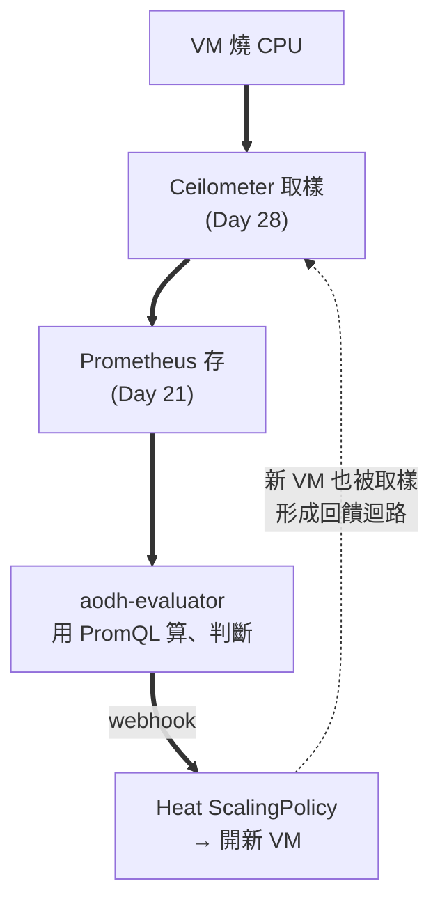
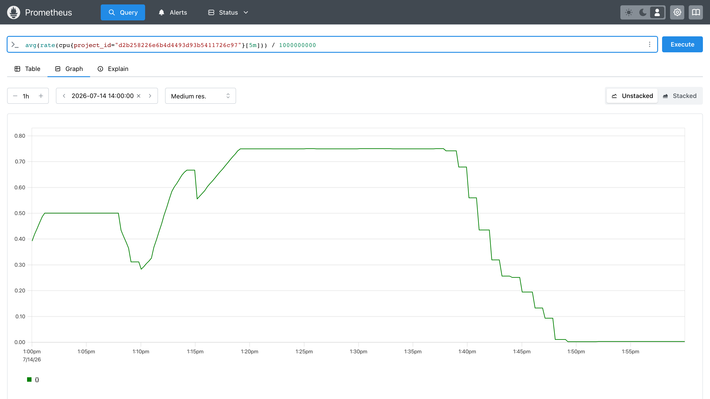

# Day 29: 告警與自動擴縮——讓雲自己反應

> Day 28 把用量變成了 Prometheus 裡的數字。今天讓那些數字**產生後果**:Aodh 用 PromQL 盯著它們,超標時通知 Heat 自己長出機器,負載退了再自己收回去。同時補上 Day 5 沒教完的 Heat autoscaling。本章的價值不在「裝起來」——而在官方主推的這條路上,有四個缺口是文件不會告訴你的,包括**官方範例至今仍在用一個會回 403 的寫法**。

{ align=right width="100" }

!!! abstract "你在課程的哪裡"
    - **Day 28**:計量資料流進 Prometheus,而且每筆都帶 `project_id`。
    - **今天**:Aodh 用 PromQL 查那些資料下判斷 → 觸發 Heat 的擴縮政策 → VM 自動增減。
    - **今天之後**:[Day 30](sprint5-day30-cloudkitty-rating.md) 把同一批數字換算成帳單。

## 第一次接觸 Aodh?先讀這段

**Aodh 是 OpenStack 的 CloudWatch Alarms**。它本身不存資料、也不畫圖,只做一件事:**定期問一次「現在的數字超標了嗎」,狀態變化時打通知出去**。

三個名詞今天會一直出現:

- **alarm(告警)**:一條規則。「team-a 的平均 CPU 超過 0.4 顆核」就是一條。
- **state(狀態)**:每條告警永遠處在 `ok`(沒超標)、`alarm`(超標)、`insufficient data`(算不出來)三者之一。
- **action(動作)**:狀態變化時要打的 webhook。`alarm_actions` 在轉為超標時打,`ok_actions` 在轉回正常時打。

第三個狀態 `insufficient data` 今天會咬人:**它既不觸發 `alarm_actions`、也不觸發 `ok_actions`**。告警卡在這個狀態時,整條鏈默默不動,而且沒有任何錯誤。

## 原理與架構 {#architecture}

今天要接起來的是一條四棒接力,每一棒的交接處都有雷:



**注意最後那條虛線**:擴容出來的新機器會再被計量,平均值因此改變——這是一個閉環的控制系統,不是單向管線。這件事在[步驟 5](#step-5) 會產生一個很好看的結果。

### 一個先天限制,決定了今天的設計

教科書的 Heat autoscaling 是這樣鎖定「哪些機器算同一組」的:

```yaml
metadata: {"metering.server_group": {get_param: "OS::stack_id"}}   # 幫 VM 貼標籤
type: OS::Aodh::GnocchiAggregationByResourcesAlarm                 # 再用標籤篩
```

它成立的前提是 **Gnocchi 存得住 resource metadata**。而 Ceilometer 推進 Prometheus 的指標,身上只有四個 label:

```text
__name__      = cpu
job           = openstack-telemetry
project_id    = d2b258226e6b4d4493d93b5411726c97
resource_id   = dd3cfe9a-0301-470c-bef5-c8620dc4e3f5
user_id       = 1384190dc01245789ea1465816402146
```

**沒有 `server_group`,沒有任何自訂 metadata。**[Day 26](sprint4-day26-sprint5-preview.md) 講的「儲存層換人」在這裡露出代價:換掉 Gnocchi,也換掉了「用任意標籤圈選機群」的能力。Prometheus 路線能拿來收斂範圍的,只剩 `project_id` 與 `user_id`。

所以今天的做法是:**一個 scaling group 一個 project**。這聽起來像將就,其實正是 [Day 27](sprint5-day27-multi-tenant-governance.md) 蓋好的東西——租戶邊界本來就該是資源邊界。缺口與解法在這裡剛好對上。

## 步驟

### 步驟 1:部署 Aodh

```bash
echo 'enable_aodh: "yes"' | sudo tee -a /etc/kolla/globals.yml
source ~/kolla-venv/bin/activate
kolla-ansible deploy -i ~/all-in-one --tags aodh
```

四個容器(api / evaluator / notifier / listener)healthy 即可續行。

### 步驟 2:讓 Aodh 找得到 Prometheus

建一條 PromQL 告警試試:

```bash
pip install python-aodhclient        # CLI 外掛,同型雷第 N 次
source /etc/kolla/admin-openrc.sh
TEAM_A=$(openstack project show team-a -f value -c id)
openstack alarm create --type prometheus --name day29-vm-count \
  --query "count(cpu{project_id=\"$TEAM_A\"})" \
  --comparison-operator ge --threshold 1 --evaluation-periods 1 --granularity 60
```

告警建立成功,但狀態停在 `insufficient data`,evaluator 的 log 說:

```text
Could not load 'prometheus': Can't find prometheus host and port configuration
```

**Aodh 不從 Keystone 服務目錄找 Prometheus**——它讀一個設定檔,而 **kolla 不會產生這個檔**(完整判讀見[地雷 1](#mine-1))。自己補:

```bash
PW=$(sudo grep '^prometheus_password:' /etc/kolla/passwords.yml | awk '{print $2}')
sudo mkdir -p /etc/openstack
sudo tee /etc/openstack/prometheus.yaml << EOF
host: admin:${PW}@10.0.0.4
port: 9091
EOF
```

!!! warning "那個 `admin:密碼@` 不是筆誤"
    Day 21 的 Prometheus 有 basic auth,而 Aodh 這條鏈上**沒有任何地方可以填帳號密碼**([地雷 2](#mine-2))。把憑證內嵌進 host 字串是唯一不必拆掉認證的解法。

檔案在主機上,但 Aodh 跑在容器裡——用 kolla 的官方機制掛進去:

```bash
sudo tee -a /etc/kolla/globals.yml << 'EOF'
aodh_extra_volumes:
  - "/etc/openstack:/etc/openstack:ro"
EOF
kolla-ansible deploy -i ~/all-in-one --tags aodh
```

### 步驟 3:第一條告警,兩個方向都要驗

```bash
openstack alarm show day29-vm-count -f value -c state -c state_reason
```

```text
alarm
Transition to alarm due to 1 samples outside threshold, most recent: 1.0
```

超標會叫了。但**只驗一個方向不算驗**——條件不成立時它必須回得來,否則你分不清「真的在算」和「卡在 alarm 動不了」:

```bash
openstack alarm update day29-vm-count --threshold 99
```

門檻改成 99(不可能達到),狀態應回 `ok`。這裡要用 API 看,不要用 CLI:

```bash
TOKEN=$(openstack token issue -f value -c id)
AODH=$(openstack endpoint list --service alarming --interface public -f value -c URL)
curl -s -H "X-Auth-Token: $TOKEN" "$AODH/v2/alarms/<alarm-id>" | python3 -m json.tool
```

```json
"state": "ok",
"prometheus_rule": {
  "comparison_operator": "ge",
  "threshold": 99.0,
  "query": "count(cpu{project_id=\"d2b258226e6b4d4493d93b5411726c97\"})"
}
```

`threshold 1 → alarm`、`threshold 99 → ok`,**兩個方向都對,告警是真的在算**。至於為什麼不用 `openstack alarm show` 看規則——見[地雷 5](#mine-5)。

驗完把門檻改回來:`openstack alarm update day29-vm-count --threshold 1`。

### 步驟 4:Heat autoscaling 補課

[Day 5](sprint3-day5-barbican-heat.md) 教了 Heat 的範本與 stack,但沒教**自動擴縮**。補上三個資源:

| 資源 | 做什麼 |
|---|---|
| `OS::Heat::AutoScalingGroup` | 一群同規格的 VM,有 `min_size` / `max_size` 上下限 |
| `OS::Heat::ScalingPolicy` | 一個「加一台」或「減一台」的動作,附帶 `cooldown` |
| `OS::Aodh::PrometheusAlarm` | 條件成立時去打 ScalingPolicy 的 webhook |

先確認 Heat 認得這個告警型別:

```bash
openstack orchestration resource type list | grep -i aodh
```

```text
| OS::Aodh::Alarm                              |
| OS::Aodh::CompositeAlarm                     |
| OS::Aodh::EventAlarm                         |
| OS::Aodh::GnocchiAggregationByMetricsAlarm   |
| OS::Aodh::GnocchiAggregationByResourcesAlarm |
| OS::Aodh::GnocchiResourcesAlarm              |
| OS::Aodh::LBMemberHealthAlarm                |
| OS::Aodh::PrometheusAlarm                    |
```

三種 Gnocchi 型別仍在(教科書那條路),而 `PrometheusAlarm` 也已經是一等公民——[Day 26](sprint4-day26-sprint5-preview.md) 講的路線之爭,在這張清單上看得一清二楚。

### 步驟 5:接起來,看它自己跑完一輪 {#step-5}

完整範本([`day29-autoscale.yaml`](#full-template)在本頁最後):

```yaml
  cpu_high:
    type: OS::Aodh::PrometheusAlarm
    properties:
      query:
        str_replace:
          template: 'avg(rate(cpu{project_id="PID"}[5m])) / 1000000000'
          params:
            PID: { get_param: project_id }
      comparison_operator: gt
      threshold: 0.4
      alarm_actions:
        - str_replace:
            template: trust+url
            params:
              url: { get_attr: [scale_out, signal_url] }
```

三個地方值得停下來看:

**`rate(cpu[...]) / 1000000000`**——`cpu` 是累計的 CPU 奈秒數,取速率再除以 10⁹ 就是「用掉幾顆核」。窗口 `[5m]` 不能再短,原因見[地雷 4](#mine-4)。

**`trust+url`**——這不是筆誤,`str_replace` 會把它變成 `trust+http://...`。**官方 autoscaling 範例用的 `alarm_url` 在本課環境會回 403**([地雷 3](#mine-3)),這是今天最大的一顆。

**用 `project_id` 收斂**——就是前面說的那個先天限制。

以租戶身分建立 stack(這朵雲的日常操作本來就不該全用 admin):

```bash
source ~/team-a-openrc.sh
openstack stack create day29-as -t ~/day29-autoscale.yaml \
  --parameter project_id=$TEAM_A --wait
```

範本裡的 VM 開機後會燒 CPU 一段時間再自己停。接下來**什麼都不用做**,看它跑:

```text
13:08:28  aodh notifier  →  gets response: 200 OK
13:08:30  ASG 巢狀 stack UPDATE started
13:08:43  UPDATE completed          →  2 台
13:08:44  scale_out  Remaining as alarm due to 1 samples outside threshold,
                     most recent: 0.40572612101851857

13:13:28  aodh notifier  →  gets response: 200 OK
13:13:45  scale_out  most recent: 0.6274204384722222   →  3 台(max_size)

13:43:36  scale_in   Transition to ok due to 1 samples inside threshold,
                     most recent: 0.25709375           →  2 台
13:48:36  scale_in   Remaining as ok ... most recent: 0.010958333333333334
                                                       →  1 台(min_size)
```

**1 → 2 → 3 → 2 → 1**,負載上升擴到天花板,燒錄結束縮回地板。

那些 `most recent:` 的數字是決定性證據:**Heat 收到的訊號裡帶著 Aodh 現算出來的 PromQL 結果**,而且每次都不一樣(0.4057 → 0.6274 → 0.2571 → 0.0110),忠實反映負載的起落。

同一段時間,把告警用的那條查詢畫成圖,整件事一眼看完:



對照著看更有意思:

- **13:10 與 13:15 那兩個凹陷**——正是新機器加進來、還沒開始燒 CPU,把平均值拉低的瞬間。這就是前面那條回饋虛線的實體。
- **13:19 之後平在 0.75**——三台全在燒,`max_size` 到頂,再高也不會有第四台。
- **13:38 起一路下滑到 0**——燒錄陸續結束,`ok_actions` 把機器收回 `min_size`。

!!! question "Aodh 的告警清單在哪個主控台看?"
    **哪裡都看不到——Aodh 沒有面板。** [Day 28](sprint5-day28-ceilometer-metering.md) 那則說明提過:kolla 的 horizon role 逐一列出各服務時,Ceilometer 只有政策檔,**Aodh 連一列都沒有**。

    所以今天的告警只能用 `openstack alarm` 系列指令或 API 查——而[地雷 5](#mine-5) 還告訴你,連 CLI 都看不全(prometheus 型告警的規則要問 API)。**Sprint 5 到目前為止唯一有畫面的服務是 CloudKitty**,那是 [Day 30](sprint5-day30-cloudkitty-rating.md) 的事。

    上面那張 Prometheus 曲線之所以珍貴,正是因為它是這一天**唯一看得見**的東西。

!!! note "凹陷差點造成誤判"
    13:10 那個凹陷掉到 **0.28**,已經低於 0.4 的門檻。如果 Aodh 剛好在那一刻評估,它會判定 `ok` 並開始縮容——**擴容才剛做完就反手縮回去**,也就是 flapping。這一輪沒被觸發,只因為 `evaluation_interval` 預設 300 秒、剛好跨過那個凹陷——**那是時間點的巧合,不是機制的保證**。擋 flapping 要靠 `cooldown` 明確設定,不能指望評估週期夠鈍。

!!! note "最後一筆是 `ok → ok`,不是轉態"
    `repeat_actions` 預設為 `true`,意思是**只要還停在該狀態,每次評估都會再送一次動作**。所以縮容不是只發生一次,而是一路把機器數走回 `min_size`。這個預設值決定了擴縮的行為,值得記住。

!!! warning "別用機器數量判斷擴容成功"
    ASG 數量從 1 變 2,在**滾動更新**(改了範本觸發 VM 汰換)期間也會出現——先建新的再刪舊的,中間必然短暫看到 2 台。兩者在數字上一模一樣,光看台數分不出來。**要看 notifier 的 `200 OK` 加上 stack event 裡的 signal 記錄**,那才是因果。

## 驗收 checkpoint

逐項驗證,**全部符合判準才算完成今天**:

| 驗證 | 判準 | 本課環境的結果 |
|---|---|---|
| Aodh 容器 | api / evaluator / notifier / listener 全 healthy | 符合 |
| 插件載入 | evaluator log 無 `Could not load 'prometheus'` | 載入失敗次數 0 |
| **告警雙向** | 門檻 1 → `alarm`;門檻 99 → `ok` | 兩個方向都對(API 原始 JSON 為證) |
| webhook 送達 | notifier 回應 2xx | `gets response: 200 OK` |
| **擴容全鏈** | 告警觸發後 Heat 真的加機器 | 200 OK → 2 秒後 ASG UPDATE → 新 VM |
| 訊號內容 | Heat 收到的 signal 帶真實 PromQL 值 | `most recent: 0.40572612101851857` |
| 縮容 | 負載結束後回到 `min_size` | 3 → 2 → 1 |

## 地雷記錄

### 地雷 1:Aodh 不讀 Keystone 服務目錄,而 kolla 不產它要的檔 {#mine-1}

**症狀**:`Could not load 'prometheus': Can't find prometheus host and port configuration`。

**根因**:兩層。第一層,`observabilityclient` 找 Prometheus 的方式是**讀設定檔**,不是查 Keystone 目錄——它依序找 `/var/lib/aodh/.config/openstack/` 與 `/etc/openstack/` 下的 `prometheus.yaml`,只認得 `host` / `port` / `ca_cert` 三個鍵(或環境變數 `PROMETHEUS_HOST` / `PROMETHEUS_PORT`)。第二層,**kolla 完全不產生這個檔**。

**解法**:自己寫 `/etc/openstack/prometheus.yaml`,再用 `aodh_extra_volumes` 掛進容器。

**教訓**:OpenStack 裡「一個服務怎麼找到另一個服務」有三種機制——Keystone 服務目錄、設定檔、環境變數——而且**沒有統一規則**。在 Keystone 註冊一個 `metric` endpoint 對這條路完全無效,因為 Aodh 根本不看目錄。遇到「找不到某服務」時,先確認它用的是哪一種,再動手。

### 地雷 2:Prometheus 有認證,而這條鏈上沒有地方填帳密 {#mine-2}

**症狀**:設定檔補好、插件載入成功,換成 `[401] Unauthorized`。

**根因**:Day 21 的 kolla Prometheus 帶 basic auth。但 `observabilityclient` 的設定檔 schema **只有 host / port / ca_cert,沒有帳密欄位**——底層 client 明明有 `set_basic_auth()`,整條鏈卻沒人呼叫它。

**解法**:client 是拿 host 字串直接拼 URL 的,所以把憑證內嵌進去可行:

```yaml
host: admin:<prometheus_password>@10.0.0.4
port: 9091
```

**教訓**:這是「上游功能缺口」的典型長相——不是 bug,是沒人接上。另一條路是把 Prometheus 的認證關掉,但那是**為了讓監控能用而拆掉監控的門鎖**,不該是預設反應。先找不犧牲安全的解法。

### 地雷 3:官方 autoscaling 範例的 `alarm_url` 會回 403 {#mine-3}

**症狀**:告警正確轉態、notifier 也確實送出了,但 Heat 回:

```text
Notifying alarm <...> gets response: 403 AccessDenied.
```

手動打那個 URL,拿到完整訊息:

```xml
<ErrorResponse><Error><Type>Sender</Type><Code>AccessDenied</Code>
<Message>User is not authorized to perform action</Message></Error></ErrorResponse>
```

**根因**:`OS::Heat::ScalingPolicy` 的 `alarm_url` 是一個 **CFN 風格的 EC2 簽章 URL**。Heat 收到後會把憑證送去 Keystone 的 `/v3/ec2tokens` 驗證,而那裡回 401:

```text
INFO  heat.api.aws.ec2token  Authenticating with http://10.0.0.4:5000/v3/ec2tokens
ERROR heat.api.aws.ec2token  Failed to obtain a Keystone token from None:
      keystoneauth1.exceptions.http.Unauthorized: (HTTP 401)
```

**解法**:改用現代路線 `trust+url`——Aodh 的 `trust+http` 通知器用 **Keystone trust** 拿 token 打 Heat 的原生 API(8004),完全不碰 EC2 簽章:

```yaml
      alarm_actions:
        - str_replace:
            template: trust+url
            params:
              url: { get_attr: [scale_out, signal_url] }
```

改完立刻從 403 變 200 OK。確認 Aodh 認得這個 scheme:

```bash
sudo docker exec aodh_notifier python3 -c "
from importlib.metadata import entry_points
for ep in entry_points(group='aodh.notifier'): print(ep.name)"
```

```text
http  https  log  test  trust+heat  trust+http  trust+https  trust+zaqar  zaqar
```

**教訓**:這顆最值錢,因為**官方文件的 autoscaling 範本至今仍寫 `alarm_url`**。照著抄不會語法錯、stack 會建成功、告警也會轉態——只有最後一棒默默 403。**「範例能跑」和「範例是對的」是兩件事**,而年代久遠的範例最容易在認證機制上過期。

### 地雷 4:取樣太稀,告警卡在 `insufficient data` 而且不叫 {#mine-4}

**症狀**:告警停在 `insufficient data`,PromQL 查詢回空,零錯誤訊息。

**判讀關鍵**:先把告警用的那條查詢**自己打一次**。這是本章最有用的除錯手勢——它一秒分辨「Aodh 壞了」和「查詢本來就沒結果」:

```bash
for W in 1m 2m 3m 5m; do
  curl -s -u admin:$PW --get http://10.0.0.4:9091/api/v1/query \
    --data-urlencode "query=avg(rate(cpu{project_id=\"$TEAM_A\"}[$W]))"
done
```

```text
rate(cpu[1m]) → 空(算不出來)
rate(cpu[2m]) → 0.0
rate(cpu[5m]) → 0.0
```

**根因**:兩件事相乘。`rate()` 需要窗口內**至少兩個取樣點**才算得出速率;而 Ceilometer 的預設取樣間隔是 **300 秒**:

```yaml
# 容器內 /etc/ceilometer/polling.yaml
sources:
    - name: some_pollsters
      interval: 300
```

五分鐘一個點,`[1m]` 的窗口裡永遠只有 0~1 個點 → `rate()` 回空 → 告警算不出來 → `insufficient data`。

**解法**:把取樣調密,窗口留寬:

```bash
sudo mkdir -p /etc/kolla/config/ceilometer
sudo docker exec ceilometer_central cat /etc/ceilometer/polling.yaml \
  | sed 's/interval: 300/interval: 60/' \
  | sudo tee /etc/kolla/config/ceilometer/polling.yaml
kolla-ansible deploy -i ~/all-in-one --tags ceilometer
```

60 秒取樣配 `[5m]` 窗口 = 窗口內五個點,穩。

**教訓**:`insufficient data` **既不觸發 `alarm_actions` 也不觸發 `ok_actions`**——整條自動化鏈就這樣靜靜地不動,沒有錯誤、沒有告警、沒有任何人通知你。**它是三個狀態裡最危險的一個**,因為 `ok` 至少代表「算過了,沒事」,而 `insufficient data` 代表「根本沒算」。看到它,先查資料源,別查 Aodh。

!!! tip "順帶算一下端到端延遲"
    Ceilometer 取樣 60s + `rate()` 窗口 5m + **Aodh 的 `evaluation_interval` 預設 300s** —— 從負載真的上升到機器真的長出來,最壞情況要好幾分鐘。這不是故障,是這條鏈的物理極限。要更快就得三個一起調,而每一個都有代價。

### 地雷 5:CLI 的 `rule` 欄對 prometheus 告警顯示 `null` {#mine-5}

**症狀**:`openstack alarm show <name> -f json` 的 `rule` 欄是 `null`,看起來像規則沒設定。

**根因**:prometheus 型告警的規則存在 **`prometheus_rule`** 這個欄位裡,CLI 的 `rule` 欄對不上,於是顯示 `null`。規則其實好端端在那。

**解法**:驗規則就問 API。

**教訓**:這是今天第一顆「**顯示不等於真相**」——CLI 沒說謊,它只是沒顯示。[Day 27](sprint5-day27-multi-tenant-governance.md) 還有一顆更狠的同族(查詢直接回空,而限制正在執行)。**當 CLI 的輸出讓你想說「這不可能」時,換個介面問一次。**

## 完整範本 {#full-template}

```yaml
heat_template_version: 2021-04-16

description: Day 29 - PromQL 驅動的自動擴縮

parameters:
  project_id:
    type: string
    description: 用 project_id 收斂告警範圍(Prometheus 路線沒有 server_group label)

resources:

  asg:
    type: OS::Heat::AutoScalingGroup
    properties:
      min_size: 1
      max_size: 3
      desired_capacity: 1
      resource:
        type: OS::Nova::Server
        properties:
          image: cirros
          flavor: m1.tiny
          networks:
            - network: team-a-net
          user_data_format: RAW
          user_data: |
            #!/bin/sh
            # 開機後燒 CPU 30 分鐘再自己停
            # cirros 的 busybox 沒有 timeout 指令,只能自己算時間
            (
              END=$(( $(date +%s) + 1800 ))
              while [ "$(date +%s)" -lt "$END" ]; do
                i=0; while [ $i -lt 200000 ]; do i=$((i+1)); done
              done
            ) &

  scale_out:
    type: OS::Heat::ScalingPolicy
    properties:
      adjustment_type: change_in_capacity
      auto_scaling_group_id: { get_resource: asg }
      cooldown: 60
      scaling_adjustment: 1

  scale_in:
    type: OS::Heat::ScalingPolicy
    properties:
      adjustment_type: change_in_capacity
      auto_scaling_group_id: { get_resource: asg }
      cooldown: 60
      scaling_adjustment: -1

  cpu_high:
    type: OS::Aodh::PrometheusAlarm
    properties:
      description: team-a 平均 CPU 超過 0.4 顆核就加機器
      query:
        str_replace:
          template: 'avg(rate(cpu{project_id="PID"}[5m])) / 1000000000'
          params:
            PID: { get_param: project_id }
      comparison_operator: gt
      threshold: 0.4
      alarm_actions:
        - str_replace:
            template: trust+url
            params:
              url: { get_attr: [scale_out, signal_url] }
      ok_actions:
        - str_replace:
            template: trust+url
            params:
              url: { get_attr: [scale_in, signal_url] }
```

!!! note "`timeout` 那行註解不是廢話"
    第一版寫的是 `timeout 1800 sh -c 'while :; do :; done' &`,結果 VM 靜靜地閒置,平均 CPU 永遠 0。原因在 console log 裡:

    ```text
    /run/cirros/datasource/data/user-data: line 3: timeout: not found
    ```

    **cirros 的 busybox 沒有 `timeout` 指令**,腳本第三行就死了,而 Nova 照樣回報 `ACTIVE`。**VM 開起來 ≠ 你的 user_data 跑起來**,差一個 `openstack console log show` 才看得到。

## 帶得走的東西

- **`insufficient data` 是三個告警狀態裡最危險的一個。** `ok` 代表「算過了,沒事」;`insufficient data` 代表「根本沒算」,而它不觸發任何動作、不產生任何錯誤。看到它先查資料源,別查告警系統。
- **「範例能跑」和「範例是對的」是兩件事。** 官方 autoscaling 範本至今寫著 `alarm_url`——語法對、stack 建得起來、告警也會轉態,只有最後一棒默默 403。年代久遠的範例最容易在認證機制上過期。
- **自動擴縮是閉環控制系統,不是單向管線。** 加機器會稀釋平均值,平均值又決定要不要再加——所以擴容後必然出現凹陷,而 `cooldown` 是為那個凹陷存在的,不能指望評估週期夠鈍剛好跨過去。
- **端到端延遲是取樣間隔 × `rate()` 窗口 × 評估間隔的疊加。** 每一項都有代價,要更快就得三個一起調。
- **VM 開起來不等於你的 user_data 跑起來。** Nova 回報 `ACTIVE` 只代表機器活著,腳本第三行死掉它不會告訴你——差一個 `console log show` 才看得到。

## 延伸閱讀

想往下深挖,從這幾份開始:

- **[Aodh 官方文件](https://docs.openstack.org/aodh/2025.1/)** —— 告警型別、評估器、通知器的完整說明。
- **[Heat autoscaling 範本指南](https://docs.openstack.org/heat/2025.1/template_guide/index.html)** —— `AutoScalingGroup` / `ScalingPolicy` 的完整屬性;注意其 autoscaling 範例仍使用 `alarm_url`(見[地雷 3](#mine-3))。
- **[Prometheus `rate()` 的使用注意](https://prometheus.io/docs/prometheus/latest/querying/functions/#rate)** —— 「窗口內至少兩個點」的權威出處;本章[地雷 4](#mine-4) 的理論根據。
- **[Kolla-Ansible 的 Telemetry 指南](https://docs.openstack.org/kolla-ansible/2025.1/reference/logging-and-monitoring/index.html)** —— Ceilometer / Aodh 在 kolla 這側的官方對照。

## 下一步

雲會自己反應了。[Day 30](sprint5-day30-cloudkitty-rating.md) 把同一批 Prometheus 數字換成**錢**——CloudKitty 分租戶出帳單,而且會再撞到一顆「帳單永遠 0 元卻不報錯」的雷。
