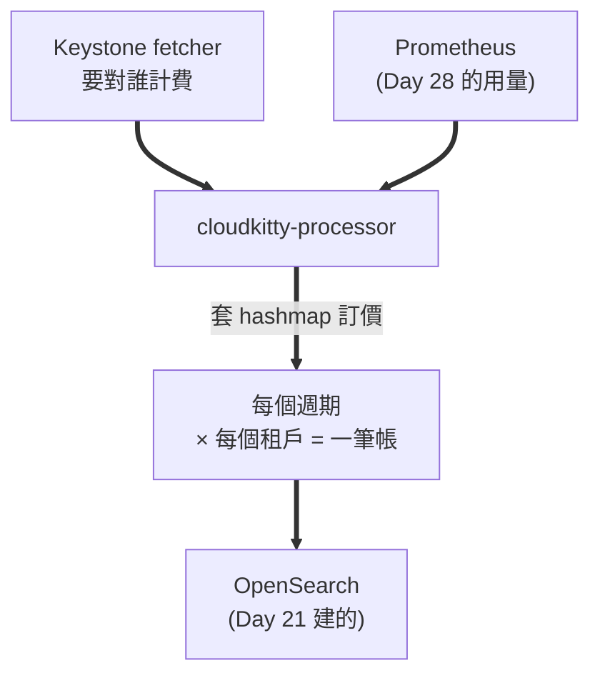
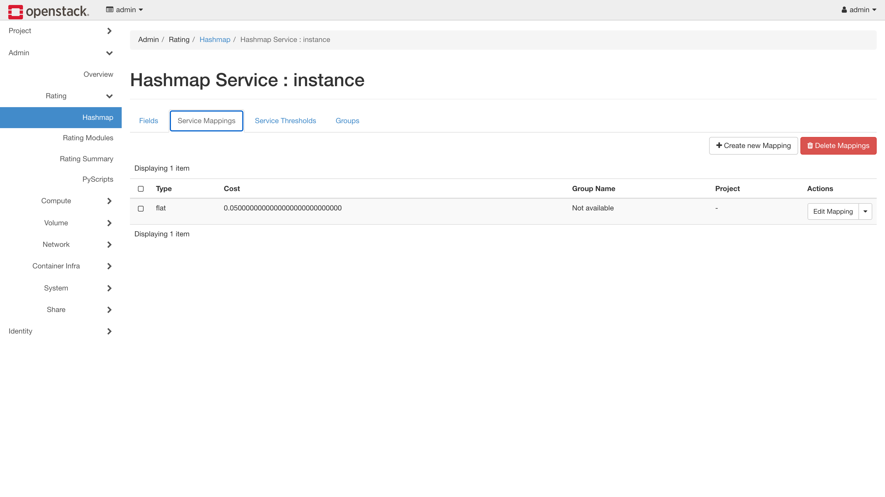
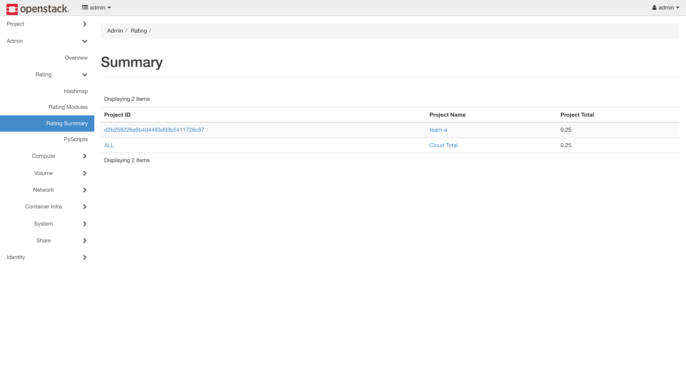

# Day 30: 計費——用量變成帳單

> Day 27 給了分帳的對象,Day 28 給了分帳的依據,Day 29 讓數字產生後果。今天把它們變成**錢**:CloudKitty 讀 Prometheus 裡的用量,套上訂價規則,吐出每個租戶各自的帳單——全程不碰 Gnocchi。本章最值錢的一顆雷叫做「**帳單永遠 0 元,而且沒有任何錯誤**」,它的根因不是 bug,是一個沒人告訴你的開關。

{ align=right width="100" }

!!! abstract "你在課程的哪裡"
    - **Day 27–29**:租戶結構、計量管線、自動反應都就緒。
    - **今天**:階段三——用量變帳單,兩個租戶各拿各的。
    - **今天之後**:Day 31 進入階段四,回多機環境談 SLA 與自癒。

## 第一次接觸雲端計費?先讀這段

CloudKitty 做的事只有一句話:**定期把「誰用了多少」乘上「單價」,存成帳單**。但它把這件事拆成四個可以各自替換的零件,而今天四個都要動:

| 零件 | 回答什麼問題 | 本課的選擇 |
|---|---|---|
| **fetcher** | **要對誰計費?** | Keystone(列出租戶) |
| **collector** | 他用了多少? | **Prometheus**(kolla 預設是 gnocchi) |
| **rating module** | 這些用量值多少錢? | **hashmap**(預設是 noop) |
| **storage** | 帳單存哪? | **OpenSearch**(重用 Day 21 的) |

**第一個零件是今天最大的雷**。直覺會認為「雲裡有幾個專案就對幾個計費」——**不是的**,fetcher 有它自己的一套挑選規則,而預設挑出來是**零個**。

另外兩個名詞今天會反覆出現:

- **period(週期)**:計費的時間顆粒,預設 **3600 秒**。帳單是一小時一格算出來的。
- **wait_periods**:等幾個週期才結算,預設 **2**。所以**帳單永遠落後現在約兩小時**——這不是故障。

## 原理與架構



processor 每一輪做的事:**問 fetcher 有哪些租戶 → 對每個租戶,把還沒算的週期一個一個補算 → 每個週期去 Prometheus 查用量 → 乘上單價 → 存進 OpenSearch**。

它送去 Prometheus 的查詢長這樣(由 `metrics.yml` 組出來):

```promql
max(max_over_time(power_state{project_id="<租戶>"}[3600s])) by (resource_id, project_id)
```

**看懂這條查詢,今天就懂一半了**:一小時的窗口內,每台機器(`resource_id`)只要出現過就算 1 台——**這正是「機器時數」的定義**,而且 `project_id` 讓它自動分租戶。[Day 28](sprint5-day28-ceilometer-metering.md) 那個 label 在這裡兌現。

!!! tip "為什麼是帶窗口的查詢,而不是 `count(power_state)`"
    [Day 28 地雷 5](sprint5-day28-ceilometer-metering.md#mine-5) 記過:Pushgateway 會**永遠記得已經刪掉的機器**。`max_over_time(...[3600s])` 有時間窗口,舊資料滑出窗外就不算;但 instant query 沒有窗口,**幽靈機器會被收錢**。CloudKitty 用的是前者,算它避開了一劫——但你自己寫查詢時要記得這件事。

## 步驟

### 步驟 1:三行 globals {#step-1}

```bash
sudo tee -a /etc/kolla/globals.yml << 'EOF'
# Day 30: CloudKitty 計費(prometheus collector + 重用 Day 21 的 OpenSearch)
enable_cloudkitty: "yes"
cloudkitty_collector_backend: "prometheus"
cloudkitty_storage_backend: "opensearch"
EOF
source ~/kolla-venv/bin/activate
kolla-ansible deploy -i ~/all-in-one --tags cloudkitty
```

```text
PLAY RECAP: ok=26  changed=16  failed=0
```

只要三行,是因為 kolla 的預設值已經幫你對好了其餘的:`cloudkitty_opensearch_url` 自動指向 Day 21 的 OpenSearch,`cloudkitty_prometheus_url` 自動指向 Day 21 的 Prometheus。

!!! note "kolla 的預設 collector 是 gnocchi"
    `cloudkitty_collector_backend` 不寫的話是 **`gnocchi`**——[Day 26](sprint4-day26-sprint5-preview.md) 講的「教科書路線」在這裡是**預設值**。要走 Prometheus 必須明確指定。

!!! quote "同一個 Prometheus,兩種待遇"
    值得跟 [Day 29](sprint5-day29-aodh-autoscaling.md#mine-2) 對照一下。kolla 的 `cloudkitty.conf` 模板長這樣:

    ```jinja
    [collector_prometheus]
    prometheus_url = {{ cloudkitty_prometheus_url }}
    prometheus_user = admin
    prometheus_password = {{ prometheus_password }}
    ```

    **basic auth 直接幫你接好了。** 而昨天的 Aodh,同一個 Prometheus,你得把帳密內嵌進 host 字串才進得去。這就是**整合成熟度的差異**——同一個生態系裡,不同專案跟同一個依賴的接合程度可以差這麼多。

### 步驟 2:寫 `metrics.yml`(kolla 不給你)

**kolla 的 cloudkitty role 沒有 `metrics.yml` 模板**,所以容器裡用的是套件內建那份——而**那份是為 gnocchi 寫的**(指標名叫 `image.size`,`extra_args` 裡是 `resource_type`、`force_granularity` 這些 gnocchi 專屬的東西)。改用 Prometheus collector,這份計量對應規則得自己寫([地雷 2](#mine-2))。

先看手上有什麼原料([Day 28](sprint5-day28-ceilometer-metering.md) 推上去的指標):

```bash
curl -s -u admin:$PW --get http://10.0.0.4:9091/api/v1/query \
  --data-urlencode 'query={job="openstack-telemetry"}'
```

```text
power_state             4 條序列      ← 機器存在 = 計費主軸
volume_size             4 條序列      ← 儲存 GB
cpu                     4 條序列
memory_usage            4 條序列
network_incoming_bytes  4 條序列
...
```

挑兩個對應到雲端帳單的兩大項:

```bash
sudo mkdir -p /etc/kolla/config/cloudkitty
sudo tee /etc/kolla/config/cloudkitty/metrics.yml << 'EOF'
metrics:

  # 機器時數:power_state 開機中為 1,NUMBOOL 把任何非零轉成 1
  power_state:
    unit: instance
    alt_name: instance
    groupby:
      - project_id
      - resource_id
    mutate: NUMBOOL
    extra_args:
      aggregation_method: max

  # 儲存:volume_size 單位已是 GiB
  volume_size:
    unit: GiB
    alt_name: volume
    groupby:
      - project_id
      - resource_id
    extra_args:
      aggregation_method: max
EOF
```

三個欄位值得說明:

- **`alt_name`**——這是帳單上的服務名稱,**等一下訂價規則要用同一個名字**,對不上就不會計價。
- **`mutate: NUMBOOL`**——`power_state` 的值是 1(開機中),NUMBOOL 把任何非零轉成 1,於是「一台機器一小時」就是數量 1。
- **`groupby`** 必須包含 `project_id`——那是 `scope_key`,分租戶靠它。

**不要試錯部署,用 CloudKitty 自己的 schema 先驗**:

```bash
sudo docker cp /etc/kolla/config/cloudkitty/metrics.yml cloudkitty_api:/tmp/m.yml
sudo docker exec cloudkitty_api python3 -c "
import yaml
from cloudkitty import collector
from oslo_config import cfg
cfg.CONF(['--config-file','/etc/cloudkitty/cloudkitty.conf'], project='cloudkitty')
print('生效的 collector =', cfg.CONF.collect.collector)
for k,v in collector.validate_conf(yaml.safe_load(open('/tmp/m.yml'))).items():
    print('✅', k, '| groupby =', v.get('groupby'))
"
```

```text
生效的 collector = prometheus
✅ power_state@#instance | groupby = ['resource_id', 'project_id']
✅ volume_size@#volume | groupby = ['resource_id', 'project_id']
```

!!! danger "一定要在 `cloudkitty_api` 容器裡驗"
    用一個乾淨的容器跑這段驗證,會得到:

    ```text
    ❌ required key not provided @ data['extra_args']['resource_type']
    ```

    `resource_type` 是 **gnocchi** 的必填欄位。乾淨容器沒有 `cloudkitty.conf`,`collector` 吃到預設值 `gnocchi`,於是**拿 gnocchi 的 schema 來驗 prometheus 的設定**——錯誤訊息完全誤導。**驗證工具本身也需要正確的環境**,這個坑會讓你去改一個根本沒問題的檔案。

    重新部署套用:`kolla-ansible deploy -i ~/all-in-one --tags cloudkitty`

### 步驟 3:訂價規則

先看計費模組的現況:

```bash
pip install python-cloudkittyclient      # CLI 外掛,同型雷第 N 次
openstack rating module list
```

```text
hashmap    False
noop       True
pyscripts  False
```

**`noop` 是啟用的,`hashmap` 是關的。** `noop` 的意思正如其名——什麼都不算。不改這個,**帳單永遠 0 元,而且不會有任何錯誤**([地雷 3](#mine-3))。

```bash
openstack rating module enable hashmap
IID=$(openstack rating hashmap service create instance -f value -c "Service ID")
VID=$(openstack rating hashmap service create volume -f value -c "Service ID")
```

`instance` 和 `volume` 這兩個名字**必須跟 `metrics.yml` 的 `alt_name` 一模一樣**。

接著訂價——每台機器每小時 $0.05、每 GiB 每小時 $0.01。**CLI 在這一步會壞掉**([地雷 5](#mine-5)),直接打 API:

```bash
TOKEN=$(openstack token issue -f value -c id)
CK=http://10.0.0.4:8889
for pair in "$IID:0.05" "$VID:0.01"; do
  curl -s -X POST "$CK/v1/rating/module_config/hashmap/mappings" \
    -H "X-Auth-Token: $TOKEN" -H "Content-Type: application/json" \
    -d "{\"service_id\":\"${pair%:*}\",\"type\":\"flat\",\"cost\":\"${pair#*:}\"}"
done
```

```text
✅ cost= 0.0500000000000000000000000000 | type= flat
✅ cost= 0.0100000000000000000000000000 | type= flat
```

建好之後在 Horizon 的 **Admin → Rating → Hashmap → (點 service) → Service Mappings** 看得到同一筆:



!!! tip "CLI 壞了,滑鼠沒壞"
    注意右上角那顆 **`+ Create new Mapping`**——**這一頁做得到那個壞掉的 CLI 做不到的事**。如果你不想打 curl,整個步驟 3 都可以在這裡用點的:`Create new Service` 建 `instance` / `volume`,再進來 `Create new Mapping` 填 flat + 0.05。

    這是本章少數「圖形介面比命令列可靠」的地方,值得記著。

### 步驟 4:告訴 CloudKitty 要對誰計費

**這是今天最重要的一步,也是最多人卡死的地方。** 到目前為止一切正常,但帳單是 0:

```bash
curl -s -H "X-Auth-Token: $TOKEN" "$CK/v2/summary"
```

```text
{"results": [["2026-07-01T00:00:00+00:00", "2026-08-01T00:00:00+00:00", 0.0, 0.0]]}
```

零錯誤、零警告。processor 的 debug log 裡只有一行輕描淡寫的話:

```text
DEBUG cloudkitty.fetcher.keystone  Number of tenants to rate : 0
```

**要計費的租戶有 0 個。** 根因在原始碼裡([地雷 1](#mine-1)):**CloudKitty 只對「cloudkitty 服務帳號持有 `rating` 角色」的專案計費**。kolla 建了這個角色,卻沒指派給任何專案。

所以這一步的本質是:**這是「哪些專案要計費」的開關**。

```bash
CKUSER=$(openstack user show cloudkitty -f value -c id)
for P in team-a team-b; do
  openstack role add --user $CKUSER --project $P rating
done
sudo docker restart cloudkitty_processor      # 別等一小時,見地雷 4
```

```text
Number of tenants to rate : 2
```

### 步驟 5:驗收——逐週期對帳

```bash
curl -s -H "X-Auth-Token: $TOKEN" "$CK/v2/summary?groupby=project_id"
```

```text
{"columns": ["begin", "end", "qty", "rate", "project_id"],
 "results": [["2026-07-01T00:00:00+00:00", "2026-08-01T00:00:00+00:00",
              5.0, 0.2500000037252903, "d2b258226e6b4d4493d93b5411726c97"]]}
```

**team-a:5 機器時 = $0.25。** 拆開看明細(`GET /v2/dataframes`,整理後):

| 週期 | 計費項 | 機器 | 小計 |
|---|---|---|---|
| 11:00–12:00 | instance × 1 | `83b15110`(meter-vm) | $0.05 |
| 12:00–13:00 | instance × 4 | `83b15110`、`f621a28d`、`bf256add`、`6fc3c0f3` | $0.20 |

11:00 那小時 team-a 只有一台;12:00 那小時有四台——多的三台正是 [Day 29](sprint5-day29-aodh-autoscaling.md) 那些自動生滅的 ASG 機器。**它們只活了幾十分鐘,帳單照樣算到了。**

最後跟 Prometheus 逐週期對帳,這才是驗收:

| 週期 | 租戶 | Prometheus 用量 | CloudKitty 收費 |
|---|---|---|---|
| 11:00–12:00 | team-a | 1 台 | 1 × $0.05 |
| 11:00–12:00 | team-b | 0 台 | $0 |
| 12:00–13:00 | team-a | **4 台** | **4 × $0.05** |
| 12:00–13:00 | team-b | 0 台 | $0 |
| | **team-a 合計** | **5 台時** | **$0.25** |

**一格一格對得上。** 而 team-b 收 $0 不是廢話——**它證明分租戶的歸屬沒有外洩**。如果 `scope_key` 壞掉,team-a 的用量會漏到 team-b 身上,兩邊都會有錢。

!!! warning "對帳要逐週期比,不要拿總和比單期"
    拿「12:00 那個週期的 4 台」去比「帳單總額 5」,會得出「CloudKitty 算錯了」的結論——**5 是兩個週期的總和(1 + 4),不是單一週期的數字。** 帳單是**時間的積分**,不是某一刻的快照——這個直覺不建立起來,對帳永遠對不完。

### 帳單畫面

[Day 26](sprint4-day26-sprint5-preview.md) 說過帳單畫面要回 Horizon 看(Skyline 沒有計費外掛)。位置在 **Admin → Rating → Rating Summary**:



畫面上的 `0.25` 跟你剛才從 API 讀到的完全一致,`Project Name` 那欄直接把 project_id 翻成 `team-a`。

CloudKitty 的儀表板一共五頁,這一天做的每件事都有對應的圖形版:

| 位置 | 做什麼 | 對應本章 |
|---|---|---|
| Admin → Rating → **Hashmap** | 建 service 與費率 | 步驟 3 |
| Admin → Rating → **Rating Modules** | 開關 hashmap / noop / pyscripts | 步驟 3、[地雷 3](#mine-3) |
| Admin → Rating → **Rating Summary** | 分租戶帳單(上圖) | 步驟 5 |
| Admin → Rating → **PyScripts** | 用 Python 寫複雜計費邏輯 | 本章沒用到 |
| **Project → Rating** | 租戶自己查帳單與報表 | — |

**這是 Sprint 5 到目前為止唯一有畫面的服務。** Ceilometer 與 Aodh 連一個面板都沒有([Day 28](sprint5-day28-ceilometer-metering.md) 與 [Day 29](sprint5-day29-aodh-autoscaling.md) 各有一則說明講原因)——**計量與告警是機器在讀的,帳單才是給人看的**,這個分野很合理。

!!! danger "這個頁面差點沒出現——`--tags cloudkitty` 不會碰 Horizon"
    kolla 的 `enable_horizon_cloudkitty` 預設跟著 `enable_cloudkitty` 一起開,照理說裝完就有。但本課環境打開頁面時**選單裡什麼都沒有**——因為[步驟 1](#step-1) 只跑了 `--tags cloudkitty`,**Horizon 從頭到尾沒被重新部署過**,設定檔還停在沒有 cloudkitty 的版本。

    ```bash
    kolla-ansible deploy -i ~/all-in-one --tags horizon
    ```

    這是 [Day 28 地雷 3](sprint5-day28-ceilometer-metering.md#mine-3) 一字不差的翻版:**跨服務的 flag,`--tags A` 永遠不夠**。同一顆雷在這個 Sprint 已經是第三次了(Day 21 的 Skyline、Day 28 的通知、今天的 Horizon)——它會一直來,因為 kolla 的開關和它影響的服務,本來就不是同一個名字。

## 驗收 checkpoint

逐項驗證,**全部符合判準才算完成今天**:

| 驗證 | 判準 | 本課環境的結果 |
|---|---|---|
| 部署 | api / processor 容器 healthy | 符合 |
| storage | 重用 Day 21 的 OpenSearch,不新增資料庫 | 符合 |
| metrics.yml | 通過 CloudKitty 自己的 schema 驗證 | 兩條規則都過 |
| 訂價 | hashmap 啟用,費率建立成功 | instance $0.05 / volume $0.01 |
| **有租戶被計費** | `Number of tenants to rate` > 0 | 指派 rating 角色後為 2 |
| **帳單對得上用量** | 逐週期比對 Prometheus 與 CloudKitty | 1↔1、4↔4,合計 5 台時 = $0.25 |
| **租戶歸屬** | team-b 無用量 → 無費用(沒被汙染) | $0 |
| Horizon 帳單頁 | Admin → Rating → Rating Summary 顯示分租戶金額 | 符合(需補跑 `--tags horizon`) |
| **雙租戶帳單** | 兩個租戶都有帳單、金額不同、互不汙染 | team-a $0.75 / team-b $0.16(補驗) |
| **儲存計費** | volume 產生實際費用 | team-a $0.10 / team-b $0.06(補驗) |

## 地雷記錄

### 地雷 1:帳單永遠 0 元,因為沒有任何租戶被計費 {#mine-1}

**症狀**:部署成功、費率建好、Prometheus 有資料、processor 健康、**零錯誤**。帳單就是 0。

**判讀關鍵**:把 debug 打開(`cloudkitty_logging_debug: "yes"` 後重新部署),真相只有一行:

```text
DEBUG cloudkitty.fetcher.keystone  Number of tenants to rate : 0
```

**根因**:讀原始碼就明白了:

```python
# cloudkitty/fetcher/keystone.py
if not ignore_rating_role:
    roles = self.admin_ks.roles.list(user=my_user_id, project=tenant)
    if 'rating' not in [role.name for role in roles]:
        tenant_list.remove(tenant)          # ← 沒有 rating 角色 → 直接移除
```

**CloudKitty 只對「cloudkitty 服務帳號在該專案上持有 `rating` 角色」的專案計費。** kolla 把角色建出來了,但沒指派給任何專案——所以全新安裝的預設狀態就是「零個租戶」。

**解法**:

```bash
CKUSER=$(openstack user show cloudkitty -f value -c id)
openstack role add --user $CKUSER --project team-a rating
```

或者對所有專案計費:`[fetcher_keystone] ignore_rating_role = true`。

**教訓**:**這不是 bug,是設計——它是「哪些專案要計費」的 opt-in 開關**,只是沒有任何地方告訴你它存在。這是本課程「錯了不會叫」家族最貴的一顆:帳單系統靜靜地對零個客戶收零元,而每一個健康檢查都是綠的。

**通則**:**當一個系統「成功地產出空結果」時,先問「它認為它該處理的東西有哪些」**,而不是去查「它處理得對不對」。這顆雷會把你引去查 metrics.yml、查 Prometheus、查訂價規則——而那些全都是對的,錯的是那份工作清單本身是空的。

### 地雷 2:kolla 讓你選 Prometheus,卻不給你對應的 `metrics.yml` {#mine-2}

**症狀**:`cloudkitty_collector_backend: "prometheus"` 設了,部署也成功,但 CloudKitty 拿著一份寫著 `image.size`、`resource_type`、`force_granularity` 的計量規則去查 Prometheus。

**根因**:kolla 的 cloudkitty role 的 `templates/` 底下只有 `cloudkitty.conf.j2`、`cloudkitty-api.json.j2`、`cloudkitty-processor.json.j2`、`wsgi-cloudkitty.conf.j2`——**沒有 `metrics.yml`**。所以容器用的是套件內建的預設,而那份是為 gnocchi 寫的。

**解法**:自己寫 `/etc/kolla/config/cloudkitty/metrics.yml`(見步驟 2)。

**教訓**:**「這個選項存在」不等於「這條路是通的」。** kolla 讓你把 collector 設成 prometheus,語法檢查會過、部署會成功——但配套的計量規則要你自己補,而它不會提醒你。遇到「換了後端」這類設定時,養成一個習慣:**問一句「這個後端需要的其他檔案,是誰負責產生?」**

### 地雷 3:`noop` 模組預設啟用,一切算 0 元 {#mine-3}

**症狀**:帳單 0 元(是的,今天有兩顆不同的雷都長這樣)。

**根因**:CloudKitty 出廠時啟用的計費模組是 `noop`——它不計價。`hashmap` 預設關閉。

**解法**:`openstack rating module enable hashmap`,並確認:

```bash
openstack rating module list
```

**教訓**:跟[地雷 1](#mine-1) 合起來看更有意思——**同一個症狀(0 元)有兩個完全不同的根因**,一個在「要對誰計費」,一個在「怎麼算錢」。這正是為什麼除錯要先分層:**先確認有沒有工作進來,再確認工作做得對不對。** 順序反了會繞很久。

### 地雷 4:processor 每輪睡整整一小時 {#mine-4}

**症狀**:指派完 `rating` 角色,等了 20 分鐘,帳單還是 0,scope 狀態表空的。

**根因**:`internal_run` 的最後一行:

```python
        LOG.debug("Finished processing all storage scopes with worker ...")
        # FIXME(sheeprine): We may cause a drift here
        time.sleep(CONF.collect.period)
```

**`CONF.collect.period` 是 3600**。processor 跑完一輪就睡一小時——它在 14:07 那輪看到 0 個租戶,接著睡到 15:07。**我 14:08 做的設定變更,它要一小時後才會發現。**

**解法**:重啟它。

```bash
sudo docker restart cloudkitty_processor
```

```text
14:10:22  Number of tenants to rate : 2
```

**教訓**:注意 `[collect] period` **同時是「計費週期」和「processor 的輪詢間隔」**——兩個完全不同的概念綁在同一個參數上。想讓它反應快就得縮短計費週期,而那會改變帳單的顆粒度。**這是設計上的疙瘩,而上游自己也知道**(那行 `FIXME` 就掛在旁邊)。

**實務上**:改完任何 CloudKitty 設定,**重啟 processor**,別等。

### 地雷 5:`rating hashmap mapping create` 在 2025.1 直接壞掉 {#mine-5}

**症狀**:

```bash
openstack rating hashmap mapping create --service-id $IID --type flat 0.05
```

```json
{"faultcode": "Client", "faultstring": "Unknown attribute for argument mapping_data: name",
 "debuginfo": null}  (HTTP 400)
```

**根因**:`python-cloudkittyclient` 6.1.0 送了一個 `name` 欄位,而 CloudKitty 22.0.1(2025.1)的 API 不認得。**CLI 與 API 版本不同步。**

**解法**:兩條路都行——繞過 CLI 直接打 API(見步驟 3),或者**乾脆用 Horizon 的 Hashmap 頁點一點**(那顆 `+ Create new Mapping` 做得到 CLI 做不到的事)。同一族的還有幾個:

| 指令 | 症狀 |
|---|---|
| `openstack rating storage dataframe get` | 這版根本沒這個指令 |
| `GET /v1/scope/state` | 405 Method Not Allowed |
| `GET /v1/storage/dataframes?limit=2` | `Unknown argument: "limit"` |

**都改用 v2**:`/v2/scope`、`/v2/dataframes`、`/v2/summary`。

**教訓**:**CLI 壞掉不代表功能壞掉。** 這幾顆都只是客戶端跟服務端版本對不上,底下的 API 好端端的。遇到 CLI 報奇怪的參數錯誤時,**先用 curl 打一次 API 確認功能本身在不在**——這個習慣今天省了很多時間,[Day 29 地雷 5](sprint5-day29-aodh-autoscaling.md#mine-5) 也是靠它。

!!! note "還有一顆:全新的 scope 從「當月 1 號」開始算"
    ```python
    # cloudkitty/utils/__init__.py
    def check_time_state(timestamp=None, period=0, wait_periods=0):
        if not timestamp:
            return tzutils.get_month_start()
    ```

    月中安裝的話,processor 得先把當月 1 號到現在的空白週期全部補跑一遍才會走到有資料的時段。本課環境是 7/14 裝的,所以它磨了 **326 個週期 × 2 個租戶 = 652 次**——好消息是 `Worker.run()` 是個 while 迴圈,**一輪之內全部追完**,只花了 4 秒。看到帳單暫時是 0,先確認它是不是還在補跑。

## 補完:雙租戶帳單 + 儲存計費

寫這章的當下有兩個缺口:team-b 沒有資源(雙租戶對比退化成 `$0.25 vs $0`)、`volume_size` 規則寫了但沒磁碟可算。這兩件事的補驗只差「時間」——`period=3600` + `wait_periods=2` 意味著新用量要兩到三小時後才結算。所以在 [Day 32](sprint5-day32-full-tls.md) 開機做 TLS 時,順手替兩個租戶種下 VM 與 volume,讓計費週期在部署期間自己跑。三小時後收帳:

| 租戶 | 計費項 | 用量 | 費率 | 金額 |
|---|---|---|---|---|
| team-a | instance | 13 台時 | $0.05 | $0.65 |
| team-a | volume | 10 GiB 時 | $0.01 | $0.10 |
| team-b | instance | 2 台時 | $0.05 | $0.10 |
| team-b | volume | 6 GiB 時 | $0.01 | $0.06 |

**兩個缺口一次補齊**:team-a 收 $0.75、team-b 收 $0.16——**兩個租戶都有帳單、金額各自不同**,不再是退化案例;而且 `volume` 這個計費項真的產生了費用($0.10 與 $0.06),儲存計費不再是紙上談兵。四筆金額全部逐項對得上費率(`13×0.05`、`10×0.01`、`2×0.05`、`6×0.01`)。

這也讓今天的核心結論從「單租戶對得上」升級成完整的商業場景:**兩個真實租戶、兩種計費項(機器 + 儲存)、各自的帳單、金額互不汙染。** 這才是一朵雲「能當生意經營」該有的樣子。

## 帶得走的東西

- **當一個系統「成功地產出空結果」時,先問它認為該處理的東西有哪些**,而不是查它處理得對不對。帳單 0 元的兩個根因(沒租戶、noop 模組)都在工作清單那一層,不在計算那一層。
- **帳單是時間的積分,不是某一刻的快照。** 對帳要逐週期比,拿總和比單期一定得出「算錯了」的錯誤結論。
- **同一個依賴,不同專案的接合程度可以差很多。** 同一座 Prometheus:CloudKitty 的模板幫你把帳密接好,Aodh 要你自己內嵌進 host 字串。遇到整合問題,先確認這條路有沒有人真的走過。
- **CLI 壞掉不代表功能壞掉。** 客戶端與服務端版本不同步是常態;報奇怪的參數錯誤時,先用 API 或圖形介面確認功能本身在不在。
- **「這個選項存在」不等於「這條路是通的」。** 換後端時要問:這個後端需要的其他檔案,是誰負責產生?沒人負責的,就是你。

## 延伸閱讀

想往下深挖,從這幾份開始:

- **[CloudKitty 官方文件](https://docs.openstack.org/cloudkitty/2025.1/)** —— collector / fetcher / rating module / storage 四個零件的完整說明。
- **[CloudKitty 的 Prometheus collector](https://docs.openstack.org/cloudkitty/2025.1/admin/configuration/collector.html)** —— `metrics.yml` 的完整 schema,以及 `query_prefix` / `range_function` 等本章沒用到的進階選項。
- **[hashmap 計費模組](https://docs.openstack.org/cloudkitty/2025.1/user/rating/hashmap.html)** —— 本章只用了最簡單的 `flat`;分級費率(threshold)、依 flavor 差別訂價都在這份。
- **[Kolla-Ansible 的 CloudKitty 指南](https://docs.openstack.org/kolla-ansible/2025.1/reference/rating/cloudkitty-guide.html)** —— 本章 globals 三行設定的官方對照。

## 下一步

雲會自己收錢了。階段三結束——**這朵雲現在說得出誰用了多少、值多少錢**。

[Day 31](sprint5-day31-masakari-ha.md) 進入階段四的第一天,也是 Sprint 5 唯一要回多機環境的一天:**Masakari 自癒**——VM 的程序死掉自動重啟,compute 整台掛掉,VM 自動搬到別台去。
