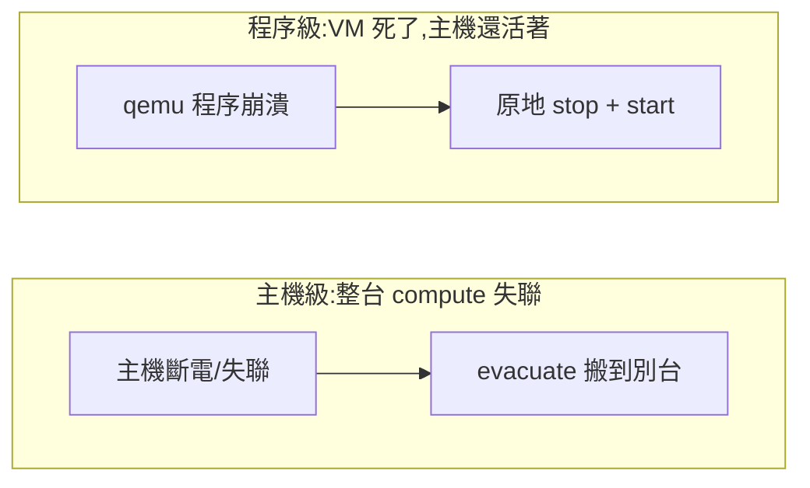

# Day 31: SLA 與自癒——讓雲自己救自己

> 到目前為止,VM 掛了要靠人去重開,一台 compute 主機死了上面的機器就跟著陪葬。今天讓雲自己處理這兩件事:**Masakari** 盯著每台 VM 與每台主機,程序死掉自動重啟、主機失效自動把 VM 搬到別台去。這是 Sprint 5 唯一回多機環境的一天,也是唯一一次你會**親手把一台主機弄死**,再看雲自己把它上面的機器救回來。

{ align=right width="100" }

!!! abstract "你在課程的哪裡"
    - **Day 23**:多節點環境建好,關掉一台 controller 只停 6 秒。
    - **今天**:回多機環境。先做重啟健檢,補上 evacuate 缺的 Cinder,部署 Masakari,驗證兩層自癒。
    - **今天之後**:多機環境用完即關;[Day 32](sprint5-day32-full-tls.md) 回單機,把所有 API 換上 https。

## 自癒有兩層,別搞混

「VM 掛了自動復原」聽起來是一件事,其實是兩件,而且復原的手段完全不同:



**程序級**:主機還在,只是上面某台 VM 的 qemu 崩了——原地重啟就好,不用搬家。負責的是 **instancemonitor**(住在每台 compute 上)。

**主機級**:整台 compute 斷電或失聯,上面所有 VM 跟著消失——得把它們**搬到活著的主機重建**(evacuate)。負責的是 **hostmonitor**,而它需要 pacemaker 叢集當偵測底層。

兩層對應 Masakari 的三個角色:

| 角色 | 住哪 | 做什麼 |
|---|---|---|
| **masakari-api / engine** | controller | 收通知、編排復原流程 |
| **instancemonitor** | 每台 compute | 盯 libvirt 事件,VM 程序死了通報 |
| **hostmonitor** | controller | 盯主機存活(靠 pacemaker) |

!!! note "今天不部署 hostmonitor"
    hostmonitor 需要 pacemaker/corosync 叢集,那是另一套 HA 中介軟體的完整安裝。本課的 lab 規模不值得為了偵測主機存活而養一整套 pacemaker——所以今天**主機級的偵測改用手動送通知**代替(見[步驟 5](#step-5))。這不是偷懶,是**把 evacuate 這個真正的動作和「怎麼偵測到主機死了」這個獨立問題拆開**:偵測方式可以換(pacemaker、外部監控、手動),但收到通知之後的搬家流程是同一套。

!!! danger "偵測可以換,但『圍籬』(fencing)不能省"
    上面說「偵測方式可以換」是對的,但漏了半句話:**pacemaker 的另一半職責是先圍籬(fencing / STONITH)再搬家**。本章 demo 之所以安全,是因為[步驟 5](#step-5) 那道 gate 用的 `az vm deallocate` **本身就是圍籬**——它保證主機真的斷電,不可能一邊被 evacuate、一邊自己還在寫硬碟。

    真實世界最危險的情境是主機「看起來死了」其實還活著(網路分區:nova 連不到它,但它的 qemu 還在跑)。此時若只靠「偵測到就送通知」自動觸發 evacuate,而**沒有先強制斷電/斷存取**,同一顆 boot-from-volume 的 volume 會被兩台活著的 VM 同時掛寫——資料直接毀損,而且每個健康檢查都是綠的([「錯了不會叫」](../runbook/sprint5-day27-multi-tenant-governance.md)的又一個實例)。所以把手動通知換成自動偵測前,**圍籬是必補的前提,不是選配**。

## 一個 evacuate 的硬前提:VM 的硬碟不能在死掉的主機上

主機級復原要「把 VM 搬到別台重建」,但如果 VM 的系統碟是主機本地磁碟,**主機死了硬碟也跟著死**——搬過去也沒東西可開。所以 evacuate 真正能救的是 **boot-from-volume** 的 VM:系統碟是一顆 Cinder volume,獨立於任何 compute 存在,主機死了 volume 還在,換台機器重新掛上就能開。

而 [Day 23](sprint4-day23-multinode-ha.md) 建的多機環境**沒有 Cinder**——所以今天在動 Masakari 之前,得先把 Cinder 補上。這是今天的隱藏前置。

## 步驟

### 步驟 1:重啟健檢——多機環境開機不會自己好

多機環境上次 [Day 24](sprint4-day24-scale-out.md) 之後就關機了。全部開機後,第一件事不是部署,是**確認它真的活過來了**。而它不會自己活過來——兩個地方要救。

先救 Galera。兩台 controller 同時關機再開,Galera 不知道誰的資料最新,不敢自己選主,整個叢集停在等待:

```bash
source ~/kolla-venv/bin/activate
kolla-ansible mariadb-recovery -i ~/multinode
```

```text
PLAY RECAP:
oslab-ctrl1  : ok=27  changed=5   failed=0
oslab-ctrl2  : ok=31  changed=10  failed=0
```

```text
wsrep_cluster_size    2
wsrep_cluster_status  Primary
```

`Primary` + `size 2` = 叢集回來了。注意指令叫 `mariadb-recovery`(連字號)——舊版是底線,2025.1 改名了([地雷 1](#mine-1))。

接著會撞到今天第一顆真正的雷:ctrl1 的一票服務 unhealthy 且**不自己好**:

```text
ctrl1: neutron_server nova_conductor nova_api nova_scheduler placement_api keystone
ctrl2: (全健康)
```

nova-api 的 log 只是不斷重試連資料庫:

```text
WARNING oslo_db.sqlalchemy.engines SQL connection failed.
```

根因不在這些服務,在它們共用的資料庫入口——**ctrl1 的 ProxySQL 崩了**,而症狀偽裝成「一堆服務連不上資料庫」。完整判讀見[地雷 2](#mine-2),解法是移走它損壞的統計資料庫再重啟:

```bash
sudo mv /var/lib/docker/volumes/proxysql/_data/proxysql_stats.db{,.corrupt}
sudo docker restart proxysql
```

```text
proxysql: Up 30 seconds (healthy)
ctrl1 → VIP:3306 ✅ 通了
```

資料庫入口一通,那票服務重啟一次就全部回歸:

```text
nova-scheduler oslab-ctrl1 up
nova-conductor oslab-ctrl1 up
nova-compute    oslab-comp1 up / comp2 up / comp3 up
```

### 步驟 2:補上 Cinder(evacuate 的前提)

多機環境沒有 Cinder,先給它一個 LVM 後端。用 loopback 檔當 volume group(lab 沒有多的實體磁碟),並且**用 systemd 讓它開機自動掛回**——否則下次重啟 VG 就消失:

```bash
sudo truncate -s 60G /var/lib/cinder-lvm/cinder-volumes.img
# systemd oneshot 開機把它接成 loop device(檔略)
sudo pvcreate /dev/loop7
sudo vgcreate cinder-volumes /dev/loop7
```

```text
Physical volume "/dev/loop7" successfully created.
Volume group "cinder-volumes" successfully created
```

`inventory` 的 `[storage]` 群組加入 ctrl1,globals 開 Cinder 與 Masakari:

```yaml
enable_cinder: "yes"
enable_cinder_backend_lvm: "yes"
enable_masakari: "yes"
enable_masakari_instancemonitor: "yes"
enable_masakari_hostmonitor: "no"
```

### 步驟 3:部署,然後補上被漏掉的負載平衡器

```bash
kolla-ansible deploy -i ~/multinode --tags common,cinder,iscsi,masakari
```

部署成功,masakari 三個容器也各就各位:

```text
ctrl1: masakari_engine, masakari_api
comp1: masakari_instancemonitor
```

但打 Cinder API 會撞牆:

```text
Failed to establish a new connection: [Errno 111] Connection refused
(host='10.100.0.250', port=8776)
```

**服務起來了,VIP 上卻沒有它的入口**——`--tags cinder` 不會回頭配 haproxy 的前端([地雷 4](#mine-4))。補一次:

```bash
kolla-ansible deploy -i ~/multinode --tags loadbalancer
```

之後 VIP 上就有新前端了(`8776` cinder、`15868` masakari),測一顆 volume:

```text
cinder-volume oslab-ctrl1@lvm-1 up
volume 狀態: available
```

### 步驟 4:建立 Masakari 的 failover segment

Masakari 用 **segment** 把「互相支援的一組 compute」圈起來——某台死了,VM 搬到同 segment 的其他台:

```bash
openstack segment create day31-seg auto COMPUTE
for h in oslab-comp1 oslab-comp2 oslab-comp3; do
  openstack segment host create $h COMPUTE SSH day31-seg
done
openstack segment host list day31-seg
```

```text
oslab-comp1  False      ← on_maintenance,False = 正常待命
oslab-comp2  False
oslab-comp3  False
```

### 步驟 5:兩道 gate——親手弄死,看它自己救回來 {#step-5}

**Gate 1(程序級)**:開一台掛 `HA_Enabled` 標記的 VM,直接 `kill -9` 它的 qemu 程序:

```bash
openstack server set --property HA_Enabled=True ha-canary
# 在 comp1 上:sudo kill -9 <qemu-pid>
```

什麼都不用做,盯著看:

```text
06:50:11  kill qemu PID 20730
06:50:12  notification: {vir_domain_event: STOPPED_FAILED}   ← libvirt 通報
06:50:14  masakari engine → nova stop
06:50:18  masakari engine → nova start
06:50:30  vm=ACTIVE(下一次輪詢確認)
```

**從程序被殺到 Masakari 送出重啟指令,只花 7 秒**(`06:50:11` → `06:50:18`),VM 在下一次輪詢就回到 ACTIVE。那個 `STOPPED_FAILED` 是關鍵——它是 libvirt 分辨「正常關機」和「異常死亡」的依據,Masakari 只對後者出手。

**Gate 2(主機級)**:這裡有個必須先跨過的坎——**你沒辦法用軟手段殺死一台主機**([地雷 5](#mine-5))。`docker stop nova_compute` 會被 systemd 拉回、`systemctl stop docker` 因為 live-restore 容器照跑,兩種「假死」nova 都判定主機還 `up`。只有真斷電才算數:

```bash
az vm deallocate -g <多機RG> -n oslab-comp1     # 真的拔電源
```

comp1 上有兩台掛了 `HA_Enabled` 的 VM:一台 boot-from-volume(`bfv-canary`)、一台本地碟。等 nova 判定主機 down,送一個主機失效通知,然後盯著 evacuate:

```text
07:09:28  comp1: down                    ← nova 終於判定失聯
07:17:55  lock → evacuate                ← Masakari 的搬家流程
07:18:06  bfv=comp1/REBUILD  ha=comp1/REBUILD
07:18:31  notif=finished  bfv=comp2/ACTIVE  ha=comp2/ACTIVE   ← 在 comp2 復活
```

**兩台 VM 都在 comp2 復活了。** 而 boot-from-volume 那台,系統碟是**同一顆 volume** 重新掛上(`volume_id` 沒變,只有 `attachment_id` 換新)——資料原封不動。這就是為什麼 evacuate 前非補 Cinder 不可:本地碟的 VM 只能 rebuild(空白重建),boot-from-volume 的才能真的**帶著資料搬家**。

## 驗收 checkpoint

逐項驗證,**全部符合判準才算完成今天**:

| 驗證 | 判準 | 本課環境的結果 |
|---|---|---|
| 重啟健檢 | Galera `Primary`、全容器健康 | recovery 後 size=2 Primary;proxysql 修復後全綠 |
| Cinder | volume 建立成功 | `available` |
| Masakari 部署 | api/engine + instancemonitor 就位 | 符合 |
| segment | 三台 compute 掛入,`on_maintenance=False` | 符合 |
| **Gate 1 程序級** | kill qemu → VM 自動回 ACTIVE | STOPPED_FAILED → stop+start,**7 秒送出重啟** |
| **Gate 2 主機級** | 主機斷電 → VM 在別台復活 | lock/evacuate → 兩台在 comp2 ACTIVE |
| BFV 資料保留 | 系統碟同一顆 volume 重新掛上 | `volume_id` 不變,`attachment_id` 更新 |

## 地雷記錄

### 地雷 1:`mariadb_recovery` 在 2025.1 改名了 {#mine-1}

**症狀**:`kolla-ansible mariadb_recovery` 回「is not a kolla-ansible command」,還附上一句「Did you mean `mariadb-recovery`?」。

**根因**:2025.1 把子指令的底線統一改成連字號。

**教訓**:小事,但它提醒一件大事——**維運指令的名字會隨版本漂移**。把 runbook 裡的指令當「這個版本當下驗證過」的快照,升版後要重驗,不要背。

### 地雷 2:ProxySQL 的統計資料庫斷電損壞,偽裝成一整排服務故障 {#mine-2}

**症狀**:重啟後 ctrl1 上七、八個服務全 unhealthy,log 全是 `SQL connection failed`。看起來像「資料庫掛了」,但 Galera 明明 `Primary`、ctrl2 的服務全好。

**判讀關鍵**:**ctrl2 好、ctrl1 壞,而兩台連的是同一個 Galera** ——那問題就不在資料庫本身,在 ctrl1 到資料庫的**那一段路**。那段路是 ProxySQL(本課的資料庫入口 proxy):

```text
proxysql: Exited (134)          ← 134 = SIGABRT,程式自己爆的
policy=no                        ← restart policy 是 no,崩了不會被拉起來
```

crash log 指向 `SQLite3DB::check_table_structure`,而它讀的是 `proxysql_stats.db`——**統計資料庫在斷電時寫到一半,檔案損壞**,ProxySQL 一啟動讀到它就 SIGABRT。

**解法**:統計資料庫是可拋棄的(它只存效能統計,不是設定),移走讓它重建:

```bash
sudo mv /var/lib/docker/volumes/proxysql/_data/proxysql_stats.db{,.corrupt}
sudo docker restart proxysql
```

**教訓**:兩顆嵌套的教訓。其一:**「一整排服務故障」往往有單一根因**,不要逐個去救那些服務,去找它們的共同依賴。其二:crash stack 會誠實指向壞掉的檔(`stats.db`),但直覺會先去怪那個 0 byte 的 `proxysql.db`——那個 0 byte 是**啟動時 rename 的產物,是果不是因**。看崩潰堆疊,不要看檔案大小。

### 地雷 3:部署新服務後 ProxySQL 沒被重讀,新服務連不上資料庫 {#mine-3}

**症狀**:手動修好 ProxySQL 之後,部署 Cinder,結果 Cinder 的 `db sync` 連資料庫被拒。

**根因**:kolla 部署新服務時會把該服務的資料庫帳號寫進 ProxySQL 的 users 設定,**但不會重啟 ProxySQL 讓它重讀**。所以新帳號躺在設定檔裡,執行中的 ProxySQL 不認得。

**解法**:部署後手動重啟兩台的 ProxySQL。

**教訓**:這是 [Day 28 地雷 3](sprint5-day28-ceilometer-metering.md#mine-3) 的近親——**一個元件的設定改了,依賴它的元件不會自動知道**。在多機這種「服務入口與服務本體分離」的架構裡,改完設定要問一句:**誰需要被重讀?**

### 地雷 4:多機 `--tags cinder` 不會配負載平衡器前端 {#mine-4}

**症狀**:Cinder 服務全 `up`,但打 VIP 的 8776 埠 `Connection refused`。

**根因**:多機環境的 API 入口是 haproxy 的 VIP。`--tags cinder` 只部署 Cinder 服務本身,**不會回頭在 haproxy 上開一個 8776 的前端**——所以服務在聽,但 VIP 上沒有門。

**解法**:補一次 `--tags loadbalancer`。

**教訓**:又一顆 `--tags` 盲區([Day 22](sprint4-day22-upgrade-backup.md#mine-1) 開始的家族),但這顆是**多機專屬**的變種:單機沒有 haproxy 前端這回事,多機才有「服務起來了,但入口沒開」的斷層。加服務到多機環境,記得問:**它的 VIP 前端誰來配?**

### 地雷 5:你沒辦法用軟手段殺死一台主機 {#mine-5}

**症狀**:想模擬「一台 compute 死掉」,試了兩種軟手段,nova 都不認為主機死了:

- `docker stop nova_compute` → systemd 的 unit 立刻把容器拉回來,heartbeat 沒斷。
- `systemctl stop docker` → docker 的 **live-restore** 讓容器在 daemon 停止後照跑,heartbeat 還是沒斷。

nova 一路顯示 comp1 `up`,evacuate 根本不會觸發。

**根因**:這些手段都只是「停掉管理層」,而**回報存活的那個程序還在跑**。要讓 nova 判定主機死亡,得讓那個程序真的消失。

**解法**:真斷電。

```bash
az vm deallocate ... oslab-comp1
```

之後 nova 才判定 `down`(還花了幾分鐘——heartbeat 逾時有寬限)。

**教訓**:這顆的價值超出 OpenStack——**測試「東西壞掉」時,要壞在對的層級**。你想測的是「主機沒了」,就得真的讓主機沒了;停個容器、停個 daemon,測到的是別的東西。故障演練最常見的失敗,是**演了一個比你以為的更輕的故障**,然後誤以為系統扛住了。

### 地雷 6:evacuate 失敗會留下 `on_maintenance`,擋掉重試 {#mine-6}

**症狀**:第一次送主機失效通知失敗後,重送同一個通知被回 `409 ... the host is already under maintenance`。

**根因**:Masakari 一收到主機失效通知,就先把該主機標成 `on_maintenance=True`(隔離,不再往它排程)。如果復原流程失敗,這個標記**不會自動清除**——於是主機卡在維護狀態,重送通知被當成「這台已經在維護了」而拒收。

**解法**:重試前先手動清標記:

```bash
openstack segment host update day31-seg oslab-comp1 --on_maintenance False
```

清完再送,workflow 就跑起來了(`lock → evacuate → unlock`)。

**教訓**:**自動化流程失敗後,常留下半途的狀態擋住重試**。設計或操作故障復原時,「失敗後怎麼回到可重試的乾淨狀態」和「成功路徑」一樣重要——而很多工具的成功路徑很漂亮,失敗清理卻要你自己來。

### 地雷 7:Masakari 預設只救有標記的 VM {#mine-7}

**症狀**:沒有 `HA_Enabled` metadata 的 VM,程序死了 Masakari 不理它。

**根因**:instancemonitor 預設只對帶 `HA_Enabled=True` 的實例出手(`process_all_instances` 預設關閉)。

**教訓**:這其實是**設計,不是限制**——不是每台 VM 都該被自動重啟(短命的批次 VM 自動重啟反而是災難)。「哪些 VM 值得自癒」是租戶的決定,用 metadata 表達。動手驗證前先確認你的測試 VM 有這個標記,否則會對著一台「照設計不該被救」的 VM 等半天。

## 帶得走的東西

- **自癒是兩層問題,手段不同:程序死了原地重啟,主機死了搬家重建。** 把它們當一件事處理,會在「主機死了卻只會重啟本地不存在的程序」上卡住。
- **evacuate 能不能保住資料,取決於系統碟在哪。** 本地碟只能空白重建,boot-from-volume 才能帶著同一顆 volume 搬家——這是「HA 設計要從開機方式就決定」的具體例子。
- **故障演練要壞在對的層級。** 停容器、停 daemon 都不是「主機死掉」;演一個比真實更輕的故障,會得到一個假的安心。
- **一整排服務故障,先找共同依賴。** 逐個救那些服務是白費力氣,它們往往死於同一個上游(這次是 ProxySQL)。
- **自動化流程失敗會留下擋路的中間狀態。** 成功路徑之外,要知道怎麼把系統手動撥回可重試的乾淨狀態。

## 延伸閱讀

想往下深挖,從這幾份開始:

- **[Masakari 官方文件](https://docs.openstack.org/masakari/2025.1/)** —— segment、host、instance 三種監控與復原流程的完整說明。
- **[Kolla-Ansible 的 Masakari 指南](https://docs.openstack.org/kolla-ansible/2025.1/reference/compute/masakari-guide.html)** —— kolla 這側啟用 Masakari 的官方頁(`enable_masakari` 開關的對照)。
- **[Nova 的 evacuate 說明](https://docs.openstack.org/nova/2025.1/admin/evacuate.html)** —— 為什麼 evacuate 需要共享儲存或 boot-from-volume;本章那個硬前提的權威出處。
- **[ProxySQL 官方文件](https://proxysql.com/documentation/)** —— 本課的資料庫入口;`proxysql.db` 與 `proxysql_stats.db` 的角色差異([地雷 2](#mine-2))在這裡有完整背景。

## 下一步

雲會自己救自己了。多機環境今天用完即關——它的任務(演一次真的主機失效)已經完成。[Day 32](sprint5-day32-full-tls.md) 回單機環境,做生產化的第一件事:**把所有 API 從 http 換成 https**,而你會發現這件「加密」的事牽動的遠不只加密。
