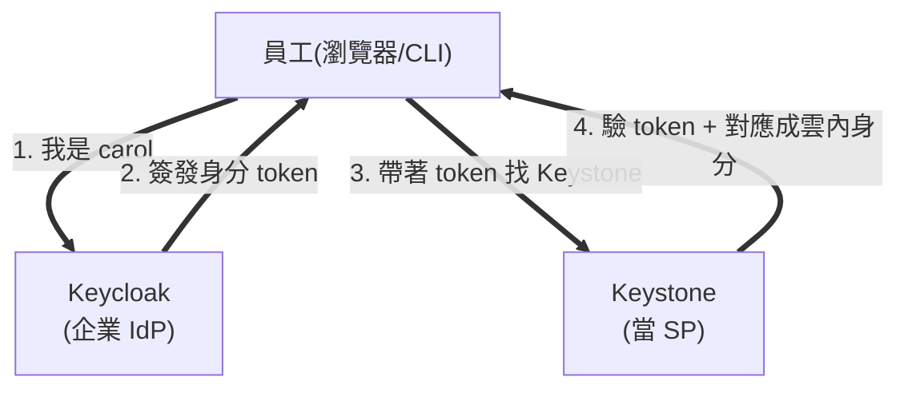

# Day 33: 企業身分接軌——用公司帳號登入這朵雲

> 到目前為止,雲裡的每個使用者都存在 Keystone 自己的資料庫。但企業已經有一套員工身分系統了——沒有人想在雲裡再維護一份平行的帳號表、離職時還要記得兩邊都刪。今天做 **Keystone Federation**:讓 Keystone 當服務提供者(SP),把身分驗證外包給企業的 **Keycloak**。員工用公司帳號登入,雲裡從此不存他們的密碼。而你會發現,昨天那張自簽 CA 是這件事能不能成的關鍵。

{ align=right width="100" }

!!! abstract "你在課程的哪裡"
    - **Day 27**:多租戶結構建好,但使用者(alice)是 Keystone 本地帳號。
    - **Day 32**:全站 https——今天的硬前提,原因馬上會撞到。
    - **今天**:接一個 Keycloak 當外部 IdP,讓外部使用者 SSO 登入、拿到對應的專案與角色、開得出 VM。
    - **今天之後**:[Day 34](sprint5-day34-cadf-audit.md) 讓所有這些操作留下稽核軌跡。

## Federation 在解什麼問題

沒有 federation 時,每個能操作雲的人都得在 Keystone 裡有一筆帳號和密碼。企業已經有 AD / LDAP / Keycloak 存著全體員工了,再維護一份平行帳號表意味著:入職要建兩次、離職要刪兩次、密碼政策要同步兩套——而只要有一邊漏了,就是資安破口。

**Federation 把「驗證你是誰」外包出去**:



Keystone 不再存 carol 的密碼——它只驗 Keycloak 簽發的 token,然後用一套 **mapping 規則**把「Keycloak 說這人是 carol、屬於 sso-users 群組」對應成「雲裡的一個影子使用者,綁到 team-sso 專案的 member 角色」。carol 的密碼永遠只在 Keycloak,雲裡從頭到尾看不到。

## 步驟

### 步驟 1:起一個 Keycloak,但它非 https 不可

先用最簡單的方式起 Keycloak(開發模式,走 http):

```bash
sudo docker run -d --name keycloak --network host \
  -e KC_BOOTSTRAP_ADMIN_USERNAME=admin -e KC_BOOTSTRAP_ADMIN_PASSWORD=... \
  quay.io/keycloak/keycloak:26.0 start-dev
```

配好 realm、client、使用者(用 `kcadm.sh`),接上 Keystone,部署——然後 **keystone 容器直接掛掉,全站 503**:

```text
AH00526: Syntax error on line 43 of wsgi-keystone.conf:
'http://10.0.0.4:8080/realms/day33/...' cannot be parsed as a "https" URL
(scheme == http)!
```

**Keystone 的 OIDC 模組(mod_auth_openidc)硬性拒絕 http 的 IdP**——它不是警告,是直接讓 apache 語法錯誤、keystone 起不來([地雷 1](#mine-1))。所以 Keycloak 得改走 https,而它的憑證要用**昨天那張 `KollaTestCA`** 簽——這樣 Keystone 才信得過它:

```bash
# 用 Day 32 的 KollaTestCA 簽一張 Keycloak 憑證
openssl x509 -req -in keycloak.csr -CA root.crt -CAkey root.key ...
# Keycloak 改用 https:8443 對外
... start-dev --https-certificate-file=... --https-port=8443
```

```text
✅ Keycloak https + CA 驗證通過
```

這就是為什麼 [Day 32](sprint5-day32-full-tls.md) 必須排在今天前面:**課綱只說 redirect URI 要 https,實際上連 IdP 本身都非 https 不可**,而簽 IdP 憑證的 CA 正是昨天建的。

### 步驟 2:在 Keycloak 裡建 realm、client、使用者

```bash
K="docker exec keycloak /opt/keycloak/bin/kcadm.sh"
$K create realms -s realm=day33 -s enabled=true
$K create clients -r day33 -s clientId=keystone \
  -s 'redirectUris=["https://10.0.0.250:5000/redirect_uri"]' \
  -s secret=... -s directAccessGrantsEnabled=true
$K create users -r day33 -s username=carol -s enabled=true \
  -s email=carol@example.com -s firstName=Carol -s lastName=Sso
$K set-password -r day33 --userid <carol> --new-password ...
```

`redirectUris` 用 Day 32 的 https 端點——這是課綱說的「redirect URI 以 https 定案」。`firstName`/`lastName` 不能省,原因見[地雷 3](#mine-3)。

!!! warning "start-dev 的資料跟容器共存亡"
    Keycloak 開發模式把資料庫存在容器內。`docker rm` 重建容器 = realm、client、使用者全失。本課把上面這串 `kcadm` 指令寫成**可重放的腳本**——重建容器就重跑一次(見[地雷 2](#mine-2))。生產環境要接外部資料庫。

### 步驟 3:告訴 Keystone 有這個 IdP

Keystone 端要三樣東西:IdP 的 metadata(它的公鑰、端點在哪)、一個 mapping 規則(外部身分怎麼對應成雲內身分)、以及 globals 設定。

metadata 用 mod_auth_openidc 的檔名規則放置(issuer 去掉 scheme 後 urlencode,見[地雷 4](#mine-4))。mapping 規則把 Keycloak 的使用者對應到一個雲內群組:

```json
[{
  "local": [{
    "user": {"name": "{0}", "email": "{1}"},
    "group": {"name": "sso-users", "domain": {"name": "day33-sso"}}
  }],
  "remote": [{"type": "OIDC-preferred_username"}, {"type": "OIDC-email"}]
}]
```

globals 填兩個 list,kolla 就會自動開 federation:

```yaml
keystone_identity_providers:
  - name: "keycloak"
    openstack_domain: "day33-sso"
    protocol: "openid"
    identifier: "https://10.0.0.4:8443/realms/day33"
    ...
keystone_identity_mappings:
  - name: "keycloak_mapping"
    file: ".../mapping.json"
```

部署後,kolla **自動建好四個物件**——identity provider、mapping、protocol、以及那個 `day33-sso` domain,還把 Keycloak 加進 Horizon/Skyline 的信任登入清單:

```text
openstack identity provider list  →  keycloak  True  Login with Keycloak
openstack mapping list            →  keycloak_mapping
openstack federation protocol list →  openid  keycloak_mapping
```

### 步驟 4:接上授權——身分之外還要有權限

federation 只解決「你是誰」,不解決「你能做什麼」。carol 登入後對應到 `sso-users` 群組,但那個群組還沒有任何專案的權限。補上:

```bash
openstack group create sso-users --domain day33-sso
openstack project create team-sso --domain day33-sso
openstack role add --group sso-users --project team-sso member
```

### 步驟 5:Gate——carol 用公司帳號開一台 VM

carol 是**只存在於 Keycloak** 的使用者,Keystone 資料庫裡沒有她。用 OIDC 認證拿 token:

```bash
openstack --os-auth-type v3oidcpassword \
  --os-auth-url https://10.0.0.250:5000/v3 --os-cacert <CA> \
  --os-identity-provider keycloak --os-protocol openid \
  --os-client-id keystone --os-client-secret ... \
  --os-username carol --os-password ... \
  --os-project-name team-sso --os-project-domain-name day33-sso \
  token issue
```

拿到 scoped token 後,carol 在 Keystone 裡冒出一個**影子使用者**(shadow user)——她第一次登入時被自動建立,但不含密碼:

```text
openstack user list --domain day33-sso  →  carol
```

最後讓 carol 用這個身分真的開一台 VM:

```text
carol 建網路 sso-net → 開 sso-vm → ACTIVE
```

**一個 Keystone 資料庫裡本來不存在的人,用公司帳號登入、拿到對應的專案與角色、開出了一台 VM。** 這就是 federation 的全部意義。

## 驗收 checkpoint

| 驗證 | 判準 | 本課環境的結果 |
|---|---|---|
| Keycloak | https(KollaTestCA 簽)+ realm/client/user | CA 驗證通過 |
| federation 物件 | kolla 自動建 idp/mapping/protocol/domain | 四個都在 |
| **OIDC 認證** | carol 用 Keycloak 帳號拿到 scoped token | team-sso scope |
| 影子使用者 | carol 出現在 day33-sso domain(無密碼) | 符合 |
| **端到端** | carol 用 SSO 身分開出 VM | sso-vm ACTIVE |

## 地雷記錄

### 地雷 1:OIDC 模組硬性拒絕 http 的 IdP,直接讓 Keystone 起不來 {#mine-1}

**症狀**:IdP 用 http 位址,部署後 keystone 容器 `Exited(1)`、全站 503。

**根因**:Keystone 的 OIDC 是靠 apache 的 `mod_auth_openidc` 實作。這個模組**拒絕任何 http 的 IdP 端點**,而且拒絕的方式是寫成 apache 設定的語法錯誤——於是不是 federation 失效,是 **apache 起不來、整個 keystone 死掉**。

**解法**:Keycloak 改走 https,憑證用 [Day 32](sprint5-day32-full-tls.md) 的 `KollaTestCA` 簽,globals 的 `identifier` 與 `jwks_uri` 全部改 https。

**教訓**:這顆確立了 **Day 32 是 Day 33 的真前提,而不只是「redirect URI 順便用 https」**。企業 SSO 的每一段——IdP 端點、jwks、redirect——都必須 https。而「一個看似只影響 federation 的設定錯誤,卻讓整個 keystone 陪葬」也是個提醒:apache 是 keystone 的宿主,動它的設定要當心波及範圍。

### 地雷 2:Keycloak 開發模式的資料跟容器共存亡 {#mine-2}

**症狀**:`docker rm` 重建 Keycloak 容器後,realm、client、使用者全部不見。

**根因**:`start-dev` 用容器內建的 H2 資料庫,資料寫在容器的可寫層,容器一刪就沒了。

**解法**:把所有 `kcadm` 配置指令寫成**可重放的腳本**,重建容器就重跑;或掛 volume 持久化資料庫。

**教訓**:**開發模式的便利有隱形的代價——它把狀態放在最容易消失的地方。** 任何 `start-dev`、`--dev`、記憶體資料庫,都在拿「持久性」換「快速起步」。lab 裡可以接受,但要清楚知道自己在拿什麼換什麼,並且讓重建變成可重放的。

### 地雷 3:Keycloak 26 的必填欄位缺失,錯誤訊息卻指向別處 {#mine-3}

**症狀**:carol 建好了,但 password grant 拿 token 被回 `invalid_grant: Account is not fully set up`。而查 carol 的 `requiredActions` 是**空的**——照理說「沒設定完」應該列出還缺什麼。

**根因**:Keycloak 26 的 user profile 把 `firstName`/`lastName` 當必填。carol 建立時只給了 username/email,缺了名字——帳號因此「未完成設定」,但這個缺失**不會反映在 `requiredActions`**,所以查那裡會被誤導。

**解法**:補上 `firstName`/`lastName`。

**教訓**:**錯誤訊息指的地方(`requiredActions` 空的)和根因(profile 必填欄缺失)可以完全對不上。** 當「它說沒設定完、但又說沒有待辦」這種自相矛盾出現時,別在矛盾的兩端繞——退回去看這個版本的**預設必填欄位**是什麼。工具升版最愛偷偷加必填欄。

### 地雷 4:metadata 的檔名有一套死規則 {#mine-4}

**症狀**:metadata 檔放錯名字,mod_auth_openidc 找不到,federation 靜靜地不動。

**根因**:mod_auth_openidc 用一套固定規則找 IdP metadata——**檔名 = issuer 去掉 scheme 之後 urlencode**,而且要三件套:`.provider`(端點)、`.client`(client id/secret)、`.conf`(額外設定)。

```text
issuer: https://10.0.0.4:8443/realms/day33
檔名  : 10.0.0.4%3A8443%2Frealms%2Fday33.provider (+ .client + .conf)
```

**教訓**:有些整合的「約定」是死的、不寫在你眼前的文件裡的——檔名編碼規則就是一例。這種東西查官方模組文件比猜快得多,而猜錯的症狀通常是「完全沒反應」,最難除錯。

### 地雷 5:CLI 的錯誤不指段,兩段鏈路要拆開手打 {#mine-5}

**症狀**:`openstack ... v3oidcpassword` 回一句 `Unrecognized schema in response body (HTTP 400)`,完全看不出是哪一段壞了。

**根因**:OIDC 認證是**兩段鏈路**:先向 Keycloak 換 token,再拿 token 找 Keystone 的 federation 端點。CLI 把兩段包在一起,任一段壞了都回同一個籠統錯誤。

**解法**:拆開手打。先直接打 Keycloak 的 token 端點(這一段回了 `invalid_grant`,揭露了[地雷 3](#mine-3)),token 拿到後再手打 Keystone 的 `OS-FEDERATION/.../auth`(回 `201`,確認第二段是通的):

```text
段 1(Keycloak):換 token → 起初 invalid_grant,補完 profile 後拿到
段 2(Keystone):帶 token 打 federation auth → HTTP 201
```

**教訓**:**多段鏈路的整合,CLI 的「一個籠統錯誤」是除錯的敵人。** 遇到 `HTTP 400` 這種不指哪段的錯,用 curl 把每一段獨立打一次——這一招在 [Day 30 地雷 5](sprint5-day30-cloudkitty-rating.md#mine-5)、[Day 29 地雷 5](sprint5-day29-aodh-autoscaling.md#mine-5) 都救過命,federation 是它最有價值的一次。

## 帶得走的東西

- **Federation 把「你是誰」外包,雲裡不再存外部使用者的密碼。** 入職離職只在企業 IdP 動一次,雲這邊只認 token——資安面少一份要同步的帳號表。
- **身分不等於權限。** federation 解決驗證,授權還是要自己接(群組 → 專案 → 角色);登入成功但什麼都不能做,是漏了這一步。
- **企業 SSO 的每一段都必須 https,連 IdP 自己都是。** 這讓 TLS 從「加密」升級成「federation 的結構前提」——沒有 Day 32,今天做不成。
- **開發模式把狀態放在最容易消失的地方。** 用 `start-dev` 換快速起步,代價是持久性;讓重建變成可重放,別讓一次 `docker rm` 抹掉半天的配置。
- **多段整合遇到籠統錯誤,拆開每一段獨立打。** CLI 把鏈路包在一起,curl 能把它拆回一段一段——這是整合除錯最可靠的手勢。

## 延伸閱讀

想往下深挖,從這幾份開始:

- **[Keystone Federation 設定指南](https://docs.openstack.org/keystone/2025.1/admin/federation/configure_federation.html)** —— identity provider、mapping 規則語法、protocol 三個物件的官方建立流程與權威來源。
- **[Kolla-Ansible 的 Keystone Federation 指南](https://docs.openstack.org/kolla-ansible/2025.1/reference/shared-services/keystone-guide.html)** —— `keystone_identity_providers`/`mappings` 兩個 list 的結構與本章 globals 的官方對照。
- **[mod_auth_openidc 官方文件](https://github.com/OpenIDC/mod_auth_openidc/wiki)** —— metadata 檔名規則([地雷 4](#mine-4))、OIDCProviderMetadata 等本章沒細講的設定;遇到「靜靜地不動」型問題的第一站。
- **[Keycloak 官方文件](https://www.keycloak.org/documentation)** —— realm/client/user 模型、user profile 必填欄位([地雷 3](#mine-3))、生產部署(外接資料庫)的完整說明。

## 下一步

員工現在能用公司帳號進這朵雲了。但「誰在什麼時候做了什麼」目前只散落在各服務的 log 裡。[Day 34](sprint5-day34-cadf-audit.md) 把這件事變成一條可查詢的稽核軌跡——包括今天 carol 開的那台 VM,是誰、幾點、用什麼身分開的,都會留下正式紀錄。
