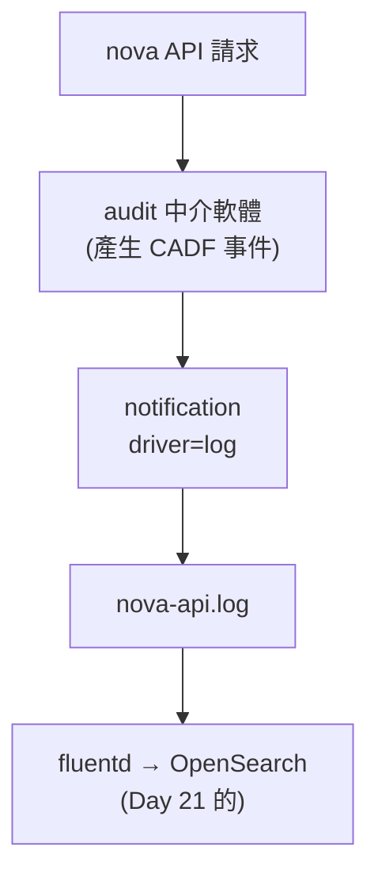

# Day 34: 稽核軌跡——誰在何時對哪個資源做了什麼

> 稽核員來的時候會問一個問題:「這台 VM 是誰刪的?」如果答案是翻遍各服務的 log 手動拼湊,那不叫稽核,叫考古。今天讓每個 API 請求自動變成一筆標準格式的 **CADF 稽核事件**,流回 [Day 21](sprint4-day21-observability.md) 建的 OpenSearch——最後,「誰在什麼時候對哪個資源做了什麼」變成一次查詢就能回答的事。

!!! abstract "你在課程的哪裡"
    - **Day 21**:集中式 log(OpenSearch)上線,能用 UUID 跨服務追一個資源。
    - **Day 33**:員工能用公司帳號進雲了——現在他們的每個動作都該留下紀錄。
    - **今天**:把 keystonemiddleware 的 audit 中介軟體插進 nova,產生 CADF 事件,接回 OpenSearch。
    - **今天之後**:[Day 35](sprint5-day35-sprint5-recap.md) 是 Sprint 5 總結,不動手。

## CADF:稽核事件的通用格式

稽核不能各服務各記各的格式——那樣跨服務查詢就成了惡夢。**CADF**(Cloud Auditing Data Federation)是雲稽核事件的標準格式,它規定每一筆事件必須回答四件事:

| CADF 要素 | 回答 | 例子 |
|---|---|---|
| **initiator** | 誰做的 | user id、來源 IP、user-agent |
| **action** | 做了什麼 | `read`、`create`、`delete` |
| **target** | 對哪個資源 | `/v2.1/servers/<uuid>` |
| **outcome** | 結果如何 | `success`、`failure`、`pending` |

只要每個服務都吐這個格式,稽核查詢就跟服務無關——問「誰刪了這台 VM」和問「誰改了這條網路」是同一種查法。今天的任務就是讓 nova 開始吐 CADF。

## 這條鏈要接四段



每一段的接法都有個要注意的點:audit 中介軟體要插進 nova 的請求管線(而它的設定檔 kolla 預設**不會複製進容器**)、CADF 事件要走 `log` driver 才會進服務 log(Day 28 開的 driver 不寫 log)、最後 fluentd 那段是 Day 21 已經接好的,今天白撿。

## 步驟

### 步驟 1:讓 CADF 事件走 log driver

CADF 事件是透過 notification 送出的。但 [Day 28](sprint5-day28-ceilometer-metering.md) 開的 notification driver 是 `messagingv2`——它把通知送進 RabbitMQ 給 Ceilometer,**不寫進 log**。要讓稽核事件進服務 log(才能被 fluentd 撿走),得加一個 `log` driver:

```ini
[audit_middleware_notifications]
driver = log
```

兩種 driver 可以並存——Ceilometer 繼續從 RabbitMQ 拿計量,稽核事件另外寫進 log。

### 步驟 2:把 audit 中介軟體插進 nova 的請求管線

nova 的 API 請求會流經一串中介軟體(pipeline)。audit 要插在**身分確認之後**——因為得先知道請求者是誰,才填得出 CADF 的 initiator:

```text
... authtoken audit keystonecontext osapi_compute_app_v21
             ↑ 插在 authtoken(確認身分)之後
```

filter 定義用容器內建的 `nova_api_audit_map.conf`(它定義了 URL 對應到哪種 action):

```ini
[filter:audit]
paste.filter_factory = keystonemiddleware.audit:filter_factory
audit_map_file = /etc/nova/nova_api_audit_map.conf
service_name = nova
```

!!! danger "這裡有一顆會讓你部署全綠、卻什麼都沒發生的雷"
    直覺會把改好的 `api-paste.ini` 放進標準 override 目錄然後 deploy。**deploy 會全綠,audit 卻毫無動靜**——因為 kolla 的 nova-api 根本不複製 `api-paste.ini` 進容器。完整判讀與正解見[地雷 1](#mine-1)。

### 步驟 3:確認 CADF 事件真的生出來了

觸發幾個操作(list、show),看 nova-api 的 log:

```text
INFO oslo.messaging.notification.audit.http.request  ...
INFO oslo.messaging.notification.audit.http.response ...
```

每個 API 呼叫都有一對 request/response 事件。挑一筆解開,確認 CADF 四要素齊全(注意要素藏在 `payload` 底下,不是頂層——見[地雷 2](#mine-2)):

```text
typeURI    : http://schemas.dmtf.org/cloud/audit/1.0/event
action     : read
outcome    : pending
eventTime  : 2026-07-16T12:58:09
誰(initiator): user=1384190d... @ 172.17.0.2
              agent=cluster-api-provider-openstack
對誰(target) : /v2.1/servers/9d978419-...
```

!!! tip "稽核照出了你沒注意的東西"
    看那個 `agent=cluster-api-provider-openstack`——**這個操作不是人做的,是 Magnum 的 CAPI driver 在背景輪詢**([Day 7](sprint3-day7-magnum-capi-driver.md) 裝的那個)。你沒下任何指令,但稽核忠實地記下了它。這正是稽核的價值:**它記錄的是「實際發生了什麼」,而不是「你以為發生了什麼」**——連自動化元件的一舉一動都無所遁形。

### 步驟 4:確認事件流進了 OpenSearch

fluentd 這一段是 Day 21 接好的,稽核事件會自動被撿進 OpenSearch:

```text
flog-2026.07.16 索引  →  420419 筆
查 audit.http.request  →  命中 40 筆,programname=nova-api
```

### 步驟 5:Gate——回答「這台 VM 是誰刪的」 {#step-5}

這是稽核的實戰場景。開一台可拋棄的 VM,刪掉,然後**只用 OpenSearch** 反查它的一生:

```bash
openstack server create audit-victim ... --wait    # 5ffbfcd0-...
openstack server delete 5ffbfcd0-...
# 從 OpenSearch 查這個 VMID 的稽核事件
```

```text
命中 7 筆含此 VMID 的稽核事件:
  12:59:14 | action=delete | user=1384190dc012 | path=/v2.1/servers/5ffbfcd0-...
  12:59:13 | action=read   | user=1384190dc012 | path=/v2.1/servers/5ffbfcd0-...
  12:59:12 | action=read   | user=1384190dc012 | path=/v2.1/servers/5ffbfcd0-...
  ...
```

**一次查詢,完整證據鏈攤開**：那台 VM 從被查看到被刪除的每一步、每一步是誰(user id)、什麼時候(到秒)、對哪個資源(精確到 UUID)。稽核員要的「誰刪的」,答案在這裡是 `user=1384190dc012`,時間 `12:59:14`,證據可查、可稽核、格式標準。

## 驗收 checkpoint

| 驗證 | 判準 | 本課環境的結果 |
|---|---|---|
| pipeline | audit 插在 authtoken 之後 | `authtoken audit keystonecontext` |
| CADF 事件 | 四要素齊全 | initiator/action/target/outcome 都有 |
| log driver | 事件寫進服務 log | `notification.audit.http` 出現在 nova-api.log |
| 進 OpenSearch | fluentd 匯入,可查詢 | 40+ 筆,programname=nova-api |
| **稽核查詢** | 反查某 VM → 誰/何時/做什麼 | audit-victim 的 delete 軌跡可查 |

## 地雷記錄

### 地雷 1:kolla 不複製 `api-paste.ini`,deploy 全綠卻什麼都沒發生 {#mine-1}

**症狀**:把改好的 `api-paste.ini` 放進標準 override 目錄,`deploy --tags nova` 回 `failed=0`,nova-api 也 healthy——但 audit filter 完全沒進容器,pipeline 還是舊的。

**判讀關鍵**:進容器看 `api-paste.ini`,是**部署前的舊檔**;而看 nova-api 的 `config.json`(kolla 決定複製哪些檔的清單),只有三筆:

```text
config.json COPY: nova.conf, nova-api-uwsgi.ini, ca-certificates
```

**`api-paste.ini` 不在清單裡。** 所以放再多次 override 都不會進容器,它用的永遠是映像檔內建的那份。

**解法**:改 `config.json` 的複製清單,把 `api-paste.ini` 與 audit map 加進去,重啟容器讓 `kolla_set_configs` 重跑:

```text
config.json COPY: ..., api-paste.ini, nova_api_audit_map.conf
容器內 filter:audit 段數: 1
pipeline: authtoken audit ...
```

**教訓**:這是「`--tags` 盲區」家族([Day 22](sprint4-day22-upgrade-backup.md#mine-1) 起)最陰險的一個變種——前幾顆至少是「設定沒被套用」,這顆是**那個檔根本不在複製清單裡**,連被套用的機會都沒有。而症狀是最無害的樣子:部署全綠、服務健康、零錯誤。**「deploy 成功」只證明 kolla 做完了它認得的事,不證明你的檔進去了。** override 一個非標準檔前,先確認它在不在 `config.json` 的複製清單。

### 地雷 2:CADF 的四要素藏在 payload 底下 {#mine-2}

**症狀**:CADF 事件生出來了,寫程式抽 `typeURI`/`action`/`initiator` 卻全部是 `None`。

**根因**:oslo 的 notification log 是巢狀的——外層是 `message_id`/`event_type`/`payload`,**CADF 的四要素在 `payload` 底下**,不在頂層。抽頂層自然全空。

**解法**:先取 `payload`,再從裡面抽 CADF 要素。

**教訓**:小坑,但它代表一類問題——**「資料明明在,卻抽到全空」通常是層級抽錯,不是資料沒有**。遇到「解析結果全 None 但原始資料看起來有內容」,先把原始結構完整印一遍看清楚巢狀,別急著改抽取邏輯。

### 地雷 3:稽核事件靠對的 notification driver 才進 log {#mine-3}

**症狀**:audit 中介軟體插好了、CADF 事件也在產生,但 log 裡找不到、OpenSearch 更查不到。

**根因**:CADF 事件透過 notification 送出,而 [Day 28](sprint5-day28-ceilometer-metering.md) 設的 driver 是 `messagingv2`——它只把通知送進 RabbitMQ(給 Ceilometer),**不寫 log**。沒有 log,fluentd 就沒東西可撿。

**解法**:加一個 `log` driver 到 `[audit_middleware_notifications]`,與 messagingv2 並存。

**教訓**:**「事件產生了」和「事件到得了你要的地方」是兩件事。** 中間那條路(driver → log → fluentd → OpenSearch)任何一段沒接上,前面做得再對都到不了終點。接稽核鏈時,要把每一段都當成可能斷掉的地方逐段驗——這也是為什麼[步驟 3、4、5](#step-5) 分成三次查(log 有嗎 → OpenSearch 有嗎 → 查得出來嗎),而不是一次驗到底。

## 帶得走的東西

- **稽核的價值是「一次查詢回答誰/何時/做什麼」,而 CADF 是讓這件事跨服務通用的格式。** 各服務各記各的,稽核就退化成考古。
- **稽核記錄的是實際發生的事,不是你以為的事。** 它照出了背景輪詢的 CAPI driver——連你沒下的指令、沒注意的自動化都留痕。
- **「deploy 成功」不證明你的檔進去了。** kolla 只複製 `config.json` 清單裡的檔;override 非標準檔前先確認它在清單上,否則會得到「全綠卻沒效果」這種最難查的結果。
- **事件產生 ≠ 事件到得了目的地。** 稽核鏈是多段接力,要逐段驗證,別假設中間那條路是通的。
- **解析全 None,先懷疑層級抽錯,不是資料沒有。** 巢狀結構把資料藏深一層,是「明明有卻抽不到」的常見原因。

## 延伸閱讀

想往下深挖,從這幾份開始:

- **[keystonemiddleware 的 audit 中介軟體](https://docs.openstack.org/keystonemiddleware/2025.1/audit.html)** —— filter 設定、audit map 檔格式、notification driver 的官方說明。
- **[pycadf——OpenStack 的 CADF 實作](https://docs.openstack.org/pycadf/latest/)** —— CADF 事件模型在 OpenStack 裡怎麼實作與運作;本章那張四要素表對應的程式碼源頭。
- **[Keystone 的事件通知說明](https://docs.openstack.org/keystone/2025.1/admin/event_notifications.html)** —— OpenStack 的通知有 Basic 與 CADF 兩種格式,以及各資源會發哪些事件;稽核要記什麼的官方對照。

## 下一步

這朵雲現在會為自己的每個動作留下正式紀錄了。Sprint 5 的動手部分到此結束——五天內,雲學會了自癒、加密、接軌企業身分、留下稽核軌跡。[Day 35](sprint5-day35-sprint5-recap.md) 盤點這一整段:從「把雲當生意經營」的第一個問題,到最後這條可查詢的稽核軌跡,以及一堂「怎麼判斷一個 OpenStack 專案生死」的版圖課。
