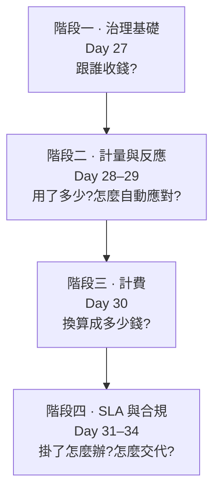

# Day 35: Sprint 5 總結——從敢動的雲,到能當生意經營的雲

> Sprint 4 的終點是一朵**敢動**的雲:敢升級、敢關掉一台 controller。但企業不會因為一朵雲技術上完美就付錢——它要能回答四個問題:誰用了多少、憑什麼收這個價、掛了怎麼辦、稽核員來了拿什麼交代。Sprint 5 的九天,就是把這四個問題一個一個變成可驗證的答案。今天盤點這段路,外加一堂這門課欠你很久的版圖課:**怎麼自己判斷一個 OpenStack 專案的生死。**

!!! abstract "你在課程的哪裡"
    - **今天**:不動手,盤點。九天走過的路、雲的前後對比、四十幾顆地雷裡最有普遍性的那些,以及一堂「專案驗屍學」。
    - **今天之後**:文末有延伸路——這門課的正式課程到此結束,但雲還會繼續長。

## 九天走過的路

四個階段,對應企業的四個問題:

| Day | 主題 | 最重要的一件事 |
|---|---|---|
| [27](sprint5-day27-multi-tenant-governance.md) | 多租戶治理 | 權限是「使用者 × 專案」的關係,不是使用者的屬性 |
| [28](sprint5-day28-ceilometer-metering.md) | 計量 Ceilometer | 監控與計量是兩回事,差在「帶不帶租戶身分」 |
| [29](sprint5-day29-aodh-autoscaling.md) | 告警與自動擴縮 | PromQL 驅動的擴縮全鏈;官方範例的 `alarm_url` 會 403 |
| [30](sprint5-day30-cloudkitty-rating.md) | 計費 CloudKitty | 帳單對得上用量,全程不用 Gnocchi |
| [31](sprint5-day31-masakari-ha.md) | Masakari 自癒 | 親手弄死一台主機,VM 自己搬家復活 |
| [32](sprint5-day32-full-tls.md) | 全站 TLS | 「開 TLS」底下是整套入口架構 |
| [33](sprint5-day33-keycloak-federation.md) | Keycloak Federation | 用公司帳號登入,雲裡不存外部密碼 |
| [34](sprint5-day34-cadf-audit.md) | CADF 稽核 | 一次查詢回答「誰刪了這台 VM」 |

## 這朵雲的前後對比

| | Sprint 4 結束時 | Sprint 5 結束時 |
|---|---|---|
| 使用者 | 全是 admin / Keystone 本地帳號 | domain 階層 + 企業 Keycloak SSO |
| 用量可見性 | 只有基礎設施指標(主機健康) | 分租戶用量(每個 project 各用多少) |
| 對負載的反應 | 人工開關機 | PromQL 驅動,負載升自動擴、降自動縮 |
| 計費 | 沒有 | 分租戶帳單,用量對得上金額 |
| VM/主機失效 | 手動處理(Day 23 只測過關機) | 程序死自動重啟、主機死自動 evacuate |
| 加密 | 全部 http | 全站 https(haproxy 終結) |
| 稽核 | 各服務 log 各記各的 | CADF 統一格式,一次查詢串起證據鏈 |

## 「能當生意經營」的三個證據

貫穿這個 Sprint 的方法論還是那條:**沒有驗證過的能力,不算能力。** 三件企業真正在意的事,都不是靠文件宣稱,是靠一次可判決的演練:

1. **能收錢**([Day 27](sprint5-day27-multi-tenant-governance.md)→[30](sprint5-day30-cloudkitty-rating.md)):從租戶結構、計量、到帳單,一條鏈接到底,而且逐項對帳——兩個真實租戶(team-a $0.75、team-b $0.16)、兩種計費項(機器 + 儲存),金額各自不同且互不汙染。**全程沒有 Gnocchi**,走的是官方現行的 Prometheus 路線。
2. **能負責**([Day 31](sprint5-day31-masakari-ha.md)):不是「應該會自癒」,是真的 `az vm deallocate` 拔掉一台 compute 的電源,看著它上面兩台 VM 在別台復活——boot-from-volume 那台還帶著同一顆系統碟。故障演練壞在對的層級,結果才算數。
3. **能交代**([Day 32](sprint5-day32-full-tls.md)→[34](sprint5-day34-cadf-audit.md)):對稽核員的三份答卷——傳輸全加密(TLS)、身分接軌企業且雲裡不存密碼(Federation)、每個動作留下 CADF 軌跡(稽核)。最後那份答卷用一次查詢就攤開了「audit-victim 這台 VM 是 `user=1384190dc012` 在 `12:59:14` 刪的」。

## 地雷回顧:四十幾顆,五種會反覆咬人的教訓

Sprint 5 九章記錄了四十幾顆具名地雷。挑出最有普遍性的五種——它們的教訓遠超出 OpenStack:

| 教訓 | 地雷 | 出處 |
|---|---|---|
| **錯了不會叫**——查詢回空/顯示 null/帳單 0 元/部署全綠,都可能是「正在錯」 | limit list 查別人專案回空;alarm show 的 rule 顯示 null;帳單 0 元因沒指派 rating 角色;deploy 全綠但 api-paste 沒被複製 | [27](sprint5-day27-multi-tenant-governance.md#mine-3)、[29](sprint5-day29-aodh-autoscaling.md#mine-5)、[30](sprint5-day30-cloudkitty-rating.md#mine-1)、[34](sprint5-day34-cadf-audit.md#mine-1) |
| **`--tags` 盲區**——跨服務的開關,只跑一個 tag 永遠不夠 | 通知要重跑發通知的服務;多機 cinder 要補 loadbalancer 前端 | [28](sprint5-day28-ceilometer-metering.md#mine-3)、[31](sprint5-day31-masakari-ha.md#mine-4) |
| **手寫覆寫是會引爆的債**——模板會隨架構更新,你手寫的那段只有你記得 | Day 27 手寫的 `[oslo_limit]` 被 TLS 引爆 | [32](sprint5-day32-full-tls.md#mine-5) |
| **官方範例能跑 ≠ 是對的**——年代久遠的範例最容易在認證機制上過期 | autoscaling 範本的 `alarm_url` 會 403,要改 `trust+url` | [29](sprint5-day29-aodh-autoscaling.md#mine-3) |
| **故障要壞在對的層級**——演一個比真實更輕的故障,得到的是假的安心 | 軟手段殺不死主機,只有真斷電才觸發 evacuate | [31](sprint5-day31-masakari-ha.md#mine-5) |

第一種——「錯了不會叫」——是整個 Sprint 5 出現最多次的類型,值得單獨記住:**報錯會停下你,回空會讓你帶著錯誤的世界觀繼續走。** 當一個結果讓你想說「這不可能」,換個身分、換個介面、或查一下那個查詢本身是不是對的。

## 一堂驗屍學:怎麼判斷一個 OpenStack 專案的生死

[Day 26](sprint4-day26-sprint5-preview.md) 答應過這一課。學 OpenStack 有個特有的坑:**網路上的教學文章不會過期下架**。你搜「監控」會撞到 Monasca,搜「計量」滿頁 Gnocchi,搜「容器」還有 Zun——它們都曾是官方專案、文章寫得又多又好,但今天照著做只會走進死巷。這門課從 Zun 被砍(Sprint 4 開篇)到繞過 Gnocchi(Day 28),一直在替你擋這種坑。今天把方法交給你,讓你自己判斷。

專案的健康有四個等級,各配一個這門課真的遇過的案例:

| 等級 | 案例 | 特徵 |
|---|---|---|
| **已死(RETIRED)** | Zun、Monasca、Sahara | 從官方專案列表移除,repo 標 retired,不再出版本 |
| **垂死** | Vitrage、Venus | 接連被列 inactive、無人接手、好幾個週期沒動 |
| **苟延(life-support)** | Gnocchi | 還有心跳,但離開官方治理、下游發行版排除它 |
| **復活** | Watcher | 沉寂後重啟維護、加了新能力(2025 年的案例) |

判斷一個專案落在哪一格,看**三個訊號**,五分鐘搞定:

1. **治理頁**——它還在[官方專案列表](https://governance.openstack.org/tc/reference/projects/)裡嗎?被移除 = 官方已經放手(這是 Gnocchi 與 Zun 最關鍵的差別:Gnocchi 是被治理放手,Zun 是連 repo 都 retired)。
2. **release 節奏**——去[版本頁](https://releases.openstack.org/)看它最近一版距今多久。OpenStack 半年一個系列,一個活著的專案每個系列都會出;超過一年沒動,亮黃燈。
3. **下游發行版**——主流的下游(RHOSO、各家商業發行版)有沒有把它包進去。上游還在、下游全部排除,是「苟延」的典型訊號。

三個訊號都綠,放心用;有一個紅,查清楚再投入學習時間。**反過來也要小心誤傳**——Mistral、Zaqar、Adjutant 常被舊文章說成已死,實際上都還正常維護。別讓一篇過期文章替你判死一個活著的專案。

所有這些現況陳述都**標註「截至 2026-07」**——因為這堂課教的不是「哪些專案死了」這份會過期的清單,是**自己查證的方法**,那才不會過期。

## 誠實的差距清單:這門課的 Sprint 5 還差什麼

「能當生意經營」是相對於 Sprint 4 的進步,但它離真正的生產計費/合規平台還有距離:

- **計費驗到機器與儲存兩項,但沒到全成本**:[Day 30](sprint5-day30-cloudkitty-rating.md) 已補驗雙租戶的機器 + 儲存帳單(金額各自不同、對得上費率),但網路流量、浮動 IP、快照這些成本項還沒納入;真正的雲帳單要涵蓋每一種可計費資源。
- **主機失效偵測是手動代替的**:[Day 31](sprint5-day31-masakari-ha.md) 的 hostmonitor 沒部署(需要 pacemaker),用手動送通知代替。生產環境要真的自動偵測主機死亡。
- **TLS 的信任錨點是玩具**:[Day 32](sprint5-day32-full-tls.md) 的 `KollaTestCA` 是自簽的,不能上生產;內網那一跳(backend TLS)也還沒加密。
- **Keycloak 是開發模式**:[Day 33](sprint5-day33-keycloak-federation.md) 用 `start-dev`,資料跟容器共存亡,沒接外部資料庫。
- **稽核只接了 nova**:[Day 34](sprint5-day34-cadf-audit.md) 的 CADF 只在 nova 生效,其他服務還沒接;保存策略、稽核事件的告警也還沒設。

清單不是遺憾,是地圖——你已經有能力自己走這幾段路了。

## 三條延伸路

1. **把稽核擴到全服務。**[Day 34](sprint5-day34-cadf-audit.md) 只在 nova 開了 CADF。用同一套方法(config.json 加複製、driver=log、驗到 OpenSearch)把 cinder、neutron、glance 也接上,你就有了一個真正完整的稽核平台——而每接一個服務,你都會更熟練今天那顆「config.json 不複製」的雷。
2. **換掉玩具,接上真的。** 把 `KollaTestCA` 換成公司 PKI 或 Let's Encrypt、把 Keycloak 接上外部資料庫、把 hostmonitor 的 pacemaker 補起來。這三件事把 lab 的「概念驗證」推向「敢上線」,而每一件的難點都不在 OpenStack,在它接的那個外部系統。
3. **驗一次專案生死。** 挑一個你在網路文章看到、但這門課沒教的 OpenStack 專案(Blazar?Zaqar?Tacker?),用上面那套三訊號法判斷它現在活得如何。這是這門課能給你的最耐久的技能——因為軟體會過期,判斷方法不會。

## 結語

Sprint 5 的第一個動作,是在 [Day 27](sprint5-day27-multi-tenant-governance.md) 建一個 domain 階層,回答「跟誰收錢」;最後一個動作,是在 [Day 34](sprint5-day34-cadf-audit.md) 用一次查詢查出「這台 VM 是誰刪的」。中間的九天——每一張帳單、每一次自動搬家的 VM、每一段被 precheck 擋下的部署——都在把 [Day 26](sprint4-day26-sprint5-preview.md) 開頭那四個企業問題,從「聽起來很難」變成「我驗證過它可以」。

三個 Sprint 走完:Sprint 3 讓這朵雲**會動**,Sprint 4 讓它**敢動**,Sprint 5 讓它**能當一門生意經營**。

而你手上真正帶走的,不是一朵雲的操作手冊——是一套面對任何「它應該可以」時的反射:**先設判準,再動手,讓結果可以被判決。** 這套反射,換到任何系統、任何技術棧,都一樣好用。
